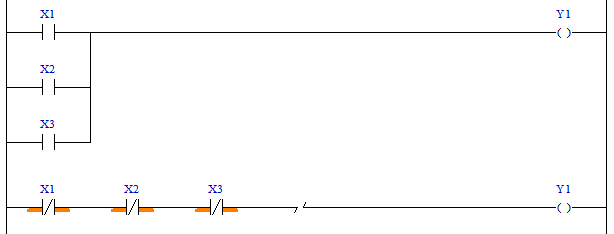

# 4.4 INV (反转): 反转

### 描述
反转 (活动 <-> 不活动) 梯级的先前结果。

 

### 使用示例

根据德摩根定律，处理一次反转将使 /(AxB) 等于 /A+/B 或 /(A+B) 等于 /Ax/B，从而允许一个简单的配置，使用没有分支的 AND 逻辑，而不是使用具有多个分支的 OR 逻辑的配置。因此，以下两个梯级的逻辑将产生相同的结果，因为 (X1+X2+X3) 等于 /(/X1x/X2x/X3)。

