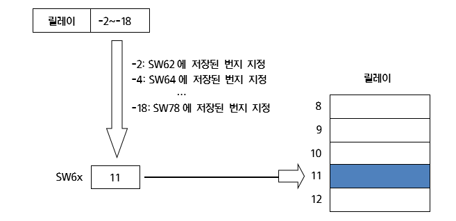
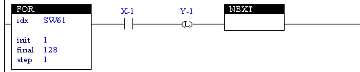

# 4.4 릴레이 간접 주소 지정

SW61~SW69는 간접 주소 지정을 위한 시스템 메모리입니다. 릴레이 형식에 관계없이 릴레이 번지를 -1 ~ -9 의 값으로 
지정하면 SW61~SW69에 저장된 값의 번지로 지정됩니다.

예를 들어 SW61~69의 값이 아래와 같을 때,

| **relay** | **value** |
| :---      | :---      |
| SW61      | 12        |
| SW65      | 3        |
| SW69      | 56        |

간접 주소 릴레이 표기는 아래와 같이 해석됩니다.

*	MW-1 -> MW12
*	FB-5.X3 -> FB3.X3
*	X-9 -> X56
*	FB-5.YW-1 -> FB3.YW12

아래 내장 PLC 예제는 X1~X128까지의 입력 신호에 해당하는 Y1~128신호를 출력하는 동작을 FOR/NEXT 문과 간접 주소 지정방식을 활용해 작성한 예입니다.

