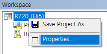
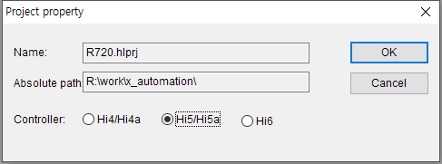

# 5. Difference in the Embedded PLC between Hi5a and Hi6

The functions of the Hi6 controller's embedded PLC are similar to those of the Hi5a controller's embedded PLC, and the same HRLadder, or the same ladder editor, is used. 
Therefore, users who are already familiar with the functions of the Hi5a controller's embedded PLC can quickly learn from this manual by checking only the different parts in the Hi6 controller.

The following content includes the list of the different parts.

 

## HRLadder online connection

HRLadder v2.80 or later supports the Hi6 controller.
Versions of HRLadder earlier than v2.80 allows remote connection through automatic recognition of the controller type when the online button is pressed.
However, for HRLadder v2.80 or later, you need to select the controller type in the attributes of the project, then press the online button.

 

## Type of relay

### Hi5a

M relays of MW1–MW1000 are supported.
A special relay SP exists.
Dedicated input and output signals are included in SW.

### Hi6

M relays are largely extended to a range of MW0–MW19998, so you can use them as substitutes for others.
SP relays are integrated into the area for special flags of [S relay - Fixed area](https://hrbook-hrc.web.app/#/view/doc-hi6-embedded-plc/korean/3-relay/4-sw-relay/1-fixed-area)
For dedicated input and output signals, support will be provided with SI and SO. 

 

## Index

### Hi5a
The index starts with 1.
The index for word, long, and float increases by 1. 
For example, DO16–DO23 are the same as DOW1

<table class="tg">
<tbody>
  <tr>
    <td class="tg-kftd">bit</td>
    <td>DO1~DO8</td>
    <td>DO9~DO16</td>
    <td>DO17~DO24</td>
    <td>DO25~DO32</td>
    <td>...</td>
  </tr>
  <tr>
    <td class="tg-kftd">byte</td>
    <td>DOB1</td>
    <td>DOB2</td>
    <td>DOB3</td>
    <td>DOB4</td>
    <td>...</td>
  </tr>
  <tr>
    <td class="tg-kftd">word</td>
    <td colspan="2">DOW1</td>
    <td colspan="2">DOW2</td>
    <td>...</td>
  </tr>
  <tr>
    <td class="tg-kftd">long</td>
    <td colspan="4">DOL1</td>
    <td>...</td>
  </tr>
  <tr>
    <td class="tg-kftd">float</td>
    <td colspan="4">DOF1</td>
    <td>...</td>
  </tr>
</tbody>
</table>

 

### Hi6
The index starts with 0.
The index of word, long and flow will increase by matching the byte location.
For example, DOW increases in the form of DOW0, DOW2, DOW4, DOW6..., and DOL increases in the form of DOL0, DOL4, DOL8...
As shown in the figure below, DO16–DO23 are the same as DOW2.

Refer to [3.2 Designating a relay](https://hrbook-hrc.web.app/#/view/doc-hi6-embedded-plc/korean/3-relay/2-relay-expression)

 

<table class="tg">
<tbody>
  <tr>
    <td class="tg-kftd">bit</td>
    <td>DO0~DO7</td>
    <td>DO8~DO15</td>
    <td>DO16~DO23</td>
    <td>DO24~DO31</td>
    <td>...</td>
  </tr>
  <tr>
    <td class="tg-kftd">byte</td>
    <td>DOB0</td>
    <td>DOB1</td>
    <td>DOB2</td>
    <td>DOB3</td>
    <td>...</td>
  </tr>
  <tr>
    <td class="tg-kftd">word</td>
    <td colspan="2">DOW0</td>
    <td colspan="2">DOW2</td>
    <td>...</td>
  </tr>
  <tr>
    <td class="tg-kftd">long</td>
    <td colspan="4">DOL0</td>
    <td>...</td>
  </tr>
  <tr>
    <td class="tg-kftd">float</td>
    <td colspan="4">DOF0</td>
    <td>...</td>
  </tr>
</tbody>
</table>

 

## System relay (SW relay)

### Hi5a

In most cases, there is a fixed SW relay index address for each monitoring item.
However, among the index addresses, SW220–249 are for 10 multipurpose slots, and it is possible to put a desired code, among the codes for system variables, mainboard storage space, analog input/output, date/time, and GE variables, into the desired slot and perform monitoring.

- Most items: Fixed area
- Some items: Optional items area (slot)

 

### Hi6

The area of SB0–SB1999 is the [S Relay Fixed Area](https://hrbook-hrc.web.app/#/view/doc-hi6-embedded-plc/korean/3-relay/4-sw-relay/1-fixed-area), which has a fixed index address for each item just like Hi5a.

However, the area of SB2000– is the [Optional items area](https://hrbook-hrc.web.app/#/view/doc-hi6-embedded-plc/korean/3-relay/4-sw-relay/README), which has about 900 multipurpose slots, permitting their use by inserting instructions for desired items.

Nearly most of the items will be montored via the optional items area.

- Most items: Optional items area (slot)
- Some items: Fixed area
