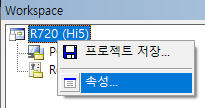
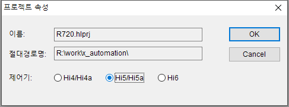

# Hi6 로봇제어기 기능설명서 - 내장PLC (Embedded PLC)


본 제품 설명서에서 제공되는 정보는 현대로보틱스의 자산입니다.

현대로보틱스의 서면에 의한 동의 없이 전부 또는 일부를 무단 전재 및 재배포할 수 없으며, 제3자에게 제공되거나 다른 목적에 사용할 수 없습니다.


본 설명서는 사전 예고 없이 변경될 수 있습니다.


**Copyright ⓒ 2022 by Hyundai Robotics**

# 1. 개요

Hi6 제어기의 내장PLC(Embedded PLC)는 PLC(Programmable Logic Controller)의 기능을 제어기 내부에 소프트웨어적으로 탑재한 것입니다. PLC에서 흔히 사용되는 래더(ladder) 프로그램을 사용자가 작성하여 구동시킬 수 있습니다.

래더(ladder) 프로그램은 현대로봇 전용의 래더 편집 PC 소프트웨어인 HRLadder로 작성/편집하여, 이더넷으로 연결된 Hi6제어기에 다운로드할 수 있습니다. 반대로 Hi6 제어기에서 실행되고 있는 래더 프로그램을 PC의 HRLadder로 업로드 할 수 있으며, 제어기에서 실행되고 있는 PLC 모드나 릴레이 값 등의 상태를 HRLadder에서 원격 모니터링 하는 것도 가능합니다.

* HRLadder는 현대로보틱스 웹사이트(https://www.hyundai-robotics.com) - 고객지원 - 응용소프트웨어 화면에서 다운로드 받으실 수 있습니다.
* HRLadder의 사용법은 HRLadder의 도움말 메뉴에 연결된 기능설명서를 참조하십시오.
* HRLadder는 Hi4~Hi5a의 구모델 제어기용으로도 사용 가능합니다. 다만 래더 프로그램은 Hi6와 구모델 간 차이가 있어 호환되지 않음을 유의하십시오.

Hi6제어기의 I/O는 필드버스나 리모트I/O 장치를 통해 필드버스 마스터를 가진 상위 공정PLC, 혹은 하위 필드버스 슬레이브 장치들과 연결할 수 있습니다. 내장PLC 기능은 이렇게 연결된 I/O 신호들을 Ladder Logic으로 제어하는 기능입니다.


Hi6의 내장PLC 기능은 Hi5a의 내장PLC 기능과 유사하며, 동일한 래더 편집기 HRLadder를 사용합니다.
따라서 이미 Hi5a의 내장PLC 기능에 익숙한 사용자는, Hi6제어기에서 달라진 부분만을 확인하는 방식으로 이 설명서를 빠르게 학습할 수 있습니다.



이미 Hi5a의 내장PLC 기능에 익숙한 사용자는, Hi6제어기에서 달라진 부분만을 확인하는 방식으로 이 설명서를 빠르게 학습할 수 있습니다. 아래 링크를 확인하시기 바랍니다.  
[5. Hi5a와 Hi6의 내장PLC 차이점](../5-diff-hi5a-hi6.md)

# 1.1 래더 로직(Ladder Logic)

래더 로직(Ladder Logic)은 내장PLC의 주요 프로그래밍 방식입니다. 이를 래더 다이어그램(Ladder Diagram, 줄여서 LD)이라고도 부릅니다. (LD 외에도 ST, FBD, SFC 같은 다른 방식도 있지만 내장PLC가 지원하지 않으므로 설명하지 않겠습니다.)

래더는 프로그램의 모양이 사다리(ladder)와 닮아서 비롯된 이름입니다. 사다리 모양에서 신호가 흘러가는 가로 연결선을 rung이라고 부르며 여러 개의 명령(instruction)들을 포함합니다.


로봇 교시 프로젝트는 래더 다이어그램 1개 혹은 여러 개를 포함할 수 있는데, 각 다이어그램은 수 십 ~ 수 백개의 rung으로 구성됩니다.  
PLC를 RUN 모드로 전환하면 래더 다이어그램이 반복적으로 수행됩니다. 1 cycle에 걸리는 시간을 scan time이라고 하며 보통 수 msec ~ 수 십 msec입니다.


<br>

명령은 명령의 이름인 니모닉(mnemonic)과 명령에 전달되는 인수(argument)인 오퍼랜드(operand)로 구성됩니다.

 예를 들어, 아래 그림의 ADD (+) 명령은 아래와 같이 구성됩니다.


* 니모닉 : ADD
* 오퍼랜드1 : MW5
* 오퍼랜드2 : DOW2
* 오퍼랜드3 : MW6

<br>

내장PLC의 명령은 아래에 설명되는 몇 가지 명령군으로 분류됩니다. 4장에서 모든 명령들이 각각 설명되므로, 이 절에서는 래더 로직의 개념 이해를 위해 일부 명령만을 예로 들어 설명하겠습니다.

---

<br>

## 접점형 명령 (Contact Instruction)

접점 명령으로 분류되는 XIC(eXamine If Closed)는 오퍼랜드가 1개만 있는 단순한 명령입니다. -| |- 기호 위에 오퍼랜드가 표기된 형태로 rung에 표시됩니다.


접점은 rung을 따라 왼쪽에 걸린 신호(1)를 오른쪽으로 전달할 지를 결정하는 스위치입니다. 릴레이 DO3 값이 0(inactive)이면 접점이 open되어 전달이 안되고, DO3의 값이 1(active)이면 접점이 close되어 전달됩니다.


<br>

XIC 접점 여러 개를 직렬로 연결하거나, 브랜치(branch)라는 형태로 병렬로 연결하면, AND, OR, NOT의 논리 연산식을 만들 수 있습니다.
(은 왼쪽 논리값의 반대값을 오른쪽으로 전달하는 INV(Inverting) 명령이며, 오퍼랜드가 없습니다.)  

```
X1 AND (X2 OR (NOT X3))
```


<br>


## 출력 코일형 명령 (Output-coil Instruction)

OTE(OuTput Energize)는 출력 코일 명령으로 분류됩니다. 항상 rung의 가장 마지막인 오른쪽에 배치되며 -( )- 기호로 표시됩니다. 왼쪽에서 전달받은 값을 오퍼랜드 릴레이로 출력합니다.

앞에서 설명한 논리 연산식의 결과를 Y8 릴레이로 출력한다면 아래와 같은 형태가 됩니다.

```
Y8 = X1 AND (X2 OR (NOT X3))
```


<br>

## 함수형 명령 (Function Instruction)

왼쪽이 active되면 주어진 오퍼랜드들에 대해 특정한 동작을 수행합니다. 가령 아래 다이어그램은 DO3가 active 되었을 때 MW5와 DOW2 릴레이의 값을 더해 MW6 릴레이에 대입하는 산술 연산 ADD(+)를 수행합니다.

```
IF DO3:
   MW6 = MW5 + DOW2
```


비교 명령의 경우에는 연산 결과를 오른쪽으로 전달하기도 합니다. 가령 아래 다이어그램은 DO6이 active이고 MW8이 120보다 크면 Y20을 활성화(activate)합니다.

```
Y20 = DO6 AND (MW8 > 120)
```


# 2. 제어기 설정

# 2.1. 내장 PLC의 모드 설정

내장 PLC의 동작모드는 "[F7:조건설정] - PLC 동작 모드" 에서 <Off, Stop, R-Stop, R-Run, Run>중 하나를 선택할 수 있습니다.  
R-Stop, R-Run은 Remote-Stop, Remote-Run, 즉 이더넷으로 연결된 PC의 HRLadder 등에서 원격으로 모드변경이 가능한 상태를 의미합니다.


<br>
<br>
선택된 모드에 따라 TP화면 우측상단에 아이콘으로 상태를 표시합니다. 즉, PLC=<R-Run이나 Run>상태이면 상기 그림과 같이 PLC 아이콘이 표시되고, PLC=Off인 경우에는 하기 그림과 같이 아이콘이 사라지며, PLC=STOP상태이면 PLC 아이콘에 적색금지마크가 표시됩니다.


 


* Off  
내장 PLC의 기능이 꺼집니다. 이 경우, 로봇제어기의 논리적 출력(Logical Output)인 FB0.DO0~FB9.DO959이 물리적 출력(Physical Output)인 FB0.Y0~FB9.Y959로 자동 출력(bypass)되고, 물리적 입력인 FB0.X0~FB9.X959가 논리적 입력인 FB0.DI0~FB9.DI595로 자동 입력됩니다.

* R-Stop / Stop  
내장 PLC의 동작을 정지시킵니다. R-Stop은 HRLadder에서 변경할 수 있는 리모트(Remote)상태를 나타내며, STOP으로 설정하면 HRLadder에서 동작모드를 변경할 수 없습니다.  
내장 PLC가 Stop될 때에는 PLC의 출력신호인 DI, Y 릴레이가 자동으로 0이 됩니다. *(DI는 로봇언어나 할당의 관점에서는 입력이지만, 내장PLC의 관점에서는 출력입니다.)*  

* R-Run / Run  
내장 PLC를 실행시킵니다. R-Run은 HRLadder에서 변경할 수 있는 리모트(Remote)상태를 나타내며, Run으로 설정하면 HRLadder에서 동작모드를 변경할 수 없습니다. 
# 2.2. 제어기 TP상에서 릴레이 상태 모니터링

"[R2: 창조정] - [F1: 선택]"으로 릴레이 상태를 모니터링 할 수 있습니다.

자세한 내용은 [Hi6 조작설명서 - 6. 모니터링](https://hrbook-hrc.web.app/#/view/doc-hi6-operation/korean-tp630/6-monitoring/README) 절을 참조하십시오.
# 2.3. scan time

내장PLC에서 래더 파일이 1cycle 수행하는데 소요된 시간은 HRLadder의 하단 상태 바에 "scan time"으로 표시됩니다. 래더 프로그램의 스텝수가 증가할 수록 이 시간이 증가하면서 I/O 의 응답성이 느려집니다.
# 3. 릴레이 (relay)

# 3.1 릴레이의 의미

전기신호를 전달할 지, 전달하지 않을 지를 결정하는 ON/OFF 접점(contact) 상태를 가진 장치를 스위치(switch)라고 부릅니다. 릴레이(relay)란 수동이 아닌 전기를 이용해 자동으로 작동시키는 스위치를 의미합니다.  

본래 릴레이는 코일(coil)의 자기적인 힘으로 접점을 제어하던 물리적인 장치입니다. 하지만 컴퓨터화된 PLC에서의 릴레이는 소프트웨어에 의해 제어되는 논리적인 개념으로서, 1bit의 ON/OFF 상태 뿐만 아니라 여러 bit로 구성된 byte, word, double word 값이나 실수값까지도 저장할 수 있는 변수와 같은 의미로 사용되고 있습니다.
# 3.2 릴레이의 표기

Hi6 로봇제어기 내장PLC에서의 릴레이 표기는 아래와 같습니다.

`[FB{block-index}.]{relay-type}[{data-type}]{signal-index}`

예를 들어, 아래와 같이 표기됩니다.

Y1501
FB3.DIW21

* block-index  
입출력 릴레이(DI, DO, X, Y)는 객체명이 FB0 ~ FB9인 10개의 필드버스 블럭(fieldbus block)으로 그룹핑되어 있습니다. 물리적인 입출력의 경우 각 블럭은 각기 개별적인 필드버스 장치에 매핑됩니다.
하나의 FB의 크기는 입출력 각각 120 바이트(=960 bit)입니다.

  FB의 일부 영역을 FN0 ~ FN63의 객체명으로 매핑해 사용할 수도 있습니다. FN영역을 설정하는 방법은 아래 링크를 참조하십시오.

  [조작설명서: 7.3.2.12 fn 블럭 할당](https://hrbook-hrc.web.app/#/view/doc-hi6-operation/korean-tp630/7-setting/3-control-parameter/2-io-signal-setting/12-fn-block)

* relay-type  
아래와 같이 총 10가지 type이 있습니다.
각각의 type은 뒤에서 자세히 설명됩니다.

  1) DI (Digital Input) : HRScript나 각종 입력 할당에서 사용할 수 있는 논리적인 입력(Logical Input) 신호입니다.

  2) DO (Digital Output) : HRScript나 각종 출력 할당에서 사용할 수 있는 논리적인 출력(Logical Output) 신호입니다.

  3) SI (System Input) : 당사 시스템 보드와 인터페이스 되는 전용입력 신호입니다.

  4) SO (System Output) : 당사 시스템 보드와 인터페이스 되는 전용출력 신호입니다.

  5) X : 필드버스 장치를 통해 제어기 외부로부터 입력되는 물리적인 입력(Physical Input) 신호입니다.

  6) Y : 필드버스 장치를 통해 제어기 외부로 출력되는 물리적인 출력(Physical Output) 신호입니다. 

  7) M (Memory) : Data를 저장할 때 사용하며, HRScript에서도 access할 수 있습니다.

  8) S (System) : 제어기 내의 시스템 값을 읽거나 쓰는 용도입니다. [3.4 S 릴레이](./4-sw-relay/README.md)를 참조하세요.

  9) R (auxiliaRy) : Obsolete. 값을 임시로 보관하기 위한 보조 릴레이입니다. Hi5a 래더파일의 이식 편의를 위해 제공됩니다. 신규 래더 파일에서는 M 릴레이 사용을 권장합니다.

  10) K (Keep) : Obsolete. 값을 임시로 보관하기 위한 보조 릴레이이며 전원을 꺼도 값이 보관됩니다. Hi5a 래더파일의 이식 편의를 위해 제공됩니다. 신규 래더 파일에서는 M 릴레이 사용을 권장합니다.


    | ** 릴레이 명칭** | ** 점 수 ** | ** 릴레이(bit) ** |** 릴레이(byte) ** |
    | :--- | :--- | :--- | :--- |
    | DI | 9600 bit (1280 byte) | FB0.DI0 ~ FB9.DI959 | FB0.DIB0 ~ FB9.DIB127 |
    | DO | 9600 bit (1280 byte) | FB0.DO0 ~ FB9.DO959 | FB0.DOB0 ~ FB9.DOB127 |
    | SI | 960 bit (128 byte) | SI0 ~ SI959 | SIB0 ~ SIB127 |
    | SO | 960 bit (128 byte) | SO0 ~ SO959 | SOB0 ~ SOB127 |
    | X | 9600 bit (1280 byte) | FB0.X0 ~ FB9.X959 | FB0.XB0 ~ FB9.XB127 |
    | Y | 9600 bit (1280 byte) | FB0.Y0 ~ FB9.Y959 | FB0.YB0 ~ FB9.YB127 |
    | M | 160000 bit (20000 byte) | M0 ~ M159999 | MB0 ~ MB19999 |
    | S | 160000 bit (20000 byte) | S0 ~ S159999 | SB0 ~ SB19999 |
    | R | 960 bit (128 byte) | R0 ~ R959 | RB0 ~ RB127 |
    | K | 960 bit (128 byte) | K0 ~ K959 | KB0 ~ KB127 |

* data-type  
아래와 같이 5가지 type이 있습니다.

  * 표기없음 : 비트 (bit), 1bit
  * B : 부호있는 바이트 (signed-byte), 8bit
  * W : 부호있는 워드 (signed-word), 16bit
  * L : 부호있는 롱 (signed-long), 32bit
  * F : 부동소수점 실수 (floating-point real), 32bit

  <br>
  이들은 별개의 메모리 공간이 아니라 같은 960 bit의 공간을 서로 다른 데이터형으로 표현한 것입니다. 예를 들어 DO[0~15]와 DOB[0~1], DOW[0]은 모두 동일한 출력신호입니다.

<br>

<style type="text/css">
table  {border-collapse:collapse;}
td {border-color:gray;border-style:solid;border-width:1px;}
.tg-kftd{background-color:#efefef;}
</style>

<table class="tg">
<tbody>
  <tr>
    <td class="tg-kftd">bit</td>
    <td>DO0~DO7</td>
    <td>DO8~DO15</td>
    <td>DO16~DO23</td>
    <td>DO24~DO31</td>
    <td>...</td>
  </tr>
  <tr>
    <td class="tg-kftd">byte</td>
    <td>DOB0</td>
    <td>DOB1</td>
    <td>DOB2</td>
    <td>DOB3</td>
    <td>...</td>
  </tr>
  <tr>
    <td class="tg-kftd">word</td>
    <td colspan="2">DOW0</td>
    <td colspan="2">DOW2</td>
    <td>...</td>
  </tr>
  <tr>
    <td class="tg-kftd">long</td>
    <td colspan="4">DOL0</td>
    <td>...</td>
  </tr>
  <tr>
    <td class="tg-kftd">float</td>
    <td colspan="4">DOF0</td>
    <td>...</td>
  </tr>
</tbody>
</table>

<br>

* signal-index
relay-type 내에서의 0-based 인덱스입니다.  
인덱스는 DO는 bit단위, DOB, DOW, DOL, DOF는 byte단위로 매겨집니다.

<br>
<br>

FB 객체명은 아래와 같이 생략할 수도 있습니다. 예를 들어 DO961은 FB1.DO1과 동일한 표기입니다.

| **객체명** | **DO 표기** | **FB.DO 표기** |
| :--- | :--- | :--- |
| FB0 | DO0 ~ DO959 | FB0.DO0 ~ FB0.DO959 |
| FB1 | DO960 ~ DO1919 | FB1.DO0 ~ FB1.DO959 |
| FB2 | DO1920 ~ DO2879 | FB2.DO0 ~ FB2.DO959 |
| FB3 | DO2880 ~ DO3839 | FB3.DO0 ~ FB3.DO959 |
| FB4 | DO3840 ~ DO4799 | FB4.DO0 ~ FB4.DO959 |
| FB5 | DO4800 ~ DO5759 | FB5.DO0 ~ FB5.DO959 |
| FB6 | DO5760 ~ DO6719 | FB6.DO0 ~ FB6.DO959 |
| FB7 | DO6720 ~ DO7679 | FB7.DO0 ~ FB7.DO959 |
| FB8 | DO7680 ~ DO8639 | FB8.DO0 ~ FB8.DO959 |
| FB9 | DO8640 ~ DO9599 | FB9.DO0 ~ FB9.DO959 |


DI, DO는 각기 논리적인 입력과 출력으로서 로봇언어와 입출력 할당에서 접근할 수 있습니다.

# 3.3 입출력 Diagram

Hi6 로봇제어기의 입출력 Diagram은 다음 그림과 같습니다.


그림 3.1 입출력 Diagram

<br><br>

그림 우측의 연두색 박스들은 Hi6 제어기 내부의 하드웨어 모듈들입니다. 좌측에는 main 소프트웨어가 구동되는 main module (COM)이 있습니다.우측에는 필드버스 연결을 위한 PCI 카드인 Hilscher CIF card 들과 MODBUS 연결을 위한 시리얼 혹은 이더넷 디바이스가 있습니다.  

main 소프트웨어 내에는 각종 릴레이들이 작은 박스의 형태로 그려져 있습니다. Hi6에서 이 릴레이에 접근하는 소프트웨어 요소는 hrscript(로봇언어)와 입출력 할당(I/O assignment), 그리고 내장PLC입니다.

<br>

## hrscript (로봇언어)
로봇언어는 입출력 변수를 통해 User I/O (FB.DI/DO) 릴레이와 Memory (M) 릴레이에 접근할 수 있는데, 대문자대신 소문자가 사용됩니다 (e.g. fb3.dow14, mw501). 입출력 변수에 대한 자세한 내용은 [Hi6 기능설명서 - 로봇언어 - 입출력변수](https://hrbook-hrc.web.app/#/view/doc-hrscript/korean/6-external-comm/1-fb-io/1-io-val) 절을 참고하십시오.


<br>

## 입출력 할당, 입출력 속성
입출력 할당은 FB.DI/DO 릴레이에 접근할 수 있습니다. 또한 입출력 속성 설정으로 부논리, 펄스 등을 FB.DI/DO에 설정할 수 있습니다. 예를 들어 입력 할당인 "외부 정지"에 DI24가 부논리로 설정되어 있으면, DI24 신호가 0(active)일 때 로봇은 정지합니다.  
자세한 내용은 [Hi6 조작설명서 - 입출력 신호 설정](https://hrbook-hrc.web.app/#/view/doc-hi6-operation/korean-tp630/7-setting/3-control-parameter/2-io-signal-setting/README) 절을 참조하십시오.

<br>

## 내장PLC
내장PLC 박스 안쪽에 점선으로 Ladder Logic이 그려져 있고 양 옆의 릴레이들과는 화살표로 연결되어 있습니다. Ladder Logic은 릴레이들의 입력을 받아 작성자가 의도한 산술적/논리적 연산을 수행한 후 다른 릴레이로 값을 전달합니다.  

Ladder Logic은 Memory와 System, Timer, Counter 릴레이와는 양방향으로 연결되어 있어 이들 릴레이에 값의 읽기와 쓰기를 모두 할 수 있습니다. 반면 물리적 출력인 FB.Y에는 쓰기만 가능하고 물리적 입력인 FB.X에는 읽기만 가능합니다.  

FB.DI는 로봇언어의 관점에서는 입력이지만, 이 입력은 내장PLC를 거쳐서 들어오는 제어기 내부의 논리적 입력입니다. 즉, 내장PLC의 관점에서는 출력이며 따라서 Ladder Logic은 여기에 쓰기만 할 수 있습니다. 마찬가지로 FB.DO는 내장PLC 관점에서는 입력이기 때문에 Ladder Logic은 읽기만 할 수 있습니다.

<br>

## 외부 통신 연결
Hilscher CIF card들은 물리적 입출력 I/O와 연결됩니다. 1개 혹은 여러 개의 FB객체를 특정한 CIF card 매핑하는 방법은 [Hi6 조작설명서 - 입출력 신호 설정 - DIO 블록 할당](https://hrbook-hrc.web.app/#/view/doc-hi6-operation/korean-tp630/7-setting/3-control-parameter/2-io-signal-setting/9-dio-block-assign)를 참고하십시오.  

모든 릴레이들은 MODBUS 슬레이브 기능의 주소공간에 매핑되어 있습니다. 자세한 내용은 [Hi6 기능설명서 - MODBUS](https://hrbook-hrc.web.app/#/view/doc-modbus/korean/README)를 참고하십시오.
# 3.4 S 릴레이

Hi6 제어기 내의 다양한 상태값이 S릴레이에 매핑되어 있습니다. 또한 일부 S릴레이에 값을 써서 Hi6의 상태를 바꿀 수 있습니다.

따라서, 공정 PLC나 PC 같은 외부 장치는 필드버스, MODBUS 등을 통해 S 릴레이 값을 읽어 Hi6 제어기의 상태를 원격 모니터링할 수 있으며, S 릴레이에 값을 써서 Hi6 제어기를 원격 제어할 수 있습니다. 

S릴레이 영역은 아래와 같이 크게 2부분으로 나뉩니다.


<style type="text/css">
table  {border-collapse:collapse;}
td {border-color:gray;border-style:solid;border-width:1px;}
.grayed {background-color:lightgray;}
</style>

<table class="tg">
	<tr>
		<th>주소</th>
		<th>내용</th>
	</tr>
	<tr>
		<td>SB00000 ~ SB01999</td>
		<td>고정 항목 영역</td>
	</tr>
	<tr>
		<td>SB02000 ~ SB19999</td>
		<td>선택 항목 영역 (slots)</td>
	</tr>
</table>

<br>

### 고정 영역 (fixed area)
자주 사용되는 기본적인 항목들이 미리 정해진 주소로 배치되어 있습니다. 설정을 통한 항목 변경과 배치가 불가능합니다. 다음 절에서 고정영역의 맵이 설명됩니다.

<br>

### 선택 항목 영역 (optional items area)
20byte 크기의 slot들 900개로 구성되어 있습니다. 각 slot은 선두 word에 어떤 command 값을 넣느냐에 따라 구성이 결정됩니다. 각 command별 맵이 이어지는 절에서 설명됩니다.

<table class="tg">
<thead>
	<tr>
		<th>slot index</th>
		<th>s index:offset</th>
		<th>field</th>
	</tr>
</thead>
<tbody>
	<tr>
		<td rowspan=10>slot 0</td>
		<td>2000:0</td>
		<td>command (관례: 짝수는 get, 홀수는 set)</td>
	</tr>
	<tr>
		<td>:2</td>
		<td rowspan=2>params</td>
	</tr>
	<tr>
		<td>:4</td>
	</tr>
	<tr>
		<td>:6</td>
		<td rowspan=5>results</td>
	</tr>
	<tr><td>:8</td></tr>
	<tr><td>:10</td></tr>
	<tr><td>:12</td></tr>
	<tr><td>:14</td></tr>
	<tr><td>:16</td><td class='grayed'></td></tr>
	<tr><td>:18</td><td class='grayed'></td></tr>
	<tr>
		<td rowspan=10>slot 1</td>
		<td>2020:0</td>
		<td>command</td>
	</tr>
	<tr>
		<td>:2</td>
		<td>params</td>
	</tr>
	<tr>
		<td>:4</td>
		<td rowspan=2>results</td>
	</tr>
	<tr>
		<td>:6</td>
	</tr>
	<tr><td>:8</td><td class='grayed'></td></tr>
	<tr><td>:10</td><td class='grayed'></td></tr>
	<tr><td>:12</td><td class='grayed'></td></tr>
	<tr><td>:14</td><td class='grayed'></td></tr>
	<tr><td>:16</td><td class='grayed'></td></tr>
	<tr><td>:18</td><td class='grayed'></td></tr>
	<tr>
		<td rowspan=3>slot 2</td>
		<td>2040:0</td>
		<td>command</td>
	</tr>
	<tr>
		<td>:2</td>
		<td>params</td>
	</tr>
	<tr>
		<td>...</td>
		<td>...</td>
	</tr>
	<tr>
		<td>...</td>
		<td>...</td>
		<td>...</td>
	</tr>
	<tr>
		<td rowspan=3>slot 899</td>
		<td>19980:0</td>
		<td>command</td>
	</tr>
	<tr>
		<td>:2</td>
		<td>params</td>
	</tr>
	<tr>
		<td>...</td>
		<td>...</td>
	</tr>
</tbody>
</table># 3.4.1 S 릴레이 - 고정영역

항목이 고정 제공되는 SB0 ~ SB1999 영역은 아래 표를 참고하십시오.

<style type="text/css">
table  {border-collapse:collapse;}
td {border-color:gray;border-style:solid;border-width:1px;}
.grayed {background-color:lightgray;}
.bit { width: 10%; }
</style>

### 특수 플래그 (special flags) 영역

<table class="tg">
<thead>
	<tr>
		<th class='bit'>릴레이</th>
		<th class='bit'>bit7</th>
		<th class='bit'>bit6</th>
		<th class='bit'>bit5</th>
		<th class='bit'>bit4</th>
		<th class='bit'>bit3</th>
		<th class='bit'>bit2</th>
		<th class='bit'>bit1</th>
		<th class='bit'>bit0</th>		
		<th class='bit'>비고</th>
	</tr>
</thead>
<tbody>
	<tr>
		<td>SB0</td>
		<td>연산에 carry가 있으면 on</td>
		<td>BCD연산 불가시 on</td>
		<td>1초 clock</td>
		<td>0.2초 clock</td>
		<td>0.1초 clock</td>
		<td>한 scan만 on</td>
		<td>상시 off</td>
		<td>상시 on</td>		
		<td></td>
	</tr>
	<tr>
		<td>SB1</td>
		<td class='grayed'></td>
		<td>Label이 0이하, Jump할 Label이 없을때 on</td>
		<td>Label이 중복될때 on</td>
		<td>Label이 100개 이상일때 on</td>
		<td>Label이 상수가 아닐때 on</td>
		<td>On이면 Y릴레이 직접출력 허용</td>
		<td>4초 clock</td>
		<td>2초 clock</td>
		<td></td>
	</tr>
	<tr>
		<td>SB2</td>
		<td class='grayed'></td>
		<td class='grayed'></td>
		<td class='grayed'></td>
		<td class='grayed'></td>
		<td class='grayed'></td>
		<td class='grayed'></td>
		<td>Call로 호출되는 subladder가 없을때 on</td>
		<td>Scan time이 5초를 초과할때 on</td>
		<td></td>
	</tr>
</tbody>
</table>

<br>

### 기본 정보 (basic information) 영역

<table class="tg">
<thead>
	<tr>
		<th>릴레이</th>
		<th>설명</th>
		<th>비고</th>
	</tr>
</thead>

<tbody>
	<tr>
		<td>SB4</th>
		<td>PLC실행모드<br>
		(0=stop, 1=R.stop, 2=R.run, 3= run, 4=off, 5=프로그램 없음)</td>
		<td></td>
	</tr>
	<tr class='grayed'><td>-</td><td>-</td><td>-</td></tr>
	<tr>
		<td>SW6</td>
		<td>날짜/시간 : 년</td>
	</tr>
	<tr>
		<td>SB8</td>
		<td>날짜/시간 : 월</td>
		<td></td>
	</tr>
	<tr>
		<td>SB9</td>
		<td>날짜/시간 : 일</td>
		<td></td>
	</tr>	
	<tr>
		<td>SB10</td>
		<td>날짜/시간 : 시</td>
		<td></td>
	</tr>	
	<tr>
		<td>SB11</td>
		<td>날짜/시간 : 분</td>
		<td></td>
	</tr>	
	<tr>
		<td>SB12</td>
		<td>날짜/시간 : 초</td>
		<td></td>
	</tr>	
	<tr class='grayed'><td>-</td><td>-</td><td>-</td></tr>
	<tr>
		<td>SB14</td>
		<td>소프트웨어 버전 : first<br>
		e.g. V60.05-08인 경우, SB14:60, SB15:5, SB16:8</td>
		<td></td>
	</tr>
	<tr>
		<td>SB15</td>
		<td>소프트웨어 버전 : second</td>
		<td></td>
	</tr>
	<tr>
		<td>SB16</td>
		<td>소프트웨어 버전 : small-fix</td>
		<td></td>
	</tr>
	<tr class='grayed'><td>-</td><td>-</td><td>-</td></tr>
	<tr>
		<td>SW18</td>
		<td>Scan time</td>
		<td>ms</td>
	</tr>
	<tr>
		<td>SW20</td>
		<td>할당 시간</td>
		<td>us</td>
	</tr>
	<tr>
		<td>SW22</td>
		<td>최대 점유시간</td>
		<td>ms</td>
	</tr>
	<tr>
		<td>SW24</td>
		<td>평균 점유시간</td>
		<td>ms</td>
	</tr>
	<tr>
		<td>SW26</td>
		<td>Ladder의 총 스텝수</td>
		<td></td>
	</tr>
	<tr>
		<td>SW28</td>
		<td>점유비율</td>
		<td>%</td>
	</tr>
	<tr class='grayed'><td>-</td><td>-</td><td>-</td></tr>
	<tr>
		<td>SB40</td>
		<td>현재 툴번호</td>
		<td></td>
	</tr>
	<tr>
		<td>SB41</td>
		<td>로봇 상태 (0=stop, 1=run, 2=wait)</td>
		<td></td>
	</tr>
	<tr>
		<td>SB42</td>
		<td>재생속도</td>
		<td>%</td>
	</tr>
	<tr class='grayed'><td>-</td><td>-</td><td>-</td></tr>
	<tr>
		<td>SW44</td>
		<td>수동속도</td>
		<td>mm/s</td>
	</tr>
	<tr>
		<td>SW46</td>
		<td>툴 끝 이동속도</td>
		<td>mm/s</td>
	</tr>
	<tr>
		<td>SW48</td>
		<td>에러/경고 번호</td>
		<td></td>
	</tr>
	<tr>
		<td>SW50</td>
		<td>에러/경고 보조정보</td>
		<td></td>
	</tr>
	<tr class='grayed'><td>-</td><td>-</td><td>-</td></tr>
	<tr>
		<td>SW60</td>
		<td>간접주소지정 1</td>
		<td></td>
	</tr>
	<tr>
		<td>SW62</td>
		<td>간접주소지정 2</td>
		<td></td>
	</tr>
	<tr>
		<td>SW64</td>
		<td>간접주소지정 3</td>
		<td></td>
	</tr>
	<tr>
		<td>SW66</td>
		<td>간접주소지정 4</td>
		<td></td>
	</tr>
	<tr>
		<td>SW68</td>
		<td>간접주소지정 5</td>
		<td></td>
	</tr>
	<tr>
		<td>SW70</td>
		<td>간접주소지정 6</td>
		<td></td>
	</tr>
	<tr>
		<td>SW72</td>
		<td>간접주소지정 7</td>
		<td></td>
	</tr>
	<tr>
		<td>SW74</td>
		<td>간접주소지정 8</td>
		<td></td>
	</tr>
	<tr>
		<td>SW76</td>
		<td>간접주소지정 9</td>
		<td></td>
	</tr>
	<tr>
		<td>SW78</td>
		<td>간접주소지정 10</td>
		<td></td>
	</tr>
	<tr class='grayed'><td>-</td><td>-</td><td>-</td></tr>
	<tr>
		<td>SB88</br>
		...</br>
		SB99</td>
		<td>T/P키 입력상태</td>
		<td></td>
	</tr>
	<tr class='grayed'><td>-</td><td>-</td><td>-</td></tr>
	<tr>
		<td>SB111</td>
		<td>가동시간 선택<br>
		(1=통산(초기화 후), 2=통산(전원투입 후), 3=마지막사이클, 4=현재사이클</td>
		<td></td>
	</tr>
	<tr>
		<td>SL112</td>
		<td>모터 on (day)</td>
		<td></td>
	</tr>
	<tr>
		<td>SL116</td>
		<td>모터 on (ms)</td>
		<td></td>
	</tr>
	<tr>
		<td>SL120</td>
		<td>가동시간 (day)</td>
		<td></td>
	</tr>
	<tr>
		<td>SL124</td>
		<td>가동시간 (ms)</td>
		<td></td>
	</tr>
	<tr>
		<td>SL128</td>
		<td>이동시간 (day)</td>
		<td></td>
	</tr>
	<tr>
		<td>SL132</td>
		<td>이동시간 (ms)</td>
		<td></td>
	</tr>
	<tr>
		<td>SL136</td>
		<td>사이클 회수</td>
		<td></td>
	</tr>
	<tr>
		<td>SL140</td>
		<td>wait, di 대기시간 (day)</td>
		<td></td>
	</tr>
	<tr>
		<td>SL144</td>
		<td>wait, di 대기시간 (ms)</td>
		<td></td>
	</tr>
	<tr>
		<td>SL148</td>
		<td>delay 대기시간 (day)</td>
		<td></td>
	</tr>
	<tr>
		<td>SL152</td>
		<td>delay 대기시간 (ms)</td>
		<td></td>
	</tr>
	<tr class='grayed'><td>-</td><td>-</td><td>-</td></tr>
	<tr>
		<td>SB159</td>
		<td>축정보 선택<br>
		(1=현재위치(축각도), 2=현재위치(베이스좌표), 6=축속도, 7=모터속도<br>
		 10=부하율(I/Ir), 11=부하율(I/Ip), 13=부하율(연속), 15=엔코더온도<br>
		 18=축별누적거리</td>
		<td></td>
	</tr>
	<tr>
		<td>SF160</td>
		<td>1축 해당값</td>
		<td></td>
	</tr>
	<tr>
		<td>SF164</td>
		<td>2축 해당값</td>
		<td></td>
	</tr>
	<tr>
		<td>SF168</td>
		<td>3축 해당값</td>
		<td></td>
	</tr>
	<tr>
		<td>SF172</td>
		<td>4축 해당값</td>
		<td></td>
	</tr>
	<tr>
		<td>SF176</td>
		<td>5축 해당값</td>
		<td></td>
	</tr>
	<tr>
		<td>SF180</td>
		<td>6축 해당값</td>
		<td></td>
	</tr>
	<tr>
		<td>SF184</td>
		<td>7축 해당값</td>
		<td></td>
	</tr>
	<tr>
		<td>SF188</td>
		<td>8축 해당값</td>
		<td></td>
	</tr>
	<tr>
		<td>SF192</td>
		<td>9축 해당값</td>
		<td></td>
	</tr>
	<tr>
		<td>SF196</td>
		<td>10축 해당값</td>
		<td></td>
	</tr>
	<tr class='grayed'><td>-</td><td>-</td><td>-</td></tr>
	<tr>
		<td>SL200</td>
		<td>각 축별 제어상태 (0=off, 1=on)</td>
		<td></td>
	</tr>
	<tr class='grayed'><td>-</td><td>-</td><td>-</td></tr>
	<tr>
		<td>SW210</br>
		...</br>
		SW280</td>
		<td>프로그램 번호</br>
		(main task = sw210, subtask 1 = sw220, subtask 2 = sw230, subtask 3 = sw240,</br>
		subtask 4 = sw250, subtask 5 = sw260, subtask 6 = sw270, subtask 7 = sw280)</td>
		<td></td>
	</tr>
	<tr>
		<td>SW212</br>
		...</br>
		SW282</td>
		<td>스텝 번호</br>
		(main task = sw212, subtask 1 = sw222, subtask 2 = sw232, subtask 3 = sw242,</br>
		subtask 4 = sw252, subtask 5 = sw262, subtask 6 = sw272, subtask 7 = sw282)</td>
		<td></td>
	</tr>
	<tr>
		<td>SW214</br>
		...</br>
		SW284</td>
		<td>펑션 번호</br>
		(main task = sw214, subtask 1 = sw224, subtask 2 = sw234, subtask 3 = sw244,</br>
		subtask 4 = sw254, subtask 5 = sw264, subtask 6 = sw274, subtask 7 = sw284)</td>
		<td></td>
	</tr>
	<tr>
		<td>SW216</br>
		...</br>
		SW286</td>
		<td>메인 프로그램 번호</br>
		(main task = sw216, subtask 1 = sw226, subtask 2 = sw236, subtask 3 = sw246,</br>
		subtask 4 = sw256, subtask 5 = sw266, subtask 6 = sw276, subtask 7 = sw286)</td>
		<td></td>
	</tr>
	<tr class='grayed'><td>-</td><td>-</td><td>-</td></tr>
	<tr>
		<td>SW500</td>
		<td>건번호 (0=현재 선택된 건번호, 1~16)</td>
		<td></td>
	</tr>
	<tr>
		<td>SW502</td>
		<td>건서치 상태 (1=완료, 0=미완료)</td>
		<td></td>
	</tr>
	<tr>
		<td>SW504</td>
		<td>이동전극 마모량 x 100</td>
		<td></td>
	</tr>
	<tr>
		<td>SW506</td>
		<td>고정전극 마모량 x 100</td>
		<td></td>
	</tr>
	<tr>
		<td>SW508</td>
		<td>가압력 지령값 x 10</td>
		<td></td>
	</tr>
	<tr>
		<td>SW510</td>
		<td>가압력 현재값 x 10</td>
		<td></td>
	</tr>
</tbody>
</table># 3.4.2 S 릴레이 - TASK_INFO

<style type="text/css">
table  {border-collapse:collapse;}
td {border-color:gray;border-style:solid;border-width:1px;}
.grayed {background-color:lightgray;}
</style>

<table class="tg">
<thead>
	<tr>
		<th>S offset</th>
		<th>field</th>
		<th>description</th>
		<th>type</th>
	</tr>
</thead>

<tbody>
	<tr>
		<td>0</td>
		<td>command</td>
		<td>GET_TASK_INFO (100)</td>
		<td>s2</td>
	</tr>
	<tr>
		<td>2</td>
		<td>param. 1</td>
		<td>task_no (0~7)</td>
		<td>s2</td>
	</tr>
	<tr>
		<td>4</td>
		<td rowspan=5>result</td>
		<td>task 활성화 상태</td>
		<td>s2</td>
	</tr>
	<tr>
		<td>6</td>
		<td>task 프로그램 번호</td>
		<td>s2</td>
	</tr>
	<tr>
		<td>8</td>
		<td>task 스텝 번호</td>
		<td>s2</td>
	</tr>
	<tr>
		<td>10</td>
		<td>task 펑션 번호</td>
		<td>s2</td>
	</tr>
	<tr>
		<td>12</td>
		<td>task 메인 프로그램 번호</td>
		<td>s2</td>
	</tr>	
</tbody>
</table># 3.4.3 S 릴레이 - OP_TIME

<style type="text/css">
table  {border-collapse:collapse;}
td {border-color:gray;border-style:solid;border-width:1px;}
.grayed {background-color:lightgray;}
</style>

<table class="tg">
<thead>
	<tr>
		<th>S offset</th>
		<th>field</th>
		<th>description</th>
		<th>type</th>
	</tr>
</thead>

<tbody>
	<tr>
		<td>0</td>
		<td>command</td>
		<td>GET_OP_TIME (110)</td>
		<td>s2</td>
	</tr>
	<tr>
		<td>2</td>
		<td>param. 1</td>
		<td>task_no (0~7)</td>
		<td>s2</td>
	</tr>
	<tr>
		<td>4</td>
		<td>param. 2</td>
		<td>time_base<br>1=since_init, 2=since power ON, 3=since last cycle, 4=current cycle</td>
		<td>s2</td>
	</tr>
	<tr>
		<td>6</td>
		<td>param. 3</td>
		<td>item<br>1=motor ON, 2=run_time, 3=moving time, 4=wait time, 5=delay time, 11=spotweld time (welder 1), 12=(welder 2), 13=(welder 3), 14=(welder 4)</td>
		<td>s2</td>
	</tr>
	<tr>
		<td>8</td>
		<td rowspan=3>result</td>
		<td>day</td>
		<td>s4</td>
	</tr>
	<tr>
		<td>12</td>
		<td>msec</td>
		<td>s4</td>
	</tr>
	<tr>
		<td>16</td>
		<td>cycle count / weld count</td>
		<td>s4</td>
	</tr>
</tbody>
</table># 3.4.4 S 릴레이 - AXIS_INFO

<style type="text/css">
table  {border-collapse:collapse;}
td {border-color:gray;border-style:solid;border-width:1px;}
.grayed {background-color:lightgray;}
</style>

<table class="tg">
<thead>
	<tr>
		<th>S offset</th>
		<th>field</th>
		<th>description</th>
		<th>type</th>
	</tr>
</thead>

<tbody>
	<tr>
		<td>0</td>
		<td>command</td>
		<td>GET_AXIS_INFO (120)</td>
		<td>s2</td>
	</tr>
	<tr>
		<td>2</td>
		<td>param. 1</td>
		<td>type<br>1 = 현재위치(축각도), 2 = 현재위치(베이스좌표계), 6 = 축속도,
7 = 모터속도, 10 = 부하율(I/Ir), 11 = 부하율(I/Ip), 12 = 부하율(연속),
15 = 엔코더(온도), 18 = 축별누적거리</td>
		<td>s2</td>
	</tr>
	<tr>
		<td>4</td>
		<td>param. 2</td>
		<td>시작 축 번호 (1~)</td>
		<td>s2</td>
	</tr>
	<tr>
		<td>6</td>
		<td>-</td>
		<td class='grayed'></td>
		<td class='grayed'></td>
	</tr>
	<tr>
		<td>8</td>
		<td rowspan=3>result</td>
		<td>(시작축 + 0축) 해당값</td>
		<td>f4</td>
	</tr>
	<tr>
		<td>12</td>
		<td>(시작축 + 1축) 해당값</td>
		<td>f4</td>
	</tr>
	<tr>
		<td>16</td>
		<td>(시작축 + 2축) 해당값</td>
		<td>f4</td>
	</tr>
</tbody>
</table># 3.4.5 S 릴레이 - TP_KEYPAD

<style type="text/css">
table  {border-collapse:collapse;}
td {border-color:gray;border-style:solid;border-width:1px;}
.grayed {background-color:lightgray;}
</style>

<table class="tg">
<thead>
	<tr>
		<th>S offset</th>
		<th>field</th>
		<th>description</th>
		<th>type</th>
	</tr>
</thead>

<tbody>
	<tr>
		<td>0</td>
		<td>command</td>
		<td>GET_TP_KEYPAD (130)</td>
		<td>s2</td>
	</tr>
	<tr>
		<td>2</td>
		<td>-</td>
		<td class='grayed'></td>
		<td class='grayed'></td>
	</tr>
	<tr>
		<td>3</td>
		<td>[0]</td>
		<td rowspan=12>keypad[0~11]</td>
		<td>u1</td>
	</tr>
	<tr>
		<td>4</td>
		<td>[1]</td>
		<td>u1</td>
	</tr>
	<tr>
		<td>5</td>
		<td>[2]</td>
		<td>u1</td>
	</tr>
	<tr>
		<td>6</td>
		<td>[3]</td>
		<td>u1</td>
	</tr>
	<tr>
		<td>7</td>
		<td>[4]</td>
		<td>u1</td>
	</tr>
	<tr>
		<td>8</td>
		<td>[5]</td>
		<td>u1</td>
	</tr>
	<tr>
		<td>9</td>
		<td>[6]</td>
		<td>u1</td>
	</tr>
	<tr>
		<td>10</td>
		<td>[7]</td>
		<td>u1</td>
	</tr>
	<tr>
		<td>11</td>
		<td>[8]</td>
		<td>u1</td>
	</tr>
	<tr>
		<td>12</td>
		<td>[9]</td>
		<td>u1</td>
	</tr>
	<tr>
		<td>13</td>
		<td>[10]</td>
		<td>u1</td>
	</tr>
	<tr>
		<td>14</td>
		<td>[11]</td>
		<td>u1</td>
	</tr>
</tbody>
</table># 3.4.6 S 릴레이 - TP_APP

<style type="text/css">
table  {border-collapse:collapse;}
td {border-color:gray;border-style:solid;border-width:1px;}
.grayed {background-color:lightgray;}
</style>

<table class="tg">
<thead>
	<tr>
		<th>S offset</th>
		<th>field</th>
		<th>description</th>
		<th>type</th>
	</tr>
</thead>

<tbody>
	<tr>
		<td>0</td>
		<td>command</td>
		<td>GETSET_TP_APP (140)</td>
		<td>s2</td>
	</tr>
	<tr>
		<td>2</td>
		<td>get</td>
		<td>현재 TP app의 단축키 번호 (1~9)</td>
		<td>s2</td>
	</tr>
	<tr>
		<td>4</td>
		<td>set</td>
		<td>상태를 읽거나 제어할 대상 TP app의 단축키 번호 (1~9)</td>
		<td>s2</td>
	</tr>
	<tr>
		<td>6</td>
		<td>get</td>
		<td>대상 TP app의 상태 현재값<br>(-1=없음, 0=미실행, 1=활성, 2=비활성)</td>
		<td>s2</td>
	</tr>
	<tr>
		<td>8</td>
		<td>set</td>
		<td>대상 TP app 상태 제어<br>
(0:동작없음, 1:활성, 2:비활성, 8: 실행, 9:강제종료)<br>
* 값이 변할 때마다 1번씩만 수행됨.</td>
		<td>s2</td>
	</tr>
</tbody>
</table># 3.4.7 S 릴레이 - DATE_TIME

<style type="text/css">
table  {border-collapse:collapse;}
td {border-color:gray;border-style:solid;border-width:1px;}
.grayed {background-color:lightgray;}
</style>

<table class="tg">
<thead>
	<tr>
		<th>S offset</th>
		<th>field</th>
		<th>description</th>
		<th>type</th>
	</tr>
</thead>

<tbody>
	<tr>
		<td>0</td>
		<td>command</td>
		<td>GET_DATE_TIME (150)</td>
		<td>s2</td>
	</tr>
	<tr>
		<td>2</td>
		<td rowspan=6>result</td>
		<td>년 (e.g. 2022)</td>
		<td>s2</td>
	</tr>
	<tr>
		<td>4</td>
		<td>월 (1~12)</td>
		<td>s2</td>
	</tr>
	<tr>
		<td>6</td>
		<td>일 (1~31)</td>
		<td>s2</td>
	</tr>
	<tr>
		<td>8</td>
		<td>시 (0~23)</td>
		<td>s2</td>
	</tr>
	<tr>
		<td>10</td>
		<td>분 (0~59)</td>
		<td>s2</td>
	</tr>
	<tr>
		<td>12</td>
		<td>초 (0~59)</td>
		<td>s2</td>
	</tr>
</tbody>
</table># 3.4.8 S 릴레이 - CUR_SPOTGUN_NO

<style type="text/css">
table  {border-collapse:collapse;}
td {border-color:gray;border-style:solid;border-width:1px;}
.grayed {background-color:lightgray;}
</style>

<table class="tg">
<thead>
	<tr>
		<th>S offset</th>
		<th>field</th>
		<th>description</th>
		<th>type</th>
	</tr>
</thead>

<tbody>
	<tr>
		<td>0</td>
		<td>command</td>
		<td>GET_CUR_SPOTGUN_NO (2000)</td>
		<td>s2</td>
	</tr>
	<tr>
		<td>2</td>
		<td>param 1</td>
		<td>task_no (0~7)</td>
		<td>s2</td>
	</tr>
	<tr>
		<td>4</td>
		<td rowspan=4>result</td>
		<td>현재 스폿건 번호 (용접기 1, master gun)</td>
		<td>s2</td>
	</tr>
	<tr>
		<td>6</td>
		<td>현재 스폿건 번호 (용접기 2, slave gun #1)</td>
		<td>s2</td>
	</tr>
	<tr>
		<td>8</td>
		<td>현재 스폿건 번호 (용접기 3, slave gun #2)</td>
		<td>s2</td>
	</tr>
	<tr>
		<td>10</td>
		<td>현재 스폿건 번호 (용접기 4, slave gun #3)</td>
		<td>s2</td>
	</tr>
</tbody>
</table># 3.4.9 S 릴레이 - SPOTWELD_INFO

<style type="text/css">
table  {border-collapse:collapse;}
td {border-color:gray;border-style:solid;border-width:1px;}
.grayed {background-color:lightgray;}
</style>

<table class="tg">
<thead>
	<tr>
		<th>S offset</th>
		<th>field</th>
		<th>description</th>
		<th>type</th>
	</tr>
</thead>

<tbody>
	<tr>
		<td>0</td>
		<td>command</td>
		<td>GET_SPOTWELD_INFO (2010)</td>
		<td>s2</td>
	</tr>
	<tr>
		<td>2</td>
		<td>param 1</td>
		<td>task_no (0~7)</td>
		<td>s2</td>
	</tr>
	<tr>
		<td>4</td>
		<td>param 2</td>
		<td>gun_no (0=현재 선택된 건번호, 1~16)</td>
		<td>s2</td>
	</tr>
	<tr>
		<td>6</td>
		<td rowspan=5>result</td>
		<td>건서치 상태 (1=완료, 0=미완료)</td>
		<td>s2</td>
	</tr>
	<tr>
		<td>8</td>
		<td>이동전극 마모량 x 100</td>
		<td>s2</td>
	</tr>
	<tr>
		<td>10</td>
		<td>고정전극 마모량 x 100</td>
		<td>s2</td>
	</tr>
	<tr>
		<td>12</td>
		<td>가압력 지령값 x 10</td>
		<td>s2</td>
	</tr>
	<tr>
		<td>14</td>
		<td>가압력 현재값 x 10</td>
		<td>s2</td>
	</tr>
</tbody>
</table># 3.4.10 S 릴레이 - CONVEYOR_INFO

<style type="text/css">
table  {border-collapse:collapse;}
td {border-color:gray;border-style:solid;border-width:1px;}
.grayed {background-color:lightgray;}
</style>

<table class="tg">
<thead>
	<tr>
		<th>S offset</th>
		<th>field</th>
		<th>description</th>
		<th>type</th>
	</tr>
</thead>

<tbody>
	<tr>
		<td>0</td>
		<td>command</td>
		<td>GET_CONVEYOR_INFO (4000)</td>
		<td>s2</td>
	</tr>
	<tr>
		<td>2</td>
		<td>param 1</td>
		<td>conv_no (0~7)</td>
		<td>s2</td>
	</tr>
	<tr>
		<td>4</td>
		<td rowspan=7>result</td>
		<td>컨베이어 펄스</td>
		<td>s2</td>
	</tr>
	<tr>
		<td>6</td>
		<td>작업물 위치</td>
		<td>s2</td>
	</tr>
	<tr>
		<td>8</td>
		<td>컨베이어 속도</td>
		<td>s2</td>
	</tr>
	<tr>
		<td>10</td>
		<td>작업물 개수</td>
		<td>s2</td>
	</tr>
	<tr>
		<td>12</td>
		<td>리밋스위치 입력</td>
		<td>s2</td>
	</tr>
	<tr>
		<td>14</td>
		<td>raw 펄스</td>
		<td>s2</td>
	</tr>
	<tr>
		<td>14</td>
		<td>엔코더 분해능</td>
		<td>s4</td>
	</tr>
</tbody>
</table>

<br>

<table class="tg">
<thead>
	<tr>
		<th>S offset</th>
		<th>field</th>
		<th>description</th>
		<th>type</th>
	</tr>
</thead>

<tbody>
	<tr>
		<td>0</td>
		<td>command</td>
		<td>GET_CONVEYOR_INFO_LIN (4010)</td>
		<td>s2</td>
	</tr>
	<tr>
		<td>2</td>
		<td>param 1</td>
		<td>conv_no (0~7)</td>
		<td>s2</td>
	</tr>
	<tr>
		<td>4</td>
		<td rowspan=2>result</td>
		<td>직선컨베이어 수평각도</td>
		<td>f4</td>
	</tr>
	<tr>
		<td>8</td>
		<td>직선컨베이어 수직각도</td>
		<td>f4</td>
	</tr>
</tbody>
</table>

<br>

<table class="tg">
<thead>
	<tr>
		<th>S offset</th>
		<th>field</th>
		<th>description</th>
		<th>type</th>
	</tr>
</thead>

<tbody>
	<tr>
		<td>0</td>
		<td>command</td>
		<td>GET_CONVEYOR_INFO_CIR (4020)</td>
		<td>s2</td>
	</tr>
	<tr>
		<td>2</td>
		<td>param 1</td>
		<td>conv_no (0~7)</td>
		<td>s2</td>
	</tr>
	<tr>
		<td>4</td>
		<td rowspan=2>result</td>
		<td>원형컨베이어 각도(X축)</td>
		<td>f4</td>
	</tr>
	<tr>
		<td>8</td>
		<td>원형컨베이어 각도(Y축)</td>
		<td>f4</td>
	</tr>
</tbody>
</table>

<br>

<table class="tg">
<thead>
	<tr>
		<th>S offset</th>
		<th>field</th>
		<th>description</th>
		<th>type</th>
	</tr>
</thead>

<tbody>
	<tr>
		<td>0</td>
		<td>command</td>
		<td>GET_CONVEYOR_INFO_CIR2 (4040)</td>
		<td>s2</td>
	</tr>
	<tr>
		<td>2</td>
		<td>param 1</td>
		<td>conv_no (0~7)</td>
		<td>s2</td>
	</tr>
	<tr>
		<td>4</td>
		<td rowspan=3>result</td>
		<td>원형컨베이어 중심(X)</td>
		<td>f4</td>
	</tr>
	<tr>
		<td>8</td>
		<td>원형컨베이어 중심(Y)</td>
		<td>f4</td>
	</tr>
	<tr>
		<td>12</td>
		<td>원형컨베이어 중심(Z)</td>
		<td>f4</td>
	</tr>
</tbody>
</table>
# 3.5 릴레이 간접 주소 지정

SW62~SW79는 간접 주소 지정을 위한 시스템 메모리입니다. 릴레이 형식에 관계없이 릴레이 번지를 -2 ~ -18 의 값으로 
지정하면 SW62~SW79에 저장된 값의 번지로 지정됩니다.


예를 들어 SW62~79의 값이 아래와 같을 때,

| **relay** | **value** |
| :---      | :---      |
| SW62      | 12        |
| SW70      | 3         |
| SW78      | 56        |

간접 주소 릴레이 표기는 아래와 같이 해석됩니다.

*	MW-2 -> MW12
*	FB-10.X3 -> FB3.X3
*	X-18 -> X56
*	FB-10.YW-2 -> FB3.YW12

아래 내장 PLC 예제는 X1~X128까지의 입력 신호에 해당하는 Y1~128신호를 출력하는 동작을 FOR/NEXT 문과 간접 주소 지정방식을 활용해 작성한 예입니다.

# 4. 명령 (instruction)


래더 프로그램은 다수의 rung으로 구성되며, 각 rung은 다수의 명령들로 구성됩니다.

내장 PLC는 프로그램 내의 명령들을 순차적으로 수행하면서 논리적인 I/O 동작을 수행합니다.

<style type="text/css">
table  {border-collapse:collapse;}
td {border-color:gray;border-style:solid;border-width:1px;}
.tg-kftd{background-color:#efefef;}
</style>

<table>
<thead>
  <tr>
    <td rowspan="11">래더 프로젝트</td>
    <td rowspan="7">래더 프로그램</td>
    <td rowspan="3">rung</td>
    <td>명령</td>
  </tr>
  <tr>
    <td>명령</td>
  </tr>
  <tr>
    <td>...</td>
  </tr>
  <tr>
    <td rowspan="3">rung</td>
    <td>명령</td>
  </tr>
  <tr>
    <td>명령</td>
  </tr>
  <tr>
    <td>...</td>
  </tr>
  <tr>
    <td>...</td>
    <td>...</td>
  </tr>
  <tr>
    <td rowspan="3">래더 프로그램</td>
    <td rowspan="2">rung</td>
    <td>명령</td>
  </tr>
  <tr>
    <td>명령</td>
  </tr>
  <tr>
    <td>...</td>
    <td>...</td>
  </tr>
  <tr>
    <td>...</td>
    <td>...</td>
    <td>...</td>
  </tr>
</thead>
</table>

<br><br>

명령은 아래와 같이 3가지 요소로 구성됩니다.

<table>
<thead>
  <tr>
    <th>명령어 (mnemonic)</th>
    <th>동작의 종류</th>
  </tr>
</thead>
<tbody>
  <tr>
    <td>오퍼랜드 (operand)</td>
    <td>동작의 인수.<br>명령어에 따라 오퍼랜드가 1개나 여러개가 지정되며, 오퍼랜드가 없는 명령어도 있습니다.</td>
  </tr>
  <tr>
    <td>주석</td>
    <td>프로그램의 가독성을 위해 붙이는 설명. 동작에는 영향을 주지 않습니다.</td>
  </tr>
</tbody>
</table>


# 4.1 명령어 일람


<style type="text/css">
table  {border-collapse:collapse;}
th {background-color:#efefef; border-style:solid;border-width:1px;color:black}
td {border-color:gray;border-style:solid;border-width:1px;}
.tg-kftd{background-color:#efefef;}
</style>

### * Rung과 Branch
<br>

<table>
<thead>
  <tr>
    <th>니모닉</th>
    <th>이름</th>
    <th>심볼</th>
    <th>설명</th>
  </tr>
</thead>
<tbody>
  <tr>
    <td>RUNG</td>
    <td>Rung</td>
    <td>├─┤</td>
    <td>rung</td>
  </tr>
  <tr>
    <td>BST</td>
    <td>Branch Start</td>
    <td>┬─</td>
    <td>브렌치(branch)의 시작</td>
  </tr>
  <tr>
    <td>BND</td>
    <td>Branch End</td>
    <td>─┬</td>
    <td>브렌치(branch)의 끝</td>
  </tr>
  <tr>
    <td>NXB</td>
    <td>Nested Branch</td>
    <td>└,├</td>
    <td>브렌치(branch)의 내포</td>
  </tr>
</tbody>
</table>

<br><br>  

### * logic 검사 명령: 검사결과, 참이면 Rung 활성, 거짓이면 비활성
<br>

<table>
<thead>
	<tr>
		<th>니모닉</th>
		<th>이름</th>
		<th>심볼</th>
		<th>설명</th>
	</tr>
</thead>
<tbody>
	<tr>
		<td>XIC</td>
		<td>Examine if Closed</td>
		<td>-| |-</td>
		<td>접점이 닫혔는가를 검사(A접점)</td>
	</tr>
	<tr>
		<td>XIO</td>
		<td>Examine if Open</td>
		<td>-|/|-</td>
		<td>접점이 열렸는가를 검사(B접점)</td>
	</tr>
	<tr>
		<td>INV</td>
		<td>Inverting</td>
		<td>-//-</td>
		<td>Rung의 결과 반전(inverting)</td>
	</tr>
	<tr>
		<td>EQU</td>
		<td>Inverting</td>
		<td>-[&nbsp;&nbsp;&nbsp;]-</td>
		<td>같은지(=) 검사</td>
	</tr>
	<tr>
		<td>NEQ</td>
		<td>Inverting</td>
		<td>-[&nbsp;&nbsp;&nbsp;]-</td>
		<td>다른지(<>) 검사</td>
	</tr>
	<tr>
		<td>LES</td>
		<td>Less Than</td>
		<td>-[&nbsp;&nbsp;&nbsp;]-</td>
		<td>작은지(<) 검사</td>
	</tr>
	<tr>
		<td>GRT</td>
		<td>Greater Than</td>
		<td>-[&nbsp;&nbsp;&nbsp;]-</td>
		<td>큰지(>) 검사</td>
	</tr>
	<tr>
		<td>LEQ</td>
		<td>Less Than or Equal</td>
		<td>-[&nbsp;&nbsp;&nbsp;]-</td>
		<td>작거나 같은지(<=) 검사</td>
	</tr>
	<tr>
		<td>GEQ</td>
		<td>Greater Than or Equal</td>
		<td>-[&nbsp;&nbsp;&nbsp;]-</td>
		<td>크거나 같은지(>=) 검사</td>
	</tr>
</tbody>
</table>

<br><br>  

### * 출력명령

<br>

<table>
<thead>
	<tr>
		<th>니모닉</th>
		<th>이름</th>
		<th>심볼</th>
		<th>설명</th>
	</tr>
</thead>
<tbody>
	<tr>
		<td>OTE</td>
		<td>OuTput Energize</td>
		<td>-( )-</td>
		<td>Rung의 상태를 출력(활성:ON/비활성:OFF)</td>
	</tr>
	<tr>
		<td>OTL</td>
		<td>OuTput Latch</td>
		<td>-(L)-</td>
		<td>Rung이 활성이면, ON(high)으로 출력</td>
	</tr>
	<tr>
		<td>OTU</td>
		<td>OuTput Unlatch</td>
		<td>-(U)-</td>
		<td>Rung이 활성이면, OFF(low)로 출력</td>
	</tr>
	<tr>
		<td>OSR</td>
		<td>One Shot Rising</td>
		<td>-(OSR)-</td>
		<td>Rung이 활성이면, 한 scan동안만 ON출력</td>
	</tr>
	<tr>
		<td>RES</td>
		<td>RESet</td>
		<td>-(RES)-</td>
		<td>Rung이 활성이면, 타이머나 카운터를 리셋</td>
	</tr>
</tbody>
</table>


<br><br>  

### * 타이머 및 카운터 명령

<br>

<table>
<thead>
	<tr>
		<th>니모닉</th>
		<th>이름</th>
		<th>심볼</th>
		<th>설명</th>
	</tr>
</thead>
<tbody>
	<tr>
		<td>TON</td>
		<td>Time ON delay</td>
		<td>-[&nbsp;&nbsp;&nbsp;]-</td>
		<td>Rung이 활성인 동안 타이머 동작</td>
	</tr>
	<tr>
		<td>CTD</td>
		<td>CounT Down</td>
		<td>-[&nbsp;&nbsp;&nbsp;]-</td>
		<td>Rung의 활성(비활성->활성)을 다운-카운트</td>
	</tr>
</tbody>
</table>


<br><br>  

### * 산술연산 명령

<br>

<table>
<thead>
	<tr>
		<th>니모닉</th>
		<th>이름</th>
		<th>심볼</th>
		<th>설명</th>
	</tr>
</thead>
<tbody>
	<tr>
		<td>ADD</td>
		<td>Add</td>
		<td>-[&nbsp;&nbsp;&nbsp;]-</td>
		<td>Rung이 활성이면, (+)연산</td>
	</tr>
	<tr>
		<td>SUB</td>
		<td>SUBtract</td>
		<td>-[&nbsp;&nbsp;&nbsp;]-</td>
		<td>Rung이 활성이면, (-)연산</td>
	</tr>
	<tr>
		<td>MUL</td>
		<td>MULtiply</td>
		<td>-[&nbsp;&nbsp;&nbsp;]-</td>
		<td>Rung이 활성이면, (x)연산</td>
	</tr>
	<tr>
		<td>DIV</td>
		<td>DIVide</td>
		<td>-[&nbsp;&nbsp;&nbsp;]-</td>
		<td>Rung이 활성이면, (/)연산</td>
	</tr>
	<tr>
		<td>POW</td>
		<td>POWer</td>
		<td>-[&nbsp;&nbsp;&nbsp;]-</td>
		<td>Rung이 활성이면, (^: 거듭제곱)연산</td>
	</tr>
</tbody>
</table>


<br><br>  

### * 데이터 변환 명령

<br>

<table>
<thead>
	<tr>
		<th>니모닉</th>
		<th>이름</th>
		<th>심볼</th>
		<th>설명</th>
	</tr>
</thead>
<tbody>
	<tr>
		<td>TOD</td>
		<td>convert integer TO BCD</td>
		<td>-[&nbsp;&nbsp;&nbsp;]-</td>
		<td>Rung이 활성이면, integer를 BCD로 변환</td>
	</tr>
	<tr>
		<td>FRD</td>
		<td>convert FRom BCD to inetger</td>
		<td>-[&nbsp;&nbsp;&nbsp;]-</td>
		<td>Rung이 활성이면, BCD를 integer로 변환.</td>
	</tr>
	<tr>
		<td>SEG</td>
		<td>7'SEGment</td>
		<td>-[&nbsp;&nbsp;&nbsp;]-</td>
		<td>Rung이 활성이면, 7'세그먼트 값으로 변환.</td>
	</tr>
</tbody>
</table>


<br><br>  

### * 이동 및 복사 명령

<br>

<table>
<thead>
	<tr>
		<th>니모닉</th>
		<th>이름</th>
		<th>심볼</th>
		<th>설명</th>
	</tr>
</thead>
<tbody>
	<tr>
		<td>MOV</td>
		<td>MOVe</td>
		<td>-[&nbsp;&nbsp;&nbsp;]-</td>
		<td>Rung이 활성이면, 데이터 한 개를 복사</td>
	</tr>
	<tr>
		<td>COP</td>
		<td>COPy data</td>
		<td>-[&nbsp;&nbsp;&nbsp;]-</td>
		<td>Rung이 활성이면, 데이터 여러 개를 복사.</td>
	</tr>
	<tr>
		<td>CCOP</td>
		<td>Conditional COPy data</td>
		<td>-[&nbsp;&nbsp;&nbsp;]-</td>
		<td>Rung 상태에 따라, 데이터 여러 개를 복사.</td>
	</tr>
	<tr>
		<td>ROT</td>
		<td>ROTating output</td>
		<td>-[&nbsp;&nbsp;&nbsp;]-</td>
		<td>Rung이 활성이면, 순차적으로 출력.</td>
	</tr>
</tbody>
</table>

<br><br>  


### * 블록 제어 명령

<br>

<table>
<thead>
	<tr>
		<th>니모닉</th>
		<th>이름</th>
		<th>심볼</th>
		<th>설명</th>
	</tr>
</thead>
<tbody>
	<tr>
		<td>FOR</td>
		<td>FOR loop</td>
		<td>-[&nbsp;&nbsp;&nbsp;]-</td>
		<td>Rung이 활성이면, NEXT까지 반복 실행</td>
	</tr>
	<tr>
		<td>NEXT</td>
		<td>NEXT loop</td>
		<td>-[&nbsp;&nbsp;&nbsp;]-</td>
		<td>반복횟수 이내이면, FOR문으로 분기(jump).</td>
	</tr>
	<tr>
		<td>LBL</td>
		<td>LaBeL</td>
		<td>-[&nbsp;&nbsp;&nbsp;]-</td>
		<td>JMP 명령으로 분기(jump)할 위치 지정.</td>
	</tr>
	<tr>
		<td>JMP</td>
		<td>JuMP</td>
		<td>-[&nbsp;&nbsp;&nbsp;]-</td>
		<td>Rung이 활성이면, LBL 위치로 분기.<br>
		(Label&lt;0이면, -n개의 NEXT까지 건너뜀.)</td>
	</tr>
	<tr>
		<td>CALL</td>
		<td>CALL</td>
		<td>-[&nbsp;&nbsp;&nbsp;]-</td>
		<td>Rung이 활성이면, sub-ladder 호출.</td>
	</tr>
	<tr>
		<td>END</td>
		<td>END</td>
		<td>-[&nbsp;&nbsp;&nbsp;]-</td>
		<td>Rung이 활성이면, sub-ladder end.</td>
	</tr>
</tbody>
</table># 4.2 XIC(Examine if Closed) : Close 검사


### 설명
오퍼랜드의 bit 값이 1이면 Rung을 활성(active), 0이면 비활성 합니다.

<br>

### 오퍼랜드로 사용할 수 있는 type
(X는 불가)
<style type="text/css">
table  {border-collapse:collapse;}
th {background-color:#efefef; border-style:solid;border-width:1px;color:black;text-align:center;}
td {border-color:gray;border-style:solid;border-width:1px;text-align:center;}
.hd{background-color:#efefef;color:black;font-weight:bold;}
</style>

<table>
<thead>
  <tr>
    <th>relay type</th>
    <th colspan="2">input<br>X, DO</th>
    <th colspan="2">output<br>Y, DI, R, K</th>
    <th colspan="2">memory<br>M, S</th>
    <th>const.<br>32bit</th>
  </tr>
  <tr>
    <th>data-type</th>
    <th>bit</th>
    <th>B,W,L,F</th>
    <th>bit</th>
    <th>B,W,L,F</th>
    <th>bit</th>
    <th>B,W,L,F</th>
    <th>L,F</th>
  </tr>
</thead>
<tbody>
  <tr>
    <td class='hd'>oprd1</td>
    <td></td>
    <td>X</td>
    <td></td>
    <td>X</td>
    <td></td>
    <td>X</td>
    <td>X</td>
  </tr>
</tbody>
</table>

<br>

### 사용 예

A접점 입력 X2인 가동 스위치가 눌린 상태(1=Active)이고, 내부상태 M5가 정상(1)이면 "가동 중 (RUN)" 램프 출력 Y5를 on합니다.


# 4.3 XIO(Examine if Open) : Open 검사


### 설명
오퍼랜드의 bit 값이 0이면 Rung을 활성(active), 1이면 비활성 합니다.

<br>

### 오퍼랜드로 사용할 수 있는 type
(X는 불가)
<style type="text/css">
table  {border-collapse:collapse;}
th {background-color:#efefef; border-style:solid;border-width:1px;color:black;text-align:center;}
td {border-color:gray;border-style:solid;border-width:1px;text-align:center;}
.hd{background-color:#efefef;color:black;font-weight:bold;}
</style>

<table>
<thead>
  <tr>
    <th>relay type</th>
    <th colspan="2">input<br>X, DO</th>
    <th colspan="2">output<br>Y, DI, R, K</th>
    <th colspan="2">memory<br>M, S</th>
    <th>const.<br>32bit</th>
  </tr>
  <tr>
    <th>data-type</th>
    <th>bit</th>
    <th>B,W,L,F</th>
    <th>bit</th>
    <th>B,W,L,F</th>
    <th>bit</th>
    <th>B,W,L,F</th>
    <th>L,F</th>
  </tr>
</thead>
<tbody>
  <tr>
    <td class='hd'>oprd1</td>
    <td></td>
    <td>X</td>
    <td></td>
    <td>X</td>
    <td></td>
    <td>X</td>
    <td>X</td>
  </tr>
</tbody>
</table>

<br>

### 사용 예

B접점 입력 X1인 "중지(PAUSE)" 버튼이 눌린 상태(0=Active)이면, 브레이크 출력 Y8을 on합니다.


# 4.4 INV(Inverting) : 인버팅


### 설명
Rung의 이전까지의 결과를 반전(활성 <-> 비활성)시킵니다.

<br>

### 사용 예

이 처리는 드모르강의 법칙에 따라 /(AxB)=/A+/B, 또는 /(A+B)=/Ax/B로 되기 때문에, 여러 개의 브랜치로 OR로직을 구성해야 하는 것을 브랜치 없이, 간단하게 AND로직으로 구성할 수 있습니다.  
즉, (X1+X2+X3) = /(/X1x/X2x/X3)이므로 하기 두 rung의 로직은 같은 결과가 됩니다.


# 4.5 EQU(Equal) : 같은지 검사


### 설명
두 값을 비교하여 같으면, Rung이 활성 됩니다. (접점활성)

<br>

### 오퍼랜드로 사용할 수 있는 type
(X는 불가)
<style type="text/css">
table  {border-collapse:collapse;}
th {background-color:#efefef; border-style:solid;border-width:1px;color:black;text-align:center;}
td {border-color:gray;border-style:solid;border-width:1px;text-align:center;}
.hd{background-color:#efefef;color:black;font-weight:bold;}
</style>

<table>
<thead>
  <tr>
    <th>relay type</th>
    <th colspan="2">input<br>X, DO</th>
    <th colspan="2">output<br>Y, DI, R, K</th>
    <th colspan="2">memory<br>M, S</th>
    <th>const.<br>32bit</th>
  </tr>
  <tr>
    <th>data-type</th>
    <th>bit</th>
    <th>B,W,L,F</th>
    <th>bit</th>
    <th>B,W,L,F</th>
    <th>bit</th>
    <th>B,W,L,F</th>
    <th>L,F</th>
  </tr>
</thead>
<tbody>
  <tr>
    <td class='hd'>source a</td>
    <td>X</td>
    <td></td>
    <td>X</td>
    <td></td>
    <td>X</td>
    <td></td>
    <td></td>
  </tr>
</tbody>
<tbody>
  <tr>
    <td class='hd'>source b</td>
    <td>X</td>
    <td></td>
    <td>X</td>
    <td></td>
    <td>X</td>
    <td></td>
    <td></td>
  </tr>
</tbody>
</table>

<br>

### 사용 예

입력 XB3의 값이 100과 같으면 출력 Y7를 on하고, 다르면 off 합니다.


# 4.6 NEQ(Not Equal) : 다른지 검사


### 설명
두 값을 비교하여 같지 않으면, Rung이 활성 됩니다. (접점활성)

<br>

### 오퍼랜드로 사용할 수 있는 type
(X는 불가)
<style type="text/css">
table  {border-collapse:collapse;}
th {background-color:#efefef; border-style:solid;border-width:1px;color:black;text-align:center;}
td {border-color:gray;border-style:solid;border-width:1px;text-align:center;}
.hd{background-color:#efefef;color:black;font-weight:bold;}
</style>

<table>
<thead>
  <tr>
    <th>relay type</th>
    <th colspan="2">input<br>X, DO</th>
    <th colspan="2">output<br>Y, DI, R, K</th>
    <th colspan="2">memory<br>M, S</th>
    <th>const.<br>32bit</th>
  </tr>
  <tr>
    <th>data-type</th>
    <th>bit</th>
    <th>B,W,L,F</th>
    <th>bit</th>
    <th>B,W,L,F</th>
    <th>bit</th>
    <th>B,W,L,F</th>
    <th>L,F</th>
  </tr>
</thead>
<tbody>
  <tr>
    <td class='hd'>source a</td>
    <td>X</td>
    <td></td>
    <td>X</td>
    <td></td>
    <td>X</td>
    <td></td>
    <td></td>
  </tr>
</tbody>
<tbody>
  <tr>
    <td class='hd'>source b</td>
    <td>X</td>
    <td></td>
    <td>X</td>
    <td></td>
    <td>X</td>
    <td></td>
    <td></td>
  </tr>
</tbody>
</table>

<br>

### 사용 예

입력 XB4의 값이 50과 다르면 출력 Y8를 on하고, 같으면 off 합니다.


# 4.7 LES(Less Than) : 작은지 검사


### 설명
"source a"의 값이 "source b" 의 값보다 작으면, Rung이 활성 됩니다. (접점활성)

<br>

### 오퍼랜드로 사용할 수 있는 type
(X는 불가)
<style type="text/css">
table  {border-collapse:collapse;}
th {background-color:#efefef; border-style:solid;border-width:1px;color:black;text-align:center;}
td {border-color:gray;border-style:solid;border-width:1px;text-align:center;}
.hd{background-color:#efefef;color:black;font-weight:bold;}
</style>

<table>
<thead>
  <tr>
    <th>relay type</th>
    <th colspan="2">input<br>X, DO</th>
    <th colspan="2">output<br>Y, DI, R, K</th>
    <th colspan="2">memory<br>M, S</th>
    <th>const.<br>32bit</th>
  </tr>
  <tr>
    <th>data-type</th>
    <th>bit</th>
    <th>B,W,L,F</th>
    <th>bit</th>
    <th>B,W,L,F</th>
    <th>bit</th>
    <th>B,W,L,F</th>
    <th>L,F</th>
  </tr>
</thead>
<tbody>
  <tr>
    <td class='hd'>source a</td>
    <td>X</td>
    <td></td>
    <td>X</td>
    <td></td>
    <td>X</td>
    <td></td>
    <td></td>
  </tr>
</tbody>
<tbody>
  <tr>
    <td class='hd'>source b</td>
    <td>X</td>
    <td></td>
    <td>X</td>
    <td></td>
    <td>X</td>
    <td></td>
    <td></td>
  </tr>
</tbody>
</table>

<br>

### 사용 예

입력 XB7의 값이 70보다 작으면 출력 Y9를 on하고, 크거나 같으면 off 합니다.


# 4.8 GRT(Greater Than) : 큰지 검사


### 설명
"source a"의 값이 "source b" 의 값보다 크면, Rung이 활성 됩니다. (접점활성)

<br>

### 오퍼랜드로 사용할 수 있는 type
(X는 불가)
<style type="text/css">
table  {border-collapse:collapse;}
th {background-color:#efefef; border-style:solid;border-width:1px;color:black;text-align:center;}
td {border-color:gray;border-style:solid;border-width:1px;text-align:center;}
.hd{background-color:#efefef;color:black;font-weight:bold;}
</style>

<table>
<thead>
  <tr>
    <th>relay type</th>
    <th colspan="2">input<br>X, DO</th>
    <th colspan="2">output<br>Y, DI, R, K</th>
    <th colspan="2">memory<br>M, S</th>
    <th>const.<br>32bit</th>
  </tr>
  <tr>
    <th>data-type</th>
    <th>bit</th>
    <th>B,W,L,F</th>
    <th>bit</th>
    <th>B,W,L,F</th>
    <th>bit</th>
    <th>B,W,L,F</th>
    <th>L,F</th>
  </tr>
</thead>
<tbody>
  <tr>
    <td class='hd'>source a</td>
    <td>X</td>
    <td></td>
    <td>X</td>
    <td></td>
    <td>X</td>
    <td></td>
    <td></td>
  </tr>
</tbody>
<tbody>
  <tr>
    <td class='hd'>source b</td>
    <td>X</td>
    <td></td>
    <td>X</td>
    <td></td>
    <td>X</td>
    <td></td>
    <td></td>
  </tr>
</tbody>
</table>

<br>

### 사용 예

입력 XB8의 값이 80보다 크면 출력 Y10를 on하고, 작거나 같으면 off 합니다.


# 4.9 LEQ(Less Than or Equal) : 작거나 같은지 검사


### 설명
"source a"의 값이 "source b" 의 값보다 작거나 같으면, Rung이 활성 됩니다. (접점활성)

<br>

### 오퍼랜드로 사용할 수 있는 type
(X는 불가)
<style type="text/css">
table  {border-collapse:collapse;}
th {background-color:#efefef; border-style:solid;border-width:1px;color:black;text-align:center;}
td {border-color:gray;border-style:solid;border-width:1px;text-align:center;}
.hd{background-color:#efefef;color:black;font-weight:bold;}
</style>

<table>
<thead>
  <tr>
    <th>relay type</th>
    <th colspan="2">input<br>X, DO</th>
    <th colspan="2">output<br>Y, DI, R, K</th>
    <th colspan="2">memory<br>M, S</th>
    <th>const.<br>32bit</th>
  </tr>
  <tr>
    <th>data-type</th>
    <th>bit</th>
    <th>B,W,L,F</th>
    <th>bit</th>
    <th>B,W,L,F</th>
    <th>bit</th>
    <th>B,W,L,F</th>
    <th>L,F</th>
  </tr>
</thead>
<tbody>
  <tr>
    <td class='hd'>source a</td>
    <td>X</td>
    <td></td>
    <td>X</td>
    <td></td>
    <td>X</td>
    <td></td>
    <td></td>
  </tr>
</tbody>
<tbody>
  <tr>
    <td class='hd'>source b</td>
    <td>X</td>
    <td></td>
    <td>X</td>
    <td></td>
    <td>X</td>
    <td></td>
    <td></td>
  </tr>
</tbody>
</table>

<br>

### 사용 예

입력 XB9의 값이 90보다 작거나 같으면 출력 Y11를 on하고, 크면 off 합니다.


# 4.10 GEQ(Greater Than or Equal) : 크거나 같은지 검사


### 설명
"source a"의 값이 "source b" 의 값보다 크거나 같으면, Rung이 활성 됩니다. (접점활성)

<br>

### 오퍼랜드로 사용할 수 있는 type
(X는 불가)
<style type="text/css">
table  {border-collapse:collapse;}
th {background-color:#efefef; border-style:solid;border-width:1px;color:black;text-align:center;}
td {border-color:gray;border-style:solid;border-width:1px;text-align:center;}
.hd{background-color:#efefef;color:black;font-weight:bold;}
</style>

<table>
<thead>
  <tr>
    <th>relay type</th>
    <th colspan="2">input<br>X, DO</th>
    <th colspan="2">output<br>Y, DI, R, K</th>
    <th colspan="2">memory<br>M, S</th>
    <th>const.<br>32bit</th>
  </tr>
  <tr>
    <th>data-type</th>
    <th>bit</th>
    <th>B,W,L,F</th>
    <th>bit</th>
    <th>B,W,L,F</th>
    <th>bit</th>
    <th>B,W,L,F</th>
    <th>L,F</th>
  </tr>
</thead>
<tbody>
  <tr>
    <td class='hd'>source a</td>
    <td>X</td>
    <td></td>
    <td>X</td>
    <td></td>
    <td>X</td>
    <td></td>
    <td></td>
  </tr>
</tbody>
<tbody>
  <tr>
    <td class='hd'>source b</td>
    <td>X</td>
    <td></td>
    <td>X</td>
    <td></td>
    <td>X</td>
    <td></td>
    <td></td>
  </tr>
</tbody>
</table>

<br>

### 사용 예

입력 XB9의 값이 100보다 크거나 같으면 출력 Y12를 on하고, 작으면 off 합니다.


# 4.11 OTE(Output Energize) : 일반 출력


### 설명
Rung상태에 따라 출력합니다. 즉, Rung이 활성이면 on(high)으로, 비활성이면 off(low)로 출력합니다.

<br>

### 오퍼랜드로 사용할 수 있는 type
(X는 불가)
<style type="text/css">
table  {border-collapse:collapse;}
th {background-color:#efefef; border-style:solid;border-width:1px;color:black;text-align:center;}
td {border-color:gray;border-style:solid;border-width:1px;text-align:center;}
.hd{background-color:#efefef;color:black;font-weight:bold;}
</style>

<table>
<thead>
  <tr>
    <th>relay type</th>
    <th colspan="2">input<br>X, DO</th>
    <th colspan="2">output<br>Y, DI, R, K</th>
    <th colspan="2">memory<br>M, S</th>
    <th>const.<br>32bit</th>
  </tr>
  <tr>
    <th>data-type</th>
    <th>bit</th>
    <th>B,W,L,F</th>
    <th>bit</th>
    <th>B,W,L,F</th>
    <th>bit</th>
    <th>B,W,L,F</th>
    <th>L,F</th>
  </tr>
</thead>
<tbody>
  <tr>
    <td class='hd'>oprd1</td>
    <td>X</td>
    <td>X</td>
    <td></td>
    <td>X</td>
    <td></td>
    <td>X</td>
    <td>X</td>
  </tr>
</tbody>
</table>

<br>

### 사용 예

입력 DO12의 상태로 Y12를 출력합니다.


# 4.12 OTL(Output Latch) : 래치 출력


### 설명
Rung이 활성이면, 출력신호를 On(high)으로 출력합니다. 그러나 Rung이 비활성이면, 출력은 변하지 않습니다.

<br>

### 오퍼랜드로 사용할 수 있는 type
(X는 불가)
<style type="text/css">
table  {border-collapse:collapse;}
th {background-color:#efefef; border-style:solid;border-width:1px;color:black;text-align:center;}
td {border-color:gray;border-style:solid;border-width:1px;text-align:center;}
.hd{background-color:#efefef;color:black;font-weight:bold;}
</style>

<table>
<thead>
  <tr>
    <th>relay type</th>
    <th colspan="2">input<br>X, DO</th>
    <th colspan="2">output<br>Y, DI, R, K</th>
    <th colspan="2">memory<br>M, S</th>
    <th>const.<br>32bit</th>
  </tr>
  <tr>
    <th>data-type</th>
    <th>bit</th>
    <th>B,W,L,F</th>
    <th>bit</th>
    <th>B,W,L,F</th>
    <th>bit</th>
    <th>B,W,L,F</th>
    <th>L,F</th>
  </tr>
</thead>
<tbody>
  <tr>
    <td class='hd'>oprd1</td>
    <td>X</td>
    <td>X</td>
    <td></td>
    <td>X</td>
    <td></td>
    <td>X</td>
    <td>X</td>
  </tr>
</tbody>
</table>

<br>

### 사용 예

입력 DO13이 on되면 Y13를 on합니다. 이후 DO13이 off 되더라도 Y13은 on을 계속 유지합니다.


# 4.13 OTU(Output Unlatch) : 언래치 출력


### 설명
Rung이 활성이면, 출력신호를 Off(low)로 출력합니다. 그러나 Rung이 비활성이면, 출력은 변하지 않습니다.

<br>

### 오퍼랜드로 사용할 수 있는 type
(X는 불가)
<style type="text/css">
table  {border-collapse:collapse;}
th {background-color:#efefef; border-style:solid;border-width:1px;color:black;text-align:center;}
td {border-color:gray;border-style:solid;border-width:1px;text-align:center;}
.hd{background-color:#efefef;color:black;font-weight:bold;}
</style>

<table>
<thead>
  <tr>
    <th>relay type</th>
    <th colspan="2">input<br>X, DO</th>
    <th colspan="2">output<br>Y, DI, R, K</th>
    <th colspan="2">memory<br>M, S</th>
    <th>const.<br>32bit</th>
  </tr>
  <tr>
    <th>data-type</th>
    <th>bit</th>
    <th>B,W,L,F</th>
    <th>bit</th>
    <th>B,W,L,F</th>
    <th>bit</th>
    <th>B,W,L,F</th>
    <th>L,F</th>
  </tr>
</thead>
<tbody>
  <tr>
    <td class='hd'>oprd1</td>
    <td>X</td>
    <td>X</td>
    <td></td>
    <td>X</td>
    <td></td>
    <td>X</td>
    <td>X</td>
  </tr>
</tbody>
</table>

<br>

### 사용 예

입력 DO14이 on되면 Y14를 off합니다. 이후 DO14이 off 되더라도 Y14은 off을 계속 유지합니다.


# 4.14 OSR(One Shot Rising) : 원 샷 출력


### 설명
Rung이 활성이면, 한scan 동안만 On(high)으로 출력합니다.  
즉, Rung이 비활성이었다가 활성으로 될 때 한 scan동안만 해당 릴레이가 On됩니다.

<br>

### 오퍼랜드로 사용할 수 있는 type
(X는 불가)
<style type="text/css">
table  {border-collapse:collapse;}
th {background-color:#efefef; border-style:solid;border-width:1px;color:black;text-align:center;}
td {border-color:gray;border-style:solid;border-width:1px;text-align:center;}
.hd{background-color:#efefef;color:black;font-weight:bold;}
</style>

<table>
<thead>
  <tr>
    <th>relay type</th>
    <th colspan="2">input<br>X, DO</th>
    <th colspan="2">output<br>Y, DI, R, K</th>
    <th colspan="2">memory<br>M, S</th>
    <th>const.<br>32bit</th>
  </tr>
  <tr>
    <th>data-type</th>
    <th>bit</th>
    <th>B,W,L,F</th>
    <th>bit</th>
    <th>B,W,L,F</th>
    <th>bit</th>
    <th>B,W,L,F</th>
    <th>L,F</th>
  </tr>
</thead>
<tbody>
  <tr>
    <td class='hd'>oprd1</td>
    <td>X</td>
    <td>X</td>
    <td></td>
    <td>X</td>
    <td></td>
    <td>X</td>
    <td>X</td>
  </tr>
</tbody>
</table>

<br>

### 사용 예

입력 X17이 on되면 내부 상태 M17를 on합니다. M17은 해당 scan이 종료할 때 까지만 on을 유지하고 새로운 scan이 시작되면 off 됩니다.


# 4.15 RES(Reset) : 리셋


### 설명
Rung이 활성이면, 타이머(T)나 카운터(C) 릴레이 값을 클리어(-1)시킵니다.

<br>

### 오퍼랜드로 사용할 수 있는 type
(X는 불가)
<style type="text/css">
table  {border-collapse:collapse;}
th {background-color:#efefef; border-style:solid;border-width:1px;color:black;text-align:center;}
td {border-color:gray;border-style:solid;border-width:1px;text-align:center;}
.hd{background-color:#efefef;color:black;font-weight:bold;}
</style>

<table>
<thead>
  <tr>
    <th>relay type</th>
    <th colspan="2">input<br>X, DO</th>
    <th colspan="2">output<br>Y, DI, R, K</th>
    <th colspan="2">memory<br>M, S</th>
    <th colspan="2">timer<br>T</th>
    <th colspan="2">count<br>C</th>
    <th>const.<br>32bit</th>
  </tr>
  <tr>
    <th>data-type</th>
    <th>bit</th>
    <th>B,W,L,F</th>
    <th>bit</th>
    <th>B,W,L,F</th>
    <th>bit</th>
    <th>B,W,L,F</th>
    <th>bit</th>
    <th>B,W,L,F</th>
    <th>bit</th>
    <th>B,W,L,F</th>
    <th>L,F</th>
  </tr>
</thead>
<tbody>
  <tr>
    <td class='hd'>oprd1</td>
    <td>X</td>
    <td>X</td>
    <td>X</td>
    <td>X</td>
    <td>X</td>
    <td>X</td>
    <td></td>
    <td>X</td>
    <td></td>
    <td>X</td>
    <td>X</td>
  </tr>
</tbody>
</table>

<br>

### 사용 예

내부 상태 M18이 on되면 T28의 타이머 릴레이를 -1로 클리어 합니다.


# 4.16 TON(Time On Delay) : 타이머


### 설명
Rung이 활성인 시간을 계산하여 설정한 시간(timer base x preset x 10) [ms]이후에 해당 타이머 릴레이가 On(high)으로 됩니다. 그러나 Rung이 비활성이면, 즉시 클리어(-1) 설정됩니다.  
참고) T의 값은 1ms단위입니다.

<br>

### 오퍼랜드로 사용할 수 있는 type
(X는 불가)
<style type="text/css">
table  {border-collapse:collapse;}
th {background-color:#efefef; border-style:solid;border-width:1px;color:black;text-align:center;}
td {border-color:gray;border-style:solid;border-width:1px;text-align:center;}
.hd{background-color:#efefef;color:black;font-weight:bold;}
</style>

<table>
<thead>
  <tr>
    <th>relay type</th>
    <th colspan="2">input<br>X, DO</th>
    <th colspan="2">output<br>Y, DI, R, K</th>
    <th colspan="2">memory<br>M, S</th>
    <th colspan="2">timer<br>T</th>
    <th>const.<br>32bit</th>
  </tr>
  <tr>
    <th>data-type</th>
    <th>bit</th>
    <th>B,W,L,F</th>
    <th>bit</th>
    <th>B,W,L,F</th>
    <th>bit</th>
    <th>B,W,L,F</th>
    <th>bit</th>
    <th>B,W,L,F</th>
    <th>L,F</th>
  </tr>
</thead>
<tbody>
  <tr>
    <td class='hd'>timer</td>
    <td>X</td>
    <td>X</td>
    <td>X</td>
    <td>X</td>
    <td>X</td>
    <td>X</td>
    <td></td>
    <td>X</td>
    <td>X</td>
  </tr>
</tbody>
<tbody>
  <tr>
    <td class='hd'>timer base(1/100s)</td>
    <td>X</td>
    <td></td>
    <td>X</td>
    <td></td>
    <td>X</td>
    <td></td>
    <td>X</td>
    <td>X</td>
    <td></td>
  </tr>
</tbody>
<tbody>
  <tr>
    <td class='hd'>preset</td>
    <td>X</td>
    <td></td>
    <td>X</td>
    <td></td>
    <td>X</td>
    <td></td>
    <td>X</td>
    <td>X</td>
    <td></td>
  </tr>
</tbody>
</table>

<br>

### 사용 예

입력 DO34가 on된 후 1초가 경과하면 T32의 타이머 릴레이가 on 됩니다. 이때 출력 Y34가 on 됩니다. 


# 4.17 CTD(Count Down) : 카운터


### 설명
Rung의 상승(비활성에서 활성)을 다운-카운트합니다.
해당 C의 값이 0이 되면 해당 카운터가 on(high)으로 되고, 더 이상 카운트 하지 않습니다.
Rung이 활성일 때, 해당 C의 값이 음수이면, preset값을 C에 저장합니다.  
참고) Rung이 비활성이라도 C는 클리어(-1) 하지 않으며 클리어 하기 위해서는 RES 명령어를 실행해야 합니다.  

<br>

### 오퍼랜드로 사용할 수 있는 type
(X는 불가)
<style type="text/css">
table  {border-collapse:collapse;}
th {background-color:#efefef; border-style:solid;border-width:1px;color:black;text-align:center;}
td {border-color:gray;border-style:solid;border-width:1px;text-align:center;}
.hd{background-color:#efefef;color:black;font-weight:bold;}
</style>

<table>
<thead>
  <tr>
    <th>relay type</th>
    <th colspan="2">input<br>X, DO</th>
    <th colspan="2">output<br>Y, DI</th>
    <th colspan="2">memory<br>M, S</th>
    <th colspan="2">count<br>C</th>
    <th>const.<br>32bit</th>
  </tr>
  <tr>
    <th>data-type</th>
    <th>bit</th>
    <th>B,W,L,F</th>
    <th>bit</th>
    <th>B,W,L,F</th>
    <th>bit</th>
    <th>B,W,L,F</th>
    <th>bit</th>
    <th>B,W,L,F</th>
    <th>L,F</th>
  </tr>
</thead>
<tbody>
  <tr>
    <td class='hd'>counter</td>
    <td>X</td>
    <td>X</td>
    <td>X</td>
    <td>X</td>
    <td>X</td>
    <td>X</td>
    <td></td>
    <td>X</td>
    <td>X</td>
  </tr>
</tbody>
<tbody>
  <tr>
    <td class='hd'>preset</td>
    <td>X</td>
    <td></td>
    <td>X</td>
    <td></td>
    <td>X</td>
    <td></td>
    <td>X</td>
    <td>X</td>
    <td></td>
  </tr>
</tbody>
</table>

<br>

### 사용 예

내부 상태 M19가 off에서 on으로 변경되면 C20의 값이 3에서 시작해서 1씩 감소합니다. C20의 값이 0이 되면 카운터 릴레이가 on 됩니다. 이때 출력 Y35가 on 됩니다. 


# 4.18 ADD(Add) : 더하기


### 설명
Rung이 활성이면, "source a"의 값과 "source b" 의 값을 더해서 "destination" 릴레이에 값을 설정합니다.  
만일, 연산결과에 오버플로우가 발생하면 S7=1로 설정합니다.

<br>

### 오퍼랜드로 사용할 수 있는 type
(X는 불가)
<style type="text/css">
table  {border-collapse:collapse;}
th {background-color:#efefef; border-style:solid;border-width:1px;color:black;text-align:center;}
td {border-color:gray;border-style:solid;border-width:1px;text-align:center;}
.hd{background-color:#efefef;color:black;font-weight:bold;}
</style>

<table>
<thead>
  <tr>
    <th>relay type</th>
    <th colspan="2">input<br>X, DO</th>
    <th colspan="2">output<br>Y, DI, R, K</th>
    <th colspan="2">memory<br>M, S</th>
    <th>const.<br>32bit</th>
  </tr>
  <tr>
    <th>data-type</th>
    <th>bit</th>
    <th>B,W,L,F</th>
    <th>bit</th>
    <th>B,W,L,F</th>
    <th>bit</th>
    <th>B,W,L,F</th>
    <th>L,F</th>
  </tr>
</thead>
<tbody>
  <tr>
    <td class='hd'>source a</td>
    <td>X</td>
    <td></td>
    <td>X</td>
    <td></td>
    <td>X</td>
    <td></td>
    <td></td>
  </tr>
</tbody>
<tbody>
  <tr>
    <td class='hd'>source b</td>
    <td>X</td>
    <td></td>
    <td>X</td>
    <td></td>
    <td>X</td>
    <td></td>
    <td></td>
  </tr>
</tbody>
<tbody>
  <tr>
    <td class='hd'>destination</td>
    <td>X</td>
    <td>X</td>
    <td>X</td>
    <td></td>
    <td>X</td>
    <td></td>
    <td>X</td>
  </tr>
</tbody>
</table>

<br>

### 사용 예

입력 DO36이 활성화 되면 XB3의 값에 50을 더해서 그 결과를 내부 상태 MB3에 설정합니다.


# 4.19 SUB(Subtract) : 빼기


### 설명
Rung이 활성이면, "source a"의 값에서 "source b" 의 값을 빼서 "destination" 릴레이에 값을 설정합니다.

<br>

### 오퍼랜드로 사용할 수 있는 type
(X는 불가)
<style type="text/css">
table  {border-collapse:collapse;}
th {background-color:#efefef; border-style:solid;border-width:1px;color:black;text-align:center;}
td {border-color:gray;border-style:solid;border-width:1px;text-align:center;}
.hd{background-color:#efefef;color:black;font-weight:bold;}
</style>

<table>
<thead>
  <tr>
    <th>relay type</th>
    <th colspan="2">input<br>X, DO</th>
    <th colspan="2">output<br>Y, DI, R, K</th>
    <th colspan="2">memory<br>M, S</th>
    <th>const.<br>32bit</th>
  </tr>
  <tr>
    <th>data-type</th>
    <th>bit</th>
    <th>B,W,L,F</th>
    <th>bit</th>
    <th>B,W,L,F</th>
    <th>bit</th>
    <th>B,W,L,F</th>
    <th>L,F</th>
  </tr>
</thead>
<tbody>
  <tr>
    <td class='hd'>source a</td>
    <td>X</td>
    <td></td>
    <td>X</td>
    <td></td>
    <td>X</td>
    <td></td>
    <td></td>
  </tr>
</tbody>
<tbody>
  <tr>
    <td class='hd'>source b</td>
    <td>X</td>
    <td></td>
    <td>X</td>
    <td></td>
    <td>X</td>
    <td></td>
    <td></td>
  </tr>
</tbody>
<tbody>
  <tr>
    <td class='hd'>destination</td>
    <td>X</td>
    <td>X</td>
    <td>X</td>
    <td></td>
    <td>X</td>
    <td></td>
    <td>X</td>
  </tr>
</tbody>
</table>

<br>

### 사용 예

입력 DO37이 활성화 되면 XB3의 값에 10을 빼서 그 결과를 내부 상태 MB3에 설정합니다.


# 4.20 MUL(Multiply) : 곱하기


### 설명
Rung이 활성이면, "source a"의 값에서 "source b" 의 값을 곱해서 "destination" 릴레이에 값을 설정합니다.  
만일, 연산결과에 오버플로우가 발생하면 S7=1로 설정합니다.

<br>

### 오퍼랜드로 사용할 수 있는 type
(X는 불가)
<style type="text/css">
table  {border-collapse:collapse;}
th {background-color:#efefef; border-style:solid;border-width:1px;color:black;text-align:center;}
td {border-color:gray;border-style:solid;border-width:1px;text-align:center;}
.hd{background-color:#efefef;color:black;font-weight:bold;}
</style>

<table>
<thead>
  <tr>
    <th>relay type</th>
    <th colspan="2">input<br>X, DO</th>
    <th colspan="2">output<br>Y, DI, R, K</th>
    <th colspan="2">memory<br>M, S</th>
    <th>const.<br>32bit</th>
  </tr>
  <tr>
    <th>data-type</th>
    <th>bit</th>
    <th>B,W,L,F</th>
    <th>bit</th>
    <th>B,W,L,F</th>
    <th>bit</th>
    <th>B,W,L,F</th>
    <th>L,F</th>
  </tr>
</thead>
<tbody>
  <tr>
    <td class='hd'>source a</td>
    <td>X</td>
    <td></td>
    <td>X</td>
    <td></td>
    <td>X</td>
    <td></td>
    <td></td>
  </tr>
</tbody>
<tbody>
  <tr>
    <td class='hd'>source b</td>
    <td>X</td>
    <td></td>
    <td>X</td>
    <td></td>
    <td>X</td>
    <td></td>
    <td></td>
  </tr>
</tbody>
<tbody>
  <tr>
    <td class='hd'>destination</td>
    <td>X</td>
    <td>X</td>
    <td>X</td>
    <td></td>
    <td>X</td>
    <td></td>
    <td>X</td>
  </tr>
</tbody>
</table>

<br>

### 사용 예

입력 DO38이 활성화 되면 XB3의 값에 3을 곱해서 그 결과를 내부 상태 MB3에 설정합니다.


# 4.21 DIV(Divide) : 나누기


### 설명
Rung이 활성이면, "source a"의 값에서 "source b" 의 값을 나누어 "destination" 릴레이에 값을 설정합니다.  
만일, "source b"가 0이거나 연산결과에 오버플로우가 발생하면 S7=1로 설정합니다.

<br>

### 오퍼랜드로 사용할 수 있는 type
(X는 불가)
<style type="text/css">
table  {border-collapse:collapse;}
th {background-color:#efefef; border-style:solid;border-width:1px;color:black;text-align:center;}
td {border-color:gray;border-style:solid;border-width:1px;text-align:center;}
.hd{background-color:#efefef;color:black;font-weight:bold;}
</style>

<table>
<thead>
  <tr>
    <th>relay type</th>
    <th colspan="2">input<br>X, DO</th>
    <th colspan="2">output<br>Y, DI, R, K</th>
    <th colspan="2">memory<br>M, S</th>
    <th>const.<br>32bit</th>
  </tr>
  <tr>
    <th>data-type</th>
    <th>bit</th>
    <th>B,W,L,F</th>
    <th>bit</th>
    <th>B,W,L,F</th>
    <th>bit</th>
    <th>B,W,L,F</th>
    <th>L,F</th>
  </tr>
</thead>
<tbody>
  <tr>
    <td class='hd'>source a</td>
    <td>X</td>
    <td></td>
    <td>X</td>
    <td></td>
    <td>X</td>
    <td></td>
    <td></td>
  </tr>
</tbody>
<tbody>
  <tr>
    <td class='hd'>source b</td>
    <td>X</td>
    <td></td>
    <td>X</td>
    <td></td>
    <td>X</td>
    <td></td>
    <td></td>
  </tr>
</tbody>
<tbody>
  <tr>
    <td class='hd'>destination</td>
    <td>X</td>
    <td>X</td>
    <td>X</td>
    <td></td>
    <td>X</td>
    <td></td>
    <td>X</td>
  </tr>
</tbody>
</table>

<br>

### 사용 예

입력 DO39이 활성화 되면 XB3의 값에서 4로 나누어 그 결과를 내부 상태 MB3에 설정합니다.


# 4.22 POW(Power) : 거듭제곱


### 설명
Rung이 활성이면, "source a"의 값을 "source b" 의 값으로 거듭제곱하여 "destination" 릴레이에 값을 설정합니다. 만일, 연산결과에 오버플로우가 발생하면 S7=1로 설정합니다.

<br>

### 오퍼랜드로 사용할 수 있는 type
(X는 불가)
<style type="text/css">
table  {border-collapse:collapse;}
th {background-color:#efefef; border-style:solid;border-width:1px;color:black;text-align:center;}
td {border-color:gray;border-style:solid;border-width:1px;text-align:center;}
.hd{background-color:#efefef;color:black;font-weight:bold;}
</style>

<table>
<thead>
  <tr>
    <th>relay type</th>
    <th colspan="2">input<br>X, DO</th>
    <th colspan="2">output<br>Y, DI, R, K</th>
    <th colspan="2">memory<br>M, S</th>
    <th>const.<br>32bit</th>
  </tr>
  <tr>
    <th>data-type</th>
    <th>bit</th>
    <th>B,W,L,F</th>
    <th>bit</th>
    <th>B,W,L,F</th>
    <th>bit</th>
    <th>B,W,L,F</th>
    <th>L,F</th>
  </tr>
</thead>
<tbody>
  <tr>
    <td class='hd'>source a</td>
    <td>X</td>
    <td></td>
    <td>X</td>
    <td></td>
    <td>X</td>
    <td></td>
    <td></td>
  </tr>
</tbody>
<tbody>
  <tr>
    <td class='hd'>source b</td>
    <td>X</td>
    <td></td>
    <td>X</td>
    <td></td>
    <td>X</td>
    <td></td>
    <td></td>
  </tr>
</tbody>
<tbody>
  <tr>
    <td class='hd'>destination</td>
    <td>X</td>
    <td>X</td>
    <td>X</td>
    <td></td>
    <td>X</td>
    <td></td>
    <td>X</td>
  </tr>
</tbody>
</table>

<br>

### 사용 예

입력 DO40이 활성화 되면 XB3의 값을 2로 거듭제곱하여 그 결과를 내부 상태 MB3에 설정합니다.


# 4.23 TOD(Convert to BCD) : BCD값으로 변환


### 설명
Rung이 활성이면, "source"의 값을 BCD로 변환하여 "destination"에 저장합니다.  
이 명령은 BCD형식으로 7’세그먼트에 값을 표시하는 장치를 사용할 때 편리합니다.  
만일, "destination"의 데이터 타입이 바이트(B) 형식이면, 2개의 디지트로 변환하고, 워드(W) 형식이면, 4개의 디지트로 변환합니다. "source"의 값이 변환하는 디지트 수 보다 크면, S6=1로 설정합니다.

<br>

### 오퍼랜드로 사용할 수 있는 type
(X는 불가, u는 부호없는 정수)
<style type="text/css">
table  {border-collapse:collapse;}
th {background-color:#efefef; border-style:solid;border-width:1px;color:black;text-align:center;}
td {border-color:gray;border-style:solid;border-width:1px;text-align:center;}
.hd{background-color:#efefef;color:black;font-weight:bold;}
</style>

<table>
<thead>
  <tr>
    <th>relay type</th>
    <th colspan="2">input<br>X, DO</th>
    <th colspan="2">output<br>Y, DI, R, K</th>
    <th colspan="2">memory<br>M, S</th>
    <th>const.<br>32bit</th>
  </tr>
  <tr>
    <th>data-type</th>
    <th>bit</th>
    <th>B,W,L,F</th>
    <th>bit</th>
    <th>B,W,L,F</th>
    <th>bit</th>
    <th>B,W,L,F</th>
    <th>L,F</th>
  </tr>
</thead>
<tbody>
  <tr>
    <td class='hd'>source</td>
    <td>X</td>
    <td>u</td>
    <td>X</td>
    <td>u</td>
    <td>X</td>
    <td>u</td>
    <td>u</td>
  </tr>
</tbody>
<tbody>
  <tr>
    <td class='hd'>destination</td>
    <td>X</td>
    <td>X</td>
    <td>X</td>
    <td>u</td>
    <td>X</td>
    <td>u</td>
    <td>X</td>
  </tr>
</tbody>
</table>

<br>

### 사용 예

입력 DO42이 활성화 되면 XB3의 값을 BCD로 변환하여 그 결과를 내부 상태 MB3에 설정합니다.  
(참고, BCD(Binary Coded Decimal)란 4bit의 코드 값이 0~9범위의 값을 가질 수 있는 숫자를 의미합니다. 즉 BCD에서는 4bit로 표시할 수 있는 숫자 0~F중에서 A~F를 사용하지 않습니다)  
만일 &H7B(123)을 BCD로 변환하면 &H23(35)이 되며 &H7B(123)이 &H63(99)보다 크기 때문에 S6=1로 설정합니다.


# 4.24 FRD(Convert from BCD to Integer) : integer로 변환


### 설명
Rung이 활성이면, "source"의 BCD값을 integer로 변환하여 "destination"에 저장합니다.  
이 명령은 BCD형태로 출력되는 캠 스위치의 값을 입력으로 받아드리는 경우에 편리하게 사용할 수 있습니다.  
만일, "source"의 값이 BCD가 아닌 경우에는 S6=1로 설정합니다.
또한, "source"가 워드(W) 형식이고, "destination"이 바이트(B) 형식인 경우, 변환할 "source"의 최대값은 &H9999이므로 integer의 변환결과가 9999(&H270F)로 되어 바이트의 범위 &Hff를 초과하므로 오버플로우가 발생하게 되며, 이 경우에는 S6=1로 설정합니다.

<br>

### 오퍼랜드로 사용할 수 있는 type
(X는 불가, u는 부호없는 정수)
<style type="text/css">
table  {border-collapse:collapse;}
th {background-color:#efefef; border-style:solid;border-width:1px;color:black;text-align:center;}
td {border-color:gray;border-style:solid;border-width:1px;text-align:center;}
.hd{background-color:#efefef;color:black;font-weight:bold;}
</style>

<table>
<thead>
  <tr>
    <th>relay type</th>
    <th colspan="2">input<br>X, DO</th>
    <th colspan="2">output<br>Y, DI, R, K</th>
    <th colspan="2">memory<br>M, S</th>
    <th>const.<br>32bit</th>
  </tr>
  <tr>
    <th>data-type</th>
    <th>bit</th>
    <th>B,W,L,F</th>
    <th>bit</th>
    <th>B,W,L,F</th>
    <th>bit</th>
    <th>B,W,L,F</th>
    <th>L,F</th>
  </tr>
</thead>
<tbody>
  <tr>
    <td class='hd'>source</td>
    <td>X</td>
    <td>u</td>
    <td>X</td>
    <td>u</td>
    <td>X</td>
    <td>u</td>
    <td>u</td>
  </tr>
</tbody>
<tbody>
  <tr>
    <td class='hd'>destination</td>
    <td>X</td>
    <td>X</td>
    <td>X</td>
    <td>u</td>
    <td>X</td>
    <td>u</td>
    <td>X</td>
  </tr>
</tbody>
</table>

<br>

### 사용 예

입력 DO43이 활성화 되면 XB3의 값(BCD)을 integer로 변환하여 그 결과를 내부 상태 MB3에 설정합니다.  
만일 &H23(35)을 integer로 변환하면 &H17(23)이 됩니다.


# 4.25 SEG(7'Segment) : 7'세그먼트 값으로 변환


### 설명
Rung이 활성이면, "source"의 값을 7’세그먼트 값(8bit)으로 변환하여 "destination"에 저장합니다.  
"destination"이 워드(W)형식이면, 2개의 7’세그먼트 값(8bit)을 "destination"에 저장합니다.

<br>

### 오퍼랜드로 사용할 수 있는 type
(X는 불가, u는 부호없는 정수)
<style type="text/css">
table  {border-collapse:collapse;}
th {background-color:#efefef; border-style:solid;border-width:1px;color:black;text-align:center;}
td {border-color:gray;border-style:solid;border-width:1px;text-align:center;}
.hd{background-color:#efefef;color:black;font-weight:bold;}
</style>

<table>
<thead>
  <tr>
    <th>relay type</th>
    <th colspan="2">input<br>X, DO</th>
    <th colspan="2">output<br>Y, DI, R, K</th>
    <th colspan="2">memory<br>M, S</th>
    <th>const.<br>32bit</th>
  </tr>
  <tr>
    <th>data-type</th>
    <th>bit</th>
    <th>B,W,L,F</th>
    <th>bit</th>
    <th>B,W,L,F</th>
    <th>bit</th>
    <th>B,W,L,F</th>
    <th>L,F</th>
  </tr>
</thead>
<tbody>
  <tr>
    <td class='hd'>source</td>
    <td>X</td>
    <td>u</td>
    <td>X</td>
    <td>u</td>
    <td>X</td>
    <td>u</td>
    <td>u</td>
  </tr>
</tbody>
<tbody>
  <tr>
    <td class='hd'>destination</td>
    <td>X</td>
    <td>X</td>
    <td>X</td>
    <td>u</td>
    <td>X</td>
    <td>u</td>
    <td>X</td>
  </tr>
</tbody>
</table>

<br>

### 사용 예

입력 DO44이 활성화 되면 XB3의 값에 해당하는 7'세그먼트 값을 내부 상태 MW3에 설정합니다.   
만일 &H17인 경우 SEGD_1(SEGM_B|SEGM_C = 0x02|0x04 = 0x06)=&H06과 
SEGD_7(SEGM_A|SEGM_B|SEGM_C = 0x01|0x02|0x04 = 0x07)=&H07이 결합된 &H0607를 MW3에 저장합니다.


<br>

### 7'세그먼트 데이터


SEGM_A = 0x01<br>
SEGM_B = 0x02<br>
SEGM_C = 0x04<br>
SEGM_D = 0x08<br>
SEGM_E = 0x10<br>
SEGM_F = 0x20<br>
SEGM_G = 0x40<br>
SEGM_DP = 0x80<br>

# 4.26 MOV(Move) : 이동


### 설명
Rung이 활성이면, "source"의 값을 "destination"에 복사합니다.  
만일, "source"가 워드(W)형식이고 "destination"이 바이트(B)형식이면, "source"의 값 중 하위 바이트만 "destination"에 복사됩니다.  
그리고, 내장 PLC의 모든 데이터는 부호가 있는 데이터로 처리하고 있기 때문에, "source"가 바이트(B) 형식이고 값이 -1(&Hff)인 경우 워드(W)형식의 "destination"으로 복사하면, -1(&HFFFF)로 복사합니다.(&H00ff는 255의 값이 됩니다.)


<br>

### 오퍼랜드로 사용할 수 있는 type
(X는 불가)
<style type="text/css">
table  {border-collapse:collapse;}
th {background-color:#efefef; border-style:solid;border-width:1px;color:black;text-align:center;}
td {border-color:gray;border-style:solid;border-width:1px;text-align:center;}
.hd{background-color:#efefef;color:black;font-weight:bold;}
</style>

<table>
<thead>
  <tr>
    <th>relay type</th>
    <th colspan="2">input<br>X, DO</th>
    <th colspan="2">output<br>Y, DI, R, K</th>
    <th colspan="2">memory<br>M, S</th>
    <th>const.<br>32bit</th>
  </tr>
  <tr>
    <th>data-type</th>
    <th>bit</th>
    <th>B,W,L,F</th>
    <th>bit</th>
    <th>B,W,L,F</th>
    <th>bit</th>
    <th>B,W,L,F</th>
    <th>L,F</th>
  </tr>
</thead>
<tbody>
  <tr>
    <td class='hd'>source</td>
    <td>X</td>
    <td></td>
    <td>X</td>
    <td></td>
    <td>X</td>
    <td></td>
    <td></td>
  </tr>
</tbody>
<tbody>
  <tr>
    <td class='hd'>destination</td>
    <td>X</td>
    <td>X</td>
    <td>X</td>
    <td></td>
    <td>X</td>
    <td></td>
    <td>X</td>
  </tr>
</tbody>
</table>

<br>

### 사용 예

입력 DO55가 활성화되면 내부 상태 MB2에 55가 설정됩니다.


# 4.27 COP(Copy data) : 복사


### 설명
Rung이 활성이면, "source"의 위치에서부터 "length"수 만큼 "destination"의 위치로 값들을 복사합니다.  
"source"가 숫자인 경우, "destination"에서부터 "length"수 만큼의 "source"값으로 채워집니다. 이 경우 "destination"가 bit형식이면, "source"의 숫자가 0이면 OFF, 0이 아니면 ON으로 채워집니다.  
"source"가 릴레이인 경우, "source"와 "destination"의 데이터 형은 같아야 합니다. 즉, "source"가 비트이면 "destination"도 비트, "source"가 바이트(B)이면 "destination"도 바이트(B), "source"가 워드(W)이면 "destination"도 워드(W)라야 합니다.  
만일 "source"+"length"이 "source" 릴레이 최대개수보다 크거나, "destination"+"length"이 "destination" 릴레이 최대개수보다 큰 경우, 릴레이 최대개수까지만 복사를 진행합니다.

<br>

### 오퍼랜드로 사용할 수 있는 type
(X는 불가)
<style type="text/css">
table  {border-collapse:collapse;}
th {background-color:#efefef; border-style:solid;border-width:1px;color:black;text-align:center;}
td {border-color:gray;border-style:solid;border-width:1px;text-align:center;}
.hd{background-color:#efefef;color:black;font-weight:bold;}
</style>

<table>
<thead>
  <tr>
    <th>relay type</th>
    <th colspan="2">input<br>X, DO</th>
    <th colspan="2">output<br>Y, DI, R, K</th>
    <th colspan="2">memory<br>M, S</th>
    <th>const.<br>32bit</th>
  </tr>
  <tr>
    <th>data-type</th>
    <th>bit</th>
    <th>B,W,L,F</th>
    <th>bit</th>
    <th>B,W,L,F</th>
    <th>bit</th>
    <th>B,W,L,F</th>
    <th>L,F</th>
  </tr>
</thead>
<tbody>
  <tr>
    <td class='hd'>source</td>
    <td></td>
    <td></td>
    <td></td>
    <td></td>
    <td></td>
    <td></td>
    <td></td>
  </tr>
</tbody>
<tbody>
  <tr>
    <td class='hd'>destination</td>
    <td>X</td>
    <td>X</td>
    <td></td>
    <td></td>
    <td></td>
    <td></td>
    <td>X</td>
  </tr>
</tbody>
<tbody>
  <tr>
    <td class='hd'>length</td>
    <td>X</td>
    <td></td>
    <td>X</td>
    <td></td>
    <td>X</td>
    <td></td>
    <td></td>
  </tr>
</tbody>
</table>

<br>

### 사용 예

입력 DO56이 활성화되면 입력 DOB2부터 8바이트에 해당하는 값을 출력 YB2부터 8바이트로 복사합니다.


# 4.28 CCOP(Conditional copy data) : 조건별 복사


### 설명
Rung 상태에 따라 "source a"나 "source b"의 위치에서부터 "length"수 만큼 "destination"의 위치로 값들을 복사합니다.  
"source"가 숫자인 경우, "destination"에서부터 "length"수 만큼의 해당 값으로 채워집니다. 이 경우 "destination"가 bit형식인 경우 해당값이 0이면 OFF, 0이 아니면 ON으로 채워집니다.  
"source"가 릴레이인 경우, "source"와 "destination"의 데이터 형은 같아야 합니다. 즉, "source"가 비트이면 "destination"도 비트, "source"가 바이트(B)이면 "destination"도 바이트(B), "source"가 워드(W)이면 "destination"도 워드(W)라야 합니다.  
만일 "source"+"length"이 "source" 릴레이 최대개수보다 크거나, "destination"+"length"이 "destination" 릴레이 최대개수보다 큰 경우, 릴레이 최대개수까지만 복사를 진행합니다.


<br>

### 오퍼랜드로 사용할 수 있는 type
(X는 불가)
<style type="text/css">
table  {border-collapse:collapse;}
th {background-color:#efefef; border-style:solid;border-width:1px;color:black;text-align:center;}
td {border-color:gray;border-style:solid;border-width:1px;text-align:center;}
.hd{background-color:#efefef;color:black;font-weight:bold;}
</style>

<table>
<thead>
  <tr>
    <th>relay type</th>
    <th colspan="2">input<br>X, DO</th>
    <th colspan="2">output<br>Y, DI, R, K</th>
    <th colspan="2">memory<br>M, S</th>
    <th>const.<br>32bit</th>
  </tr>
  <tr>
    <th>data-type</th>
    <th>bit</th>
    <th>B,W,L,F</th>
    <th>bit</th>
    <th>B,W,L,F</th>
    <th>bit</th>
    <th>B,W,L,F</th>
    <th>L,F</th>
  </tr>
</thead>
<tbody>
  <tr>
    <td class='hd'>source a</td>
    <td></td>
    <td></td>
    <td></td>
    <td></td>
    <td></td>
    <td></td>
    <td></td>
  </tr>
</tbody>
<tbody>
  <tr>
    <td class='hd'>source b</td>
    <td></td>
    <td></td>
    <td></td>
    <td></td>
    <td></td>
    <td></td>
    <td></td>
  </tr>
</tbody>
<tbody>
  <tr>
    <td class='hd'>destination</td>
    <td>X</td>
    <td>X</td>
    <td></td>
    <td></td>
    <td></td>
    <td></td>
    <td>X</td>
  </tr>
</tbody>
<tbody>
  <tr>
    <td class='hd'>length</td>
    <td>X</td>
    <td></td>
    <td>X</td>
    <td></td>
    <td>X</td>
    <td></td>
    <td></td>
  </tr>
</tbody>
</table>

<br>

### 사용 예

입력 DO57이 활성화되면 입력 DOB2부터 4바이트에 해당하는 값을 출력 YB2부터 4바이트로 복사합니다. 그렇지 않고 입력 DO57이 비활성화되면 입력 DOB12부터 4바이트에 해당하는 값을 출력 YB2부터 4바이트로 복사합니다.


# 4.29 ROT(Rotating Output) : 순차 출력


### 설명
Rung이 활성이면, "start relay"부터 "count" 범위내의 릴레이 값이 0이 아닌 값을 "repeat time" 동안 "out relay"에 반복적으로 출력합니다.  
만일, "reset relay"에 신호가 입력되면, "start relay"부터 "count"수 만큼 전부 0으로 채우고, 타이머 값을 "repeat time"값으로 초기화 하며, "out relay"도 0으로 출력합니다.  
이 명령은 에러번호를 출력하는 장치가 한 개 밖에 없으나, 발생하는 에러의 종류가 많을 경우, 발생한 에러번호를 지정한 시간 동안 출력하는 용도에 매우 편리하게 사용할 수 있습니다.

<br>

### 오퍼랜드로 사용할 수 있는 type
(X는 불가)
<style type="text/css">
table  {border-collapse:collapse;}
th {background-color:#efefef; border-style:solid;border-width:1px;color:black;text-align:center;}
td {border-color:gray;border-style:solid;border-width:1px;text-align:center;}
.hd{background-color:#efefef;color:black;font-weight:bold;}
</style>

<table>
<thead>
  <tr>
    <th>relay type</th>
    <th colspan="2">input<br>X, DO</th>
    <th colspan="2">output<br>Y, DI, R, K</th>
    <th colspan="2">memory<br>M, S</th>
    <th colspan="2">timer<br>T</th>
    <th>const.<br>32bit</th>
  </tr>
  <tr>
    <th>data-type</th>
    <th>bit</th>
    <th>B,W,L,F</th>
    <th>bit</th>
    <th>B,W,L,F</th>
    <th>bit</th>
    <th>B,W,L,F</th>
    <th>bit</th>
    <th>B,W,L,F</th>
    <th>L,F</th>
  </tr>
</thead>
<tbody>
  <tr>
    <td class='hd'>start relay</td>
    <td>X</td>
    <td></td>
    <td>X</td>
    <td></td>
    <td>X</td>
    <td></td>
    <td>X</td>
    <td>X</td>
    <td>X</td>
  </tr>
</tbody>
<tbody>
  <tr>
    <td class='hd'>count</td>
    <td>X</td>
    <td></td>
    <td>X</td>
    <td>X</td>
    <td>X</td>
    <td></td>
    <td>X</td>
    <td>X</td>
    <td></td>
  </tr>
</tbody>
<tbody>
  <tr>
    <td class='hd'>timer relay</td>
    <td>X</td>
    <td>X</td>
    <td>x</td>
    <td>X</td>
    <td>X</td>
    <td>X</td>
    <td></td>
    <td>X</td>
    <td>X</td>
  </tr>
</tbody>
<tbody>
  <tr>
    <td class='hd'>repeat time</td>
    <td>X</td>
    <td></td>
    <td>X</td>
    <td></td>
    <td>X</td>
    <td></td>
    <td>X</td>
    <td>X</td>
    <td></td>
  </tr>
</tbody>
<tbody>
  <tr>
    <td class='hd'>out relay</td>
    <td>X</td>
    <td>X</td>
    <td>X</td>
    <td></td>
    <td>X</td>
    <td></td>
    <td>X</td>
    <td>X</td>
    <td>X</td>
  </tr>
</tbody>
<tbody>
  <tr>
    <td class='hd'>reset relay</td>
    <td></td>
    <td>X</td>
    <td></td>
    <td>X</td>
    <td></td>
    <td>X</td>
    <td>X</td>
    <td>X</td>
    <td>X</td>
  </tr>
</tbody>
<tbody>
  <tr>
    <td class='hd'>temp relay</td>
    <td>X</td>
    <td>X</td>
    <td>X</td>
    <td></td>
    <td>X</td>
    <td></td>
    <td>X</td>
    <td>X</td>
    <td>X</td>
  </tr>
</tbody>
</table>

<br>

### 사용 예

에러조건 1~3중에 한 개 이상의 에러가 발생하면, 에러번호가 MW50~MW55에 저장됩니다. 여기서 입력 DO58이 활성화되면 ROT명령에 의해 발생한 에러번호가 MW70에 2초 동안 저장되고, TOD명령으로 BCD값으로 변환되어 YB3에 연결된 표시장치에 순차적으로 표시됩니다.  
만일, 외부 에러리셋에 연결된 X3에 신호가 입력되면, 에러번호가 저장된 MW51~MW55의 내용이 0으로 클리어 되고, MW70과 MW80도 0으로 클리어 되어, 표시장치에 0이 표시됩니다. 


# 4.30 FOR(FOR) : 블록 반복


### 설명
Rung이 활성이면, NEXT까지의 블록을 "init"부터 "final"까지 "idx" 릴레이 값을 "step"씩 증가하면서 반복 실행합니다.  
FOR문을 실행할 때 무조건 "idx" 릴레이에 "init"값을 대입합니다.  
FOR/NEXT문은 최대 10개까지 중첩시킬 수 있습니다. → FOR() FOR() FOR() ….NEXT NEXT NEXT  
"step"이 0보다 큰 경우, "init" 값이 "final" 값보다 크면 실행하지 않고 NEXT로 Jump합니다.  
"step"이 0보다 작은 경우, "init" 값이 "final" 값보다 작으면 실행하지 않고 NEXT로 Jump합니다.  
"final"과 "step"은 변수로 지정해도 FOR문을 처음 시작할 때의 값만을 사용합니다.  
특수하게 FOR문의 중간에서 빠져나가고자 할 때에는 뒤에서 설명할 JMP(음수)명령을 사용할 수 있습니다. (JMP명령설명 참조)   
주의) FOR명령은 브랜치를 위한 별도의 처리를 하지 않습니다.  
참고) NEXT 명령에 대한 내용은 [4.31 NEXT(NEXT)](./31-next)를 참조하십시오.

<br>

### 오퍼랜드로 사용할 수 있는 type
(X는 불가)
<style type="text/css">
table  {border-collapse:collapse;}
th {background-color:#efefef; border-style:solid;border-width:1px;color:black;text-align:center;}
td {border-color:gray;border-style:solid;border-width:1px;text-align:center;}
.hd{background-color:#efefef;color:black;font-weight:bold;}
</style>

<table>
<thead>
  <tr>
    <th>relay type</th>
    <th colspan="2">input<br>X, DO</th>
    <th colspan="2">output<br>Y, DI, R, K</th>
    <th colspan="2">memory<br>M, S</th>
    <th>const.<br>32bit</th>
  </tr>
  <tr>
    <th>data-type</th>
    <th>bit</th>
    <th>B,W,L,F</th>
    <th>bit</th>
    <th>B,W,L,F</th>
    <th>bit</th>
    <th>B,W,L,F</th>
    <th>L,F</th>
  </tr>
</thead>
<tbody>
  <tr>
    <td class='hd'>idx</td>
    <td>X</td>
    <td>X</td>
    <td>X</td>
    <td></td>
    <td>X</td>
    <td></td>
    <td>X</td>
  </tr>
</tbody>
<tbody>
  <tr>
    <td class='hd'>initial</td>
    <td>X</td>
    <td></td>
    <td>X</td>
    <td></td>
    <td>X</td>
    <td></td>
    <td></td>
  </tr>
</tbody>
<tbody>
  <tr>
    <td class='hd'>final</td>
    <td>X</td>
    <td></td>
    <td>X</td>
    <td></td>
    <td>X</td>
    <td></td>
    <td></td>
  </tr>
</tbody>
<tbody>
  <tr>
    <td class='hd'>step</td>
    <td>X</td>
    <td></td>
    <td>X</td>
    <td></td>
    <td>X</td>
    <td></td>
    <td></td>
  </tr>
</tbody>
</table>

<br>

### 사용 예

SW62에 1부터 4까지 1씩 증가하면서 {XIC(DO-2), OTL(Y-2)}명령을 반복 실행 합니다.  
즉, "idx"가 상대어드레싱(SW62~SW79)을 위한 릴레이를 사용하고 있고, 그 XIC의 DO릴레이와 OTL의 Y릴레이가 “-2”이므로 SW62의 값에 있는 번호가 적용되기 때문에, DO1~DO4중 High인 신호번호에 해당하는 Y릴레이 번호만 High로 출력하고 입력되지 않는 번호의 Y출력은 이전상태를 유지합니다.  
참고) 상대어드레싱이란 어떤 형식의 릴레이든지 그 번지를 -2~-9값으로 설정하면 SW62~SW79에 저장된 값으로 릴레이 번지가 지정되는 방식을 말합니다.


# 4.31 NEXT(NEXT) : 블록 next


### 설명
FOR명령의 "step"에 따라 다음과 같이 동작합니다.  
"step"이 0보다 큰 경우, "idx" 릴레이 값이 "final" 값보다 적거나 같을 때까지 반복 실행합니다.  
"step"이 0보다 작은 경우, "idx" 릴레이 값이 "final" 값보다 크거나 같을 때까지 반복 실행합니다.  
FOR문이 없이 NEXT문이 실행되는 경우, NEXT명령이 무시됩니다.  
주의)  
FOR/NEXT명령은 브랜치를 위한 별도의 처리를 하지 않고 있으므로, 브랜치 내에 FOR명령을 기록하고, 브랜치 밖에 혹은 다른 브랜치 내에 NEXT를 기록하면 FOR명령이 잘못 동작합니다.  
참고) FOR 명령에 대한 내용은 [4.30 FOR(FOR)](./30-for)를 참조하십시오.

<br>

### 사용 예

FOR 명령의 사용예를 참고합니다.
# 4.32 LBL(Label) : 레이블 지정


### 설명
JMP명령으로 jump할 레이블의 위치를 0보다 큰 숫자(const)로 번호를 지정합니다.  
LBL명령은 Rung이 활성/비활성에 무관하게 위치가 지정됩니다.  
참고) JMP 명령에 대한 내용은 [4.33 JMP(Jump)](./33-jmp)를 참조하십시오.

<br>

### 오퍼랜드로 사용할 수 있는 type
(X는 불가)
<style type="text/css">
table  {border-collapse:collapse;}
th {background-color:#efefef; border-style:solid;border-width:1px;color:black;text-align:center;}
td {border-color:gray;border-style:solid;border-width:1px;text-align:center;}
.hd{background-color:#efefef;color:black;font-weight:bold;}
</style>

<table>
<thead>
  <tr>
    <th>relay type</th>
    <th colspan="2">input<br>X, DO</th>
    <th colspan="2">output<br>Y, DI, R, K</th>
    <th colspan="2">memory<br>M, S</th>
    <th>const.<br>32bit</th>
  </tr>
  <tr>
    <th>data-type</th>
    <th>bit</th>
    <th>B,W,L,F</th>
    <th>bit</th>
    <th>B,W,L,F</th>
    <th>bit</th>
    <th>B,W,L,F</th>
    <th>L,F</th>
  </tr>
</thead>
<tbody>
  <tr>
    <td class='hd'>label</td>
    <td>X</td>
    <td>X</td>
    <td>X</td>
    <td>X</td>
    <td>X</td>
    <td>X</td>
    <td></td>
  </tr>
</tbody>
</table>

<br>

### 사용 예

JMP명령과 함께 사용하므로 JMP명령 설명을 참고하십시오.
# 4.33 JMP(Jump) : 점프


### 설명
Rung이 활성이면, "label"로 지정한 레이블의 값과 일치하는 LBL명령이 있는 위치로 점프합니다.  
특별하게 "label"을 0보다 작은 값으로 지정한 경우에는 FOR문의 중간에서 빠져나가는 기능으로 사용할 수 있습니다. (음수로 지정한 수만큼 skip함)  
주의1)  
레이블의 위치가 JMP명령보다 위쪽에 있고, JMP명령 앞에 조건이 없을 경우에는 무한 루프에 빠질 수 있으므로 주의하십시오. 이 경우, 스캔타임이 5초를 초과하기 때문에 S16=1으로 설정됩니다.  
주의2)  
FOR/NEXT명령 블록 내에서 JMP(양수)를 사용하여 블록을 빠져나가는 경우는 블록제어가 잘못될 수 있습니다. 이 경우에는 JMP(음수)를 이용하여 NEXT명령까지 건너뛸 수 있도록 프로그램 해야 합니다.  
참고) LBL 명령에 대한 내용은 [4.32 LBL(Label)](./32-lbl)를 참조하십시오.

<br>

### 오퍼랜드로 사용할 수 있는 type
(X는 불가)
<style type="text/css">
table  {border-collapse:collapse;}
th {background-color:#efefef; border-style:solid;border-width:1px;color:black;text-align:center;}
td {border-color:gray;border-style:solid;border-width:1px;text-align:center;}
.hd{background-color:#efefef;color:black;font-weight:bold;}
</style>

<table>
<thead>
  <tr>
    <th>relay type</th>
    <th colspan="2">input<br>X, DO</th>
    <th colspan="2">output<br>Y, DI, R, K</th>
    <th colspan="2">memory<br>M, S</th>
    <th>const.<br>32bit</th>
  </tr>
  <tr>
    <th>data-type</th>
    <th>bit</th>
    <th>B,W,L,F</th>
    <th>bit</th>
    <th>B,W,L,F</th>
    <th>bit</th>
    <th>B,W,L,F</th>
    <th>L,F</th>
  </tr>
</thead>
<tbody>
  <tr>
    <td class='hd'>idx</td>
    <td>X</td>
    <td>X</td>
    <td>X</td>
    <td>X</td>
    <td>X</td>
    <td>X</td>
    <td></td>
  </tr>
</tbody>
</table>

<br>

### 사용 예

입력 DO19가 활성화되면 JMP 명령의 "label 99"에 의해 해당 LBL의 명령으로 jump하여 실행합니다. 즉, {XIC(DO20), OTE(Y20)}명령은 실행되지 않습니다.  
만약 입력 DO19가 비활성화되면 JMP 명령은 실행되지 않으므로 다음 Rung에 작성된 {XIC(DO20), OTE(Y20)}명령을 실행합니다.


# 4.34 CALL(Call) : 서브래더 호출


### 설명
Rung이 활성이면, "file number"로 지정하는 번호(1 ~ 99)의 서브래더를 호출합니다.  
서브래더의 파일명은 S01xxxx.LAD ~ S99xxxx.LAD으로 최대 99개가 있을 수 있으며, 파일명의 xxxx은 최대 15글자까지 사용자가 임의로 붙일 수 있습니다.

<br>

### 오퍼랜드로 사용할 수 있는 type
(X는 불가)
<style type="text/css">
table  {border-collapse:collapse;}
th {background-color:#efefef; border-style:solid;border-width:1px;color:black;text-align:center;}
td {border-color:gray;border-style:solid;border-width:1px;text-align:center;}
.hd{background-color:#efefef;color:black;font-weight:bold;}
</style>

<table>
<thead>
  <tr>
    <th>relay type</th>
    <th colspan="2">input<br>X, DO</th>
    <th colspan="2">output<br>Y, DI, R, K</th>
    <th colspan="2">memory<br>M, S</th>
    <th>const.<br>32bit</th>
  </tr>
  <tr>
    <th>data-type</th>
    <th>bit</th>
    <th>B,W,L,F</th>
    <th>bit</th>
    <th>B,W,L,F</th>
    <th>bit</th>
    <th>B,W,L,F</th>
    <th>L,F</th>
  </tr>
</thead>
<tbody>
  <tr>
    <td class='hd'>idx</td>
    <td>X</td>
    <td></td>
    <td>X</td>
    <td></td>
    <td>X</td>
    <td></td>
    <td></td>
  </tr>
</tbody>
</table>

<br>

### 사용 예

입력 DO21이 활성화되면 S01xxxx.LAD부터 S99xxxx.LAD의 파일을 순차 호출합니다.  
CALL명령 실행결과, 해당 번호의 서브래더가 존재하지 않거나 값의 범위가 1~99를 벗어나면 S17=1으로 설정되고, 정상적으로 실행되면 S17=0으로 됩니다. 따라서 필요에 따라 서브래더가 있어야만 하는 경우에는 호출 후 S17을 이용하여 에러검출이 가능합니다.  
메인 래더에서 CALL명령으로 1~99번까지의 서브래더를 호출하도록 하고, 응용 별로 서브래더 번호를 배정하면, 응용에 따라 필요한 서브래더만 제어기로 로딩하면 해당응용의 래더가 자동으로 실행되는 효과를 기대할 수 있습니다.


# 4.35 END(End) : 래더 종료


### 설명
Rung이 활성이면, 현재 실행되고 있는 래더를 종료합니다.  
만일 현재 실행하고 있는 래더가 서브래더이면 메인래더로 리턴 하고, 현재 실행하고 있는 래더가 메인래더이면, 실행을 종료하고 처음부터 다시 실행합니다.

<br>

### 사용 예

입력 DO22가 활성화되면 END 명령에 의해 래더가 종료되며 따라서  이후에 작성된 Rung의 명령들은 실행하지 않습니다.   
입력 DO22가 비활성화되면 END 명령이 실행되지 않으므로 자연스럽게 이후에 작성된 Rung의 명령들도 실행합니다.   


# 5. Hi5a와 Hi6의 내장PLC 차이점

Hi6의 내장PLC 기능은 Hi5a의 내장PLC 기능과 유사하며, 동일한 래더 편집기 HRLadder를 사용합니다.
따라서 이미 Hi5a의 내장PLC 기능에 익숙한 사용자는, Hi6제어기에서 달라진 부분만을 확인하는 방식으로 이 설명서를 빠르게 학습할 수 있습니다.

아래는 달라진 부분의 리스트입니다.

<br>

## HRLadder online 연결

HRLadder v2.80부터 Hi6제어기를 지원합니다.  
HRLadder v2.80 미만 버전에서는 online 버튼을 누르면 제어기 종류(Hi4~Hi5a)를 자동 인식하여 원격 연결이 수행합니다.  
반면 HRLadder v2.80 이상 버전에서는 먼저 프로젝트의 속성에서 제어기 종류를 선택한 후 online 버튼을 누르십시오.





<br>

## 릴레이 종류

### Hi5a

M릴레이는 MW1~1000을 지원합니다.
특수릴레이 SP가 존재합니다.
전용입력, 전용출력 신호가 SW에 포함되어 있습니다.

### Hi6

M릴레이가 MW0~MW19998 로 대폭 확대되었으므로, M릴레이로 대체하여 사용하십시오.
SP릴레이는 [S 릴레이 - 고정영역](https://hrbook-hrc.web.app/#/view/doc-hi6-embedded-plc/korean/3-relay/4-sw-relay/1-fixed-area)의 특수 플래그 영역로서 통합되었습니다.  
전용입력, 전용출력 신호에 대해 SI, SO로 지원됩니다.


<br>


## 인덱스(index)

### Hi5a
index가 1부터 시작합니다.
word, long, float 의 index가 1씩 증가합니다. 
예를 들어 DOW1 따라서, DO16~DO23은 DOW1과 같습니다.


<style type="text/css">
table  {border-collapse:collapse;}
td {border-color:gray;border-style:solid;border-width:1px;}
.tg-kftd{background-color:#efefef;}
</style>

<table class="tg">
<tbody>
  <tr>
    <td class="tg-kftd">bit</td>
    <td>DO1~DO8</td>
    <td>DO9~DO16</td>
    <td>DO17~DO24</td>
    <td>DO25~DO32</td>
    <td>...</td>
  </tr>
  <tr>
    <td class="tg-kftd">byte</td>
    <td>DOB1</td>
    <td>DOB2</td>
    <td>DOB3</td>
    <td>DOB4</td>
    <td>...</td>
  </tr>
  <tr>
    <td class="tg-kftd">word</td>
    <td colspan="2">DOW1</td>
    <td colspan="2">DOW2</td>
    <td>...</td>
  </tr>
  <tr>
    <td class="tg-kftd">long</td>
    <td colspan="4">DOL1</td>
    <td>...</td>
  </tr>
  <tr>
    <td class="tg-kftd">float</td>
    <td colspan="4">DOF1</td>
    <td>...</td>
  </tr>
</tbody>
</table>

<br>

### Hi6
index가 0부터 시작합니다.
word, long, float 의 index가 byte 위치에 맞추어 증가합니다.
가령 DOW는 DOW0, DOW2, DOW4, DOW6...의 식으로 증가하고, DOL은 DOL0, DOL4, DOL8...의 식의 증가합니다.
아래 그림에서, 볼 수 있듯이 DO16~DO23은 DOW2와 같습니다.

[3.2 릴레이의 표기](https://hrbook-hrc.web.app/#/view/doc-hi6-embedded-plc/korean/3-relay/2-relay-expression)를 참조하십시오.

<br>

<style type="text/css">
table  {border-collapse:collapse;}
td {border-color:gray;border-style:solid;border-width:1px;}
.tg-kftd{background-color:#efefef;}
</style>

<table class="tg">
<tbody>
  <tr>
    <td class="tg-kftd">bit</td>
    <td>DO0~DO7</td>
    <td>DO8~DO15</td>
    <td>DO16~DO23</td>
    <td>DO24~DO31</td>
    <td>...</td>
  </tr>
  <tr>
    <td class="tg-kftd">byte</td>
    <td>DOB0</td>
    <td>DOB1</td>
    <td>DOB2</td>
    <td>DOB3</td>
    <td>...</td>
  </tr>
  <tr>
    <td class="tg-kftd">word</td>
    <td colspan="2">DOW0</td>
    <td colspan="2">DOW2</td>
    <td>...</td>
  </tr>
  <tr>
    <td class="tg-kftd">long</td>
    <td colspan="4">DOL0</td>
    <td>...</td>
  </tr>
  <tr>
    <td class="tg-kftd">float</td>
    <td colspan="4">DOF0</td>
    <td>...</td>
  </tr>
</tbody>
</table>

<br>


## 시스템 릴레이 (SW relay)

### Hi5a

거의 모니터링 항목에 각기 정해진 SW릴레이 인덱스 주소가 있습니다.  
단, 인덱스 주소 중 SW220~249는 10개의 다용도 슬롯(slot)이며, 시스템변수, 메인보드 저장공간, 아날로그 입출력, 날짜/시간, GE변수 중 원하는 코드를 원하는 슬롯에 넣어 모니터링합니다.

- 대부분 항목 : 고정영역
- 일부 항목 : 선택 항목 영역 (slot)

<br>

### Hi6

SB0~SB1999 영역은 Hi5a와 같이 항목마다 정해진 인덱스 주소를 갖는 [S 릴레이 고정 영역](https://hrbook-hrc.web.app/#/view/doc-hi6-embedded-plc/korean/3-relay/4-sw-relay/1-fixed-area)입니다.

반면 SB2000~ 의 영역의 900개의 다용도 슬롯(slot)으로 구성되어 있어서 원하는 항목의 command를 넣어 사용할 수 있는 [선택 항목 영역](https://hrbook-hrc.web.app/#/view/doc-hi6-embedded-plc/korean/3-relay/4-sw-relay/README)입니다.  
거의 대부분의 항목을 선택 항목 영역을 통해 모니터링합니다.

- 대부분 항목 : 선택 항목 영역 (slot)
- 일부 항목 : 고정영역
