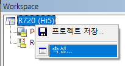
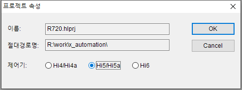


[__SOURCE](README.md)
# ${cont_model} Controller Function Manual - Embedded Progammable Logic Controller (PLC)

[__SOURCE](0-about-this-manual/precautions.md)
# Precautions



[__SOURCE](1-intro/README.md)
# 1. Overview

The embedded programmable logic controller (PLC) of the ${cont_model} controller refers to the functions of the PLC that are installed into the controller in a software-like manner. The user can write and operate ladder programs that are commonly used in PLCs.


Ladder programs can be written or edited using the HRLadder, a ladder editing PC software dedicated to the robots of Hyundai Robotics, and downloaded to the ${cont_model} controller connected via Ethernet. Conversely, the ladder program running on the ${cont_model} controller can be uploaded to the HRLadder on the PC, and the status, such as the mode of the PLC running on the controller or the values of relays, can be remotely monitored from the HRLadder. 

* You can download the HRLadder from the Hyundai Robotics website (https://www.hd-hyundairobotics.com/) - Customer Support - Application Software screen.
* For the information on how to use the HRLadder, refer to the function manual linked to the Help menu of the HRLadder.
* HRLadder can be used for old controller models ranging from Hi4 to Hi5a. Please note that as the ladder program of the ${cont_model} controller is different from that of the old model controllers, there is no compatibility between them.


The ${cont_model} controller"s I/O can be connected to the upper-process PLCs with fieldbus masters or to the devices of lower-level fieldbus slaves, both through a fieldbus or remote I/O device. The functions of the embedded PLC are designed to control the signals of the thus connected I/O using ladder logic.


The functions of the ${cont_model} controller"s embedded PLC are similar to those of the Hi5a controller"s embedded PLC, and the same HRLadder, in other words, the same ladder editor, is used. Therefore, users who are already familiar with the functions of the Hi5a controller"s embedded PLC can quickly learn from this manual by checking only the different parts of the ${cont_model} controller.



Therefore, users already familiar with the functions of the Hi5a controller"s embedded PLC can quickly learn from this manual by checking only the different parts of the ${cont_model} controller. You are kindly required to check the link shown below.
[5. Difference in the embedded PLC between Hi5a and ${cont_model} controllers](../5-diff-hi5a-hi6.md)




[__SOURCE](1-intro/1-ladder-logic.md)
# 1.1 Ladder logic

Ladder Logic, or Ladder Diagram (LD), is the main programming method for embedded PLCs. [Besides LD, there are other methods such as Structured Text (ST), Function Block Diagram (FBD), and Sequential Function Chart (SFC), but embedded PLCs do not support them and will not be further discussed.]

The reason the ladder program is so named is that the architecture of the program resembles a ladder. The horizontal connection line through which signals flow in a ladder-like structure is called a rung, which includes multiple instructions.


A robot teaching project can include one or multiple ladder diagrams, and each diagram may consist of tens to hundreds of rungs.
When the programmable logic controller (PLC) is switched to RUN mode, LD will be executed repeatedly. The time taken to complete one cycle is called scan time and usually ranges from a few milliseconds to several tens of milliseconds.


<br>

An instruction consists of a mnemonic, which is the name of the instruction, and an operand, which is the argument to be transferred to the instruction.

  For example, the ADD (+) instruction in the figure below is configured as follows.


* Mnemonic: ADD
* Operand1: MW5
* Operand2: DOW2
* Operand3: MW6

<br>

Instructions of an embedded PLC can be classified into multiple instruction groups, as described below. As every instruction will be explained in Section 4, the instructions in this section will be explained as examples for understanding the concept of ladder logic.

---

<br>

### Contact instruction

Classified as a contact instruction, eXamine If Closed (XIC) is a simple instruction with only one operand. This instruction will be indicated on the rung with an operand marked on the -| |- symbol.


A contact is a switch determining whether to transfer the signal (1) applied to the left along the rung to the right. If the relay DO3"s value is 0 (inactive), the contact will be open, keeping the signal from being transferred. If the DO3"s value is 1 (active), the contact will be closed, allowing the signal to be transferred.


<br>

When several XIC contacts are connected in series or parallel in the form of a branch, logical operational expressions such as AND, OR, and NOT can be created.
( shows an Inverting (INV) instruction that is designed to transfer the opposite value of the logical value on the left to the right and has no operand.)

```
X1 AND (X2 OR (NOT X3))
```


<br>


### Output-coil instruction

OuTput Energize (OTE) is classified as an output coil instruction. It is always placed at the rightmost end of the rung and indicated by the -( )- symbol. This instruction allows the value transferred from the left to be outputted to the operand relay.

If the result of the logical operation expression described above is outputted to the Y8 relay, it will be in the form shown below.

```
Y8 = X1 AND (X2 OR (NOT X3))
```


<br>

### Function instruction

When the left side becomes active, a specific operation for the given operand will be executed. For example, in the diagram below, when DO3 becomes active, the arithmetic operation ADD (+) of adding the values of MW5 and DOW2 relays and then substituting the thus acquired sum into the MW6 relay will be executed.

```
IF DO3:
   MW6 = MW5 + DOW2
```


The compare instruction also transfers the operation result to the right side. For example, in the diagram below, if DO6 becomes active and MW8 exceeds 120, Y20 will be activated.

```
Y20 = DO6 AND (MW8 > 120)
```


[__SOURCE](2-rc-setting/README.md)
# 2. Setting up the controller


[__SOURCE](2-rc-setting/1-plc-mode-set.md)
# 2.1. Setting the embedded PLC"s mode

In "[F7: Condition setting] - PLC"s operation mode", you can select one of the Off, Stop, R-Stop, R-Run, or Run modes as the operation mode of the embedded progammable logic controller (PLC.) 
R-Stop and R-Run refer to Remote-Stop and Remote-Run, respectively, and each represents a state in which the mode can be changed remotely from the HRLadder of the PC connected via Ethernet.


<br>
<br>
According to the selected mode, the state will be indicated with an icon at the top right of the teach pendant"s screen. That is, in the case of PLC=R-Run or PLC=Run, the PLC icon will be displayed, as shown in the figure above; in the case of PLC=Off, the PLC icon will disappear, as shown in the figure below; and in the case of PLC=Stop, a prohibition mark in red will be indicated on the PLC icon.


 


* Off  
The functions of the embedded PLC will be turned off. When this occurs, the logical outputs of the robot controller, FB0.DO0-FB9.DO959, will be automatically outputted as the physical outputs (means bypassing), FB0.Y0-FB9.Y959, and the physical inputs, FB0.X0-FB9.X959, will be automatically inputted as logical inputs, FB0.DI0-FB9.DI595.

* R-Stop/Stop  
The operation of the embedded PLC will be stopped. R-Stop represents a remote state in which a change can be made from the HRLadder. If the Stop mode is set, it will be impossible to change the operation mode from the HRLadder. 
When the embedded PLC is stopped, the DI and Y relays, which are PLC output signals, will become 0 automatically. *(DI is an input from the perspective of robot language or assignment, but it is an output from the perspective of the embedded PLC.)*  

* R-Run/Run  
The embedded PLC will be executed. R-Run represents a remote state in which changes can be made from the HRLadder. If the Run mode is set, it will be impossible to change the operation mode from the HRLadder. 

[__SOURCE](2-rc-setting/2-tp-relay-mon.md)
# 2.2. Monitoring the relay state from the teach pendant of the controller

The relay state can be monitored by entering "[R2: Window adjustment] - [F1: Selection]".

For more details, refer to [${cont_model} Operation Manual - 6. Monitoring](https://hrbook-hrc.web.app/#/view/doc-hi6-operation/ko-tp630/6-monitoring/README?cont_model=${cont_model}).
[__SOURCE](2-rc-setting/3-scan-time.md)
# 2.3. Scan time

The time taken for the one-cycle execution of the ladder file in the embedded PLC will be indicated as "scan time" on the status bar at the bottom of the HRLadder. As the number of steps in the ladder program increases, the time for execution increases, slowing down the I/O responsiveness accordingly.
[__SOURCE](3-relay/README.md)
# 3. Relays


[__SOURCE](3-relay/1-relay-is.md)
# 3.1 The meaning of a relay

A device in a state equivalent to an on/off contact that determines whether to transfer an electrical signal is called a switch. Meanwhile, a relay is a switch that can operate automatically by using electricity rather than manually.  

Originally, a relay was a physical device that controls contacts using the magnetic force of a coil. However, a relay in a computerized programmable logic controller (PLC) is a logical concept that is controlled by software. In terms of the meaning, a relay has been used as a variable that can store not only an on/off state consisting of 1 bit but also a byte, word, double word, or real value consisting of several bits.
[__SOURCE](3-relay/2-relay-expression.md)
# 3.2 Designating a relay

The following shows how the relays are designated in the embedded programmable logic controller (PLC) of the ${cont_model} robot controller.

`[FB{block-index}.]{relay-type}[{data-type}]{signal-index}`

For example, relays can be designated as below.

Y1501
FB3.DIW21

### block-index  
Input and output relays (DI, DO, X, Y) are grouped into 10 fieldbus blocks with their object names ranging from FB0 to FB9. For physical inputs and outputs, each block will be mapped to each fieldbus device.
The size of one fieldbus block is 120 bytes (=960 bits) for the input and output, respectively.

  You can also map some areas of FB to object names from FN0 to FN63.
  See the link below for instructions on how to set up the FN region.

  [Operation manual: 7.3.2.12 fn block allocation](https://hrbook-hrc.web.app/#/view/doc-hi6-operation/en-tp630/7-system/3-control-parameter/2-io-signal-setting/12-fn-block?cont_model=${cont_model})


### relay-type  
There are 12 different types, as shown below.
Each will be explained in detail later.

- Digital Input (DI): This is a logical input signal that can be used in HRScript or for assigning various inputs.
- Digital Output (DO): This is a logical output signal that can be used in HRScript or for assigning various outputs.
- System Input (SI): This is a dedicated input signal that interfaces with the company"s system board.
- System Output (SO): This is a dedicated output signal that interfaces with the company"s system board.
- X: This is a physical input signal that is inputted from the outside of the controller via a fieldbus device.
- Y: This is a physical output signal that is outputted to the outside of the controller via a fieldbus device. 
- Memory (M): This can be used for storing data and can be accessed from HRScript.
- System (S): This is used to read or write system values in the controller. Refer to [3.4 S relay](./4-sw-relay/README.md).
- AuxiliaRy (R): This is an auxiliary relay for temporarily storing.
- Keep (K): This is an auxiliary relay for temporarily storing. The value will be stored even when the power is turned off. 
- Timer (T): Relays for timer operation, the contact is On when the value is 0. 
- Counter (C): Relays for counter operation, the contact is On when the value is 0. 

<style type="text/css">
  .relay-table {
    border-collapse: collapse;
    /* width를 지정하지 않거나 auto로 두면 내용물에 폭이 딱 맞춰집니다 */
    width: auto; 
    font-family: sans-serif;
    font-size: 13px;
  }
  
  .relay-table th, 
  .relay-table td {
    border: 1px solid #a0a0a0;
    /* 상하 패딩 6px, 좌우 패딩 2px (완전 0보다 가독성을 위해 2px 추천) */
    padding: 6px 2px;
    text-align: center;
    /* 내용이 길어도 줄바꿈되지 않고 한 줄로 나오게 하여 폭을 압축 */
    white-space: nowrap; 
  }

  .relay-table th {
    background-color: #efefef;
    color: black;
    font-weight: bold;
  }

  /* 홀수 줄 배경색 (선택사항: 가독성 향상) */
  .relay-table tbody tr:nth-child(odd) {
    background-color: #ffffff;
  }
  .relay-table tbody tr:nth-child(even) {
    background-color: #f9f9f9;
  }
</style>

<table class="relay-table">
  <thead>
    <tr>
      <th>Relay name</th>
      <th>Number of points</th>
      <th>Relay (bit)</th>
      <th>Relay (byte)</th>
    </tr>
  </thead>
  <tbody>
    <tr>
      <td>DI</td>
      <td>9600 bits (1280 bytes)</td>
      <td>FB0.DI0-FB9.DI959</td>
      <td>FB0.DIB0-FB9.DIB127</td>
    </tr>
    <tr>
      <td>DO</td>
      <td>9600 bits (1280 bytes)</td>
      <td>FB0.DO0-FB9.DO959</td>
      <td>FB0.DOB0-FB9.DOB127</td>
    </tr>
    <tr>
      <td>SI</td>
      <td>960 bits (128 bytes)</td>
      <td>SI0-SI959</td>
      <td>SIB0-SIB127</td>
    </tr>
    <tr>
      <td>SO</td>
      <td>960 bits (128 bytes)</td>
      <td>SO0-SO959</td>
      <td>SOB0-SOB127</td>
    </tr>
    <tr>
      <td>X</td>
      <td>9600 bits (1280 bytes)</td>
      <td>FB0.X0-FB9.X959</td>
      <td>FB0.XB0-FB9.XB127</td>
    </tr>
    <tr>
      <td>Y</td>
      <td>9600 bits (1280 bytes)</td>
      <td>FB0.Y0-FB9.Y959</td>
      <td>FB0.YB0-FB9.YB127</td>
    </tr>
    <tr>
      <td>M</td>
      <td>160000 bits (20000 bytes)</td>
      <td>M0-M159999</td>
      <td>MB0-MB19999</td>
    </tr>
    <tr>
      <td>S</td>
      <td>160000 bits (20000 bytes)</td>
      <td>S0-S159999</td>
      <td>SB0-SB19999</td>
    </tr>
    <tr>
      <td>R</td>
      <td>960 bits (128 bytes)</td>
      <td>R0-R959</td>
      <td>RB0-RB127</td>
    </tr>
    <tr>
      <td>K</td>
      <td>960 bits (128 bytes)</td>
      <td>K0-K959</td>
      <td>KB0-KB127</td>
    </tr>
    <tr>
      <td>T</td>
      <td>256 DWORD (1024 bytes)</td>
      <td>T0-T255</td>
      <td>-</td>
    </tr>
    <tr>
      <td>C</td>
      <td>256 DWORD (1024 bytes)</td>
      <td>C0-C255</td>
      <td>-</td>
    </tr>
  </tbody>
</table>

<div class="page-break"></div>

### data-type  
There are five different types, as shown below.

  * No designation: bit, 1 bit
  * B: signed-byte, 8 bits
  * W: signed-word, 16 bits
  * L: signed-long, 32 bits
  * F: floating-point real, 32 bits

  <br>
  They are just different data types representing the same memory space of 960 bit rather than separate memory spaces. For example, DO[0-15], DOB[0-1], and DOW[0] are all the same output signals.

<br>

<style type="text/css">
table  {border-collapse:collapse;}
td {border-color:gray;border-style:solid;border-width:1px;}
.tg-kftd{background-color:#efefef;}
</style>

<table class="tg">
<tbody>
  <tr>
    <td class="tg-kftd">bit</td>
    <td>DO0-DO7</td>
    <td>DO8-DO15</td>
    <td>DO16-DO23</td>
    <td>DO24-DO31</td>
    <td>...</td>
  </tr>
  <tr>
    <td class="tg-kftd">byte</td>
    <td>DOB0</td>
    <td>DOB1</td>
    <td>DOB2</td>
    <td>DOB3</td>
    <td>...</td>
  </tr>
  <tr>
    <td class="tg-kftd">word</td>
    <td colspan="2">DOW0</td>
    <td colspan="2">DOW2</td>
    <td>...</td>
  </tr>
  <tr>
    <td class="tg-kftd">long</td>
    <td colspan="4">DOL0</td>
    <td>...</td>
  </tr>
  <tr>
    <td class="tg-kftd">float</td>
    <td colspan="4">DOF0</td>
    <td>...</td>
  </tr>
</tbody>
</table>

<div class="page-break"></div>

### signal-index

 This is a 0-based index within the relay type. The index will be given in bit units for DO and in byte units for DOB, DOW, DOL, and DOF.

<br>
<br>

The fieldbus object name can be partially skipped, as shown below. For example, DO961 is the same designation as FB1.DO1.

| **Object name** | **DO designation** | **FB.DO designation** |
| :--- | :--- | :--- |
| FB0 | DO0-DO959 | FB0.DO0-FB0.DO959 |
| FB1 | DO960-DO1919 | FB1.DO0-FB1.DO959 |
| FB2 | DO1920-DO2879 | FB2.DO0-FB2.DO959 |
| FB3 | DO2880-DO3839 | FB3.DO0-FB3.DO959 |
| FB4 | DO3840-DO4799 | FB4.DO0-FB4.DO959 |
| FB5 | DO4800-DO5759 | FB5.DO0-FB5.DO959 |
| FB6 | DO5760-DO6719 | FB6.DO0-FB6.DO959 |
| FB7 | DO6720-DO7679 | FB7.DO0-FB7.DO959 |
| FB8 | DO7680-DO8639 | FB8.DO0-FB8.DO959 |
| FB9 | DO8640-DO9599 | FB9.DO0-FB9.DO959 |


DI and DO are logical inputs and outputs, respectively, and can be accessed through the robot language and I/O assignment.
[__SOURCE](3-relay/3-io/README.md)
# 3.3 Input/output

The I/O diagram of the ${cont_model} robot controller is as shown below.


Figure 3.1 I/O diagram

<br><br>

The light green boxes on the right side of the figure are hardware modules inside the ${cont_model} controller. On the left, there is the main module (COM module) where the main software runs. Meanwhile, on the right, there are Hilscher communication interface (CIF) cards, which are peripheral component interconnect (PCI) cards for the connection to the fieldbus, and serial or Ethernet devices for the connection to the Modbus.

In the main software, there are various relays drawn in the form of small boxes. In the ${cont_model} controller, there are software elements that access these relays, and they are HRScript (robot language), I/O assignment, and the embedded programmable logic controller (PLC). 

<br>

### HRScript (robot language)
The robot language can access User I/O (FB.DI/DO) relays and Memory (M) relays through I/O variables. However, lowercase letters are to be used instead of uppercase letters (e.g., fb3.dow14, mw501.). For details on input/output variables, refer to the [${cont_model} Function Manual - Robot Language - I/O Variables](https://hrbook-hrc.web.app/#/view/doc-hrscript/ko/6-external-comm/1-fb-io/1-io-val?cont_model=${cont_model}) section.


<br>

### I/O assignment, I/O attributes
I/O assignment can access FB.DI/DO relays. In addition, negative logic, pulse, etc. can be set in FB.DI/DO by setting the I/O attributes. For example, for the "external stop," which is an input assignment, if negative logic is set in DI24, the robot will stop when the DI24 signal is 0 (active).
For more details, refer to the [${cont_model} Operation Manual - Input/Output Signal Setting](https://hrbook-hrc.web.app/#/view/doc-hi6-operation/ko-tp630/7-setting/3-control-parameter/2-io-signal-setting/README?cont_model=${cont_model}) section. 


<br>

### Embedded PLC
Ladder Logic is drawn in a dotted line inside the embedded PLC box, and this part is connected to the relays on both sides with arrows. Ladder Logic receives inputs from relays, executes arithmetic/logical operations intended by the author, and then transfers the result values   to other relays.  

As Ladder Logic is connected to Memory, System, Timer, and Counter relays in both directions, it can read values from the relays and write values to them. On the other hand, it is possible only to write values to FB.Y, a physical output, and only to read values from FB.X, a physical input. 

FB.DI is an input from the point of view of the robot language, but this input is a logical input coming inside the controller through the embedded PLC. In other words, from the point of view of the embedded PLC, it is an output. Therefore, Ladder Logic can only write to it. Likewise, as FB.DO is an input from the point of view of the embedded PLC, Ladder Logic can only read from it.

<br>

### Connection to external communication
Hilscher CIF cards are to be connected to physical inputs and outputs. For how to map one or multiple fieldbus objects to a specific CIF card, refer to [${cont_model} Operation Manual - I/O Signal Setting - DIO Block Assignment](https://hrbook-hrc.web.app/#/view/doc-hi6-operation/ko-tp630/7-setting/3-control-parameter/2-io-signal-setting/9-dio-block-assign?cont_model=${cont_model}).  

All relays are mapped to the address space of the Modbus slave function. For more details, refer to [${cont_model} Function Manual - Modbus](https://hrbook-hrc.web.app/#/view/doc-modbus/ko/README?cont_model=${cont_model}).

[__SOURCE](3-relay/3-io/1-so.md)
# 3.3.1 SO - System output

<style type="text/css">
table  {border-collapse:collapse;}
td {
    border-color:gray;
    border-style:solid;
    border-width:1px;
    padding: 1px 4px;
    height: auto !important;
}
</style>

<table class="tg">
<thead>
	<tr>
		<th>System board</th>
		<th>Byte</th>
		<th>Bit</th>
		<th>Name</th>
	</tr>
</thead>

<tbody>
	<tr>
		<td rowspan=32>BD630</td>
		<td rowspan=4>sob0</td>
		<td>so0</td>
		<td>Motor ON (TP)</td>
	</tr>
	<tr>
		<td>so1</td>
		<td>Start (TP)</td>
	</tr>
	<tr>
		<td>so2</td>
		<td>Stop (TP)</td>
	</tr>
	<tr>
		<td>so3</td>
		<td>System error</td>
	</tr>
	<tr>
		<td rowspan=8>sob1</td>
		<td>so8</td>
		<td>Remote Auto Mode</td>
	</tr>
	<tr>
		<td>so9</td>
		<td>TP Disconnect</td>
	</tr>
	<tr>
		<td>so10</td>
		<td>ESCON(Release)</td>
	</tr>	
	<tr>
		<td>so11</td>
		<td>Stop category 1</td>
	</tr>	
	<tr>
		<td>so12</td>
		<td>Stop category 2</td>
	</tr>	
	<tr>
		<td>so13</td>
		<td>Heartbeat 1</td>
	</tr>	
	<tr>
		<td>so14</td>
		<td>Heartbeat 2</td>
	</tr>	
	<tr>
		<td>so15</td>
		<td>Heartbeat 3</td>
	</tr>	
	<tr>
		<td rowspan=3>sob2</td>
		<td>so16</td>
		<td>System error reveived</td>
	</tr>
	<tr>
		<td>so17</td>
		<td>System halt</td>
	</tr>
	<tr>
		<td>so18</td>
		<td>Self diagnosis ok</td>
	</tr>	
</tbody>

<tbody>
	<tr>
		<td rowspan=32>BD640 - 1</td>
		<td rowspan=8>sob4</td>
		<td>so32</td>
		<td>Brake control 1</td>
	</tr>
	<tr>
		<td>so33</td>
		<td>Brake control 2</td>
	</tr>
	<tr>
		<td>so34</td>
		<td>Brake control 3</td>
	</tr>
	<tr>
		<td>so35</td>
		<td>Brake control 4</td>
	</tr>
	<tr>
		<td>so36</td>
		<td>Brake control 5</td>
	</tr>
	<tr>
		<td>so37</td>
		<td>Brake control 6</td>
	</tr>
	<tr>
		<td>so38</td>
		<td>Brake control 7</td>
	</tr>
	<tr>
		<td>so39</td>
		<td>Brake control 8</td>
	</tr>
	<tr>
		<td rowspan=2>sob5</td>
		<td>so42</td>
		<td>Dynamic brake</td>
	</tr>
	<tr>
		<td>so43</td>
		<td>Dynamic brake mode</td>
	</tr>
	<tr>
		<td rowspan=8>sob6</td>
		<td>so48</td>
		<td>User 1</td>
	</tr>
	<tr>
		<td>so49</td>
		<td>User 2</td>
	</tr>
	<tr>
		<td>so50</td>
		<td>User 3</td>
	</tr>
	<tr>
		<td>so51</td>
		<td>User 4</td>
	</tr>
	<tr>
		<td>so52</td>
		<td>User 5 (BD640T)</td>
	</tr>
	<tr>
		<td>so53</td>
		<td>User 6 (BD640T)</td>
	</tr>
	<tr>
		<td>so54</td>
		<td>User 7 (BD640T)</td>
	</tr>
	<tr>
		<td>so55</td>
		<td>User 8 (BD640T)</td>
	</tr>
	<tr>
		<td rowspan=1>sob7</td>
		<td>so56</td>
		<td>Self diagnosis ok</td>
	</tr>
</tbody>

<tbody>
	<tr>
		<td rowspan=32>BD640 - 2</td>
		<td rowspan=8>sob8</td>
		<td>so64</td>
		<td>Brake control 1</td>
	</tr>
	<tr>
		<td>so65</td>
		<td>Brake control 2</td>
	</tr>
	<tr>
		<td>so66</td>
		<td>Brake control 3</td>
	</tr>
	<tr>
		<td>so67</td>
		<td>Brake control 4</td>
	</tr>
	<tr>
		<td>so68</td>
		<td>Brake control 5</td>
	</tr>
	<tr>
		<td>so69</td>
		<td>Brake control 6</td>
	</tr>
	<tr>
		<td>so70</td>
		<td>Brake control 7</td>
	</tr>
	<tr>
		<td>so71</td>
		<td>Brake control 8</td>
	</tr>
	<tr>
		<td rowspan=2>sob9</td>
		<td>so74</td>
		<td>Dynamic brake</td>
	</tr>
	<tr>
		<td>so75</td>
		<td>Dynamic brake mode</td>
	</tr>
	<tr>
		<td rowspan=8>sob10</td>
		<td>so80</td>
		<td>User 1</td>
	</tr>
	<tr>
		<td>so81</td>
		<td>User 2</td>
	</tr>
	<tr>
		<td>so82</td>
		<td>User 3</td>
	</tr>
	<tr>
		<td>so83</td>
		<td>User 4</td>
	</tr>
	<tr>
		<td>so84</td>
		<td>User 5 (BD640T)</td>
	</tr>
	<tr>
		<td>so85</td>
		<td>User 6 (BD640T)</td>
	</tr>
	<tr>
		<td>so86</td>
		<td>User 7 (BD640T)</td>
	</tr>
	<tr>
		<td>so87</td>
		<td>User 8 (BD640T)</td>
	</tr>
	<tr>
		<td rowspan=1>sob11</td>
		<td>so88</td>
		<td>Self diagnosis ok</td>
	</tr>
</tbody>

<tbody>
	<tr>
		<td rowspan=32>BD640 - 3</td>
		<td rowspan=8>sob12</td>
		<td>so96</td>
		<td>Brake control 1</td>
	</tr>
	<tr>
		<td>so97</td>
		<td>Brake control 2</td>
	</tr>
	<tr>
		<td>so98</td>
		<td>Brake control 3</td>
	</tr>
	<tr>
		<td>so99</td>
		<td>Brake control 4</td>
	</tr>
	<tr>
		<td>so100</td>
		<td>Brake control 5</td>
	</tr>
	<tr>
		<td>so101</td>
		<td>Brake control 6</td>
	</tr>
	<tr>
		<td>so102</td>
		<td>Brake control 7</td>
	</tr>
	<tr>
		<td>so103</td>
		<td>Brake control 8</td>
	</tr>
	<tr>
		<td rowspan=2>sob13</td>
		<td>so106</td>
		<td>Dynamic brake</td>
	</tr>
	<tr>
		<td>so107</td>
		<td>Dynamic brake mode</td>
	</tr>
	<tr>
		<td rowspan=8>sob14</td>
		<td>so112</td>
		<td>User 1</td>
	</tr>
	<tr>
		<td>so113</td>
		<td>User 2</td>
	</tr>
	<tr>
		<td>so114</td>
		<td>User 3</td>
	</tr>
	<tr>
		<td>so115</td>
		<td>User 4</td>
	</tr>
	<tr>
		<td>so116</td>
		<td>User 5 (BD640T)</td>
	</tr>
	<tr>
		<td>so117</td>
		<td>User 6 (BD640T)</td>
	</tr>
	<tr>
		<td>so118</td>
		<td>User 7 (BD640T)</td>
	</tr>
	<tr>
		<td>so119</td>
		<td>User 8 (BD640T)</td>
	</tr>
	<tr>
		<td rowspan=1>sob15</td>
		<td>so120</td>
		<td>Self diagnosis ok</td>
	</tr>
</tbody>

<tbody>
	<tr>
		<td rowspan=32>BD640 - 4</td>
		<td rowspan=8>sob16</td>
		<td>so128</td>
		<td>Brake control 1</td>
	</tr>
	<tr>
		<td>so129</td>
		<td>Brake control 2</td>
	</tr>
	<tr>
		<td>so130</td>
		<td>Brake control 3</td>
	</tr>
	<tr>
		<td>so131</td>
		<td>Brake control 4</td>
	</tr>
	<tr>
		<td>so132</td>
		<td>Brake control 5</td>
	</tr>
	<tr>
		<td>so133</td>
		<td>Brake control 6</td>
	</tr>
	<tr>
		<td>so134</td>
		<td>Brake control 7</td>
	</tr>
	<tr>
		<td>so135</td>
		<td>Brake control 8</td>
	</tr>
	<tr>
		<td rowspan=2>sob17</td>
		<td>so138</td>
		<td>Dynamic brake</td>
	</tr>
	<tr>
		<td>so139</td>
		<td>Dynamic brake mode</td>
	</tr>
	<tr>
		<td rowspan=8>sob18</td>
		<td>so144</td>
		<td>User 1</td>
	</tr>
	<tr>
		<td>so145</td>
		<td>User 2</td>
	</tr>
	<tr>
		<td>so146</td>
		<td>User 3</td>
	</tr>
	<tr>
		<td>so147</td>
		<td>User 4</td>
	</tr>
	<tr>
		<td>so148</td>
		<td>User 5 (BD640T)</td>
	</tr>
	<tr>
		<td>so149</td>
		<td>User 6 (BD640T)</td>
	</tr>
	<tr>
		<td>so150</td>
		<td>User 7 (BD640T)</td>
	</tr>
	<tr>
		<td>so151</td>
		<td>User 8 (BD640T)</td>
	</tr>
	<tr>
		<td rowspan=1>sob19</td>
		<td>so152</td>
		<td>Self diagnosis ok</td>
	</tr>
</tbody>

<tbody>
	<tr>
		<td rowspan=32>BD640T Conveyor</td>
		<td rowspan=4>sob20</td>
		<td>so160</td>
		<td>ch1 - Pulse counting type (0=up, 1=up/down)</td>
	</tr>
	<tr>
		<td>so161</td>
		<td>ch1- Communication type (0=Line Driver, 1=Open Collector)</td>
	</tr>
	<tr>
		<td>so162</td>
		<td>ch2 - Pulse counting type (0=up, 1=up/down)</td>
	</tr>
	<tr>
		<td>so163</td>
		<td>ch2- Communication type (0=Line Driver, 1=Open Collector)</td>
	</tr>
</tbody>

</table>

<div class="page-break"></div>
[__SOURCE](3-relay/3-io/2-si.md)
# 3.3.2 SI - System input

<style type="text/css">
table  {border-collapse:collapse;}
td {border-color:gray;border-style:solid;border-width:1px;}
.grayed {background-color:lightgray;}
</style>

<table class="tg">
<thead>
	<tr>
		<th>System board</th>
		<th>Byte</th>
		<th>Bit</th>
		<th>Name</th>
	</tr>
</thead>

<tbody>
	<tr>
		<td rowspan=32>BD630</td>
		<td rowspan=8>sib0</td>
		<td>si0</td>
		<td>Lift Axis/Arm Limit</td>
	</tr>
	<tr>
		<td>si1</td>
		<td>Primary Axis Limit</td>
	</tr>
	<tr>
		<td>si2</td>
		<td>Add Axis Limit</td>
	</tr>
	<tr>
		<td>si3</td>
		<td>Ext Axis Limit</td>
	</tr>
	<tr>
		<td>si4</td>
		<td>Emergency stop (OP)</td>
	</tr>
	<tr>
		<td>si5</td>
		<td>Emergency stop (TP)</td>
	</tr>
	<tr>
		<td>si6</td>
		<td>Emergency stop (Ext)</td>
	</tr>
	<tr>
		<td>si7</td>
		<td>Safety chain</td>
	</tr>
	<tr>
		<td rowspan=7>sib1</td>
		<td>si8</td>
		<td>Mode switch (Auto)</td>
	</tr>
	<tr>
		<td>si9</td>
		<td>Mode switch (Manual)</td>
	</tr>
	<tr>
		<td>si10</td>
		<td>Mode switch (Remote)</td>
	</tr>	
	<tr>
		<td>si11</td>
		<td>TP Enabling switch</td>
	</tr>	
	<tr>
		<td>si12</td>
		<td>Safety guard (Auto)</td>
	</tr>	
	<tr>
		<td>si13</td>
		<td>Safety guard (Auto ext.)</td>
	</tr>	
	<tr>
		<td>si14</td>
		<td>Safety guard (General)</td>
	</tr>	
	<tr>
		<td rowspan=8>sib2</td>
		<td>si16</td>
		<td>PreCharge</td>
	</tr>
	<tr>
		<td>si17</td>
		<td>Motors Power</td>
	</tr>
	<tr>
		<td>si18</td>
		<td>DisCharge</td>
	</tr>	
	<tr>
		<td>si19</td>
		<td>Motor ON (TP)</td>
	</tr>	
	<tr>
		<td>si20</td>
		<td>Start (TP)</td>
	</tr>	
	<tr>
		<td>si21</td>
		<td>Stop (TP)</td>
	</tr>	
	<tr>
		<td>si22</td>
		<td>OP installed</td>
	</tr>	
	<tr>
		<td>si23</td>
		<td>Motor ON(Ext.)</td>
	</tr>	
	<tr>
		<td rowspan=2>sib3</td>
		<td>si24</td>
		<td>Heartbeat 1</td>
	</tr>
	<tr>
		<td>si25</td>
		<td>Heartbeat 2</td>
	</tr>
</tbody>

<tbody>
	<tr>
		<td rowspan=32>BD640 - 1</td>
		<td rowspan=8>sib4</td>
		<td>si32</td>
		<td>Brake status 1</td>
	</tr>
	<tr>
		<td>si33</td>
		<td>Brake status 2</td>
	</tr>
	<tr>
		<td>si34</td>
		<td>Brake status 3</td>
	</tr>
	<tr>
		<td>si35</td>
		<td>Brake status 4</td>
	</tr>
	<tr>
		<td>si36</td>
		<td>Brake status 5</td>
	</tr>
	<tr>
		<td>si37</td>
		<td>Brake status 6</td>
	</tr>
	<tr>
		<td>si38</td>
		<td>Brake status 7</td>
	</tr>
	<tr>
		<td>si39</td>
		<td>Brake status 8</td>
	</tr>
	<tr>
		<td rowspan=8>sib5</td>
		<td>si40</td>
		<td>Precharge relay on</td>
	</tr>
	<tr>
		<td>si41</td>
		<td>Dynamic resistor overheat</td>
	</tr>
	<tr>
		<td>si42</td>
		<td>Over voltage</td>
	</tr>
	<tr>
		<td>si43</td>
		<td>Under voltage</td>
	</tr>
	<tr>
		<td>si44</td>
		<td>Dynamic brake status</td>
	</tr>
	<tr>
		<td>si45</td>
		<td>/SVON (Servo ON)</td>
	</tr>
	<tr>
		<td>si46</td>
		<td>Robot-fan failure</td>
	</tr>
	<tr>
		<td>si47</td>
		<td>Diode module overheat</td>
	</tr>
	<tr>
		<td rowspan=8>sib6</td>
		<td>si48</td>
		<td>User 1</td>
	</tr>
	<tr>
		<td>si49</td>
		<td>User 2</td>
	</tr>
	<tr>
		<td>si50</td>
		<td>User 3</td>
	</tr>
	<tr>
		<td>si51</td>
		<td>User 4</td>
	</tr>
	<tr>
		<td>si52</td>
		<td>User 5 (BD640T)</td>
	</tr>
	<tr>
		<td>si53</td>
		<td>User 6 (BD640T)</td>
	</tr>
	<tr>
		<td>si54</td>
		<td>User 7 (BD640T)</td>
	</tr>
	<tr>
		<td>si55</td>
		<td>User 8 (BD640T)</td>
	</tr>
	<tr>
		<td rowspan=2>sib7</td>
		<td>si56</td>
		<td>Brake power fail</td>
	</tr>
	<tr>
		<td>si57</td>
		<td>AC voltage down</td>
	</tr>
</tbody>

<tbody>
	<tr>
		<td rowspan=32>BD640 - 2</td>
		<td rowspan=8>sib8</td>
		<td>si64</td>
		<td>Brake status 1</td>
	</tr>
	<tr>
		<td>si65</td>
		<td>Brake status 2</td>
	</tr>
	<tr>
		<td>si66</td>
		<td>Brake status 3</td>
	</tr>
	<tr>
		<td>si67</td>
		<td>Brake status 4</td>
	</tr>
	<tr>
		<td>si68</td>
		<td>Brake status 5</td>
	</tr>
	<tr>
		<td>si69</td>
		<td>Brake status 6</td>
	</tr>
	<tr>
		<td>si70</td>
		<td>Brake status 7</td>
	</tr>
	<tr>
		<td>si71</td>
		<td>Brake status 8</td>
	</tr>
	<tr>
		<td rowspan=8>sib9</td>
		<td>si72</td>
		<td>Precharge relay on</td>
	</tr>
	<tr>
		<td>si73</td>
		<td>Dynamic resistor overheat</td>
	</tr>
	<tr>
		<td>si74</td>
		<td>Over voltage</td>
	</tr>
	<tr>
		<td>si75</td>
		<td>Under voltage</td>
	</tr>
	<tr>
		<td>si76</td>
		<td>Dynamic brake status</td>
	</tr>
	<tr>
		<td>si77</td>
		<td>/SVON (Servo ON)</td>
	</tr>
	<tr>
		<td>si78</td>
		<td>Robot-fan failure</td>
	</tr>
	<tr>
		<td>si79</td>
		<td>Diode module overheat</td>
	</tr>
	<tr>
		<td rowspan=8>sib10</td>
		<td>si80</td>
		<td>User 1</td>
	</tr>
	<tr>
		<td>si81</td>
		<td>User 2</td>
	</tr>
	<tr>
		<td>si82</td>
		<td>User 3</td>
	</tr>
	<tr>
		<td>si83</td>
		<td>User 4</td>
	</tr>
	<tr>
		<td>si84</td>
		<td>User 5 (BD640T)</td>
	</tr>
	<tr>
		<td>si85</td>
		<td>User 6 (BD640T)</td>
	</tr>
	<tr>
		<td>si86</td>
		<td>User 7 (BD640T)</td>
	</tr>
	<tr>
		<td>si87</td>
		<td>User 8 (BD640T)</td>
	</tr>
	<tr>
		<td rowspan=2>sib11</td>
		<td>si88</td>
		<td>Brake power fail</td>
	</tr>
	<tr>
		<td>si89</td>
		<td>AC voltage down</td>
	</tr>
</tbody>

<tbody>
	<tr>
		<td rowspan=32>BD640 - 3</td>
		<td rowspan=8>sib12</td>
		<td>si96</td>
		<td>Brake status 1</td>
	</tr>
	<tr>
		<td>si97</td>
		<td>Brake status 2</td>
	</tr>
	<tr>
		<td>si98</td>
		<td>Brake status 3</td>
	</tr>
	<tr>
		<td>si99</td>
		<td>Brake status 4</td>
	</tr>
	<tr>
		<td>si100</td>
		<td>Brake status 5</td>
	</tr>
	<tr>
		<td>si101</td>
		<td>Brake status 6</td>
	</tr>
	<tr>
		<td>si102</td>
		<td>Brake status 7</td>
	</tr>
	<tr>
		<td>si103</td>
		<td>Brake status 8</td>
	</tr>
	<tr>
		<td rowspan=8>sib13</td>
		<td>si104</td>
		<td>Precharge relay on</td>
	</tr>
	<tr>
		<td>si105</td>
		<td>Dynamic resistor overheat</td>
	</tr>
	<tr>
		<td>si106</td>
		<td>Over voltage</td>
	</tr>
	<tr>
		<td>si107</td>
		<td>Under voltage</td>
	</tr>
	<tr>
		<td>si108</td>
		<td>Dynamic brake status</td>
	</tr>
	<tr>
		<td>si109</td>
		<td>/SVON (Servo ON)</td>
	</tr>
	<tr>
		<td>si110</td>
		<td>Robot-fan failure</td>
	</tr>
	<tr>
		<td>si111</td>
		<td>Diode module overheat</td>
	</tr>
	<tr>
		<td rowspan=8>sib14</td>
		<td>si112</td>
		<td>User 1</td>
	</tr>
	<tr>
		<td>si113</td>
		<td>User 2</td>
	</tr>
	<tr>
		<td>si114</td>
		<td>User 3</td>
	</tr>
	<tr>
		<td>si115</td>
		<td>User 4</td>
	</tr>
	<tr>
		<td>si116</td>
		<td>User 5 (BD640T)</td>
	</tr>
	<tr>
		<td>si117</td>
		<td>User 6 (BD640T)</td>
	</tr>
	<tr>
		<td>si118</td>
		<td>User 7 (BD640T)</td>
	</tr>
	<tr>
		<td>si119</td>
		<td>User 8 (BD640T)</td>
	</tr>
	<tr>
		<td rowspan=2>sib15</td>
		<td>si120</td>
		<td>Brake power fail</td>
	</tr>
	<tr>
		<td>si121</td>
		<td>AC voltage down</td>
	</tr>
</tbody>

<tbody>
	<tr>
		<td rowspan=32>BD640 - 4</td>
		<td rowspan=8>sib16</td>
		<td>si128</td>
		<td>Brake status 1</td>
	</tr>
	<tr>
		<td>si129</td>
		<td>Brake status 2</td>
	</tr>
	<tr>
		<td>si130</td>
		<td>Brake status 3</td>
	</tr>
	<tr>
		<td>si131</td>
		<td>Brake status 4</td>
	</tr>
	<tr>
		<td>si132</td>
		<td>Brake status 5</td>
	</tr>
	<tr>
		<td>si133</td>
		<td>Brake status 6</td>
	</tr>
	<tr>
		<td>si134</td>
		<td>Brake status 7</td>
	</tr>
	<tr>
		<td>si135</td>
		<td>Brake status 8</td>
	</tr>
	<tr>
		<td rowspan=8>sib17</td>
		<td>si136</td>
		<td>Precharge relay on</td>
	</tr>
	<tr>
		<td>si137</td>
		<td>Dynamic resistor overheat</td>
	</tr>
	<tr>
		<td>si138</td>
		<td>Over voltage</td>
	</tr>
	<tr>
		<td>si139</td>
		<td>Under voltage</td>
	</tr>
	<tr>
		<td>si140</td>
		<td>Dynamic brake status</td>
	</tr>
	<tr>
		<td>si141</td>
		<td>/SVON (Servo ON)</td>
	</tr>
	<tr>
		<td>si142</td>
		<td>Robot-fan failure</td>
	</tr>
	<tr>
		<td>si143</td>
		<td>Diode module overheat</td>
	</tr>
	<tr>
		<td rowspan=8>sib18</td>
		<td>si144</td>
		<td>User 1</td>
	</tr>
	<tr>
		<td>si145</td>
		<td>User 2</td>
	</tr>
	<tr>
		<td>si146</td>
		<td>User 3</td>
	</tr>
	<tr>
		<td>si147</td>
		<td>User 4</td>
	</tr>
	<tr>
		<td>si148</td>
		<td>User 5 (BD640T)</td>
	</tr>
	<tr>
		<td>si149</td>
		<td>User 6 (BD640T)</td>
	</tr>
	<tr>
		<td>si150</td>
		<td>User 7 (BD640T)</td>
	</tr>
	<tr>
		<td>si151</td>
		<td>User 8 (BD640T)</td>
	</tr>
	<tr>
		<td rowspan=2>sib19</td>
		<td>si152</td>
		<td>Brake power fail</td>
	</tr>
	<tr>
		<td>si153</td>
		<td>AC voltage down</td>
	</tr>
</tbody>

<tbody>
	<tr>
		<td rowspan=32>BD640T Conveyor</td>
		<td rowspan=1>sib42<br>sib43</td>
		<td></td>
		<td>ch1 - pulse counter (16bit)</td>
	</tr>
	<tr>
		<td rowspan=1>sib44<br>sib45</td>
		<td></td>
		<td>ch2 - pulse counter (16bit)</td>
	</tr>
	<tr>
		<td rowspan=4>sib46</td>
		<td>si368</td>
		<td>ch1- line error</td>
	</tr>
	<tr>
		<td>si369</td>
		<td>ch1- limit swich</td>
	</tr>
	<tr>
		<td>si370</td>
		<td>ch2- line error</td>
	</tr>
	<tr>
		<td>si371</td>
		<td>ch2- limit swich</td>
	</tr>
</tbody>

</table>

[__SOURCE](3-relay/4-sw-relay/README.md)
# 3.4 S relays

The values   for various states in the ${cont_model} controller are mapped to the S relays. It is also possible to change the state of ${cont_model} by writing values   to some of the S relays.

Therefore, an external device, such as a process programmable logic controller (PLC) or personal computer (PC), can remotely monitor the states of the ${cont_model} controller by reading the values of the S relays through fieldbus, Modbus, etc. and can remotely control the ${cont_model} controller by writing values to the S relays.  

The area of the S relays can be largely divided into two parts as follows.


<style type="text/css">
table  {border-collapse:collapse;}
td {border-color:gray;border-style:solid;border-width:1px;}
.grayed {background-color:lightgray;}
</style>

<table class="tg">
	<tr>
		<th>address</th>
		<th>content</th>
	</tr>
	<tr>
		<td>SB00000-SB01999</td>
		<td>fixed area</td>
	</tr>
	<tr>
		<td>SB02000-SB19999</td>
		<td>optional items area (slots)</td>
	</tr>
</table>

<br>

### Fixed area
Basic items that are frequently used are allocated to predetermined addresses. It is not possible to change or allocate items through settings. The map of the fixed area will be described in the next section.

<br>

### Optional items area
This area consists of a total of 900 slots, with each slot of 20 bytes. The configuration of each slot will be determined by what command value is to be put into the leading word. The map for each command is described in the following section.

<div class="page-break"></div>

<table class="tg">
<thead>
	<tr>
		<th>slot index</th>
		<th>s index:offset</th>
		<th>field</th>
	</tr>
</thead>
<tbody>
	<tr>
		<td rowspan=10>slot 0</td>
		<td>2000:0</td>
		<td>command (conventional practice: get is for even numbers, set is for odd numbers)</td>
	</tr>
	<tr>
		<td>:2</td>
		<td rowspan=2>params</td>
	</tr>
	<tr>
		<td>:4</td>
	</tr>
	<tr>
		<td>:6</td>
		<td rowspan=5>results</td>
	</tr>
	<tr><td>:8</td></tr>
	<tr><td>:10</td></tr>
	<tr><td>:12</td></tr>
	<tr><td>:14</td></tr>
	<tr><td>:16</td><td class='grayed'></td></tr>
	<tr><td>:18</td><td class='grayed'></td></tr>
	<tr>
		<td rowspan=10>slot 1</td>
		<td>2020:0</td>
		<td>command</td>
	</tr>
	<tr>
		<td>:2</td>
		<td>params</td>
	</tr>
	<tr>
		<td>:4</td>
		<td rowspan=2>results</td>
	</tr>
	<tr>
		<td>:6</td>
	</tr>
	<tr><td>:8</td><td class='grayed'></td></tr>
	<tr><td>:10</td><td class='grayed'></td></tr>
	<tr><td>:12</td><td class='grayed'></td></tr>
	<tr><td>:14</td><td class='grayed'></td></tr>
	<tr><td>:16</td><td class='grayed'></td></tr>
	<tr><td>:18</td><td class='grayed'></td></tr>
	<tr>
		<td rowspan=3>slot 2</td>
		<td>2040:0</td>
		<td>command</td>
	</tr>
	<tr>
		<td>:2</td>
		<td>params</td>
	</tr>
	<tr>
		<td>...</td>
		<td>...</td>
	</tr>
	<tr>
		<td>...</td>
		<td>...</td>
		<td>...</td>
	</tr>
	<tr>
		<td rowspan=3>slot 899</td>
		<td>19980:0</td>
		<td>command</td>
	</tr>
	<tr>
		<td>:2</td>
		<td>params</td>
	</tr>
	<tr>
		<td>...</td>
		<td>...</td>
	</tr>
</tbody>
</table>
[__SOURCE](3-relay/4-sw-relay/1-fixed-area.md)
# 3.4.1 S relay - Fixed area

Please refer to the table shown below for the SB0-SB1999 areas for which fixed items are provided.

<style type="text/css">
table  {border-collapse:collapse;}
td {
    border-color:gray;
    border-style:solid;
    border-width:1px;
    padding: 1px 4px;
    height: auto !important;
}
.grayed {background-color:lightgray;}
</style>

<div class="page-break"></div>

### Area for special flags

<table class="tg">
<thead>
	<tr>
		<th class='bit'>Relay</th>
		<th class='bit'>bit7</th>
		<th class='bit'>bit6</th>
		<th class='bit'>bit5</th>
		<th class='bit'>bit4</th>
		<th class='bit'>bit3</th>
		<th class='bit'>bit2</th>
		<th class='bit'>bit1</th>
		<th class='bit'>bit0</th>		
		<th class='bit'>Remark</th>
	</tr>
</thead>
<tbody>
	<tr>
		<td>SB0</td>
		<td>On if carry occurs in the operation</td>
		<td>On if BCD operation is impossible</td>
		<td>1-sec clock</td>
		<td>0.2-sec clock</td>
		<td>0.1-sec clock</td>
		<td>On only for one scan</td>
		<td>Always off</td>
		<td>Always on</td>		
		<td></td>
	</tr>
	<tr>
		<td>SB1</td>
		<td class='grayed'></td>
		<td>On when the label is 0 or below or when there is no label to jump to</td>
		<td>On if the label is duplicated</td>
		<td>On if there are more than 100 labels</td>
		<td>On if the label is not a constant</td>
		<td class='grayed'></td>
		<td>4-sec clock</td>
		<td>2-sec clock</td>
		<td></td>
	</tr>
	<tr>
		<td>SB2</td>
		<td class='grayed'></td>
		<td class='grayed'></td>
		<td class='grayed'></td>
		<td class='grayed'></td>
		<td class='grayed'></td>
		<td class='grayed'></td>
		<td>On if there is no subladder to be called by Call</td>
		<td>On when the scan time exceeds 5 seconds</td>
		<td></td>
	</tr>
	<tr>
		<td>SB3</td>
		<td class='grayed'></td>
		<td class='grayed'></td>
		<td class='grayed'></td>
		<td class='grayed'></td>
		<td class='grayed'></td>
		<td class='grayed'></td>
		<td>Self diagnosis completed </td>
		<td>T/P booting completed</td>
		<td></td>
	</tr>
</tbody>
</table>

<div class="page-break"></div>

### Area for basic information

<table class="tg">
<thead>
	<tr>
		<th>Relay</th>
		<th>Description</th>
		<th>Remark</th>
	</tr>
</thead>

<tbody>
	<tr>
		<td>SB4</th>
		<td>PLC execution mode<br>
		(0=stop, 1=R.stop, 2=R.run, 3= run, 4=off, 5=no program)</td>
		<td></td>
	</tr>
	<tr class='grayed'><td>-</td><td>-</td><td>-</td></tr>
	<tr>
		<td>SW6</td>
		<td>Date/Time: Year</td>
	</tr>
	<tr>
		<td>SB8</td>
		<td>Date/Time: Month</td>
		<td></td>
	</tr>
	<tr>
		<td>SB9</td>
		<td>Date/Time: Date</td>
		<td></td>
	</tr>	
	<tr>
		<td>SB10</td>
		<td>Date/Time: Hour</td>
		<td></td>
	</tr>	
	<tr>
		<td>SB11</td>
		<td>Date/Time: Minute</td>
		<td></td>
	</tr>	
	<tr>
		<td>SB12</td>
		<td>Date/Time: Second</td>
		<td></td>
	</tr>	
	<tr class='grayed'><td>-</td><td>-</td><td>-</td></tr>
	<tr>
		<td>SB14</td>
		<td>Software version: First<br>
		e.g., In the case of V60.05-08, SB14:60, SB15:5, SB16:8</td>
		<td></td>
	</tr>
	<tr>
		<td>SB15</td>
		<td>Software version: Second</td>
		<td></td>
	</tr>
	<tr>
		<td>SB16</td>
		<td>Software version: Small-fix</td>
		<td></td>
	</tr>
	<tr class='grayed'><td>-</td><td>-</td><td>-</td></tr>
	<tr>
		<td>SW18</td>
		<td>Scan time</td>
		<td>ms</td>
	</tr>
	<tr>
		<td>SW20</td>
		<td>Assignment time</td>
		<td>us</td>
	</tr>
	<tr>
		<td>SW22</td>
		<td>Maximum occupancy time</td>
		<td>ms</td>
	</tr>
	<tr>
		<td>SW24</td>
		<td>Average occupancy time</td>
		<td>ms</td>
	</tr>
	<tr>
		<td>SW26</td>
		<td>Total number of the steps in the Ladder</td>
		<td></td>
	</tr>
	<tr>
		<td>SW28</td>
		<td>Occupancy ratio</td>
		<td>%</td>
	</tr>
	<tr class='grayed'><td>-</td><td>-</td><td>-</td></tr>
	<tr>
		<td>SB30</td>
		<td>Gun output status</td>
		<td></td>
	</tr>
	<tr>
		<td>SB39</td>
		<td>Current user coordinate number</td>
		<td></td>
	</tr>
	<tr>
		<td>SB40</td>
		<td>Current tool number</td>
		<td></td>
	</tr>
	<tr>
		<td>SB41</td>
		<td>Robot state (0=stop, 1=run, 2=wait)</td>
		<td></td>
	</tr>
	<tr>
		<td>SB42</td>
		<td>Playback speed</td>
		<td>%</td>
	</tr>
	<tr class='grayed'><td>-</td><td>-</td><td>-</td></tr>
	<tr>
		<td>SW44</td>
		<td>Step go/back max speed</td>
		<td>mm/s</td>
	</tr>
	<tr>
		<td>SW46</td>
		<td>Tool tip movement speed</td>
		<td>mm/s</td>
	</tr>
</tbody>
</table>

<div class="page-break"></div>

<table class="tg">
<tbody>
	<tr>
		<td>SW48</td>
		<td>Error/warning number</td>
		<td></td>
	</tr>
	<tr>
		<td>SW50</td>
		<td>Error/warning auxiliary information</td>
		<td></td>
	</tr>
	<tr class='grayed'><td>-</td><td>-</td><td>-</td></tr>
	<tr>
		<td>SW60</td>
		<td>Indirect address designation 1</td>
		<td></td>
	</tr>
	<tr>
		<td>SW62</td>
		<td>Indirect address designation 2</td>
		<td></td>
	</tr>
	<tr>
		<td>SW64</td>
		<td>Indirect address designation 3</td>
		<td></td>
	</tr>
	<tr>
		<td>SW66</td>
		<td>Indirect address designation 4</td>
		<td></td>
	</tr>
	<tr>
		<td>SW68</td>
		<td>Indirect address designation 5</td>
		<td></td>
	</tr>
	<tr>
		<td>SW70</td>
		<td>Indirect address designation 6</td>
		<td></td>
	</tr>
	<tr>
		<td>SW72</td>
		<td>Indirect address designation 7</td>
		<td></td>
	</tr>
	<tr>
		<td>SW74</td>
		<td>Indirect address designation 8</td>
		<td></td>
	</tr>
	<tr>
		<td>SW76</td>
		<td>Indirect address designation 9</td>
		<td></td>
	</tr>
	<tr>
		<td>SW78</td>
		<td>Indirect address designation 10</td>
		<td></td>
	</tr>
	<tr class='grayed'><td>-</td><td>-</td><td>-</td></tr>
	<tr>
		<td>SB88</br>
		...</br>
		SB99</td>
		<td>Teach pendant key input state</td>
		<td></td>
	</tr>
	<tr class='grayed'><td>-</td><td>-</td><td>-</td></tr>
	<tr>
		<td>SW100</td>
		<td>Main program number</td>
		<td>Main task</td>
	</tr>
	<tr>
		<td>SW102</td>
		<td>Step number</td>
		<td>Main task</td>
	</tr>
	<tr>
		<td>SW104</td>
		<td>Function number</td>
		<td>Main task</td>
	</tr>
	<tr>
		<td>SW106</td>
		<td>Main program number</td>
		<td>Main task</td>
	</tr>
	<tr class='grayed'><td>-</td><td>-</td><td>-</td></tr>
	<tr>
		<td>SB109</td>
		<td>Run time selection<br>
		(1=Total (after initialization), 2=Total (after power input), 3=Last cycle, 4=Current cycle)</td>
		<td></td>
	</tr>
	<tr>
		<td>SL110</td>
		<td>Motor on (day)</td>
		<td></td>
	</tr>
	<tr>
		<td>SL114</td>
		<td>Motor on (ms)</td>
		<td></td>
	</tr>
</tbody>
</table>

<div class="page-break"></div>

<table class="tg">
<tbody>
	<tr>
		<td>SL118</td>
		<td>Run time (day)</td>
		<td></td>
	</tr>
	<tr>
		<td>SL122</td>
		<td>Run time (ms)</td>
		<td></td>
	</tr>
	<tr>
		<td>SL126</td>
		<td>Movement time (day)</td>
		<td></td>
	</tr>
	<tr>
		<td>SL130</td>
		<td>Movement time (ms)</td>
		<td></td>
	</tr>
	<tr>
		<td>SL134</td>
		<td>Cycle count</td>
		<td></td>
	</tr>
	<tr>
		<td>SL138</td>
		<td>wait, di wait time (day)</td>
		<td></td>
	</tr>
	<tr>
		<td>SL142</td>
		<td>wait, di wait time (ms)</td>
		<td></td>
	</tr>
	<tr>
		<td>SL146</td>
		<td>delay wait time (day)</td>
		<td></td>
	</tr>
	<tr>
		<td>SL150</td>
		<td>delay wait time (ms)</td>
		<td></td>
	</tr>
	<tr class='grayed'><td>-</td><td>-</td><td>-</td></tr>
	<tr>
		<td>SB159</td>
		<td>Axis information selection<br>
		1 = Current position (axis angle), 2 = Current position (base coordinate), 3 = Current position (base/user coordinate)<br>
		6 = Axis speed, 7 = Motor speed<br>
		8 = Motor speed command when speed control(rpm)<br>
		10 = Load factor(I/Ir), 11 = Load factor(I/Ip), 13 = Load factor(continuous)<br>
		15 = Encoder temperature<br>
		18 = Accumulated distance for each axis<br>
		111 = Position deviation(current), 112 = Position deviation(maximum)<br>
		124 = Encoder communication failure count<br>
		</td>
		<td></td>
	</tr>
	<tr>
		<td>SF160</td>
		<td>Relevant value for Axis 1</td>
		<td></td>
	</tr>
	<tr>
		<td>SF164</td>
		<td>Relevant value for Axis 2</td>
		<td></td>
	</tr>
	<tr>
		<td>SF168</td>
		<td>Relevant value for Axis 3</td>
		<td></td>
	</tr>
	<tr>
		<td>SF172</td>
		<td>Relevant value for Axis 4</td>
		<td></td>
	</tr>
	<tr>
		<td>SF176</td>
		<td>Relevant value for Axis 5</td>
		<td></td>
	</tr>
	<tr>
		<td>SF180</td>
		<td>Relevant value for Axis 6</td>
		<td></td>
	</tr>
	<tr>
		<td>SF184</td>
		<td>Relevant value for Axis 7</td>
		<td></td>
	</tr>
	<tr>
		<td>SF188</td>
		<td>Relevant value for Axis 8</td>
		<td></td>
	</tr>
	<tr>
		<td>SF192</td>
		<td>Relevant value for Axis 9</td>
		<td></td>
	</tr>
	<tr>
		<td>SF196</td>
		<td>Relevant value for Axis 10</td>
		<td></td>
	</tr>
	<tr class='grayed'><td>-</td><td>-</td><td>-</td></tr>
</tbody>
</table>

<div class="page-break"></div>

[__SOURCE](3-relay/4-sw-relay/2-slot-task-info.md)
# 3.4.2 S relay - TASK_INFO

<style type="text/css">
table  {border-collapse:collapse;}
td {border-color:gray;border-style:solid;border-width:1px;}
.grayed {background-color:lightgray;}
</style>

<table class="tg">
<thead>
	<tr>
		<th>S offset</th>
		<th>field</th>
		<th>description</th>
		<th>type</th>
	</tr>
</thead>

<tbody>
	<tr>
		<td>0</td>
		<td>command</td>
		<td>GET_TASK_INFO (100)</td>
		<td>s2</td>
	</tr>
	<tr>
		<td>2</td>
		<td>param. 1</td>
		<td>task_no (0-7)</td>
		<td>s2</td>
	</tr>
	<tr>
		<td>4</td>
		<td rowspan=5>result</td>
		<td>task in activated state</td>
		<td>s2</td>
	</tr>
	<tr>
		<td>6</td>
		<td>task program number</td>
		<td>s2</td>
	</tr>
	<tr>
		<td>8</td>
		<td>task step number</td>
		<td>s2</td>
	</tr>
	<tr>
		<td>10</td>
		<td>task function number</td>
		<td>s2</td>
	</tr>
	<tr>
		<td>12</td>
		<td>task main program number</td>
		<td>s2</td>
	</tr>	
</tbody>
</table>
[__SOURCE](3-relay/4-sw-relay/3-slot-op-time.md)
# 3.4.3 S relay - OP_TIME

<style type="text/css">
table  {border-collapse:collapse;}
td {border-color:gray;border-style:solid;border-width:1px;}
.grayed {background-color:lightgray;}
</style>

<table class="tg">
<thead>
	<tr>
		<th>S offset</th>
		<th>field</th>
		<th>description</th>
		<th>type</th>
	</tr>
</thead>

<tbody>
	<tr>
		<td>0</td>
		<td>command</td>
		<td>GET_OP_TIME (110)</td>
		<td>s2</td>
	</tr>
	<tr>
		<td>2</td>
		<td>param. 1</td>
		<td>task_no (0-7)</td>
		<td>s2</td>
	</tr>
	<tr>
		<td>4</td>
		<td>param. 2</td>
		<td>time_base<br>1=since_init, 2=since power ON, 3=since last cycle, 4=current cycle</td>
		<td>s2</td>
	</tr>
	<tr>
		<td>6</td>
		<td>param. 3</td>
		<td>item<br>1=motor ON, 2=run_time, 3=moving time, 4=wait time, 5=delay time, 11=spotweld time (welder 1), 12=(welder 2), 13=(welder 3), 14=(welder 4)</td>
		<td>s2</td>
	</tr>
	<tr>
		<td>8</td>
		<td rowspan=3>result</td>
		<td>day</td>
		<td>s4</td>
	</tr>
	<tr>
		<td>12</td>
		<td>msec</td>
		<td>s4</td>
	</tr>
	<tr>
		<td>16</td>
		<td>cycle count / weld count</td>
		<td>s4</td>
	</tr>
</tbody>
</table>

<div class="page-break"></div>

[__SOURCE](3-relay/4-sw-relay/4-slot-axis-info.md)
# 3.4.4 S relay - AXIS_INFO

<style type="text/css">
table  {border-collapse:collapse;}
td {border-color:gray;border-style:solid;border-width:1px;}
.grayed {background-color:lightgray;}
</style>

<table class="tg">
<thead>
	<tr>
		<th>S offset</th>
		<th>field</th>
		<th>description</th>
		<th>type</th>
	</tr>
</thead>

<tbody>
	<tr>
		<td>0</td>
		<td>command</td>
		<td>GET_AXIS_INFO (120)</td>
		<td>s2</td>
	</tr>
	<tr>
		<td>2</td>
		<td>param. 1</td>
		<td>type<br>
		1 = Current position (axis angle), 2 = Current position (base coordinate), 3 = Current position (base/user coordinate)<br>
		6 = Axis speed, 7 = Motor speed<br>
		8 = Motor speed command when speed control(rpm)<br>
		10 = Load factor(I/Ir), 11 = Load factor(I/Ip), 13 = Load factor(continuous)<br>
		15 = Encoder temperature<br>
		18 = Accumulated distance for each axis<br>
		111 = Position deviation(current), 112 = Position deviation(maximum)<br>
		124 = Encoder communication failure count<br>
	    </td>
		<td>s2</td>
	</tr>
	<tr>
		<td>4</td>
		<td>param. 2</td>
		<td>start axis number (1-)</td>
		<td>s2</td>
	</tr>
	<tr>
		<td>6</td>
		<td>-</td>
		<td class='grayed'></td>
		<td class='grayed'></td>
	</tr>
	<tr>
		<td>8</td>
		<td rowspan=3>result</td>
		<td>relevant value (for the start axis + axis 0)</td>
		<td>f4</td>
	</tr>
	<tr>
		<td>12</td>
		<td>relevant value (for the start axis + axis 1)</td>
		<td>f4</td>
	</tr>
	<tr>
		<td>16</td>
		<td>relevant value (for the start axis + axis 2)</td>
		<td>f4</td>
	</tr>
</tbody>
</table>

<br>
<br>
<br>

<table class="tg">
<thead>
	<tr>
		<th>S offset</th>
		<th>field</th>
		<th>description</th>
		<th>type</th>
	</tr>
</thead>

<tbody>
	<tr>
		<td>0</td>
		<td>command</td>
		<td>SET_AXIS_INFO (121)</td>
		<td>s2</td>
	</tr>
	<tr>
		<td>2</td>
		<td>param. 1</td>
		<td>type<br>8 = motor speed command when speed control(rpm)</td>
		<td>s2</td>
	</tr>
	<tr>
		<td>4</td>
		<td>param. 2</td>
		<td>start axis number (1-)</td>
		<td>s2</td>
	</tr>
	<tr>
		<td>6</td>
		<td>-</td>
		<td class='grayed'></td>
		<td class='grayed'></td>
	</tr>
	<tr>
		<td>8</td>
		<td rowspan=3>result</td>
		<td>relevant value (for the start axis + axis 0)</td>
		<td>f4</td>
	</tr>
	<tr>
		<td>12</td>
		<td>relevant value (for the start axis + axis 1)</td>
		<td>f4</td>
	</tr>
	<tr>
		<td>16</td>
		<td>relevant value (for the start axis + axis 2)</td>
		<td>f4</td>
	</tr>
</tbody>
</table>

<div class="page-break"></div>

[__SOURCE](3-relay/4-sw-relay/5-slot-tp-keypad.md)
# 3.4.5 S relay - TP_KEYPAD

Supported from V60.30-07

<style type="text/css">
	table  {border-collapse:collapse;}
	th, td {
		border: 1px solid black;
		text-align: center;
		width: 9%;
		height: 3rem;
	}
	.grayed {
		background-color: lightgray;
	}
	.jog {
		color: black;
		background-color: rgb(255, 240, 200);
	}
	.fkey {
		color: black;
		background-color: rgb(210, 230, 200);
	}
	.opkey {
		color: black;
		background-color: rgb(240, 240, 150);
	}
	.spkey {
		color: black;
		background-color: rgb(250, 180, 170);
	}
	.num {
		color: black;
		background-color: rgb(240, 240, 240);
	}
	.arrow {
		color: black;
		background-color: lightgreen;
	}
	.ent {
		color: black;
		background-color: rgb(185, 250, 255);
	}
</style>

<table class="tg">
<thead>
	<tr>
		<th>SB offset</th>
		<th>byte\bit</th>
		<th>7</th>
		<th>6</th>
		<th>5</th>
		<th>4</th>
		<th>3</th>
		<th>2</th>
		<th>1</th>
		<th>0</th>
		<th>type</th>
	</tr>
</thead>

<tbody>
	<tr>
		<td>0</td>
		<td>command</td>
		<td colspan='8'>GET_TP_KEYPAD (130)</td>
		<td>s2</td>
	</tr>
	<tr>
		<td>2</td>
		<td>-</td>
		<td colspan='8'></td>
		<td></td>
	</tr>
	<tr>
		<td>3</td>
		<td>[0]</td>
		<td class='jog'>J4-</td>
		<td class='jog'>J5-</td>
		<td class='jog'>J1-</td>
		<td class='jog'>J2-</td>
		<td class='jog'>J3-</td>
		<td class='jog'>J1+</td>
		<td class='jog'>J2+</td>
		<td class='jog'>J3+</td>
		<td>u1</td>
	</tr>
	<tr>
		<td>4</td>
		<td>[1]</td>
		<td class='ent'>SHIFT</td>
		<td class='arrow'>&larr;</td>
		<td class='jog'>J6-</td>
		<td class='jog'>J4+</td>
		<td class='jog'>J5+</td>
		<td class='jog'>J6+</td>
		<td class='jog'>Step<br>FWD</td>
		<td class='jog'>Step<br>BWD</td>
		<td>u1</td>
	</tr>
	<tr>
		<td>5</td>
		<td>[2]</td>
		<td>Setup</td>
		<td></td>
		<td>robot<br>move</td>
		<td></td>
		<td></td>
		<td>SHIFT+1</td>
		<td>SHIFT+3</td>
		<td>SHIFT+2</td>
		<td>u1</td>
	</tr>
	<tr>
		<td>6</td>
		<td>[3]</td>
		<td class='fkey'>F7</td>
		<td class='fkey'>F6</td>
		<td class='fkey'>F5</td>
		<td class='fkey'>F4</td>
		<td class='fkey'>F3</td>
		<td class='fkey'>F2</td>
		<td class='fkey'>F1</td>
		<td></td>
		<td>u1</td>
	</tr>
	<tr>
		<td>7</td>
		<td>[4]</td>
		<td>Backspace</td>
		<td>Virtual<br>TP</td>
		<td class='ent'>CTRL</td>
		<td class='opkey'>mode2</td>
		<td class='opkey'>mode1</td>
		<td class='opkey'>stop</td>
		<td class='opkey'>start</td>
		<td class='opkey'>motor<br>on</td>
		<td>u1</td>
	</tr>
	<tr>
		<td>8</td>
		<td>[5]</td>
		<td class='num'>7</td>
		<td class='num'>6</td>
		<td class='num'>5</td>
		<td class='num'>4</td>
		<td class='num'>3</td>
		<td class='num'>2</td>
		<td class='num'>1</td>
		<td class='num'>0</td>
		<td>u1</td>
	</tr>
	<tr>
		<td>9</td>
		<td>[6]</td>
		<td class='arrow'>&darr;</td>
		<td class='arrow'>&uarr;</td>
		<td class='arrow'>&rarr;</td>
		<td class='ent'>R</td>
		<td class='ent'>ENTER</td>
		<td class='ent'>ESC</td>
		<td class='num'>9</td>
		<td class='num'>8</td>
		<td>u1</td>
	</tr>
	<tr>
		<td>10</td>
		<td>[7]</td>
		<td class='spkey'>SPEED<br>.LOW</td>
		<td class='spkey'>SPEED<br>.HI</td>
		<td class='spkey'>REC</td>
		<td class='spkey'>STEP</td>
		<td class='spkey'>MECH</td>
		<td class='spkey'>GUN</td>
		<td class='spkey'>COORD</td>
		<td></td>
		<td>u1</td>
	</tr>
	<tr>
		<td>11</td>
		<td>[8]</td>
		<td class='spkey'>HISTORY</td>
		<td class='num'>.</td>
		<td></td>
		<td>align<br>move</td>
		<td class='jog'>J8+</td>
		<td class='jog'>J8-</td>
		<td class='jog'>J7+</td>
		<td class='jog'>J7-</td>
		<td>u1</td>
	</tr>
	<tr>
		<td>12</td>
		<td>[9]</td>
		<td></td>
		<td></td>
		<td></td>
		<td></td>
		<td></td>
		<td></td>
		<td></td>
		<td></td>
		<td>u1</td>
	</tr>
	<tr>
		<td>13</td>
		<td>[10]</td>
		<td></td>
		<td></td>
		<td></td>
		<td></td>
		<td></td>
		<td></td>
		<td></td>
		<td></td>
		<td>u1</td>
	</tr>
	<tr>
		<td>14</td>
		<td>[11]</td>
		<td colspan='8'>serial no.</td>
		<td>u1</td>
	</tr>
</tbody>
</table>

<div class="page-break"></div>


[__SOURCE](3-relay/4-sw-relay/6-slot-tp-app.md)
# 3.4.6 S relay - TP_APP

<style type="text/css">
table  {border-collapse:collapse;}
td {border-color:gray;border-style:solid;border-width:1px;}
.grayed {background-color:lightgray;}
</style>

<table class="tg">
<thead>
	<tr>
		<th>S offset</th>
		<th>field</th>
		<th>description</th>
		<th>type</th>
	</tr>
</thead>

<tbody>
	<tr>
		<td>0</td>
		<td>command</td>
		<td>GETSET_TP_APP (140)</td>
		<td>s2</td>
	</tr>
	<tr>
		<td>2</td>
		<td>get</td>
		<td>the shortcut key number for the teach pendant"s current app (1-9)</td>
		<td>s2</td>
	</tr>
	<tr>
		<td>4</td>
		<td>set</td>
		<td>the shortcut key number for the teach pendant"s target app whose state needs to be read or controlled (1-9)</td>
		<td>s2</td>
	</tr>
	<tr>
		<td>6</td>
		<td>get</td>
		<td>the current state value of the teach pendant"s target app<br>(-1=no operation, 0=not executed, 1=activated, 2=inactivated)</td>
		<td>s2</td>
	</tr>
	<tr>
		<td>8</td>
		<td>set</td>
		<td>controlling of the teach pendant"s target app<br>
(0: no operation, 1: activated, 2: inactivated, 8: executed, 9:forced ending)<br>
* will be performed once every time the value changes.</td>
		<td>s2</td>
	</tr>
</tbody>
</table>

<div class="page-break"></div>

[__SOURCE](3-relay/4-sw-relay/7-slot-date-time.md)
# 3.4.7 S relay - DATE_TIME

<style type="text/css">
table  {border-collapse:collapse;}
td {border-color:gray;border-style:solid;border-width:1px;}
.grayed {background-color:lightgray;}
</style>

<table class="tg">
<thead>
	<tr>
		<th>S offset</th>
		<th>field</th>
		<th>description</th>
		<th>type</th>
	</tr>
</thead>

<tbody>
	<tr>
		<td>0</td>
		<td>command</td>
		<td>GET_DATE_TIME (150)</td>
		<td>s2</td>
	</tr>
	<tr>
		<td>2</td>
		<td rowspan=6>result</td>
		<td>year (e.g., 2022)</td>
		<td>s2</td>
	</tr>
	<tr>
		<td>4</td>
		<td>month (1-12)</td>
		<td>s2</td>
	</tr>
	<tr>
		<td>6</td>
		<td>date (1-31)</td>
		<td>s2</td>
	</tr>
	<tr>
		<td>8</td>
		<td>hour (0-23)</td>
		<td>s2</td>
	</tr>
	<tr>
		<td>10</td>
		<td>minute (0-59)</td>
		<td>s2</td>
	</tr>
	<tr>
		<td>12</td>
		<td>second (0-59)</td>
		<td>s2</td>
	</tr>
</tbody>
</table>

<div class="page-break"></div>

[__SOURCE](3-relay/4-sw-relay/8-slot-cur-spotgun-no.md)
# 3.4.8 S relay - CUR_SPOTGUN_NO

<style type="text/css">
table  {border-collapse:collapse;}
td {border-color:gray;border-style:solid;border-width:1px;}
.grayed {background-color:lightgray;}
</style>

<table class="tg">
<thead>
	<tr>
		<th>S offset</th>
		<th>field</th>
		<th>description</th>
		<th>type</th>
	</tr>
</thead>

<tbody>
	<tr>
		<td>0</td>
		<td>command</td>
		<td>GET_CUR_SPOTGUN_NO (2000)</td>
		<td>s2</td>
	</tr>
	<tr>
		<td>2</td>
		<td>param 1</td>
		<td>task_no (0-7)</td>
		<td>s2</td>
	</tr>
	<tr>
		<td>4</td>
		<td rowspan=12>result</td>
		<td>current spot gun number (master gun)</td>
		<td>s1</td>
	</tr>
	<tr>
		<td>5</td>
		<td>current condition number (master cnd)</td>
		<td>s2</td>
	</tr>
	<tr>
		<td>7</td>
		<td>current sequence number (master seq)</td>
		<td>s1</td>
	</tr>
	<tr>
		<td>8</td>
		<td>current spot gun number (slave gun #1)</td>
		<td>s1</td>
	</tr>
	<tr>
		<td>9</td>
		<td>current condition number (slave cnd #1)</td>
		<td>s2</td>
	</tr>
	<tr>
		<td>11</td>
		<td>current sequence number (slave seq #1)</td>
		<td>s1</td>
	</tr>
	<tr>
		<td>12</td>
		<td>current spot gun number (slave gun #2)</td>
		<td>s1</td>
	</tr>
	<tr>
		<td>13</td>
		<td>current condition number (slave cnd #2)</td>
		<td>s2</td>
	</tr>
	<tr>
		<td>15</td>
		<td>current sequence number (slave seq #2)</td>
		<td>s1</td>
	</tr>
	<tr>
		<td>16</td>
		<td>current spot gun number (slave gun #3)</td>
		<td>s1</td>
	</tr>
	<tr>
		<td>17</td>
		<td>current condition number (slave cnd #3)</td>
		<td>s2</td>
	</tr>
	<tr>
		<td>19</td>
		<td>current sequence number (slave seq #3)</td>
		<td>s1</td>
	</tr>
</tbody>
</table>

<div class="page-break"></div>

[__SOURCE](3-relay/4-sw-relay/9-slot-spotweld-info.md)
# 3.4.9 S realy - SPOTWELD_INFO

<style type="text/css">
table  {border-collapse:collapse;}
td {border-color:gray;border-style:solid;border-width:1px;}
.grayed {background-color:lightgray;}
</style>

<table class="tg">
<thead>
	<tr>
		<th>S offset</th>
		<th>field</th>
		<th>description</th>
		<th>type</th>
	</tr>
</thead>

<tbody>
	<tr>
		<td>0</td>
		<td>command</td>
		<td>GET_SPOTWELD_INFO (2010)</td>
		<td>s2</td>
	</tr>
	<tr>
		<td>2</td>
		<td>param 1</td>
		<td>task_no (0-7)</td>
		<td>s2</td>
	</tr>
	<tr>
		<td>4</td>
		<td>param 2</td>
		<td>gun_no (1-4)</td>
		<td>s2</td>
	</tr>
	<tr>
		<td>6</td>
		<td rowspan=5>result</td>
		<td>gun search state (1=complete, 0=incomplete)</td>
		<td>s2</td>
	</tr>
	<tr>
		<td>8</td>
		<td>moving electrode consumption amount x 10</td>
		<td>s2</td>
	</tr>
	<tr>
		<td>10</td>
		<td>fixed electrode consumption amount x 10</td>
		<td>s2</td>
	</tr>
	<tr>
		<td>12</td>
		<td>squeeze force instruction value x 10</td>
		<td>s2</td>
	</tr>
	<tr>
		<td>14</td>
		<td>squeeze force current value x 10</td>
		<td>s2</td>
	</tr>
</tbody>
</table>

<div class="page-break"></div>

[__SOURCE](3-relay/4-sw-relay/10-slot-arcweld-info.md)
# 3.4.10 S realy - ARCWELD_INFO

<style type="text/css">
table  {border-collapse:collapse;}
td {
    border-color:gray;
    border-style:solid;
    border-width:1px;
    padding: 1px 4px;
    height: auto !important;
}
.grayed {background-color:lightgray;}
</style>

<table class="tg">
<thead>
	<tr>
		<th>S offset</th>
		<th>field</th>
		<th>description</th>
		<th>type</th>
	</tr>
</thead>

<tbody>
	<tr>
		<td>0</td>
		<td>command</td>
		<td>GET_ARCTWELD_INFO (3000) - input</td>
		<td>s2</td>
	</tr>
	<tr>
		<td>2</td>
		<td>param 1</td>
		<td>welder_no (0~1)</td>
		<td>s1</td>
	</tr>
	<tr>
		<td>3</td>
		<td>param 2</td>
		<td>twin_no (0~1)</td>
		<td>s1</td>
	</tr>
	<tr>
		<td>4</td>
		<td rowspan=5>result</td>
		<td>welding current</td>
		<td>f4</td>
	</tr>
	<tr>
		<td>8</td>
		<td>welding voltage</td>
		<td>f4</td>
	</tr>
	<tr>
		<td>12</td>
		<td>welder error</td>
		<td>s2</td>
	</tr>
	<tr>
		<td>16</td>
		<td>wire feeding speed</td>
		<td>f4</td>
	</tr>
</tbody>
</table>


<br>
The following services are supported from V60.32-00 onwards.
<br>
<table class="tg">
<thead>
	<tr>
		<th>S offset</th>
		<th>field</th>
		<th>description</th>
		<th>type</th>
	</tr>
</thead>

<tbody>
	<tr>
		<td>0</td>
		<td>command</td>
		<td>GET_ARCTWELD_INFO (3001) - input</td>
		<td>s2</td>
	</tr>
	<tr>
		<td>2</td>
		<td>param 1</td>
		<td>welder_no (0~1)</td>
		<td>s1</td>
	</tr>
	<tr>
		<td>3</td>
		<td>param 2</td>
		<td>twin_no (0~1)</td>
		<td>s1</td>
	</tr>
	<tr>
		<td>4</td>
		<td rowspan=5>result</td>
		<td>feed motor current</td>
		<td>f4</td>
	</tr>
	<tr>
		<td>8</td>
		<td>seam tracking data</td>
		<td>f4</td>
	</tr>
	<tr>
		<td>12</td>
		<td>welding process</td>
		<td>s2</td>
	</tr>
	<tr>
		<td>16</td>
		<td></td>
		<td>f4</td>
	</tr>
</tbody>
</table>

<br>
<table class="tg">
<thead>
	<tr>
		<th>S offset</th>
		<th>field</th>
		<th>description</th>
		<th>type</th>
	</tr>
</thead>

<tbody>
	<tr>
		<td>0</td>
		<td>command</td>
		<td>GET_ARCTWELD_INFO (3002) - input</td>
		<td>s2</td>
	</tr>
	<tr>
		<td>2</td>
		<td>param 1</td>
		<td>welder_no (0~1)</td>
		<td>s1</td>
	</tr>
	<tr>
		<td>3</td>
		<td>param 2</td>
		<td>twin_no (0~1)</td>
		<td>s1</td>
	</tr>
	<tr>
		<td>4</td>
		<td rowspan=5>result</td>
		<td>Welder total operation time(s)</td>
		<td>s4</td>
	</tr>
	<tr>
		<td>8</td>
		<td>Welder firmware version - Lower digit(Vx.x.255)</td>
		<td>s1</td>
	</tr>
	<tr>
		<td>9</td>
		<td>Welder firmware version - Middle digit(Vx.255.x)</td>
		<td>s1</td>
	</tr>
	<tr>
		<td>10</td>
		<td>Welder firmware version - High digit(V255.x.x)</td>
		<td>s1</td>
	</tr>
</tbody>
</table>

<br>
<table class="tg">
<thead>
	<tr>
		<th>S offset</th>
		<th>field</th>
		<th>description</th>
		<th>type</th>
	</tr>
</thead>

<tbody>
	<tr>
		<td>0</td>
		<td>command</td>
		<td>GET_ARCTWELD_INFO (3004) - input</td>
		<td>s2</td>
	</tr>
	<tr>
		<td>2</td>
		<td>param 1</td>
		<td>welder_no (0~1)</td>
		<td>s1</td>
	</tr>
	<tr>
		<td>3</td>
		<td>param 2</td>
		<td>twin_no (0~1)</td>
		<td>s1</td>
	</tr>
	<tr>
		<td>4</td>
		<td rowspan=5>result</td>
		<td>
			0x01 = WCR(wire contact relay) <br>
			0x02 = Torch collision <br>
			0x04 = Power source ok <br>
			0x08 = Wire sticked <br>
			0x10 = Welder error <br>
			0x20 = Process active <br>
			0x40 = Comm ready <br>
			0x80 = Wire use possible <br>
		</td>
		<td>s1</td>
	</tr>
	<tr>
		<td>5</td>
		<td>
			0x01 = Torch status <br>
			0x02 = Inching status <br>
			0x04 = Retract status <br>
			0x08 = Gas check <br>
			0x10 = Synergic avaliable <br>
			0x20 = Limit status <br>
			0x40 = Setting over range <br>
		</td>
		<td>s1</td>
	</tr>
</tbody>
</table>

<br>
<table class="tg">
<thead>
	<tr>
		<th>S offset</th>
		<th>field</th>
		<th>description</th>
		<th>type</th>
	</tr>
</thead>

<tbody>
	<tr>
		<td>0</td>
		<td>command</td>
		<td>GET_ARCTWELD_INFO (3005) - output</td>
		<td>s2</td>
	</tr>
	<tr>
		<td>2</td>
		<td>param 1</td>
		<td>welder_no (0~1)</td>
		<td>s1</td>
	</tr>
	<tr>
		<td>3</td>
		<td>param 2</td>
		<td>twin_no (0~1)</td>
		<td>s1</td>
	</tr>
	<tr>
		<td>4</td>
		<td rowspan=5>result</td>
		<td>welder current</td>
		<td>f4</td>
	</tr>
	<tr>
		<td>8</td>
		<td>welder voltage</td>
		<td>f4</td>
	</tr>
	<tr>
		<td>12</td>
		<td>Job/Prog no</td>
		<td>s2</td>
	</tr>
	<tr>
		<td>14</td>
		<td>Operation mode</td>
		<td>s2</td>
	</tr>
	<tr>
		<td>16</td>
		<td>Synergic code</td>
		<td>s2</td>
	</tr>
</tbody>
</table>

<br>
<table class="tg">
<thead>
	<tr>
		<th>S offset</th>
		<th>field</th>
		<th>description</th>
		<th>type</th>
	</tr>
</thead>

<tbody>
	<tr>
		<td>0</td>
		<td>command</td>
		<td>GET_ARCTWELD_INFO (3006) - output</td>
		<td>s2</td>
	</tr>
	<tr>
		<td>2</td>
		<td>param 1</td>
		<td>welder_no (0~1)</td>
		<td>s1</td>
	</tr>
	<tr>
		<td>3</td>
		<td>param 2</td>
		<td>twin_no (0~1)</td>
		<td>s1</td>
	</tr>
	<tr>
		<td>4</td>
		<td rowspan=5>result</td>
		<td>Pulse dynamic corr.</td>
		<td>f4</td>
	</tr>
	<tr>
		<td>8</td>
		<td>Wire burnback</td>
		<td>f4</td>
	</tr>
	<tr>
		<td>12</td>
		<td>Process control</td>
		<td>f4</td>
	</tr>
	<tr>
		<td>16</td>
		<td>Arc force</td>
		<td>f4</td>
	</tr>
</tbody>
</table>

<br>
<table class="tg">
<thead>
	<tr>
		<th>S offset</th>
		<th>field</th>
		<th>description</th>
		<th>type</th>
	</tr>
</thead>

<tbody>
	<tr>
		<td>0</td>
		<td>command</td>
		<td>GET_ARCTWELD_INFO (3007) - output</td>
		<td>s2</td>
	</tr>
	<tr>
		<td>2</td>
		<td>param 1</td>
		<td>welder_no (0~1)</td>
		<td>s1</td>
	</tr>
	<tr>
		<td>3</td>
		<td>param 2</td>
		<td>twin_no (0~1)</td>
		<td>s1</td>
	</tr>
	<tr>
		<td>4</td>
		<td rowspan=5>result</td>
		<td>Wire material</td>
		<td>s1</td>
	</tr>
	<tr>
		<td>5</td>
		<td>Wire diameter</td>
		<td>s1</td>
	</tr>
	<tr>
		<td>6</td>
		<td>Gas type</td>
		<td>s1</td>
	</tr>
	<tr>
		<td>7</td>
		<td>Welding mode</td>
		<td>s1</td>
	</tr>
	<tr>
		<td>8</td>
		<td>Twin oper mode</td>
		<td>s1</td>
	</tr>
</tbody>
</table>

<br>
<table class="tg">
<thead>
	<tr>
		<th>S offset</th>
		<th>field</th>
		<th>description</th>
		<th>type</th>
	</tr>
</thead>

<tbody>
	<tr>
		<td>0</td>
		<td>command</td>
		<td>GET_ARCTWELD_INFO (3009) - output</td>
		<td>s2</td>
	</tr>
	<tr>
		<td>2</td>
		<td>param 1</td>
		<td>welder_no (0~1)</td>
		<td>s1</td>
	</tr>
	<tr>
		<td>3</td>
		<td>param 2</td>
		<td>twin_no (0~1)</td>
		<td>s1</td>
	</tr>
	<tr>
		<td>4</td>
		<td rowspan=5>result</td>
		<td>
			0x01 = Arc on <br>
			0x02 = Robot ready <br>
			0x04 = Master torch select <br>
			0x08 = Gas on <br>
			0x10 = Wire inching <br>
			0x20 = Wire retract <br>
			0x40 = Welder error reset <br>
			0x80 = Wire stick check	<br>
		</td>
		<td>s1</td>
	</tr>
	<tr>
		<td>5</td>
		<td>
			0x01 = Welding simulation <br>
			0x02 = Pilot arc<br>
			0x04 = Lift arc use <br>
			0x08 = Super pulse use <br>
			0x10 = Online status <br>
			0x20 = Job mode active <br>
			0x40 = Voltage set mode <br>
			0x80 = Current set mode <br>
		</td>
		<td>s1</td>
	</tr>
	<tr>
		<td>6</td>
		<td>
			0x01 = Robot torch collision <br>
			0x02 = Robot error status <br>
		</td>
		<td>s1</td>
	</tr>	
</tbody>
</table>

<br>

<table class="tg">
<thead>
	<tr>
		<th>S offset</th>
		<th>field</th>
		<th>description</th>
		<th>type</th>
	</tr>
</thead>

<tbody>
	<tr>
		<td>0</td>
		<td>command</td>
		<td>GET_ARCTWELD_INFO (3010) - status</td>
		<td>s2</td>
	</tr>
	<tr>
		<td>2</td>
		<td>param 1</td>
		<td>welder_no (0~1)</td>
		<td>s1</td>
	</tr>
	<tr>
		<td>3</td>
		<td>param 2</td>
		<td>twin_no (0~1)</td>
		<td>s1</td>
	</tr>
	<tr>
		<td>4</td>
		<td rowspan=5>result</td>
		<td>Current arcon cnd no.</td>
		<td>s2</td>
	</tr>
	<tr>
		<td>6</td>
		<td>Current touchsensing cnd no.</td>
		<td>s2</td>
	</tr>
	<tr>
		<td>8</td>
		<td>Current weaving cnd no.</td>
		<td>s2</td>
	</tr>
	<tr>
		<td>10</td>
		<td>Current lvs cnd no.</td>
		<td>s2</td>
	</tr>
	<tr>
		<td>12</td>
		<td>Current arccond cnd no.</td>
		<td>s2</td>
	</tr>
</tbody>
</table>

<div class="page-break"></div>

[__SOURCE](3-relay/4-sw-relay/11-slot-conveyor-info.md)
# 3.4.11 S relay - CONVEYOR_INFO

<style type="text/css">
table  {border-collapse:collapse;}
td {border-color:gray;border-style:solid;border-width:1px;}
.grayed {background-color:lightgray;}
</style>

<table class="tg">
<thead>
	<tr>
		<th>S offset</th>
		<th>field</th>
		<th>description</th>
		<th>type</th>
	</tr>
</thead>

<tbody>
	<tr>
		<td>0</td>
		<td>command</td>
		<td>GET_CONVEYOR_INFO (4000)</td>
		<td>s2</td>
	</tr>
	<tr>
		<td>2</td>
		<td>param 1</td>
		<td>conv_no (0-7)</td>
		<td>s2</td>
	</tr>
	<tr>
		<td>4</td>
		<td rowspan=7>result</td>
		<td>conveyor pulse</td>
		<td>s2</td>
	</tr>
	<tr>
		<td>6</td>
		<td>workpiece position</td>
		<td>s2</td>
	</tr>
	<tr>
		<td>8</td>
		<td>conveyor speed</td>
		<td>s2</td>
	</tr>
	<tr>
		<td>10</td>
		<td>workpiece count</td>
		<td>s2</td>
	</tr>
	<tr>
		<td>12</td>
		<td>limit switch input</td>
		<td>s2</td>
	</tr>
	<tr>
		<td>14</td>
		<td>raw pulse</td>
		<td>s2</td>
	</tr>
	<tr>
		<td>14</td>
		<td>encoder resolution</td>
		<td>s4</td>
	</tr>
</tbody>
</table>

<br>

<table class="tg">
<thead>
	<tr>
		<th>S offset</th>
		<th>field</th>
		<th>description</th>
		<th>type</th>
	</tr>
</thead>

<tbody>
	<tr>
		<td>0</td>
		<td>command</td>
		<td>GET_CONVEYOR_INFO_LIN (4010)</td>
		<td>s2</td>
	</tr>
	<tr>
		<td>2</td>
		<td>param 1</td>
		<td>conv_no (0-7)</td>
		<td>s2</td>
	</tr>
	<tr>
		<td>4</td>
		<td rowspan=2>result</td>
		<td>linear conveyor horizontal angle</td>
		<td>f4</td>
	</tr>
	<tr>
		<td>8</td>
		<td>linear conveyor vertical angle</td>
		<td>f4</td>
	</tr>
</tbody>
</table>

<br>

<table class="tg">
<thead>
	<tr>
		<th>S offset</th>
		<th>field</th>
		<th>description</th>
		<th>type</th>
	</tr>
</thead>

<tbody>
	<tr>
		<td>0</td>
		<td>command</td>
		<td>GET_CONVEYOR_INFO_CIR (4020)</td>
		<td>s2</td>
	</tr>
	<tr>
		<td>2</td>
		<td>param 1</td>
		<td>conv_no (0-7)</td>
		<td>s2</td>
	</tr>
	<tr>
		<td>4</td>
		<td rowspan=2>result</td>
		<td>circular conveyor angle (X axis)</td>
		<td>f4</td>
	</tr>
	<tr>
		<td>8</td>
		<td>circular conveyor angle (Y axis)</td>
		<td>f4</td>
	</tr>
</tbody>
</table>

<br>

<table class="tg">
<thead>
	<tr>
		<th>S offset</th>
		<th>field</th>
		<th>description</th>
		<th>type</th>
	</tr>
</thead>

<tbody>
	<tr>
		<td>0</td>
		<td>command</td>
		<td>GET_CONVEYOR_INFO_CIR2 (4040)</td>
		<td>s2</td>
	</tr>
	<tr>
		<td>2</td>
		<td>param 1</td>
		<td>conv_no (0-7)</td>
		<td>s2</td>
	</tr>
	<tr>
		<td>4</td>
		<td rowspan=3>result</td>
		<td>circular conveyor center (X)</td>
		<td>f4</td>
	</tr>
	<tr>
		<td>8</td>
		<td>circular conveyor center (Y)</td>
		<td>f4</td>
	</tr>
	<tr>
		<td>12</td>
		<td>circular conveyor center (Z)</td>
		<td>f4</td>
	</tr>
</tbody>
</table>

<div class="page-break"></div>

[__SOURCE](3-relay/4-sw-relay/12-slot-sys-var.md)
# 3.4.12 S realy - SYSTEM_VARIABLE

<style type="text/css">
table  {border-collapse:collapse;}
td {border-color:gray;border-style:solid;border-width:1px;}
.grayed {background-color:lightgray;}
</style>


### Getting and Setting system variables


In versions lower than V70.00-00 to set system variables, check that the command has changed and operate. <br>
In other words, it operates once at the moment the command value changes to 161.  



#### Get system variables
<table class="tg">
<thead>
	<tr>
		<th>S offset</th>
		<th>field</th>
		<th>description</th>
		<th>type</th>
	</tr>
</thead>

<tbody>
	<tr>
		<td>0</td>
		<td>command</td>
		<td>GET_SYS_VAR (160)</td>
		<td>s2</td>
	</tr>
	<tr>
		<td>2</td>
		<td>param 1</td>
		<td>item (of set data)</td>
		<td>s2</td>
	</tr>
	<tr>
		<td>4 ~ 18</td>
		<td>param n</td>
		<td>get value</td>
		<td></td>
	</tr>
</tbody>
</table>
<br>

#### Set system variables
<table class="tg">
<thead>
	<tr>
		<th>S offset</th>
		<th>field</th>
		<th>description</th>
		<th>type</th>
	</tr>
</thead>

<tbody>
	<tr>
		<td>0</td>
		<td>command</td>
		<td>SET_SYS_VAR (161)</td>
		<td>s2</td>
	</tr>
	<tr>
		<td>2</td>
		<td>param 1</td>
		<td>item (of set data)</td>
		<td>s2</td>
	</tr>
	<tr>
		<td>4 ~ 18</td>
		<td>param n</td>
		<td>set value</td>
		<td></td>
	</tr>
</tbody>
</table>
<br>
<br>

#### <mark style="color:green;">Playback speed</mark>
<table class="tg">
<thead>
	<tr>
		<th>S offset</th>
		<th>field</th>
		<th>description</th>
		<th>type</th>
	</tr>
</thead>
<tbody>
	<tr>
		<td>2</td>
		<td>param 1</td>
		<td>42 = Playback speed</td>
		<td>s2</td>
	</tr>
	<tr>
		<td>4</td>
		<td>param 1</td>
		<td>value</td>
		<td>s1</td>
	</tr>
</tbody>
</table>
Info) <br>
- Getting it on versions lower than V70.00-00 is not supported. <br>
<br>

#### <mark style="color:green;">Current tool number</mark>
<table class="tg">
<thead>
	<tr>
		<th>S offset</th>
		<th>field</th>
		<th>description</th>
		<th>type</th>
	</tr>
</thead>
<tbody>
	<tr>
		<td>2</td>
		<td>param 1</td>
		<td>40 = Tool number</td>
		<td>s2</td>
	</tr>
	<tr>
		<td>4</td>
		<td>param 1</td>
		<td>value</td>
		<td>s1</td>
	</tr>
</tbody>
</table>
Info) <br>
- Getting it on versions lower than V70.00-00 is not supported. <br>
<br>

#### <mark style="color:green;">Step go/back max speed</mark>
<table class="tg">
<thead>
	<tr>
		<th>S offset</th>
		<th>field</th>
		<th>description</th>
		<th>type</th>
	</tr>
</thead>
<tbody>
	<tr>
		<td>2</td>
		<td>param 1</td>
		<td>44 = Step go/back max speed</td>
		<td>s2</td>
	</tr>
	<tr>
		<td>4</td>
		<td>param 1</td>
		<td>value</td>
		<td>s2</td>
	</tr>
</tbody>
</table>
Info) <br>
- Getting it on versions lower than V70.00-00 is not supported. <br>
- Settings are not supported on versions lower than V60.32-07. <br>
<br>

<div class="page-break"></div>

[__SOURCE](3-relay/4-sw-relay/13-slot-hw-info.md)
# 3.4.13 S realy - HW_INFO

<style type="text/css">
table  {border-collapse:collapse;}
td {border-color:gray;border-style:solid;border-width:1px;}
.grayed {background-color:lightgray;}
</style>

<table class="tg">
<thead>
	<tr>
		<th>S offset</th>
		<th>field</th>
		<th>description</th>
		<th>type</th>
	</tr>
</thead>

<tbody>
	<tr>
		<td>0</td>
		<td>command</td>
		<td>GET_HW_INFO (170)</td>
		<td>s2</td>
	</tr>
	<tr>
		<td>2</td>
		<td rowspan=6>result</td>
		<td>cpu temperature * 10</td>
		<td>s2</td>
	</tr>
	<tr>
		<td>4</td>
		<td>main board temperature * 10</td>
		<td>s2</td>
	</tr>
	<tr>
		<td>6</td>
		<td>system board temperature * 10</td>
		<td>s2</td>
	</tr>
</tbody>
</table>

<div class="page-break"></div>

[__SOURCE](3-relay/4-sw-relay/14-slot-cifx-info/README.md)
# 3.4.14 S relay - CIFX PCI Communication

#### CIFX PCI Communication Common Relay
* command 1000: Common Status
* command 1001: Common Control

<br>

#### CIFX PCI Communication Protocol Relay
* command 1010: Profibus-DP Master
* command 1012: DeviceNet Master
* command 1014: EtherNet/IP Master
* command 1016: Profinet IO Master
* command 1018: EtherCAT Master

<div class="page-break"></div>

[__SOURCE](3-relay/4-sw-relay/14-slot-cifx-info/1-slot-common-info.md)
# 3.4.14.1 S relay - CIFX PCI Communication Status

<style type="text/css">
table  {border-collapse:collapse;}
td {border-color:gray;border-style:solid;border-width:1px;}
.grayed {background-color:lightgray;}
.powderblued {background-color:powderblue;}
</style>

<br>

### CIFX PCI Common Status

<br>


<table class="tg">
<thead>
	<tr>
		<th colspan=2>S Offset</th>
		<th>Name</th>
		<th colspan=8>Description or Bit Index</th>
	</tr>
</thead>

<tbody>
	<tr>
		<td class='powderblued'>Start</td>
		<td class='powderblued'>Size</td>
		<td class='powderblued'>Relay</td>
		<td class='powderblued'>Bit 7</td>
		<td class='powderblued'>Bit 6</td>
		<td class='powderblued'>Bit 5</td>
		<td class='powderblued'>Bit 4</td>
		<td class='powderblued'>Bit 3</td>
		<td class='powderblued'>Bit 2</td>
		<td class='powderblued'>Bit 1</td>
		<td class='powderblued'>Bit 0</td>
	</tr>
	<tr>
		<td>0</td>
		<td>2</td>
		<td>command</td>
		<td colspan=8>Get CIFX Status = 1000</td>
	</tr>
	<tr>
		<td>2</td>
		<td>1</td>
		<td>param. 1</td>
		<td colspan=8>Slot Number = 1 ~ 3</td>
	</tr>
	<tr>
		<td>3</td>
		<td>1</td>
		<td>param. 2</td>
		<td colspan=8>Status 1 = 1</td>
	</tr>
	<tr>
		<td>4</td>
		<td>4</td>
		<td>Channel Status</td>
		<td class='grayed'></td>
		<td>Restart Required Enable</td>
		<td>Restart Required</td>
		<td>Config New</td>
		<td>Config Lock</td>
		<td>Bus On</td>
		<td>Run</td>
		<td>Ready</td>
	</tr>
	<tr>
		<td>8</td>
		<td>4</td>
		<td>Communication Status</td>
		<td colspan=8>0 = Unknown, <br> 1 =  Not Configured, <br> 2 = Stop, <br> 3 = Idle, <br> 4 = Operate</td>
	</tr>
	<tr>
		<td>12</td>
		<td>4</td>
		<td>Communication Error Code</td>
		<td colspan=8>0 = No Error, <br> Non-zero =  Error Code (32Bit Hexa)</td>
	</tr>
	<tr>
		<td>16</td>
		<td>2</td>
		<td>Version of Diagnosis Structure</td>
		<td colspan=8></td>
	</tr>
	<tr>
		<td>18</td>
		<td>2</td>
		<td>Watchdog Timeout (ms)</td>
		<td colspan=8></td>
	</tr>
</tbody>
</table>


<div class="page-break"></div>


<table class="tg">
<thead>
	<tr>
		<th colspan=2>S Offset</th>
		<th>Name</th>
		<th colspan=8>Description or Bit Index</th>
	</tr>
</thead>

<tbody>
	<tr>
		<td class='powderblued'>Start</td>
		<td class='powderblued'>Size</td>
		<td class='powderblued'>Relay</td>
		<td class='powderblued'>Bit 7</td>
		<td class='powderblued'>Bit 6</td>
		<td class='powderblued'>Bit 5</td>
		<td class='powderblued'>Bit 4</td>
		<td class='powderblued'>Bit 3</td>
		<td class='powderblued'>Bit 2</td>
		<td class='powderblued'>Bit 1</td>
		<td class='powderblued'>Bit 0</td>
	</tr>
	<tr>
		<td>0</td>
		<td>2</td>
		<td>command</td>
		<td colspan=8>Get CIFX Status = 1000</td>
	</tr>
	<tr>
		<td>2</td>
		<td>1</td>
		<td>param. 1</td>
		<td colspan=8>Slot Number = 1 ~ 3</td>
	</tr>
	<tr>
		<td>3</td>
		<td>1</td>
		<td>param. 2</td>
		<td colspan=8>Status 2 = 2</td>
	</tr>
	<tr>
		<td>4</td>
		<td>1</td>
		<td>Input Data Handshake Mode</td>
		<td colspan=8></td>
	</tr>
	<tr>
		<td>5</td>
		<td>-</td>
		<td></td>
		<td colspan=8></td>
	</tr>
	<tr>
		<td>6</td>
		<td>1</td>
		<td>Output Data Handshake Mode</td>
		<td colspan=8></td>
	</tr>
	<tr>
		<td>7</td>
		<td>-</td>
		<td></td>
		<td colspan=8></td>
	</tr>
	<tr>
		<td>8</td>
		<td>4</td>
		<td>Host System Watchdog</td>
		<td colspan=8></td>
	</tr>
	<tr>
		<td>12</td>
		<td>4</td>
		<td>Communication Error Count</td>
		<td colspan=8></td>
	</tr>
	<tr>
		<td>16</td>
		<td>-</td>
		<td></td>
		<td colspan=8></td>
	</tr>
	<tr>
		<td>17</td>
		<td>1</td>
		<td>Input Data Handshake Error</td>
		<td colspan=8></td>
	</tr>
	<tr>
		<td>18</td>
		<td>1</td>
		<td>Output Data Handshake Error</td>
		<td colspan=8></td>
	</tr>
	<tr>
		<td>19</td>
		<td>-</td>
		<td></td>
		<td colspan=8></td>
	</tr>
</tbody>
</table>

<table class="tg">
<thead>
	<tr>
		<th colspan=2>S Offset</th>
		<th>Name</th>
		<th colspan=8>Description or Bit Index</th>
	</tr>
</thead>

<tbody>
	<tr>
		<td class='powderblued'>Start</td>
		<td class='powderblued'>Size</td>
		<td class='powderblued'>Relay</td>
		<td class='powderblued'>Bit 7</td>
		<td class='powderblued'>Bit 6</td>
		<td class='powderblued'>Bit 5</td>
		<td class='powderblued'>Bit 4</td>
		<td class='powderblued'>Bit 3</td>
		<td class='powderblued'>Bit 2</td>
		<td class='powderblued'>Bit 1</td>
		<td class='powderblued'>Bit 0</td>
	</tr>
	<tr>
		<td>0</td>
		<td>2</td>
		<td>command</td>
		<td colspan=8>Get CIFX Status = 1000</td>
	</tr>
	<tr>
		<td>2</td>
		<td>1</td>
		<td>param. 1</td>
		<td colspan=8>Slot Number = 1 ~ 3</td>
	</tr>
	<tr>
		<td>3</td>
		<td>1</td>
		<td>param. 2</td>
		<td colspan=8>Status 3 = 3</td>
	</tr>
	<tr>
		<td>4</td>
		<td>16</td>
		<td>Reserved</td>
		<td colspan=8></td>
	</tr>
</tbody>
</table>

<div class="page-break"></div>

### CIFX PCI Master Only

<br>

<table class="tg">
<thead>
	<tr>
		<th colspan=2>S Offset</th>
		<th>Name</th>
		<th colspan=8>Description or Bit Index</th>
	</tr>
</thead>

<tbody>
	<tr>
		<td class='powderblued'>Start</td>
		<td class='powderblued'>Size</td>
		<td class='powderblued'>Relay</td>
		<td class='powderblued'>Bit 7</td>
		<td class='powderblued'>Bit 6</td>
		<td class='powderblued'>Bit 5</td>
		<td class='powderblued'>Bit 4</td>
		<td class='powderblued'>Bit 3</td>
		<td class='powderblued'>Bit 2</td>
		<td class='powderblued'>Bit 1</td>
		<td class='powderblued'>Bit 0</td>
	</tr>
	<tr>
		<td>0</td>
		<td>2</td>
		<td>command</td>
		<td colspan=8>Get CIFX Status = 1000</td>
	</tr>
	<tr>
		<td>2</td>
		<td>1</td>
		<td>param. 1</td>
		<td colspan=8>Slot Number = 1 ~ 3</td>
	</tr>
	<tr>
		<td>3</td>
		<td>1</td>
		<td>param. 2</td>
		<td colspan=8>Status 4 = 4</td>
	</tr>
	<tr>
		<td>4</td>
		<td>4</td>
		<td>Slave Status</td>
		<td colspan=8>0 = Unknown, <br> 1 = OK, <br> 2 = FAILED</td>
	</tr>
	<tr>
		<td>8</td>
		<td>4</td>
		<td>Reserved</td>
		<td colspan=8></td>
	</tr>
	<tr>
		<td>12</td>
		<td>4</td>
		<td>Number of Configured Slaves</td>
		<td colspan=8></td>
	</tr>
	<tr>
		<td>16</td>
		<td>4</td>
		<td>Number of Active Slaves</td>
		<td colspan=8></td>
	</tr>
</tbody>
</table>

<table class="tg">
<thead>
	<tr>
		<th colspan=2>S Offset</th>
		<th>Name</th>
		<th colspan=8>Description or Bit Index</th>
	</tr>
</thead>

<tbody>
	<tr>
		<td class='powderblued'>Start</td>
		<td class='powderblued'>Size</td>
		<td class='powderblued'>Relay</td>
		<td class='powderblued'>Bit 7</td>
		<td class='powderblued'>Bit 6</td>
		<td class='powderblued'>Bit 5</td>
		<td class='powderblued'>Bit 4</td>
		<td class='powderblued'>Bit 3</td>
		<td class='powderblued'>Bit 2</td>
		<td class='powderblued'>Bit 1</td>
		<td class='powderblued'>Bit 0</td>
	</tr>
	<tr>
		<td>0</td>
		<td>2</td>
		<td>command</td>
		<td colspan=8>Get CIFX Status = 1000</td>
	</tr>
	<tr>
		<td>2</td>
		<td>1</td>
		<td>param. 1</td>
		<td colspan=8>Slot Number = 1 ~ 3</td>
	</tr>
	<tr>
		<td>3</td>
		<td>1</td>
		<td>param. 2</td>
		<td colspan=8>Status 5 = 5</td>
	</tr>
	<tr>
		<td>4</td>
		<td>4</td>
		<td>Number of Diagnostic Slaves</td>
		<td colspan=8></td>
	</tr>
	<tr>
		<td>8</td>
		<td>12</td>
		<td>Reserved</td>
		<td colspan=8></td>
	</tr>
</tbody>
</table>	

<div class="page-break"></div>

[__SOURCE](3-relay/4-sw-relay/14-slot-cifx-info/2-slot-common-control.md)
# 3.4.14.2 S relay - CIFX PCI Communication Control

<style type="text/css">
table  {border-collapse:collapse;}
td {border-color:gray;border-style:solid;border-width:1px;}
.grayed {background-color:lightgray;}
.powderblued {background-color:powderblue;}
</style>

<br>

#### Supported version: TBD 

<br>


<table class="tg">
<thead>
	<tr>
		<th colspan=2>S Offset</th>
		<th>Name</th>
		<th colspan=8>Description or Bit Index</th>
	</tr>
</thead>

<tbody>
	<tr>
		<td class='powderblued'>Start</td>
		<td class='powderblued'>Size</td>
		<td class='powderblued'>Relay</td>
		<td class='powderblued'>Bit 7</td>
		<td class='powderblued'>Bit 6</td>
		<td class='powderblued'>Bit 5</td>
		<td class='powderblued'>Bit 4</td>
		<td class='powderblued'>Bit 3</td>
		<td class='powderblued'>Bit 2</td>
		<td class='powderblued'>Bit 1</td>
		<td class='powderblued'>Bit 0</td>
	</tr>
	<tr>
		<td>0</td>
		<td>2</td>
		<td>command</td>
		<td colspan=8>Get CIFX Control = 1001</td>
	</tr>
	<tr>
		<td>2</td>
		<td>1</td>
		<td>param. 1</td>
		<td colspan=8>Slot Number = 1 ~ 3</td>
	</tr>
	<tr>
		<td>3</td>
		<td>1</td>
		<td>param. 2</td>
		<td colspan=8>Control Group = 1</td>
	</tr>
	<tr>
		<td>4</td>
		<td>1</td>
		<td>Communication Reset</td>
		<td colspan=8>Reset when the signal changes 0 -> 1 </td>
	</tr>
	<tr>
		<td>5</td>
		<td>1</td>
		<td>Reserved</td>
		<td colspan=8></td>
	</tr>
	<tr>
		<td>6</td>
		<td>1</td>
		<td>Reserved</td>
		<td colspan=8></td>
	</tr>
	<tr>
		<td>7</td>
		<td>1</td>
		<td>Reserved</td>
		<td colspan=8></td>
	</tr>
	<tr>
		<td>8</td>
		<td>2</td>
		<td>Reserved</td>
		<td colspan=8></td>
	</tr>
	<tr>
		<td>10</td>
		<td>2</td>
		<td>Reserved</td>
		<td colspan=8></td>
	</tr>
	<tr>
		<td>12</td>
		<td>8</td>
		<td>Reserved</td>
		<td colspan=8></td>
	</tr>
</tbody>
</table>

<div class="page-break"></div>

[__SOURCE](3-relay/4-sw-relay/14-slot-cifx-info/3-slot-profibus-dp-info.md)
# 3.4.14.3 S relay - Profibus-DP Master Status

<style>
.my-custom-table table  {border-collapse:collapse;}
.my-custom-table td {border-color:gray;border-style:solid;border-width:1px;font-size: 11px}
.my-custom-table th:nth-child(1)
{
    width: 2%;
} 
.my-custom-table th:nth-child(2)
{
    width: 3%;
} 
.relay-table td:nth-child(1) {
    width: 1%;
}
.relay-table td:nth-child(2) {
    width: 1%;
}
.relay-table td:nth-child(3) {
    width: 3%;
}
.grayed {background-color:lightgray;}
.powderblued {background-color:powderblue;}
</style>

<br>

<table class="my-custom-table">
<thead>
	<tr>
		<th colspan=2>S Offset</th>
		<th>Name</th>
		<th colspan=8>Description or Bit Index</th>
	</tr>
</thead>
<tbody>
	<tr>
		<td class='powderblued'>Start</td>
		<td class='powderblued'>Size</td>
		<td class='powderblued'>Relay</td>
		<td class='powderblued'>Bit 7</td>
		<td class='powderblued'>Bit 6</td>
		<td class='powderblued'>Bit 5</td>
		<td class='powderblued'>Bit 4</td>
		<td class='powderblued'>Bit 3</td>
		<td class='powderblued'>Bit 2</td>
		<td class='powderblued'>Bit 1</td>
		<td class='powderblued'>Bit 0</td>
	</tr>
	<tr>
		<td>0</td>
		<td>2</td>
		<td>command</td>
		<td colspan=8>Get Profibus-DP Status = 1010</td>
	</tr>
	<tr>
		<td>2</td>
		<td>1</td>
		<td>param. 1</td>
		<td colspan=8>Slot Number = 1 ~ 3</td>
	</tr>
	<tr>
		<td>3</td>
		<td>1</td>
		<td>param. 2</td>
		<td colspan=8>Status  = 1</td>
	</tr>
	<tr>
		<td>4</td>
		<td>1</td>
		<td>Global Bits <br> (Profibus Master)</td>
		<td class='grayed'></td>
		<td class='grayed'></td>
		<td>TimeOut</td>
		<td>Host Not Ready</td>
		<td>Fatal Error</td>
		<td>Not Exchange Error</td>
		<td>Auto Clear Error</td>
		<td>Control Error</td>
	</tr>
	<tr>
		<td>5</td>
		<td>1</td>
		<td>Master Status</td>
		<td colspan=8>0x00 = Offline, <br> 0x40 = Stop, <br> 0x80 = Clear, <br> 0xC0 = Operate</td>
	</tr>
	<tr>
		<td>6</td>
		<td>1</td>
		<td>Reserved</td>
		<td colspan=8></td>
	</tr>
	<tr>
		<td>7</td>
		<td>1</td>
		<td>Reserved</td>
		<td colspan=8></td>
	</tr>
	<tr>
		<td>8</td>
		<td>2</td>
		<td>Reserved</td>
		<td colspan=8></td>
	</tr>
	<tr>
		<td>10</td>
		<td>2</td>
		<td>Reserved</td>
		<td colspan=8></td>
	</tr>
	<tr>
		<td>12</td>
		<td>8</td>
		<td>Reserved</td>
		<td colspan=8></td>
	</tr>
</tbody>
</table>

	
<br>


If you want to monitor whether the slave is active, Please check "List of Slaves in IO Exchange".


<div class="page-break"></div>

<table class="my-custom-table">
<thead>
	<tr>
		<th colspan=2>S Offset</th>
		<th>Name</th>
		<th colspan=8>Description or Bit Index</th>
	</tr>
</thead>

<tbody>
	<tr>
		<td class='powderblued'>Start</td>
		<td class='powderblued'>Size</td>
		<td class='powderblued'>Relay</td>
		<td class='powderblued'>Bit 7</td>
		<td class='powderblued'>Bit 6</td>
		<td class='powderblued'>Bit 5</td>
		<td class='powderblued'>Bit 4</td>
		<td class='powderblued'>Bit 3</td>
		<td class='powderblued'>Bit 2</td>
		<td class='powderblued'>Bit 1</td>
		<td class='powderblued'>Bit 0</td>
	</tr>
	<tr>
		<td>0</td>
		<td>2</td>
		<td>command</td>
		<td colspan=8>Get Profibus-DP Status = 1010</td>
	</tr>
	<tr>
		<td>2</td>
		<td>1</td>
		<td>param. 1</td>
		<td colspan=8>Slot Number = 1 ~ 3</td>
	</tr>
	<tr>
		<td>3</td>
		<td>1</td>
		<td>param. 2</td>
		<td colspan=8>List of Configured Slaves = 2</td>
	</tr>
	<tr>
		<td>4</td>
		<td rowspan=16>16</td>
		<td rowspan=16>List of Slaves</td>
		<td>Node 7</td>
		<td>Node 6</td>
		<td>Node 5</td>
		<td>Node 4</td>
		<td>Node 3</td>
		<td>Node 2</td>
		<td>Node 1</td>
		<td>Node 0</td>
	</tr>
	<tr>
		<td>5</td>
		<td>Node 15</td>
		<td>Node 14</td>
		<td>Node 13</td>
		<td>Node 12</td>
		<td>Node 11</td>
		<td>Node 10</td>
		<td>Node 9</td>
		<td>Node 8</td>
	</tr>
	<tr>
		<td>6</td>
		<td>Node 23</td>
		<td>Node 22</td>
		<td>Node 21</td>
		<td>Node 20</td>
		<td>Node 19</td>
		<td>Node 18</td>
		<td>Node 17</td>
		<td>Node 16</td>
	</tr>
	<tr>
		<td>7</td>
		<td>Node 31</td>
		<td>Node 30</td>
		<td>Node 29</td>
		<td>Node 28</td>
		<td>Node 27</td>
		<td>Node 26</td>
		<td>Node 25</td>
		<td>Node 24</td>
	</tr>
	<tr>
		<td>8</td>
		<td>Node 39</td>
		<td>Node 38</td>
		<td>Node 37</td>
		<td>Node 36</td>
		<td>Node 35</td>
		<td>Node 34</td>
		<td>Node 33</td>
		<td>Node 32</td>
	</tr>
	<tr>
		<td>9</td>
		<td>Node 47</td>
		<td>Node 46</td>
		<td>Node 45</td>
		<td>Node 44</td>
		<td>Node 43</td>
		<td>Node 42</td>
		<td>Node 41</td>
		<td>Node 40</td>
	</tr>
	<tr>
		<td>10</td>
		<td>Node 55</td>
		<td>Node 54</td>
		<td>Node 53</td>
		<td>Node 52</td>
		<td>Node 51</td>
		<td>Node 50</td>
		<td>Node 49</td>
		<td>Node 48</td>
	</tr>
	<tr>
		<td>11</td>
		<td>Node 63</td>
		<td>Node 62</td>
		<td>Node 61</td>
		<td>Node 60</td>
		<td>Node 59</td>
		<td>Node 58</td>
		<td>Node 57</td>
		<td>Node 56</td>
	</tr>
	<tr>
		<td>12</td>
		<td>Node 71</td>
		<td>Node 70</td>
		<td>Node 69</td>
		<td>Node 68</td>
		<td>Node 67</td>
		<td>Node 66</td>
		<td>Node 65</td>
		<td>Node 64</td>
	</tr>
	<tr>
		<td>13</td>
		<td>Node 79</td>
		<td>Node 78</td>
		<td>Node 77</td>
		<td>Node 76</td>
		<td>Node 75</td>
		<td>Node 74</td>
		<td>Node 73</td>
		<td>Node 72</td>
	</tr>
	<tr>
		<td>14</td>
		<td>Node 87</td>
		<td>Node 86</td>
		<td>Node 85</td>
		<td>Node 84</td>
		<td>Node 83</td>
		<td>Node 82</td>
		<td>Node 81</td>
		<td>Node 80</td>
	</tr>
	<tr>
		<td>15</td>
		<td>Node 95</td>
		<td>Node 94</td>
		<td>Node 93</td>
		<td>Node 92</td>
		<td>Node 91</td>
		<td>Node 90</td>
		<td>Node 89</td>
		<td>Node 88</td>
	</tr>
	<tr>
		<td>16</td>
		<td>Node 103</td>
		<td>Node 102</td>
		<td>Node 101</td>
		<td>Node 100</td>
		<td>Node 99</td>
		<td>Node 98</td>
		<td>Node 97</td>
		<td>Node 96</td>
	</tr>
	<tr>
		<td>17</td>
		<td>Node 111</td>
		<td>Node 110</td>
		<td>Node 109</td>
		<td>Node 108</td>
		<td>Node 107</td>
		<td>Node 106</td>
		<td>Node 105</td>
		<td>Node 104</td>
	</tr>
	<tr>
		<td>18</td>
		<td>Node 119</td>
		<td>Node 118</td>
		<td>Node 117</td>
		<td>Node 116</td>
		<td>Node 115</td>
		<td>Node 114</td>
		<td>Node 113</td>
		<td>Node 112</td>
	</tr>
	<tr>
		<td>19</td>
		<td>Node 127</td>
		<td>Node 126</td>
		<td>Node 125</td>
		<td>Node 124</td>
		<td>Node 123</td>
		<td>Node 122</td>
		<td>Node 121</td>
		<td>Node 120</td>
	</tr>
</tbody>
</table>

<div class="page-break"></div>


<table class="my-custom-table">
<thead>
	<tr>
		<th colspan=2>S Offset</th>
		<th>Name</th>
		<th colspan=8>Description or Bit Index</th>
	</tr>
</thead>

<tbody>
	<tr>
		<td class='powderblued'>Start</td>
		<td class='powderblued'>Size</td>
		<td class='powderblued'>Relay</td>
		<td class='powderblued'>Bit 7</td>
		<td class='powderblued'>Bit 6</td>
		<td class='powderblued'>Bit 5</td>
		<td class='powderblued'>Bit 4</td>
		<td class='powderblued'>Bit 3</td>
		<td class='powderblued'>Bit 2</td>
		<td class='powderblued'>Bit 1</td>
		<td class='powderblued'>Bit 0</td>
	</tr>
	<tr>
		<td>0</td>
		<td>2</td>
		<td>command</td>
		<td colspan=8>Get Profibus-DP Status = 1010</td>
	</tr>
	<tr>
		<td>2</td>
		<td>1</td>
		<td>param. 1</td>
		<td colspan=8>Slot Number = 1 ~ 3</td>
	</tr>
	<tr>
		<td>3</td>
		<td>1</td>
		<td>param. 2</td>
		<td colspan=8>List of Slaves in IO Exchange = 3</td>
	</tr>
	<tr>
		<td>4</td>
		<td rowspan=16>16</td>
		<td rowspan=16>List of Slaves</td>
		<td>Node 7</td>
		<td>Node 6</td>
		<td>Node 5</td>
		<td>Node 4</td>
		<td>Node 3</td>
		<td>Node 2</td>
		<td>Node 1</td>
		<td>Node 0</td>
	</tr>
	<tr>
		<td>5</td>
		<td>Node 15</td>
		<td>Node 14</td>
		<td>Node 13</td>
		<td>Node 12</td>
		<td>Node 11</td>
		<td>Node 10</td>
		<td>Node 9</td>
		<td>Node 8</td>
	</tr>
	<tr>
		<td>6</td>
		<td>Node 23</td>
		<td>Node 22</td>
		<td>Node 21</td>
		<td>Node 20</td>
		<td>Node 19</td>
		<td>Node 18</td>
		<td>Node 17</td>
		<td>Node 16</td>
	</tr>
	<tr>
		<td>7</td>
		<td>Node 31</td>
		<td>Node 30</td>
		<td>Node 29</td>
		<td>Node 28</td>
		<td>Node 27</td>
		<td>Node 26</td>
		<td>Node 25</td>
		<td>Node 24</td>
	</tr>
	<tr>
		<td>8</td>
		<td>Node 39</td>
		<td>Node 38</td>
		<td>Node 37</td>
		<td>Node 36</td>
		<td>Node 35</td>
		<td>Node 34</td>
		<td>Node 33</td>
		<td>Node 32</td>
	</tr>
	<tr>
		<td>9</td>
		<td>Node 47</td>
		<td>Node 46</td>
		<td>Node 45</td>
		<td>Node 44</td>
		<td>Node 43</td>
		<td>Node 42</td>
		<td>Node 41</td>
		<td>Node 40</td>
	</tr>
	<tr>
		<td>10</td>
		<td>Node 55</td>
		<td>Node 54</td>
		<td>Node 53</td>
		<td>Node 52</td>
		<td>Node 51</td>
		<td>Node 50</td>
		<td>Node 49</td>
		<td>Node 48</td>
	</tr>
	<tr>
		<td>11</td>
		<td>Node 63</td>
		<td>Node 62</td>
		<td>Node 61</td>
		<td>Node 60</td>
		<td>Node 59</td>
		<td>Node 58</td>
		<td>Node 57</td>
		<td>Node 56</td>
	</tr>
	<tr>
		<td>12</td>
		<td>Node 71</td>
		<td>Node 70</td>
		<td>Node 69</td>
		<td>Node 68</td>
		<td>Node 67</td>
		<td>Node 66</td>
		<td>Node 65</td>
		<td>Node 64</td>
	</tr>
	<tr>
		<td>13</td>
		<td>Node 79</td>
		<td>Node 78</td>
		<td>Node 77</td>
		<td>Node 76</td>
		<td>Node 75</td>
		<td>Node 74</td>
		<td>Node 73</td>
		<td>Node 72</td>
	</tr>
	<tr>
		<td>14</td>
		<td>Node 87</td>
		<td>Node 86</td>
		<td>Node 85</td>
		<td>Node 84</td>
		<td>Node 83</td>
		<td>Node 82</td>
		<td>Node 81</td>
		<td>Node 80</td>
	</tr>
	<tr>
		<td>15</td>
		<td>Node 95</td>
		<td>Node 94</td>
		<td>Node 93</td>
		<td>Node 92</td>
		<td>Node 91</td>
		<td>Node 90</td>
		<td>Node 89</td>
		<td>Node 88</td>
	</tr>
	<tr>
		<td>16</td>
		<td>Node 103</td>
		<td>Node 102</td>
		<td>Node 101</td>
		<td>Node 100</td>
		<td>Node 99</td>
		<td>Node 98</td>
		<td>Node 97</td>
		<td>Node 96</td>
	</tr>
	<tr>
		<td>17</td>
		<td>Node 111</td>
		<td>Node 110</td>
		<td>Node 109</td>
		<td>Node 108</td>
		<td>Node 107</td>
		<td>Node 106</td>
		<td>Node 105</td>
		<td>Node 104</td>
	</tr>
	<tr>
		<td>18</td>
		<td>Node 119</td>
		<td>Node 118</td>
		<td>Node 117</td>
		<td>Node 116</td>
		<td>Node 115</td>
		<td>Node 114</td>
		<td>Node 113</td>
		<td>Node 112</td>
	</tr>
	<tr>
		<td>19</td>
		<td>Node 127</td>
		<td>Node 126</td>
		<td>Node 125</td>
		<td>Node 124</td>
		<td>Node 123</td>
		<td>Node 122</td>
		<td>Node 121</td>
		<td>Node 120</td>
	</tr>
</tbody>
</table>

<div class="page-break"></div>

<table class="my-custom-table">
<thead>
	<tr>
		<th colspan=2>S Offset</th>
		<th>Name</th>
		<th colspan=8>Description or Bit Index</th>
	</tr>
</thead>

<tbody>
	<tr>
		<td class='powderblued'>Start</td>
		<td class='powderblued'>Size</td>
		<td class='powderblued'>Relay</td>
		<td class='powderblued'>Bit 7</td>
		<td class='powderblued'>Bit 6</td>
		<td class='powderblued'>Bit 5</td>
		<td class='powderblued'>Bit 4</td>
		<td class='powderblued'>Bit 3</td>
		<td class='powderblued'>Bit 2</td>
		<td class='powderblued'>Bit 1</td>
		<td class='powderblued'>Bit 0</td>
	</tr>
	<tr>
		<td>0</td>
		<td>2</td>
		<td>command</td>
		<td colspan=8>Get Profibus-DP Status = 1010</td>
	</tr>
	<tr>
		<td>2</td>
		<td>1</td>
		<td>param. 1</td>
		<td colspan=8>Slot Number = 1 ~ 3</td>
	</tr>
	<tr>
		<td>3</td>
		<td>1</td>
		<td>param. 2</td>
		<td colspan=8>List of Diagnostic Slaves = 4</td>
	</tr>
	<tr>
		<td>4</td>
		<td rowspan=16>16</td>
		<td rowspan=16>List of Slaves</td>
		<td>Node 7</td>
		<td>Node 6</td>
		<td>Node 5</td>
		<td>Node 4</td>
		<td>Node 3</td>
		<td>Node 2</td>
		<td>Node 1</td>
		<td>Node 0</td>
	</tr>
	<tr>
		<td>5</td>
		<td>Node 15</td>
		<td>Node 14</td>
		<td>Node 13</td>
		<td>Node 12</td>
		<td>Node 11</td>
		<td>Node 10</td>
		<td>Node 9</td>
		<td>Node 8</td>
	</tr>
	<tr>
		<td>6</td>
		<td>Node 23</td>
		<td>Node 22</td>
		<td>Node 21</td>
		<td>Node 20</td>
		<td>Node 19</td>
		<td>Node 18</td>
		<td>Node 17</td>
		<td>Node 16</td>
	</tr>
	<tr>
		<td>7</td>
		<td>Node 31</td>
		<td>Node 30</td>
		<td>Node 29</td>
		<td>Node 28</td>
		<td>Node 27</td>
		<td>Node 26</td>
		<td>Node 25</td>
		<td>Node 24</td>
	</tr>
	<tr>
		<td>8</td>
		<td>Node 39</td>
		<td>Node 38</td>
		<td>Node 37</td>
		<td>Node 36</td>
		<td>Node 35</td>
		<td>Node 34</td>
		<td>Node 33</td>
		<td>Node 32</td>
	</tr>
	<tr>
		<td>9</td>
		<td>Node 47</td>
		<td>Node 46</td>
		<td>Node 45</td>
		<td>Node 44</td>
		<td>Node 43</td>
		<td>Node 42</td>
		<td>Node 41</td>
		<td>Node 40</td>
	</tr>
	<tr>
		<td>10</td>
		<td>Node 55</td>
		<td>Node 54</td>
		<td>Node 53</td>
		<td>Node 52</td>
		<td>Node 51</td>
		<td>Node 50</td>
		<td>Node 49</td>
		<td>Node 48</td>
	</tr>
	<tr>
		<td>11</td>
		<td>Node 63</td>
		<td>Node 62</td>
		<td>Node 61</td>
		<td>Node 60</td>
		<td>Node 59</td>
		<td>Node 58</td>
		<td>Node 57</td>
		<td>Node 56</td>
	</tr>
	<tr>
		<td>12</td>
		<td>Node 71</td>
		<td>Node 70</td>
		<td>Node 69</td>
		<td>Node 68</td>
		<td>Node 67</td>
		<td>Node 66</td>
		<td>Node 65</td>
		<td>Node 64</td>
	</tr>
	<tr>
		<td>13</td>
		<td>Node 79</td>
		<td>Node 78</td>
		<td>Node 77</td>
		<td>Node 76</td>
		<td>Node 75</td>
		<td>Node 74</td>
		<td>Node 73</td>
		<td>Node 72</td>
	</tr>
	<tr>
		<td>14</td>
		<td>Node 87</td>
		<td>Node 86</td>
		<td>Node 85</td>
		<td>Node 84</td>
		<td>Node 83</td>
		<td>Node 82</td>
		<td>Node 81</td>
		<td>Node 80</td>
	</tr>
	<tr>
		<td>15</td>
		<td>Node 95</td>
		<td>Node 94</td>
		<td>Node 93</td>
		<td>Node 92</td>
		<td>Node 91</td>
		<td>Node 90</td>
		<td>Node 89</td>
		<td>Node 88</td>
	</tr>
	<tr>
		<td>16</td>
		<td>Node 103</td>
		<td>Node 102</td>
		<td>Node 101</td>
		<td>Node 100</td>
		<td>Node 99</td>
		<td>Node 98</td>
		<td>Node 97</td>
		<td>Node 96</td>
	</tr>
	<tr>
		<td>17</td>
		<td>Node 111</td>
		<td>Node 110</td>
		<td>Node 109</td>
		<td>Node 108</td>
		<td>Node 107</td>
		<td>Node 106</td>
		<td>Node 105</td>
		<td>Node 104</td>
	</tr>
	<tr>
		<td>18</td>
		<td>Node 119</td>
		<td>Node 118</td>
		<td>Node 117</td>
		<td>Node 116</td>
		<td>Node 115</td>
		<td>Node 114</td>
		<td>Node 113</td>
		<td>Node 112</td>
	</tr>
	<tr>
		<td>19</td>
		<td>Node 127</td>
		<td>Node 126</td>
		<td>Node 125</td>
		<td>Node 124</td>
		<td>Node 123</td>
		<td>Node 122</td>
		<td>Node 121</td>
		<td>Node 120</td>
	</tr>
</tbody>
</table>

<div class="page-break"></div>

<table class="my-custom-table">
<thead>
	<tr>
		<th colspan=2>S Offset</th>
		<th>Name</th>
		<th colspan=8>Description or Bit Index</th>
	</tr>
</thead>

<tbody>
	<tr>
		<td class='powderblued'>Start</td>
		<td class='powderblued'>Size</td>
		<td class='powderblued'>Relay</td>
		<td class='powderblued'>Bit 7</td>
		<td class='powderblued'>Bit 6</td>
		<td class='powderblued'>Bit 5</td>
		<td class='powderblued'>Bit 4</td>
		<td class='powderblued'>Bit 3</td>
		<td class='powderblued'>Bit 2</td>
		<td class='powderblued'>Bit 1</td>
		<td class='powderblued'>Bit 0</td>
	</tr>
	<tr>
		<td>0</td>
		<td>2</td>
		<td>command</td>
		<td colspan=8>Get Profibus-DP Status = 1010</td>
	</tr>
	<tr>
		<td>2</td>
		<td>1</td>
		<td>param. 1</td>
		<td colspan=8>Slot Number = 1 ~ 3</td>
	</tr>
	<tr>
		<td>3</td>
		<td>1</td>
		<td>param. 2</td>
		<td colspan=8> List of Configured Slaves = 5</td>
	</tr>
	<tr>
		<td>4</td>
		<td rowspan=16>16</td>
		<td rowspan=16>List of Slaves</td>
		<td>Node 7</td>
		<td>Node 6</td>
		<td>Node 5</td>
		<td>Node 4</td>
		<td>Node 3</td>
		<td>Node 2</td>
		<td>Node 1</td>
		<td>Node 0</td>
	</tr>
	<tr>
		<td>5</td>
		<td>Node 15</td>
		<td>Node 14</td>
		<td>Node 13</td>
		<td>Node 12</td>
		<td>Node 11</td>
		<td>Node 10</td>
		<td>Node 9</td>
		<td>Node 8</td>
	</tr>
	<tr>
		<td>6</td>
		<td>Node 23</td>
		<td>Node 22</td>
		<td>Node 21</td>
		<td>Node 20</td>
		<td>Node 19</td>
		<td>Node 18</td>
		<td>Node 17</td>
		<td>Node 16</td>
	</tr>
	<tr>
		<td>7</td>
		<td>Node 31</td>
		<td>Node 30</td>
		<td>Node 29</td>
		<td>Node 28</td>
		<td>Node 27</td>
		<td>Node 26</td>
		<td>Node 25</td>
		<td>Node 24</td>
	</tr>
	<tr>
		<td>8</td>
		<td>Node 39</td>
		<td>Node 38</td>
		<td>Node 37</td>
		<td>Node 36</td>
		<td>Node 35</td>
		<td>Node 34</td>
		<td>Node 33</td>
		<td>Node 32</td>
	</tr>
	<tr>
		<td>9</td>
		<td>Node 47</td>
		<td>Node 46</td>
		<td>Node 45</td>
		<td>Node 44</td>
		<td>Node 43</td>
		<td>Node 42</td>
		<td>Node 41</td>
		<td>Node 40</td>
	</tr>
	<tr>
		<td>10</td>
		<td>Node 55</td>
		<td>Node 54</td>
		<td>Node 53</td>
		<td>Node 52</td>
		<td>Node 51</td>
		<td>Node 50</td>
		<td>Node 49</td>
		<td>Node 48</td>
	</tr>
	<tr>
		<td>11</td>
		<td>Node 63</td>
		<td>Node 62</td>
		<td>Node 61</td>
		<td>Node 60</td>
		<td>Node 59</td>
		<td>Node 58</td>
		<td>Node 57</td>
		<td>Node 56</td>
	</tr>
	<tr>
		<td>12</td>
		<td>Node 71</td>
		<td>Node 70</td>
		<td>Node 69</td>
		<td>Node 68</td>
		<td>Node 67</td>
		<td>Node 66</td>
		<td>Node 65</td>
		<td>Node 64</td>
	</tr>
	<tr>
		<td>13</td>
		<td>Node 79</td>
		<td>Node 78</td>
		<td>Node 77</td>
		<td>Node 76</td>
		<td>Node 75</td>
		<td>Node 74</td>
		<td>Node 73</td>
		<td>Node 72</td>
	</tr>
	<tr>
		<td>14</td>
		<td>Node 87</td>
		<td>Node 86</td>
		<td>Node 85</td>
		<td>Node 84</td>
		<td>Node 83</td>
		<td>Node 82</td>
		<td>Node 81</td>
		<td>Node 80</td>
	</tr>
	<tr>
		<td>15</td>
		<td>Node 95</td>
		<td>Node 94</td>
		<td>Node 93</td>
		<td>Node 92</td>
		<td>Node 91</td>
		<td>Node 90</td>
		<td>Node 89</td>
		<td>Node 88</td>
	</tr>
	<tr>
		<td>16</td>
		<td>Node 103</td>
		<td>Node 102</td>
		<td>Node 101</td>
		<td>Node 100</td>
		<td>Node 99</td>
		<td>Node 98</td>
		<td>Node 97</td>
		<td>Node 96</td>
	</tr>
	<tr>
		<td>17</td>
		<td>Node 111</td>
		<td>Node 110</td>
		<td>Node 109</td>
		<td>Node 108</td>
		<td>Node 107</td>
		<td>Node 106</td>
		<td>Node 105</td>
		<td>Node 104</td>
	</tr>
	<tr>
		<td>18</td>
		<td>Node 119</td>
		<td>Node 118</td>
		<td>Node 117</td>
		<td>Node 116</td>
		<td>Node 115</td>
		<td>Node 114</td>
		<td>Node 113</td>
		<td>Node 112</td>
	</tr>
	<tr>
		<td>19</td>
		<td>Node 127</td>
		<td>Node 126</td>
		<td>Node 125</td>
		<td>Node 124</td>
		<td>Node 123</td>
		<td>Node 122</td>
		<td>Node 121</td>
		<td>Node 120</td>
	</tr>
</tbody>
</table>

<div class="page-break"></div>

<table class="my-custom-table">
<thead>
	<tr>
		<th colspan=2>S Offset</th>
		<th>Name</th>
		<th colspan=8>Description or Bit Index</th>
	</tr>
</thead>

<tbody>
	<tr>
		<td class='powderblued'>Start</td>
		<td class='powderblued'>Size</td>
		<td class='powderblued'>Relay</td>
		<td class='powderblued'>Bit 7</td>
		<td class='powderblued'>Bit 6</td>
		<td class='powderblued'>Bit 5</td>
		<td class='powderblued'>Bit 4</td>
		<td class='powderblued'>Bit 3</td>
		<td class='powderblued'>Bit 2</td>
		<td class='powderblued'>Bit 1</td>
		<td class='powderblued'>Bit 0</td>
	</tr>
	<tr>
		<td>0</td>
		<td>2</td>
		<td>command</td>
		<td colspan=8>Get Profibus-DP Status = 1010</td>
	</tr>
	<tr>
		<td>2</td>
		<td>1</td>
		<td>param. 1</td>
		<td colspan=8>Slot Number = 1 ~ 3</td>
	</tr>
	<tr>
		<td>3</td>
		<td>1</td>
		<td>param. 2</td>
		<td colspan=8>List of Slaves in IO Exchange = 6</td>
	</tr>
	<tr>
		<td>4</td>
		<td rowspan=16>16</td>
		<td rowspan=16>List of Slaves</td>
		<td>Node 7</td>
		<td>Node 6</td>
		<td>Node 5</td>
		<td>Node 4</td>
		<td>Node 3</td>
		<td>Node 2</td>
		<td>Node 1</td>
		<td>Node 0</td>
	</tr>
	<tr>
		<td>5</td>
		<td>Node 15</td>
		<td>Node 14</td>
		<td>Node 13</td>
		<td>Node 12</td>
		<td>Node 11</td>
		<td>Node 10</td>
		<td>Node 9</td>
		<td>Node 8</td>
	</tr>
	<tr>
		<td>6</td>
		<td>Node 23</td>
		<td>Node 22</td>
		<td>Node 21</td>
		<td>Node 20</td>
		<td>Node 19</td>
		<td>Node 18</td>
		<td>Node 17</td>
		<td>Node 16</td>
	</tr>
	<tr>
		<td>7</td>
		<td>Node 31</td>
		<td>Node 30</td>
		<td>Node 29</td>
		<td>Node 28</td>
		<td>Node 27</td>
		<td>Node 26</td>
		<td>Node 25</td>
		<td>Node 24</td>
	</tr>
	<tr>
		<td>8</td>
		<td>Node 39</td>
		<td>Node 38</td>
		<td>Node 37</td>
		<td>Node 36</td>
		<td>Node 35</td>
		<td>Node 34</td>
		<td>Node 33</td>
		<td>Node 32</td>
	</tr>
	<tr>
		<td>9</td>
		<td>Node 47</td>
		<td>Node 46</td>
		<td>Node 45</td>
		<td>Node 44</td>
		<td>Node 43</td>
		<td>Node 42</td>
		<td>Node 41</td>
		<td>Node 40</td>
	</tr>
	<tr>
		<td>10</td>
		<td>Node 55</td>
		<td>Node 54</td>
		<td>Node 53</td>
		<td>Node 52</td>
		<td>Node 51</td>
		<td>Node 50</td>
		<td>Node 49</td>
		<td>Node 48</td>
	</tr>
	<tr>
		<td>11</td>
		<td>Node 63</td>
		<td>Node 62</td>
		<td>Node 61</td>
		<td>Node 60</td>
		<td>Node 59</td>
		<td>Node 58</td>
		<td>Node 57</td>
		<td>Node 56</td>
	</tr>
	<tr>
		<td>12</td>
		<td>Node 71</td>
		<td>Node 70</td>
		<td>Node 69</td>
		<td>Node 68</td>
		<td>Node 67</td>
		<td>Node 66</td>
		<td>Node 65</td>
		<td>Node 64</td>
	</tr>
	<tr>
		<td>13</td>
		<td>Node 79</td>
		<td>Node 78</td>
		<td>Node 77</td>
		<td>Node 76</td>
		<td>Node 75</td>
		<td>Node 74</td>
		<td>Node 73</td>
		<td>Node 72</td>
	</tr>
	<tr>
		<td>14</td>
		<td>Node 87</td>
		<td>Node 86</td>
		<td>Node 85</td>
		<td>Node 84</td>
		<td>Node 83</td>
		<td>Node 82</td>
		<td>Node 81</td>
		<td>Node 80</td>
	</tr>
	<tr>
		<td>15</td>
		<td>Node 95</td>
		<td>Node 94</td>
		<td>Node 93</td>
		<td>Node 92</td>
		<td>Node 91</td>
		<td>Node 90</td>
		<td>Node 89</td>
		<td>Node 88</td>
	</tr>
	<tr>
		<td>16</td>
		<td>Node 103</td>
		<td>Node 102</td>
		<td>Node 101</td>
		<td>Node 100</td>
		<td>Node 99</td>
		<td>Node 98</td>
		<td>Node 97</td>
		<td>Node 96</td>
	</tr>
	<tr>
		<td>17</td>
		<td>Node 111</td>
		<td>Node 110</td>
		<td>Node 109</td>
		<td>Node 108</td>
		<td>Node 107</td>
		<td>Node 106</td>
		<td>Node 105</td>
		<td>Node 104</td>
	</tr>
	<tr>
		<td>18</td>
		<td>Node 119</td>
		<td>Node 118</td>
		<td>Node 117</td>
		<td>Node 116</td>
		<td>Node 115</td>
		<td>Node 114</td>
		<td>Node 113</td>
		<td>Node 112</td>
	</tr>
	<tr>
		<td>19</td>
		<td>Node 127</td>
		<td>Node 126</td>
		<td>Node 125</td>
		<td>Node 124</td>
		<td>Node 123</td>
		<td>Node 122</td>
		<td>Node 121</td>
		<td>Node 120</td>
	</tr>
</tbody>
</table>

<div class="page-break"></div>

<table class="my-custom-table">
<thead>
	<tr>
		<th colspan=2>S Offset</th>
		<th>Name</th>
		<th colspan=8>Description or Bit Index</th>
	</tr>
</thead>

<tbody>
	<tr>
		<td class='powderblued'>Start</td>
		<td class='powderblued'>Size</td>
		<td class='powderblued'>Relay</td>
		<td class='powderblued'>Bit 7</td>
		<td class='powderblued'>Bit 6</td>
		<td class='powderblued'>Bit 5</td>
		<td class='powderblued'>Bit 4</td>
		<td class='powderblued'>Bit 3</td>
		<td class='powderblued'>Bit 2</td>
		<td class='powderblued'>Bit 1</td>
		<td class='powderblued'>Bit 0</td>
	</tr>
	<tr>
		<td>0</td>
		<td>2</td>
		<td>command</td>
		<td colspan=8>Get Profibus-DP Status = 1010</td>
	</tr>
	<tr>
		<td>2</td>
		<td>1</td>
		<td>param. 1</td>
		<td colspan=8>Slot Number = 1 ~ 3</td>
	</tr>
	<tr>
		<td>3</td>
		<td>1</td>
		<td>param. 2</td>
		<td colspan=8>List of Diagnostic Slaves = 7</td>
	</tr>
	<tr>
		<td>4</td>
		<td rowspan=16>16</td>
		<td rowspan=16>List of Slaves</td>
		<td>Node 7</td>
		<td>Node 6</td>
		<td>Node 5</td>
		<td>Node 4</td>
		<td>Node 3</td>
		<td>Node 2</td>
		<td>Node 1</td>
		<td>Node 0</td>
	</tr>
	<tr>
		<td>5</td>
		<td>Node 15</td>
		<td>Node 14</td>
		<td>Node 13</td>
		<td>Node 12</td>
		<td>Node 11</td>
		<td>Node 10</td>
		<td>Node 9</td>
		<td>Node 8</td>
	</tr>
	<tr>
		<td>6</td>
		<td>Node 23</td>
		<td>Node 22</td>
		<td>Node 21</td>
		<td>Node 20</td>
		<td>Node 19</td>
		<td>Node 18</td>
		<td>Node 17</td>
		<td>Node 16</td>
	</tr>
	<tr>
		<td>7</td>
		<td>Node 31</td>
		<td>Node 30</td>
		<td>Node 29</td>
		<td>Node 28</td>
		<td>Node 27</td>
		<td>Node 26</td>
		<td>Node 25</td>
		<td>Node 24</td>
	</tr>
	<tr>
		<td>8</td>
		<td>Node 39</td>
		<td>Node 38</td>
		<td>Node 37</td>
		<td>Node 36</td>
		<td>Node 35</td>
		<td>Node 34</td>
		<td>Node 33</td>
		<td>Node 32</td>
	</tr>
	<tr>
		<td>9</td>
		<td>Node 47</td>
		<td>Node 46</td>
		<td>Node 45</td>
		<td>Node 44</td>
		<td>Node 43</td>
		<td>Node 42</td>
		<td>Node 41</td>
		<td>Node 40</td>
	</tr>
	<tr>
		<td>10</td>
		<td>Node 55</td>
		<td>Node 54</td>
		<td>Node 53</td>
		<td>Node 52</td>
		<td>Node 51</td>
		<td>Node 50</td>
		<td>Node 49</td>
		<td>Node 48</td>
	</tr>
	<tr>
		<td>11</td>
		<td>Node 63</td>
		<td>Node 62</td>
		<td>Node 61</td>
		<td>Node 60</td>
		<td>Node 59</td>
		<td>Node 58</td>
		<td>Node 57</td>
		<td>Node 56</td>
	</tr>
	<tr>
		<td>12</td>
		<td>Node 71</td>
		<td>Node 70</td>
		<td>Node 69</td>
		<td>Node 68</td>
		<td>Node 67</td>
		<td>Node 66</td>
		<td>Node 65</td>
		<td>Node 64</td>
	</tr>
	<tr>
		<td>13</td>
		<td>Node 79</td>
		<td>Node 78</td>
		<td>Node 77</td>
		<td>Node 76</td>
		<td>Node 75</td>
		<td>Node 74</td>
		<td>Node 73</td>
		<td>Node 72</td>
	</tr>
	<tr>
		<td>14</td>
		<td>Node 87</td>
		<td>Node 86</td>
		<td>Node 85</td>
		<td>Node 84</td>
		<td>Node 83</td>
		<td>Node 82</td>
		<td>Node 81</td>
		<td>Node 80</td>
	</tr>
	<tr>
		<td>15</td>
		<td>Node 95</td>
		<td>Node 94</td>
		<td>Node 93</td>
		<td>Node 92</td>
		<td>Node 91</td>
		<td>Node 90</td>
		<td>Node 89</td>
		<td>Node 88</td>
	</tr>
	<tr>
		<td>16</td>
		<td>Node 103</td>
		<td>Node 102</td>
		<td>Node 101</td>
		<td>Node 100</td>
		<td>Node 99</td>
		<td>Node 98</td>
		<td>Node 97</td>
		<td>Node 96</td>
	</tr>
	<tr>
		<td>17</td>
		<td>Node 111</td>
		<td>Node 110</td>
		<td>Node 109</td>
		<td>Node 108</td>
		<td>Node 107</td>
		<td>Node 106</td>
		<td>Node 105</td>
		<td>Node 104</td>
	</tr>
	<tr>
		<td>18</td>
		<td>Node 119</td>
		<td>Node 118</td>
		<td>Node 117</td>
		<td>Node 116</td>
		<td>Node 115</td>
		<td>Node 114</td>
		<td>Node 113</td>
		<td>Node 112</td>
	</tr>
	<tr>
		<td>19</td>
		<td>Node 127</td>
		<td>Node 126</td>
		<td>Node 125</td>
		<td>Node 124</td>
		<td>Node 123</td>
		<td>Node 122</td>
		<td>Node 121</td>
		<td>Node 120</td>
	</tr>
</tbody>
</table>

<div class="page-break"></div>

<table class="my-custom-table">
<thead>
	<tr>
		<th colspan=2>S Offset</th>
		<th>Name</th>
		<th colspan=8>Description or Bit Index</th>
	</tr>
</thead>

<tbody>
	<tr>
		<td class='powderblued'>Start</td>
		<td class='powderblued'>Size</td>
		<td class='powderblued'>Relay</td>
		<td class='powderblued'>Bit 7</td>
		<td class='powderblued'>Bit 6</td>
		<td class='powderblued'>Bit 5</td>
		<td class='powderblued'>Bit 4</td>
		<td class='powderblued'>Bit 3</td>
		<td class='powderblued'>Bit 2</td>
		<td class='powderblued'>Bit 1</td>
		<td class='powderblued'>Bit 0</td>
	</tr>
	<tr>
		<td>0</td>
		<td>2</td>
		<td>command</td>
		<td colspan=8>Get Profibus-DP Status = 1010</td>
	</tr>
	<tr>
		<td>2</td>
		<td>1</td>
		<td>param. 1</td>
		<td colspan=8>Slot Number = 1 ~ 3</td>
	</tr>
	<tr>
		<td>3</td>
		<td>1</td>
		<td>param. 2</td>
		<td colspan=8>List of Slaves in Input Update = 8</td>
	</tr>
	<tr>
		<td>4</td>
		<td rowspan=16>16</td>
		<td rowspan=16>List of Slaves</td>
		<td>Node 7</td>
		<td>Node 6</td>
		<td>Node 5</td>
		<td>Node 4</td>
		<td>Node 3</td>
		<td>Node 2</td>
		<td>Node 1</td>
		<td>Node 0</td>
	</tr>
	<tr>
		<td>5</td>
		<td>Node 15</td>
		<td>Node 14</td>
		<td>Node 13</td>
		<td>Node 12</td>
		<td>Node 11</td>
		<td>Node 10</td>
		<td>Node 9</td>
		<td>Node 8</td>
	</tr>
	<tr>
		<td>6</td>
		<td>Node 23</td>
		<td>Node 22</td>
		<td>Node 21</td>
		<td>Node 20</td>
		<td>Node 19</td>
		<td>Node 18</td>
		<td>Node 17</td>
		<td>Node 16</td>
	</tr>
	<tr>
		<td>7</td>
		<td>Node 31</td>
		<td>Node 30</td>
		<td>Node 29</td>
		<td>Node 28</td>
		<td>Node 27</td>
		<td>Node 26</td>
		<td>Node 25</td>
		<td>Node 24</td>
	</tr>
	<tr>
		<td>8</td>
		<td>Node 39</td>
		<td>Node 38</td>
		<td>Node 37</td>
		<td>Node 36</td>
		<td>Node 35</td>
		<td>Node 34</td>
		<td>Node 33</td>
		<td>Node 32</td>
	</tr>
	<tr>
		<td>9</td>
		<td>Node 47</td>
		<td>Node 46</td>
		<td>Node 45</td>
		<td>Node 44</td>
		<td>Node 43</td>
		<td>Node 42</td>
		<td>Node 41</td>
		<td>Node 40</td>
	</tr>
	<tr>
		<td>10</td>
		<td>Node 55</td>
		<td>Node 54</td>
		<td>Node 53</td>
		<td>Node 52</td>
		<td>Node 51</td>
		<td>Node 50</td>
		<td>Node 49</td>
		<td>Node 48</td>
	</tr>
	<tr>
		<td>11</td>
		<td>Node 63</td>
		<td>Node 62</td>
		<td>Node 61</td>
		<td>Node 60</td>
		<td>Node 59</td>
		<td>Node 58</td>
		<td>Node 57</td>
		<td>Node 56</td>
	</tr>
	<tr>
		<td>12</td>
		<td>Node 71</td>
		<td>Node 70</td>
		<td>Node 69</td>
		<td>Node 68</td>
		<td>Node 67</td>
		<td>Node 66</td>
		<td>Node 65</td>
		<td>Node 64</td>
	</tr>
	<tr>
		<td>13</td>
		<td>Node 79</td>
		<td>Node 78</td>
		<td>Node 77</td>
		<td>Node 76</td>
		<td>Node 75</td>
		<td>Node 74</td>
		<td>Node 73</td>
		<td>Node 72</td>
	</tr>
	<tr>
		<td>14</td>
		<td>Node 87</td>
		<td>Node 86</td>
		<td>Node 85</td>
		<td>Node 84</td>
		<td>Node 83</td>
		<td>Node 82</td>
		<td>Node 81</td>
		<td>Node 80</td>
	</tr>
	<tr>
		<td>15</td>
		<td>Node 95</td>
		<td>Node 94</td>
		<td>Node 93</td>
		<td>Node 92</td>
		<td>Node 91</td>
		<td>Node 90</td>
		<td>Node 89</td>
		<td>Node 88</td>
	</tr>
	<tr>
		<td>16</td>
		<td>Node 103</td>
		<td>Node 102</td>
		<td>Node 101</td>
		<td>Node 100</td>
		<td>Node 99</td>
		<td>Node 98</td>
		<td>Node 97</td>
		<td>Node 96</td>
	</tr>
	<tr>
		<td>17</td>
		<td>Node 111</td>
		<td>Node 110</td>
		<td>Node 109</td>
		<td>Node 108</td>
		<td>Node 107</td>
		<td>Node 106</td>
		<td>Node 105</td>
		<td>Node 104</td>
	</tr>
	<tr>
		<td>18</td>
		<td>Node 119</td>
		<td>Node 118</td>
		<td>Node 117</td>
		<td>Node 116</td>
		<td>Node 115</td>
		<td>Node 114</td>
		<td>Node 113</td>
		<td>Node 112</td>
	</tr>
	<tr>
		<td>19</td>
		<td>Node 127</td>
		<td>Node 126</td>
		<td>Node 125</td>
		<td>Node 124</td>
		<td>Node 123</td>
		<td>Node 122</td>
		<td>Node 121</td>
		<td>Node 120</td>
	</tr>
</tbody>
</table>

<div class="page-break"></div>

[__SOURCE](3-relay/4-sw-relay/14-slot-cifx-info/4-slot-devicenet-info.md)
# 3.4.14.4 S relay - DeviceNet Master Status

<style>
.my-custom-table table  {border-collapse:collapse;}
.my-custom-table td {border-color:gray;border-style:solid;border-width:1px;font-size: 11px}
.my-custom-table th:nth-child(1)
{
    width: 2%;
} 
.my-custom-table th:nth-child(2)
{
    width: 3%;
} 
.relay-table td:nth-child(1) {
    width: 1%;
}
.relay-table td:nth-child(2) {
    width: 1%;
}
.relay-table td:nth-child(3) {
    width: 3%;
}
.grayed {background-color:lightgray;}
.powderblued {background-color:powderblue;}
</style>

<table class="my-custom-table">
<thead>
	<tr>
		<th colspan=2>S Offset</th>
		<th>Name</th>
		<th colspan=8>Description or Bit Index</th>
	</tr>
</thead>

<tbody>
	<tr>
		<td class='powderblued'>Start</td>
		<td class='powderblued'>Size</td>
		<td class='powderblued'>Relay</td>
		<td class='powderblued'>Bit 7</td>
		<td class='powderblued'>Bit 6</td>
		<td class='powderblued'>Bit 5</td>
		<td class='powderblued'>Bit 4</td>
		<td class='powderblued'>Bit 3</td>
		<td class='powderblued'>Bit 2</td>
		<td class='powderblued'>Bit 1</td>
		<td class='powderblued'>Bit 0</td>
	</tr>
	<tr>
		<td>0</td>
		<td>2</td>
		<td>command</td>
		<td colspan=8>Get DeviceNet Status = 1012</td>
	</tr>
	<tr>
		<td>2</td>
		<td>1</td>
		<td>param. 1</td>
		<td colspan=8>Slot Number = 1 ~ 3</td>
	</tr>
	<tr>
		<td>3</td>
		<td>1</td>
		<td>param. 2</td>
		<td colspan=8>Status  = 1</td>
	</tr>
	<tr>
		<td>4</td>
		<td>1</td>
		<td>Global Bits <br> (Profibus Master)</td>
		<td>Checking Duplicated MAC ID</td>
		<td>Duplicated MAC ID</td>
		<td>Host Not Ready</td>
		<td>Bus Event Error</td>
		<td>Fatal Error</td>
		<td>Not Exchange Error</td>
		<td>Auto Clear Error</td>
		<td>Control Error</td>
	</tr>
	<tr>
		<td>5</td>
		<td>1</td>
		<td>Master Status</td>
		<td colspan=8>0x00 = Offline, <br> 0x40 = Stop, <br> 0x80 = Idle, <br> 0xC0 = Run</td>
	</tr>
	<tr>
		<td>6</td>
		<td>1</td>
		<td>Error Station Address</td>
		<td colspan=8></td>
	</tr>
	<tr>
		<td>7</td>
		<td>1</td>
		<td>Error Code</td>
		<td colspan=8>DeviceNet Master Only <br> 52 = Unknown process data handshake mode, <br> 53 = Baudrate Error, <br> 54 = MAC ID Error, <br> 57 = Duplicated MAC ID, <br> 58 = No Device, <br> 210 = No Configuration, <br> 212 = Failed to Read Configuration, <br> 220 = User Watchdog Fail, <br> 221 = No Response of User Data, <br> 223 = Master Stop (CAN Bus Off), <br> 226 = The Device is not the Master</td>
	</tr>
	<tr>
		<td>8</td>
		<td>2</td>
		<td>Bus Data Transaction Error Count</td>
		<td colspan=8></td>
	</tr>
	<tr>
		<td>10</td>
		<td>2</td>
		<td>Bus Off Error Count</td>
		<td colspan=8></td>
	</tr>
	<tr>
		<td>12</td>
		<td>4</td>
		<td>Bus Error Code</td>
		<td colspan=8></td>
	</tr>
	<tr>
		<td>16</td>
		<td>4</td>
		<td>Reserved</td>
		<td colspan=8></td>
	</tr>
</tbody>
</table>

	
<br>


\.		If you want to monitor whether the slave is active, Please check "List of Slaves in IO Exchange".


<div class="page-break"></div>

<table class="my-custom-table">
<thead>
	<tr>
		<th colspan=2>S Offset</th>
		<th>Name</th>
		<th colspan=8>Description or Bit Index</th>
	</tr>
</thead>

<tbody>
	<tr>
		<td class='powderblued'>Start</td>
		<td class='powderblued'>Size</td>
		<td class='powderblued'>Relay</td>
		<td class='powderblued'>Bit 7</td>
		<td class='powderblued'>Bit 6</td>
		<td class='powderblued'>Bit 5</td>
		<td class='powderblued'>Bit 4</td>
		<td class='powderblued'>Bit 3</td>
		<td class='powderblued'>Bit 2</td>
		<td class='powderblued'>Bit 1</td>
		<td class='powderblued'>Bit 0</td>
	</tr>
	<tr>
		<td>0</td>
		<td>2</td>
		<td>command</td>
		<td colspan=8>Get DeviceNet Status = 1012</td>
	</tr>
	<tr>
		<td>2</td>
		<td>1</td>
		<td>param. 1</td>
		<td colspan=8>Slot Number = 1 ~ 3</td>
	</tr>
	<tr>
		<td>3</td>
		<td>1</td>
		<td>param. 2</td>
		<td colspan=8>List of Activated / Inactivated Slaves = 2</td>
	</tr>
	<tr>
		<td>4</td>
		<td rowspan=8>8</td>
		<td rowspan=8>List of Activated Slaves</td>
		<td>Node 7</td>
		<td>Node 6</td>
		<td>Node 5</td>
		<td>Node 4</td>
		<td>Node 3</td>
		<td>Node 2</td>
		<td>Node 1</td>
		<td>Node 0</td>
	</tr>
	<tr>
		<td>5</td>
		<td>Node 15</td>
		<td>Node 14</td>
		<td>Node 13</td>
		<td>Node 12</td>
		<td>Node 11</td>
		<td>Node 10</td>
		<td>Node 9</td>
		<td>Node 8</td>
	</tr>
	<tr>
		<td>6</td>
		<td>Node 23</td>
		<td>Node 22</td>
		<td>Node 21</td>
		<td>Node 20</td>
		<td>Node 19</td>
		<td>Node 18</td>
		<td>Node 17</td>
		<td>Node 16</td>
	</tr>
	<tr>
		<td>7</td>
		<td>Node 31</td>
		<td>Node 30</td>
		<td>Node 29</td>
		<td>Node 28</td>
		<td>Node 27</td>
		<td>Node 26</td>
		<td>Node 25</td>
		<td>Node 24</td>
	</tr>
	<tr>
		<td>8</td>
		<td>Node 39</td>
		<td>Node 38</td>
		<td>Node 37</td>
		<td>Node 36</td>
		<td>Node 35</td>
		<td>Node 34</td>
		<td>Node 33</td>
		<td>Node 32</td>
	</tr>
	<tr>
		<td>9</td>
		<td>Node 47</td>
		<td>Node 46</td>
		<td>Node 45</td>
		<td>Node 44</td>
		<td>Node 43</td>
		<td>Node 42</td>
		<td>Node 41</td>
		<td>Node 40</td>
	</tr>
	<tr>
		<td>10</td>
		<td>Node 55</td>
		<td>Node 54</td>
		<td>Node 53</td>
		<td>Node 52</td>
		<td>Node 51</td>
		<td>Node 50</td>
		<td>Node 49</td>
		<td>Node 48</td>
	</tr>
	<tr>
		<td>11</td>
		<td>Node 63</td>
		<td>Node 62</td>
		<td>Node 61</td>
		<td>Node 60</td>
		<td>Node 59</td>
		<td>Node 58</td>
		<td>Node 57</td>
		<td>Node 56</td>
	</tr>
	<tr>
		<td>12</td>
		<td rowspan=8>8</td>
		<td rowspan=8>List of Inactivated Slaves</td>
		<td>Node 7</td>
		<td>Node 6</td>
		<td>Node 5</td>
		<td>Node 4</td>
		<td>Node 3</td>
		<td>Node 2</td>
		<td>Node 1</td>
		<td>Node 0</td>
	</tr>
	<tr>
		<td>13</td>
		<td>Node 15</td>
		<td>Node 14</td>
		<td>Node 13</td>
		<td>Node 12</td>
		<td>Node 11</td>
		<td>Node 10</td>
		<td>Node 9</td>
		<td>Node 8</td>
	</tr>
	<tr>
		<td>14</td>
		<td>Node 23</td>
		<td>Node 22</td>
		<td>Node 21</td>
		<td>Node 20</td>
		<td>Node 19</td>
		<td>Node 18</td>
		<td>Node 17</td>
		<td>Node 16</td>
	</tr>
	<tr>
		<td>15</td>
		<td>Node 31</td>
		<td>Node 30</td>
		<td>Node 29</td>
		<td>Node 28</td>
		<td>Node 27</td>
		<td>Node 26</td>
		<td>Node 25</td>
		<td>Node 24</td>
	</tr>
	<tr>
		<td>16</td>
		<td>Node 39</td>
		<td>Node 38</td>
		<td>Node 37</td>
		<td>Node 36</td>
		<td>Node 35</td>
		<td>Node 34</td>
		<td>Node 33</td>
		<td>Node 32</td>
	</tr>
	<tr>
		<td>17</td>
		<td>Node 47</td>
		<td>Node 46</td>
		<td>Node 45</td>
		<td>Node 44</td>
		<td>Node 43</td>
		<td>Node 42</td>
		<td>Node 41</td>
		<td>Node 40</td>
	</tr>
	<tr>
		<td>18</td>
		<td>Node 55</td>
		<td>Node 54</td>
		<td>Node 53</td>
		<td>Node 52</td>
		<td>Node 51</td>
		<td>Node 50</td>
		<td>Node 49</td>
		<td>Node 48</td>
	</tr>
	<tr>
		<td>19</td>
		<td>Node 63</td>
		<td>Node 62</td>
		<td>Node 61</td>
		<td>Node 60</td>
		<td>Node 59</td>
		<td>Node 58</td>
		<td>Node 57</td>
		<td>Node 56</td>
	</tr>
</tbody>
</table>


<div class="page-break"></div>

<table class="my-custom-table">
<thead>
	<tr>
		<th colspan=2>S Offset</th>
		<th>Name</th>
		<th colspan=8>Description or Bit Index</th>
	</tr>
</thead>

<tbody>
	<tr>
		<td class='powderblued'>Start</td>
		<td class='powderblued'>Size</td>
		<td class='powderblued'>Relay</td>
		<td class='powderblued'>Bit 7</td>
		<td class='powderblued'>Bit 6</td>
		<td class='powderblued'>Bit 5</td>
		<td class='powderblued'>Bit 4</td>
		<td class='powderblued'>Bit 3</td>
		<td class='powderblued'>Bit 2</td>
		<td class='powderblued'>Bit 1</td>
		<td class='powderblued'>Bit 0</td>
	</tr>
		<tr>
		<td>0</td>
		<td>2</td>
		<td>command</td>
		<td colspan=8>Get DeviceNet Status = 1012</td>
	</tr>
	<tr>
		<td>2</td>
		<td>1</td>
		<td>param. 1</td>
		<td colspan=8>Slot NUmber = 1 ~ 3</td>
	</tr>
	<tr>
		<td>3</td>
		<td>1</td>
		<td>param. 2</td>
		<td colspan=8>List of Slaves (Explicit Message / IO Exchange) = 3</td>
	</tr>
	<tr>
		<td>4</td>
		<td rowspan=8>8</td>
		<td rowspan=8>List of Slaves Activated Explicit Message</td>
		<td>Node 7</td>
		<td>Node 6</td>
		<td>Node 5</td>
		<td>Node 4</td>
		<td>Node 3</td>
		<td>Node 2</td>
		<td>Node 1</td>
		<td>Node 0</td>
	</tr>
	<tr>
		<td>5</td>
		<td>Node 15</td>
		<td>Node 14</td>
		<td>Node 13</td>
		<td>Node 12</td>
		<td>Node 11</td>
		<td>Node 10</td>
		<td>Node 9</td>
		<td>Node 8</td>
	</tr>
	<tr>
		<td>6</td>
		<td>Node 23</td>
		<td>Node 22</td>
		<td>Node 21</td>
		<td>Node 20</td>
		<td>Node 19</td>
		<td>Node 18</td>
		<td>Node 17</td>
		<td>Node 16</td>
	</tr>
	<tr>
		<td>7</td>
		<td>Node 31</td>
		<td>Node 30</td>
		<td>Node 29</td>
		<td>Node 28</td>
		<td>Node 27</td>
		<td>Node 26</td>
		<td>Node 25</td>
		<td>Node 24</td>
	</tr>
	<tr>
		<td>8</td>
		<td>Node 39</td>
		<td>Node 38</td>
		<td>Node 37</td>
		<td>Node 36</td>
		<td>Node 35</td>
		<td>Node 34</td>
		<td>Node 33</td>
		<td>Node 32</td>
	</tr>
	<tr>
		<td>9</td>
		<td>Node 47</td>
		<td>Node 46</td>
		<td>Node 45</td>
		<td>Node 44</td>
		<td>Node 43</td>
		<td>Node 42</td>
		<td>Node 41</td>
		<td>Node 40</td>
	</tr>
	<tr>
		<td>10</td>
		<td>Node 55</td>
		<td>Node 54</td>
		<td>Node 53</td>
		<td>Node 52</td>
		<td>Node 51</td>
		<td>Node 50</td>
		<td>Node 49</td>
		<td>Node 48</td>
	</tr>
	<tr>
		<td>11</td>
		<td>Node 63</td>
		<td>Node 62</td>
		<td>Node 61</td>
		<td>Node 60</td>
		<td>Node 59</td>
		<td>Node 58</td>
		<td>Node 57</td>
		<td>Node 56</td>
	</tr>
	<tr>
		<td>12</td>
		<td rowspan=8>8</td>
		<td rowspan=8>List of Slaves in IO Exchange</td>
		<td>Node 7</td>
		<td>Node 6</td>
		<td>Node 5</td>
		<td>Node 4</td>
		<td>Node 3</td>
		<td>Node 2</td>
		<td>Node 1</td>
		<td>Node 0</td>
	</tr>
	<tr>
		<td>13</td>
		<td>Node 15</td>
		<td>Node 14</td>
		<td>Node 13</td>
		<td>Node 12</td>
		<td>Node 11</td>
		<td>Node 10</td>
		<td>Node 9</td>
		<td>Node 8</td>
	</tr>
	<tr>
		<td>14</td>
		<td>Node 23</td>
		<td>Node 22</td>
		<td>Node 21</td>
		<td>Node 20</td>
		<td>Node 19</td>
		<td>Node 18</td>
		<td>Node 17</td>
		<td>Node 16</td>
	</tr>
	<tr>
		<td>15</td>
		<td>Node 31</td>
		<td>Node 30</td>
		<td>Node 29</td>
		<td>Node 28</td>
		<td>Node 27</td>
		<td>Node 26</td>
		<td>Node 25</td>
		<td>Node 24</td>
	</tr>
	<tr>
		<td>16</td>
		<td>Node 39</td>
		<td>Node 38</td>
		<td>Node 37</td>
		<td>Node 36</td>
		<td>Node 35</td>
		<td>Node 34</td>
		<td>Node 33</td>
		<td>Node 32</td>
	</tr>
	<tr>
		<td>17</td>
		<td>Node 47</td>
		<td>Node 46</td>
		<td>Node 45</td>
		<td>Node 44</td>
		<td>Node 43</td>
		<td>Node 42</td>
		<td>Node 41</td>
		<td>Node 40</td>
	</tr>
	<tr>
		<td>18</td>
		<td>Node 55</td>
		<td>Node 54</td>
		<td>Node 53</td>
		<td>Node 52</td>
		<td>Node 51</td>
		<td>Node 50</td>
		<td>Node 49</td>
		<td>Node 48</td>
	</tr>
	<tr>
		<td>19</td>
		<td>Node 63</td>
		<td>Node 62</td>
		<td>Node 61</td>
		<td>Node 60</td>
		<td>Node 59</td>
		<td>Node 58</td>
		<td>Node 57</td>
		<td>Node 56</td>
	</tr>
</tbody>
</table>


<div class="page-break"></div>

<table class="my-custom-table">
<thead>
	<tr>
		<th colspan=2>S Offset</th>
		<th>Name</th>
		<th colspan=8>Description or Bit Index</th>
	</tr>
</thead>

<tbody>
	<tr>
		<td class='powderblued'>Start</td>
		<td class='powderblued'>Size</td>
		<td class='powderblued'>Relay</td>
		<td class='powderblued'>Bit 7</td>
		<td class='powderblued'>Bit 6</td>
		<td class='powderblued'>Bit 5</td>
		<td class='powderblued'>Bit 4</td>
		<td class='powderblued'>Bit 3</td>
		<td class='powderblued'>Bit 2</td>
		<td class='powderblued'>Bit 1</td>
		<td class='powderblued'>Bit 0</td>
	</tr>
	<tr>
		<td>0</td>
		<td>2</td>
		<td>command</td>
		<td colspan=8>Get DeviceNet Status = 1012</td>
	</tr>
	<tr>
		<td>2</td>
		<td>1</td>
		<td>param. 1</td>
		<td colspan=8>Slot Number = 1 ~ 3</td>
	</tr>
	<tr>
		<td>3</td>
		<td>1</td>
		<td>param. 2</td>
		<td colspan=8>List of Diagnostic Slaves = 4</td>
	</tr>
	<tr>
		<td>4</td>
		<td rowspan=8>8</td>
		<td rowspan=8>List of Slaves</td>
		<td>Node 7</td>
		<td>Node 6</td>
		<td>Node 5</td>
		<td>Node 4</td>
		<td>Node 3</td>
		<td>Node 2</td>
		<td>Node 1</td>
		<td>Node 0</td>
	</tr>
	<tr>
		<td>5</td>
		<td>Node 15</td>
		<td>Node 14</td>
		<td>Node 13</td>
		<td>Node 12</td>
		<td>Node 11</td>
		<td>Node 10</td>
		<td>Node 9</td>
		<td>Node 8</td>
	</tr>
	<tr>
		<td>6</td>
		<td>Node 23</td>
		<td>Node 22</td>
		<td>Node 21</td>
		<td>Node 20</td>
		<td>Node 19</td>
		<td>Node 18</td>
		<td>Node 17</td>
		<td>Node 16</td>
	</tr>
	<tr>
		<td>7</td>
		<td>Node 31</td>
		<td>Node 30</td>
		<td>Node 29</td>
		<td>Node 28</td>
		<td>Node 27</td>
		<td>Node 26</td>
		<td>Node 25</td>
		<td>Node 24</td>
	</tr>
	<tr>
		<td>8</td>
		<td>Node 39</td>
		<td>Node 38</td>
		<td>Node 37</td>
		<td>Node 36</td>
		<td>Node 35</td>
		<td>Node 34</td>
		<td>Node 33</td>
		<td>Node 32</td>
	</tr>
	<tr>
		<td>9</td>
		<td>Node 47</td>
		<td>Node 46</td>
		<td>Node 45</td>
		<td>Node 44</td>
		<td>Node 43</td>
		<td>Node 42</td>
		<td>Node 41</td>
		<td>Node 40</td>
	</tr>
	<tr>
		<td>10</td>
		<td>Node 55</td>
		<td>Node 54</td>
		<td>Node 53</td>
		<td>Node 52</td>
		<td>Node 51</td>
		<td>Node 50</td>
		<td>Node 49</td>
		<td>Node 48</td>
	</tr>
	<tr>
		<td>11</td>
		<td>Node 63</td>
		<td>Node 62</td>
		<td>Node 61</td>
		<td>Node 60</td>
		<td>Node 59</td>
		<td>Node 58</td>
		<td>Node 57</td>
		<td>Node 56</td>
	</tr>
	<tr>
		<td>12</td>
		<td>8</td>
		<td>Reserved</td>
		<td colspan=8></td>
	</tr>
</tbody>
</table>


<div class="page-break"></div>

<table class="my-custom-table">
<thead>
	<tr>
		<th colspan=2>S Offset</th>
		<th>Name</th>
		<th colspan=8>Description or Bit Index</th>
	</tr>
</thead>

<tbody>
	<tr>
		<td class='powderblued'>Start</td>
		<td class='powderblued'>Size</td>
		<td class='powderblued'>Relay</td>
		<td class='powderblued'>Bit 7</td>
		<td class='powderblued'>Bit 6</td>
		<td class='powderblued'>Bit 5</td>
		<td class='powderblued'>Bit 4</td>
		<td class='powderblued'>Bit 3</td>
		<td class='powderblued'>Bit 2</td>
		<td class='powderblued'>Bit 1</td>
		<td class='powderblued'>Bit 0</td>
	</tr>
	<tr>
		<td>0</td>
		<td>2</td>
		<td>command</td>
		<td colspan=8>Get DeviceNet Status = 1012</td>
	</tr>
	<tr>
		<td>2</td>
		<td>1</td>
		<td>param. 1</td>
		<td colspan=8>Slot Number = 1 ~ 3</td>
	</tr>
	<tr>
		<td>3</td>
		<td>1</td>
		<td>param. 2</td>
		<td colspan=8> List of Configured Slaves = 5</td>
	</tr>
	<tr>
		<td>4</td>
		<td rowspan=8>8</td>
		<td rowspan=8>List of Slaves</td>
		<td>Node 7</td>
		<td>Node 6</td>
		<td>Node 5</td>
		<td>Node 4</td>
		<td>Node 3</td>
		<td>Node 2</td>
		<td>Node 1</td>
		<td>Node 0</td>
	</tr>
	<tr>
		<td>5</td>
		<td>Node 15</td>
		<td>Node 14</td>
		<td>Node 13</td>
		<td>Node 12</td>
		<td>Node 11</td>
		<td>Node 10</td>
		<td>Node 9</td>
		<td>Node 8</td>
	</tr>
	<tr>
		<td>6</td>
		<td>Node 23</td>
		<td>Node 22</td>
		<td>Node 21</td>
		<td>Node 20</td>
		<td>Node 19</td>
		<td>Node 18</td>
		<td>Node 17</td>
		<td>Node 16</td>
	</tr>
	<tr>
		<td>7</td>
		<td>Node 31</td>
		<td>Node 30</td>
		<td>Node 29</td>
		<td>Node 28</td>
		<td>Node 27</td>
		<td>Node 26</td>
		<td>Node 25</td>
		<td>Node 24</td>
	</tr>
	<tr>
		<td>8</td>
		<td>Node 39</td>
		<td>Node 38</td>
		<td>Node 37</td>
		<td>Node 36</td>
		<td>Node 35</td>
		<td>Node 34</td>
		<td>Node 33</td>
		<td>Node 32</td>
	</tr>
	<tr>
		<td>9</td>
		<td>Node 47</td>
		<td>Node 46</td>
		<td>Node 45</td>
		<td>Node 44</td>
		<td>Node 43</td>
		<td>Node 42</td>
		<td>Node 41</td>
		<td>Node 40</td>
	</tr>
	<tr>
		<td>10</td>
		<td>Node 55</td>
		<td>Node 54</td>
		<td>Node 53</td>
		<td>Node 52</td>
		<td>Node 51</td>
		<td>Node 50</td>
		<td>Node 49</td>
		<td>Node 48</td>
	</tr>
	<tr>
		<td>11</td>
		<td>Node 63</td>
		<td>Node 62</td>
		<td>Node 61</td>
		<td>Node 60</td>
		<td>Node 59</td>
		<td>Node 58</td>
		<td>Node 57</td>
		<td>Node 56</td>
	</tr>
	<tr>
		<td>12</td>
		<td>8</td>
		<td>Reserved</td>
		<td colspan=8></td>
	</tr>
</tbody>
</table>


<div class="page-break"></div>

<table class="my-custom-table">
<thead>
	<tr>
		<th colspan=2>S Offset</th>
		<th>Name</th>
		<th colspan=8>Description or Bit Index</th>
	</tr>
</thead>

<tbody>
	<tr>
		<td class='powderblued'>Start</td>
		<td class='powderblued'>Size</td>
		<td class='powderblued'>Relay</td>
		<td class='powderblued'>Bit 7</td>
		<td class='powderblued'>Bit 6</td>
		<td class='powderblued'>Bit 5</td>
		<td class='powderblued'>Bit 4</td>
		<td class='powderblued'>Bit 3</td>
		<td class='powderblued'>Bit 2</td>
		<td class='powderblued'>Bit 1</td>
		<td class='powderblued'>Bit 0</td>
	</tr>
	<tr>
		<td>0</td>
		<td>2</td>
		<td>command</td>
		<td colspan=8>Get DeviceNet Status = 1012</td>
	</tr>
	<tr>
		<td>2</td>
		<td>1</td>
		<td>param. 1</td>
		<td colspan=8>Slot Number = 1 ~ 3</td>
	</tr>
	<tr>
		<td>3</td>
		<td>1</td>
		<td>param. 2</td>
		<td colspan=8>List of Activated Slaves = 6</td>
	</tr>
	<tr>
		<td>4</td>
		<td rowspan=8>8</td>
		<td rowspan=8>List of Slaves</td>
		<td>Node 7</td>
		<td>Node 6</td>
		<td>Node 5</td>
		<td>Node 4</td>
		<td>Node 3</td>
		<td>Node 2</td>
		<td>Node 1</td>
		<td>Node 0</td>
	</tr>
	<tr>
		<td>5</td>
		<td>Node 15</td>
		<td>Node 14</td>
		<td>Node 13</td>
		<td>Node 12</td>
		<td>Node 11</td>
		<td>Node 10</td>
		<td>Node 9</td>
		<td>Node 8</td>
	</tr>
	<tr>
		<td>6</td>
		<td>Node 23</td>
		<td>Node 22</td>
		<td>Node 21</td>
		<td>Node 20</td>
		<td>Node 19</td>
		<td>Node 18</td>
		<td>Node 17</td>
		<td>Node 16</td>
	</tr>
	<tr>
		<td>7</td>
		<td>Node 31</td>
		<td>Node 30</td>
		<td>Node 29</td>
		<td>Node 28</td>
		<td>Node 27</td>
		<td>Node 26</td>
		<td>Node 25</td>
		<td>Node 24</td>
	</tr>
	<tr>
		<td>8</td>
		<td>Node 39</td>
		<td>Node 38</td>
		<td>Node 37</td>
		<td>Node 36</td>
		<td>Node 35</td>
		<td>Node 34</td>
		<td>Node 33</td>
		<td>Node 32</td>
	</tr>
	<tr>
		<td>9</td>
		<td>Node 47</td>
		<td>Node 46</td>
		<td>Node 45</td>
		<td>Node 44</td>
		<td>Node 43</td>
		<td>Node 42</td>
		<td>Node 41</td>
		<td>Node 40</td>
	</tr>
	<tr>
		<td>10</td>
		<td>Node 55</td>
		<td>Node 54</td>
		<td>Node 53</td>
		<td>Node 52</td>
		<td>Node 51</td>
		<td>Node 50</td>
		<td>Node 49</td>
		<td>Node 48</td>
	</tr>
	<tr>
		<td>11</td>
		<td>Node 63</td>
		<td>Node 62</td>
		<td>Node 61</td>
		<td>Node 60</td>
		<td>Node 59</td>
		<td>Node 58</td>
		<td>Node 57</td>
		<td>Node 56</td>
	</tr>
	<tr>
		<td>12</td>
		<td>8</td>
		<td>Reserved</td>
		<td colspan=8></td>
	</tr>
</tbody>
</table>


<div class="page-break"></div>

<table class="my-custom-table">
<thead>
	<tr>
		<th colspan=2>S Offset</th>
		<th>Name</th>
		<th colspan=8>Description or Bit Index</th>
	</tr>
</thead>

<tbody>
	<tr>
		<td class='powderblued'>Start</td>
		<td class='powderblued'>Size</td>
		<td class='powderblued'>Relay</td>
		<td class='powderblued'>Bit 7</td>
		<td class='powderblued'>Bit 6</td>
		<td class='powderblued'>Bit 5</td>
		<td class='powderblued'>Bit 4</td>
		<td class='powderblued'>Bit 3</td>
		<td class='powderblued'>Bit 2</td>
		<td class='powderblued'>Bit 1</td>
		<td class='powderblued'>Bit 0</td>
	</tr>
	<tr>
		<td>0</td>
		<td>2</td>
		<td>command</td>
		<td colspan=8>Get DeviceNet Status = 1012</td>
	</tr>
	<tr>
		<td>2</td>
		<td>1</td>
		<td>param. 1</td>
		<td colspan=8>Slot Number = 1 ~ 3</td>
	</tr>
	<tr>
		<td>3</td>
		<td>1</td>
		<td>param. 2</td>
		<td colspan=8>List of Diagnostic = 7</td>
	</tr>
	<tr>
		<td>4</td>
		<td rowspan=8>8</td>
		<td rowspan=8>List of Slaves</td>
		<td>Node 7</td>
		<td>Node 6</td>
		<td>Node 5</td>
		<td>Node 4</td>
		<td>Node 3</td>
		<td>Node 2</td>
		<td>Node 1</td>
		<td>Node 0</td>
	</tr>
	<tr>
		<td>5</td>
		<td>Node 15</td>
		<td>Node 14</td>
		<td>Node 13</td>
		<td>Node 12</td>
		<td>Node 11</td>
		<td>Node 10</td>
		<td>Node 9</td>
		<td>Node 8</td>
	</tr>
	<tr>
		<td>6</td>
		<td>Node 23</td>
		<td>Node 22</td>
		<td>Node 21</td>
		<td>Node 20</td>
		<td>Node 19</td>
		<td>Node 18</td>
		<td>Node 17</td>
		<td>Node 16</td>
	</tr>
	<tr>
		<td>7</td>
		<td>Node 31</td>
		<td>Node 30</td>
		<td>Node 29</td>
		<td>Node 28</td>
		<td>Node 27</td>
		<td>Node 26</td>
		<td>Node 25</td>
		<td>Node 24</td>
	</tr>
	<tr>
		<td>8</td>
		<td>Node 39</td>
		<td>Node 38</td>
		<td>Node 37</td>
		<td>Node 36</td>
		<td>Node 35</td>
		<td>Node 34</td>
		<td>Node 33</td>
		<td>Node 32</td>
	</tr>
	<tr>
		<td>9</td>
		<td>Node 47</td>
		<td>Node 46</td>
		<td>Node 45</td>
		<td>Node 44</td>
		<td>Node 43</td>
		<td>Node 42</td>
		<td>Node 41</td>
		<td>Node 40</td>
	</tr>
	<tr>
		<td>10</td>
		<td>Node 55</td>
		<td>Node 54</td>
		<td>Node 53</td>
		<td>Node 52</td>
		<td>Node 51</td>
		<td>Node 50</td>
		<td>Node 49</td>
		<td>Node 48</td>
	</tr>
	<tr>
		<td>11</td>
		<td>Node 63</td>
		<td>Node 62</td>
		<td>Node 61</td>
		<td>Node 60</td>
		<td>Node 59</td>
		<td>Node 58</td>
		<td>Node 57</td>
		<td>Node 56</td>
	</tr>
	<tr>
		<td>12</td>
		<td>8</td>
		<td>Reserved</td>
		<td colspan=8></td>
	</tr>
</tbody>
</table>
[__SOURCE](3-relay/4-sw-relay/14-slot-cifx-info/5-slot-ethernet-ip-info.md)
# 3.4.14.5 S relay - EtherNet/IP Master Status

<style>
.my-custom-table table  {border-collapse:collapse;}
.my-custom-table td {border-color:gray;border-style:solid;border-width:1px;font-size: 11px}
.my-custom-table th:nth-child(1)
{
    width: 2%;
} 
.my-custom-table th:nth-child(2)
{
    width: 3%;
} 
.relay-table td:nth-child(1) {
    width: 1%;
}
.relay-table td:nth-child(2) {
    width: 1%;
}
.relay-table td:nth-child(3) {
    width: 3%;
}
.grayed {background-color:lightgray;}
.powderblued {background-color:powderblue;}
</style>

<table class="my-custom-table">
<thead>
	<tr>
		<th colspan=2>S Offset</th>
		<th>Name</th>
		<th colspan=8>Description or Bit Index</th>
	</tr>
</thead>

<tbody>
	<tr>
		<td class='powderblued'>Start</td>
		<td class='powderblued'>Size</td>
		<td class='powderblued'>Relay</td>
		<td class='powderblued'>Bit 7</td>
		<td class='powderblued'>Bit 6</td>
		<td class='powderblued'>Bit 5</td>
		<td class='powderblued'>Bit 4</td>
		<td class='powderblued'>Bit 3</td>
		<td class='powderblued'>Bit 2</td>
		<td class='powderblued'>Bit 1</td>
		<td class='powderblued'>Bit 0</td>
	</tr>
	<tr>
		<td>0</td>
		<td>2</td>
		<td>command</td>
		<td colspan=8>Get EtherNet/IP Status = 1014</td>
	</tr>
	<tr>
		<td>2</td>
		<td>1</td>
		<td>param. 1</td>
		<td colspan=8>Slot Number = 1 ~ 3</td>
	</tr>
	<tr>
		<td>3</td>
		<td>1</td>
		<td>param. 2</td>
		<td colspan=8>Status  = 1</td>
	</tr>
	<tr>
		<td>4</td>
		<td>4</td>
		<td>Alarm Count</td>
		<td colspan=8></td>
	</tr>
	<tr>
		<td>8</td>
		<td>4</td>
		<td>Warning Count</td>
		<td colspan=8></td>
	</tr>
	<tr>
		<td>12</td>
		<td>4</td>
		<td>Error Count</td>
		<td colspan=8></td>
	</tr>
	<tr>
		<td>16</td>
		<td>4</td>
		<td>Error Level</td>
		<td colspan=8>Alarm, Warning, Error</td>
	</tr>
</tbody>
</table>

	
<div class="page-break"></div>

<table class="my-custom-table">
<thead>
	<tr>
		<th colspan=2>S Offset</th>
		<th>Name</th>
		<th colspan=8>Description or Bit Index</th>
	</tr>
</thead>

<tbody>
	<tr>
		<td class='powderblued'>Start</td>
		<td class='powderblued'>Size</td>
		<td class='powderblued'>Relay</td>
		<td class='powderblued'>Bit 7</td>
		<td class='powderblued'>Bit 6</td>
		<td class='powderblued'>Bit 5</td>
		<td class='powderblued'>Bit 4</td>
		<td class='powderblued'>Bit 3</td>
		<td class='powderblued'>Bit 2</td>
		<td class='powderblued'>Bit 1</td>
		<td class='powderblued'>Bit 0</td>
	</tr>
	<tr>
		<td>0</td>
		<td>2</td>
		<td>command</td>
		<td colspan=8>Get EtherNet/IP Status = 1014</td>
	</tr>
	<tr>
		<td>2</td>
		<td>1</td>
		<td>param. 1</td>
		<td colspan=8>Slot Number = 1 ~ 3</td>
	</tr>
	<tr>
		<td>3</td>
		<td>1</td>
		<td>param. 2</td>
		<td colspan=8>Status  = 2</td>
	</tr>
	<tr>
		<td>4</td>
		<td>4</td>
		<td>Error Code</td>
		<td colspan=8></td>
	</tr>
	<tr>
		<td>8</td>
		<td>4</td>
		<td>Parameter of Error Code</td>
		<td colspan=8></td>
	</tr>
	<tr>
		<td>12</td>
		<td>4</td>
		<td>Error Occurred Source Line</td>
		<td colspan=8></td>
	</tr>
	<tr>
		<td>16</td>
		<td>4</td>
		<td>Reserved</td>
		<td colspan=8></td>
	</tr>
</tbody>
</table>

<div class="page-break"></div>

<table class="my-custom-table">
<thead>
	<tr>
		<th colspan=2>S Offset</th>
		<th>Name</th>
		<th colspan=8>Description or Bit Index</th>
	</tr>
</thead>

<tbody>
	<tr>
		<td class='powderblued'>Start</td>
		<td class='powderblued'>Size</td>
		<td class='powderblued'>Relay</td>
		<td class='powderblued'>Bit 7</td>
		<td class='powderblued'>Bit 6</td>
		<td class='powderblued'>Bit 5</td>
		<td class='powderblued'>Bit 4</td>
		<td class='powderblued'>Bit 3</td>
		<td class='powderblued'>Bit 2</td>
		<td class='powderblued'>Bit 1</td>
		<td class='powderblued'>Bit 0</td>
	</tr>
	<tr>
		<td>0</td>
		<td>2</td>
		<td>command</td>
		<td colspan=8>Get EtherNet/IP Status = 1014</td>
	</tr>
	<tr>
		<td>2</td>
		<td>1</td>
		<td>param. 1</td>
		<td colspan=8>Slot Number = 1 ~ 3</td>
	</tr>
	<tr>
		<td>3</td>
		<td>1</td>
		<td>param. 2</td>
		<td colspan=8>Status  = 3</td>
	</tr>
	<tr>
		<td>4</td>
		<td>12</td>
		<td>Error Occurred Source Identifier</td>
		<td colspan=8></td>
	</tr>
	<tr>
		<td>16</td>
		<td>4</td>
		<td>Reserved</td>
		<td colspan=8></td>
	</tr>
</tbody>
</table>


<br>


\.		If you want to monitor whether the slave is active, Please check "List of Slaves in IO Exchange".


<div class="page-break"></div>


<table class="my-custom-table">
<thead>
	<tr>
		<th colspan=2>S Offset</th>
		<th>Name</th>
		<th colspan=8>Description or Bit Index</th>
	</tr>
</thead>

<tbody>
	<tr>
		<td class='powderblued'>Start</td>
		<td class='powderblued'>Size</td>
		<td class='powderblued'>Relay</td>
		<td class='powderblued'>Bit 7</td>
		<td class='powderblued'>Bit 6</td>
		<td class='powderblued'>Bit 5</td>
		<td class='powderblued'>Bit 4</td>
		<td class='powderblued'>Bit 3</td>
		<td class='powderblued'>Bit 2</td>
		<td class='powderblued'>Bit 1</td>
		<td class='powderblued'>Bit 0</td>
	</tr>
	<tr>
		<td>0</td>
		<td>2</td>
		<td>command</td>
		<td colspan=8>Get EtherNet/IP Status = 1014</td>
	</tr>
	<tr>
		<td>2</td>
		<td>1</td>
		<td>param. 1</td>
		<td colspan=8>Slot Number = 1 ~ 3</td>
	</tr>
	<tr>
		<td>3</td>
		<td>1</td>
		<td>param. 2</td>
		<td colspan=8> List of Configured Slaves = 5</td>
	</tr>
	<tr>
		<td>4</td>
		<td rowspan=16>16</td>
		<td rowspan=16>List of Slaves</td>
		<td>Node 7</td>
		<td>Node 6</td>
		<td>Node 5</td>
		<td>Node 4</td>
		<td>Node 3</td>
		<td>Node 2</td>
		<td>Node 1</td>
		<td>Node 0</td>
	</tr>
	<tr>
		<td>5</td>
		<td>Node 15</td>
		<td>Node 14</td>
		<td>Node 13</td>
		<td>Node 12</td>
		<td>Node 11</td>
		<td>Node 10</td>
		<td>Node 9</td>
		<td>Node 8</td>
	</tr>
	<tr>
		<td>6</td>
		<td>Node 23</td>
		<td>Node 22</td>
		<td>Node 21</td>
		<td>Node 20</td>
		<td>Node 19</td>
		<td>Node 18</td>
		<td>Node 17</td>
		<td>Node 16</td>
	</tr>
	<tr>
		<td>7</td>
		<td>Node 31</td>
		<td>Node 30</td>
		<td>Node 29</td>
		<td>Node 28</td>
		<td>Node 27</td>
		<td>Node 26</td>
		<td>Node 25</td>
		<td>Node 24</td>
	</tr>
	<tr>
		<td>8</td>
		<td>Node 39</td>
		<td>Node 38</td>
		<td>Node 37</td>
		<td>Node 36</td>
		<td>Node 35</td>
		<td>Node 34</td>
		<td>Node 33</td>
		<td>Node 32</td>
	</tr>
	<tr>
		<td>9</td>
		<td>Node 47</td>
		<td>Node 46</td>
		<td>Node 45</td>
		<td>Node 44</td>
		<td>Node 43</td>
		<td>Node 42</td>
		<td>Node 41</td>
		<td>Node 40</td>
	</tr>
	<tr>
		<td>10</td>
		<td>Node 55</td>
		<td>Node 54</td>
		<td>Node 53</td>
		<td>Node 52</td>
		<td>Node 51</td>
		<td>Node 50</td>
		<td>Node 49</td>
		<td>Node 48</td>
	</tr>
	<tr>
		<td>11</td>
		<td>Node 63</td>
		<td>Node 62</td>
		<td>Node 61</td>
		<td>Node 60</td>
		<td>Node 59</td>
		<td>Node 58</td>
		<td>Node 57</td>
		<td>Node 56</td>
	</tr>
	<tr>
		<td>12</td>
		<td>Node 71</td>
		<td>Node 70</td>
		<td>Node 69</td>
		<td>Node 68</td>
		<td>Node 67</td>
		<td>Node 66</td>
		<td>Node 65</td>
		<td>Node 64</td>
	</tr>
	<tr>
		<td>13</td>
		<td>Node 79</td>
		<td>Node 78</td>
		<td>Node 77</td>
		<td>Node 76</td>
		<td>Node 75</td>
		<td>Node 74</td>
		<td>Node 73</td>
		<td>Node 72</td>
	</tr>
	<tr>
		<td>14</td>
		<td>Node 87</td>
		<td>Node 86</td>
		<td>Node 85</td>
		<td>Node 84</td>
		<td>Node 83</td>
		<td>Node 82</td>
		<td>Node 81</td>
		<td>Node 80</td>
	</tr>
	<tr>
		<td>15</td>
		<td>Node 95</td>
		<td>Node 94</td>
		<td>Node 93</td>
		<td>Node 92</td>
		<td>Node 91</td>
		<td>Node 90</td>
		<td>Node 89</td>
		<td>Node 88</td>
	</tr>
	<tr>
		<td>16</td>
		<td>Node 103</td>
		<td>Node 102</td>
		<td>Node 101</td>
		<td>Node 100</td>
		<td>Node 99</td>
		<td>Node 98</td>
		<td>Node 97</td>
		<td>Node 96</td>
	</tr>
	<tr>
		<td>17</td>
		<td>Node 111</td>
		<td>Node 110</td>
		<td>Node 109</td>
		<td>Node 108</td>
		<td>Node 107</td>
		<td>Node 106</td>
		<td>Node 105</td>
		<td>Node 104</td>
	</tr>
	<tr>
		<td>18</td>
		<td>Node 119</td>
		<td>Node 118</td>
		<td>Node 117</td>
		<td>Node 116</td>
		<td>Node 115</td>
		<td>Node 114</td>
		<td>Node 113</td>
		<td>Node 112</td>
	</tr>
	<tr>
		<td>19</td>
		<td>Node 127</td>
		<td>Node 126</td>
		<td>Node 125</td>
		<td>Node 124</td>
		<td>Node 123</td>
		<td>Node 122</td>
		<td>Node 121</td>
		<td>Node 120</td>
	</tr>
</tbody>
</table>


<div class="page-break"></div>

<table class="my-custom-table">
<thead>
	<tr>
		<th colspan=2>S Offset</th>
		<th>Name</th>
		<th colspan=8>Description or Bit Index</th>
	</tr>
</thead>

<tbody>
	<tr>
		<td class='powderblued'>Start</td>
		<td class='powderblued'>Size</td>
		<td class='powderblued'>Relay</td>
		<td class='powderblued'>Bit 7</td>
		<td class='powderblued'>Bit 6</td>
		<td class='powderblued'>Bit 5</td>
		<td class='powderblued'>Bit 4</td>
		<td class='powderblued'>Bit 3</td>
		<td class='powderblued'>Bit 2</td>
		<td class='powderblued'>Bit 1</td>
		<td class='powderblued'>Bit 0</td>
	</tr>
	<tr>
		<td>0</td>
		<td>2</td>
		<td>command</td>
		<td colspan=8>Get EtherNet/IP Status = 1014</td>
	</tr>
	<tr>
		<td>2</td>
		<td>1</td>
		<td>param. 1</td>
		<td colspan=8>Slot Number = 1 ~ 3</td>
	</tr>
	<tr>
		<td>3</td>
		<td>1</td>
		<td>param. 2</td>
		<td colspan=8>List of Slaves in IO Exchange = 6</td>
	</tr>
	<tr>
		<td>4</td>
		<td rowspan=16>16</td>
		<td rowspan=16>List of Slaves</td>
		<td>Node 7</td>
		<td>Node 6</td>
		<td>Node 5</td>
		<td>Node 4</td>
		<td>Node 3</td>
		<td>Node 2</td>
		<td>Node 1</td>
		<td>Node 0</td>
	</tr>
	<tr>
		<td>5</td>
		<td>Node 15</td>
		<td>Node 14</td>
		<td>Node 13</td>
		<td>Node 12</td>
		<td>Node 11</td>
		<td>Node 10</td>
		<td>Node 9</td>
		<td>Node 8</td>
	</tr>
	<tr>
		<td>6</td>
		<td>Node 23</td>
		<td>Node 22</td>
		<td>Node 21</td>
		<td>Node 20</td>
		<td>Node 19</td>
		<td>Node 18</td>
		<td>Node 17</td>
		<td>Node 16</td>
	</tr>
	<tr>
		<td>7</td>
		<td>Node 31</td>
		<td>Node 30</td>
		<td>Node 29</td>
		<td>Node 28</td>
		<td>Node 27</td>
		<td>Node 26</td>
		<td>Node 25</td>
		<td>Node 24</td>
	</tr>
	<tr>
		<td>8</td>
		<td>Node 39</td>
		<td>Node 38</td>
		<td>Node 37</td>
		<td>Node 36</td>
		<td>Node 35</td>
		<td>Node 34</td>
		<td>Node 33</td>
		<td>Node 32</td>
	</tr>
	<tr>
		<td>9</td>
		<td>Node 47</td>
		<td>Node 46</td>
		<td>Node 45</td>
		<td>Node 44</td>
		<td>Node 43</td>
		<td>Node 42</td>
		<td>Node 41</td>
		<td>Node 40</td>
	</tr>
	<tr>
		<td>10</td>
		<td>Node 55</td>
		<td>Node 54</td>
		<td>Node 53</td>
		<td>Node 52</td>
		<td>Node 51</td>
		<td>Node 50</td>
		<td>Node 49</td>
		<td>Node 48</td>
	</tr>
	<tr>
		<td>11</td>
		<td>Node 63</td>
		<td>Node 62</td>
		<td>Node 61</td>
		<td>Node 60</td>
		<td>Node 59</td>
		<td>Node 58</td>
		<td>Node 57</td>
		<td>Node 56</td>
	</tr>
	<tr>
		<td>12</td>
		<td>Node 71</td>
		<td>Node 70</td>
		<td>Node 69</td>
		<td>Node 68</td>
		<td>Node 67</td>
		<td>Node 66</td>
		<td>Node 65</td>
		<td>Node 64</td>
	</tr>
	<tr>
		<td>13</td>
		<td>Node 79</td>
		<td>Node 78</td>
		<td>Node 77</td>
		<td>Node 76</td>
		<td>Node 75</td>
		<td>Node 74</td>
		<td>Node 73</td>
		<td>Node 72</td>
	</tr>
	<tr>
		<td>14</td>
		<td>Node 87</td>
		<td>Node 86</td>
		<td>Node 85</td>
		<td>Node 84</td>
		<td>Node 83</td>
		<td>Node 82</td>
		<td>Node 81</td>
		<td>Node 80</td>
	</tr>
	<tr>
		<td>15</td>
		<td>Node 95</td>
		<td>Node 94</td>
		<td>Node 93</td>
		<td>Node 92</td>
		<td>Node 91</td>
		<td>Node 90</td>
		<td>Node 89</td>
		<td>Node 88</td>
	</tr>
	<tr>
		<td>16</td>
		<td>Node 103</td>
		<td>Node 102</td>
		<td>Node 101</td>
		<td>Node 100</td>
		<td>Node 99</td>
		<td>Node 98</td>
		<td>Node 97</td>
		<td>Node 96</td>
	</tr>
	<tr>
		<td>17</td>
		<td>Node 111</td>
		<td>Node 110</td>
		<td>Node 109</td>
		<td>Node 108</td>
		<td>Node 107</td>
		<td>Node 106</td>
		<td>Node 105</td>
		<td>Node 104</td>
	</tr>
	<tr>
		<td>18</td>
		<td>Node 119</td>
		<td>Node 118</td>
		<td>Node 117</td>
		<td>Node 116</td>
		<td>Node 115</td>
		<td>Node 114</td>
		<td>Node 113</td>
		<td>Node 112</td>
	</tr>
	<tr>
		<td>19</td>
		<td>Node 127</td>
		<td>Node 126</td>
		<td>Node 125</td>
		<td>Node 124</td>
		<td>Node 123</td>
		<td>Node 122</td>
		<td>Node 121</td>
		<td>Node 120</td>
	</tr>
</tbody>
</table>

<div class="page-break"></div>

<table class="my-custom-table">
<thead>
	<tr>
		<th colspan=2>S Offset</th>
		<th>Name</th>
		<th colspan=8>Description or Bit Index</th>
	</tr>
</thead>

<tbody>
	<tr>
		<td class='powderblued'>Start</td>
		<td class='powderblued'>Size</td>
		<td class='powderblued'>Relay</td>
		<td class='powderblued'>Bit 7</td>
		<td class='powderblued'>Bit 6</td>
		<td class='powderblued'>Bit 5</td>
		<td class='powderblued'>Bit 4</td>
		<td class='powderblued'>Bit 3</td>
		<td class='powderblued'>Bit 2</td>
		<td class='powderblued'>Bit 1</td>
		<td class='powderblued'>Bit 0</td>
	</tr>
	<tr>
		<td>0</td>
		<td>2</td>
		<td>command</td>
		<td colspan=8>Get EtherNet/IP Status = 1014</td>
	</tr>
	<tr>
		<td>2</td>
		<td>1</td>
		<td>param. 1</td>
		<td colspan=8>Slot Number = 1 ~ 3</td>
	</tr>
	<tr>
		<td>3</td>
		<td>1</td>
		<td>param. 2</td>
		<td colspan=8>List of Diagnostic Slaves = 7</td>
	</tr>
	<tr>
		<td>4</td>
		<td rowspan=16>16</td>
		<td rowspan=16>List of Slaves</td>
		<td>Node 7</td>
		<td>Node 6</td>
		<td>Node 5</td>
		<td>Node 4</td>
		<td>Node 3</td>
		<td>Node 2</td>
		<td>Node 1</td>
		<td>Node 0</td>
	</tr>
	<tr>
		<td>5</td>
		<td>Node 15</td>
		<td>Node 14</td>
		<td>Node 13</td>
		<td>Node 12</td>
		<td>Node 11</td>
		<td>Node 10</td>
		<td>Node 9</td>
		<td>Node 8</td>
	</tr>
	<tr>
		<td>6</td>
		<td>Node 23</td>
		<td>Node 22</td>
		<td>Node 21</td>
		<td>Node 20</td>
		<td>Node 19</td>
		<td>Node 18</td>
		<td>Node 17</td>
		<td>Node 16</td>
	</tr>
	<tr>
		<td>7</td>
		<td>Node 31</td>
		<td>Node 30</td>
		<td>Node 29</td>
		<td>Node 28</td>
		<td>Node 27</td>
		<td>Node 26</td>
		<td>Node 25</td>
		<td>Node 24</td>
	</tr>
	<tr>
		<td>8</td>
		<td>Node 39</td>
		<td>Node 38</td>
		<td>Node 37</td>
		<td>Node 36</td>
		<td>Node 35</td>
		<td>Node 34</td>
		<td>Node 33</td>
		<td>Node 32</td>
	</tr>
	<tr>
		<td>9</td>
		<td>Node 47</td>
		<td>Node 46</td>
		<td>Node 45</td>
		<td>Node 44</td>
		<td>Node 43</td>
		<td>Node 42</td>
		<td>Node 41</td>
		<td>Node 40</td>
	</tr>
	<tr>
		<td>10</td>
		<td>Node 55</td>
		<td>Node 54</td>
		<td>Node 53</td>
		<td>Node 52</td>
		<td>Node 51</td>
		<td>Node 50</td>
		<td>Node 49</td>
		<td>Node 48</td>
	</tr>
	<tr>
		<td>11</td>
		<td>Node 63</td>
		<td>Node 62</td>
		<td>Node 61</td>
		<td>Node 60</td>
		<td>Node 59</td>
		<td>Node 58</td>
		<td>Node 57</td>
		<td>Node 56</td>
	</tr>
	<tr>
		<td>12</td>
		<td>Node 71</td>
		<td>Node 70</td>
		<td>Node 69</td>
		<td>Node 68</td>
		<td>Node 67</td>
		<td>Node 66</td>
		<td>Node 65</td>
		<td>Node 64</td>
	</tr>
	<tr>
		<td>13</td>
		<td>Node 79</td>
		<td>Node 78</td>
		<td>Node 77</td>
		<td>Node 76</td>
		<td>Node 75</td>
		<td>Node 74</td>
		<td>Node 73</td>
		<td>Node 72</td>
	</tr>
	<tr>
		<td>14</td>
		<td>Node 87</td>
		<td>Node 86</td>
		<td>Node 85</td>
		<td>Node 84</td>
		<td>Node 83</td>
		<td>Node 82</td>
		<td>Node 81</td>
		<td>Node 80</td>
	</tr>
	<tr>
		<td>15</td>
		<td>Node 95</td>
		<td>Node 94</td>
		<td>Node 93</td>
		<td>Node 92</td>
		<td>Node 91</td>
		<td>Node 90</td>
		<td>Node 89</td>
		<td>Node 88</td>
	</tr>
	<tr>
		<td>16</td>
		<td>Node 103</td>
		<td>Node 102</td>
		<td>Node 101</td>
		<td>Node 100</td>
		<td>Node 99</td>
		<td>Node 98</td>
		<td>Node 97</td>
		<td>Node 96</td>
	</tr>
	<tr>
		<td>17</td>
		<td>Node 111</td>
		<td>Node 110</td>
		<td>Node 109</td>
		<td>Node 108</td>
		<td>Node 107</td>
		<td>Node 106</td>
		<td>Node 105</td>
		<td>Node 104</td>
	</tr>
	<tr>
		<td>18</td>
		<td>Node 119</td>
		<td>Node 118</td>
		<td>Node 117</td>
		<td>Node 116</td>
		<td>Node 115</td>
		<td>Node 114</td>
		<td>Node 113</td>
		<td>Node 112</td>
	</tr>
	<tr>
		<td>19</td>
		<td>Node 127</td>
		<td>Node 126</td>
		<td>Node 125</td>
		<td>Node 124</td>
		<td>Node 123</td>
		<td>Node 122</td>
		<td>Node 121</td>
		<td>Node 120</td>
	</tr>
</tbody>
</table>

<div class="page-break"></div>

[__SOURCE](3-relay/4-sw-relay/14-slot-cifx-info/6-slot-profinet-io-info.md)
# 3.4.14.6 S relay - Profinet IO Master Status

<style>
.my-custom-table table  {border-collapse:collapse;}
.my-custom-table td {border-color:gray;border-style:solid;border-width:1px;font-size: 11px}
.my-custom-table th:nth-child(1)
{
    width: 2%;
} 
.my-custom-table th:nth-child(2)
{
    width: 3%;
} 
.relay-table td:nth-child(1) {
    width: 1%;
}
.relay-table td:nth-child(2) {
    width: 1%;
}
.relay-table td:nth-child(3) {
    width: 3%;
}
.grayed {background-color:lightgray;}
.powderblued {background-color:powderblue;}
</style>

<br>


\.		If you want to monitor whether the slave is active, Please check "List of Slaves in IO Exchange".


<br>

<table class="my-custom-table">
<thead>
	<tr>
		<th colspan=2>S Offset</th>
		<th>Name</th>
		<th colspan=8>Description or Bit Index</th>
	</tr>
</thead>

<tbody>
	<tr>
		<td class='powderblued'>Start</td>
		<td class='powderblued'>Size</td>
		<td class='powderblued'>Relay</td>
		<td class='powderblued'>Bit 7</td>
		<td class='powderblued'>Bit 6</td>
		<td class='powderblued'>Bit 5</td>
		<td class='powderblued'>Bit 4</td>
		<td class='powderblued'>Bit 3</td>
		<td class='powderblued'>Bit 2</td>
		<td class='powderblued'>Bit 1</td>
		<td class='powderblued'>Bit 0</td>
	</tr>
	<tr>
		<td>0</td>
		<td>2</td>
		<td>command</td>
		<td colspan=8>Get Profinet IO Status = 1016</td>
	</tr>
	<tr>
		<td>2</td>
		<td>1</td>
		<td>param. 1</td>
		<td colspan=8>Slot Number = 1 ~ 3</td>
	</tr>
	<tr>
		<td>3</td>
		<td>1</td>
		<td>param. 2</td>
		<td colspan=8> List of Configured Slaves = 5</td>
	</tr>
	<tr>
		<td>4</td>
		<td rowspan=16>16</td>
		<td rowspan=16>List of Slaves</td>
		<td>Node 7</td>
		<td>Node 6</td>
		<td>Node 5</td>
		<td>Node 4</td>
		<td>Node 3</td>
		<td>Node 2</td>
		<td>Node 1</td>
		<td>Node 0</td>
	</tr>
	<tr>
		<td>5</td>
		<td>Node 15</td>
		<td>Node 14</td>
		<td>Node 13</td>
		<td>Node 12</td>
		<td>Node 11</td>
		<td>Node 10</td>
		<td>Node 9</td>
		<td>Node 8</td>
	</tr>
		<tr>
		<td>6</td>
		<td>Node 23</td>
		<td>Node 22</td>
		<td>Node 21</td>
		<td>Node 20</td>
		<td>Node 19</td>
		<td>Node 18</td>
		<td>Node 17</td>
		<td>Node 16</td>
	</tr>
		<tr>
		<td>7</td>
		<td>Node 31</td>
		<td>Node 30</td>
		<td>Node 29</td>
		<td>Node 28</td>
		<td>Node 27</td>
		<td>Node 26</td>
		<td>Node 25</td>
		<td>Node 24</td>
	</tr>
		<tr>
		<td>8</td>
		<td>Node 39</td>
		<td>Node 38</td>
		<td>Node 37</td>
		<td>Node 36</td>
		<td>Node 35</td>
		<td>Node 34</td>
		<td>Node 33</td>
		<td>Node 32</td>
	</tr>
		<tr>
		<td>9</td>
		<td>Node 47</td>
		<td>Node 46</td>
		<td>Node 45</td>
		<td>Node 44</td>
		<td>Node 43</td>
		<td>Node 42</td>
		<td>Node 41</td>
		<td>Node 40</td>
	</tr>
		<tr>
		<td>10</td>
		<td>Node 55</td>
		<td>Node 54</td>
		<td>Node 53</td>
		<td>Node 52</td>
		<td>Node 51</td>
		<td>Node 50</td>
		<td>Node 49</td>
		<td>Node 48</td>
	</tr>
		<tr>
		<td>11</td>
		<td>Node 63</td>
		<td>Node 62</td>
		<td>Node 61</td>
		<td>Node 60</td>
		<td>Node 59</td>
		<td>Node 58</td>
		<td>Node 57</td>
		<td>Node 56</td>
	</tr>
		<tr>
		<td>12</td>
		<td>Node 71</td>
		<td>Node 70</td>
		<td>Node 69</td>
		<td>Node 68</td>
		<td>Node 67</td>
		<td>Node 66</td>
		<td>Node 65</td>
		<td>Node 64</td>
	</tr>
		<tr>
		<td>13</td>
		<td>Node 79</td>
		<td>Node 78</td>
		<td>Node 77</td>
		<td>Node 76</td>
		<td>Node 75</td>
		<td>Node 74</td>
		<td>Node 73</td>
		<td>Node 72</td>
	</tr>
		<tr>
		<td>14</td>
		<td>Node 87</td>
		<td>Node 86</td>
		<td>Node 85</td>
		<td>Node 84</td>
		<td>Node 83</td>
		<td>Node 82</td>
		<td>Node 81</td>
		<td>Node 80</td>
	</tr>
		<tr>
		<td>15</td>
		<td>Node 95</td>
		<td>Node 94</td>
		<td>Node 93</td>
		<td>Node 92</td>
		<td>Node 91</td>
		<td>Node 90</td>
		<td>Node 89</td>
		<td>Node 88</td>
	</tr>
		<tr>
		<td>16</td>
		<td>Node 103</td>
		<td>Node 102</td>
		<td>Node 101</td>
		<td>Node 100</td>
		<td>Node 99</td>
		<td>Node 98</td>
		<td>Node 97</td>
		<td>Node 96</td>
	</tr>
		<tr>
		<td>17</td>
		<td>Node 111</td>
		<td>Node 110</td>
		<td>Node 109</td>
		<td>Node 108</td>
		<td>Node 107</td>
		<td>Node 106</td>
		<td>Node 105</td>
		<td>Node 104</td>
	</tr>
		<tr>
		<td>18</td>
		<td>Node 119</td>
		<td>Node 118</td>
		<td>Node 117</td>
		<td>Node 116</td>
		<td>Node 115</td>
		<td>Node 114</td>
		<td>Node 113</td>
		<td>Node 112</td>
	</tr>
		<tr>
		<td>19</td>
		<td>Node 127</td>
		<td>Node 126</td>
		<td>Node 125</td>
		<td>Node 124</td>
		<td>Node 123</td>
		<td>Node 122</td>
		<td>Node 121</td>
		<td>Node 120</td>
	</tr>
</tbody>
</table>

<div class="page-break"></div>

<table class="my-custom-table">
<thead>
	<tr>
		<th colspan=2>S Offset</th>
		<th>Name</th>
		<th colspan=8>Description or Bit Index</th>
	</tr>
</thead>

<tbody>
	<tr>
		<td class='powderblued'>Start</td>
		<td class='powderblued'>Size</td>
		<td class='powderblued'>Relay</td>
		<td class='powderblued'>Bit 7</td>
		<td class='powderblued'>Bit 6</td>
		<td class='powderblued'>Bit 5</td>
		<td class='powderblued'>Bit 4</td>
		<td class='powderblued'>Bit 3</td>
		<td class='powderblued'>Bit 2</td>
		<td class='powderblued'>Bit 1</td>
		<td class='powderblued'>Bit 0</td>
	</tr>
	<tr>
		<td>0</td>
		<td>2</td>
		<td>command</td>
		<td colspan=8>Get Profinet IO Status = 1016</td>
	</tr>
	<tr>
		<td>2</td>
		<td>1</td>
		<td>param. 1</td>
		<td colspan=8>Slot Number = 1 ~ 3</td>
	</tr>
	<tr>
		<td>3</td>
		<td>1</td>
		<td>param. 2</td>
		<td colspan=8>List of Slaves in IO Exchange = 6</td>
	</tr>
	<tr>
		<td>4</td>
		<td rowspan=16>16</td>
		<td rowspan=16>List of Slaves</td>
		<td>Node 7</td>
		<td>Node 6</td>
		<td>Node 5</td>
		<td>Node 4</td>
		<td>Node 3</td>
		<td>Node 2</td>
		<td>Node 1</td>
		<td>Node 0</td>
	</tr>
	<tr>
		<td>5</td>
		<td>Node 15</td>
		<td>Node 14</td>
		<td>Node 13</td>
		<td>Node 12</td>
		<td>Node 11</td>
		<td>Node 10</td>
		<td>Node 9</td>
		<td>Node 8</td>
	</tr>
		<tr>
		<td>6</td>
		<td>Node 23</td>
		<td>Node 22</td>
		<td>Node 21</td>
		<td>Node 20</td>
		<td>Node 19</td>
		<td>Node 18</td>
		<td>Node 17</td>
		<td>Node 16</td>
	</tr>
		<tr>
		<td>7</td>
		<td>Node 31</td>
		<td>Node 30</td>
		<td>Node 29</td>
		<td>Node 28</td>
		<td>Node 27</td>
		<td>Node 26</td>
		<td>Node 25</td>
		<td>Node 24</td>
	</tr>
		<tr>
		<td>8</td>
		<td>Node 39</td>
		<td>Node 38</td>
		<td>Node 37</td>
		<td>Node 36</td>
		<td>Node 35</td>
		<td>Node 34</td>
		<td>Node 33</td>
		<td>Node 32</td>
	</tr>
		<tr>
		<td>9</td>
		<td>Node 47</td>
		<td>Node 46</td>
		<td>Node 45</td>
		<td>Node 44</td>
		<td>Node 43</td>
		<td>Node 42</td>
		<td>Node 41</td>
		<td>Node 40</td>
	</tr>
		<tr>
		<td>10</td>
		<td>Node 55</td>
		<td>Node 54</td>
		<td>Node 53</td>
		<td>Node 52</td>
		<td>Node 51</td>
		<td>Node 50</td>
		<td>Node 49</td>
		<td>Node 48</td>
	</tr>
		<tr>
		<td>11</td>
		<td>Node 63</td>
		<td>Node 62</td>
		<td>Node 61</td>
		<td>Node 60</td>
		<td>Node 59</td>
		<td>Node 58</td>
		<td>Node 57</td>
		<td>Node 56</td>
	</tr>
		<tr>
		<td>12</td>
		<td>Node 71</td>
		<td>Node 70</td>
		<td>Node 69</td>
		<td>Node 68</td>
		<td>Node 67</td>
		<td>Node 66</td>
		<td>Node 65</td>
		<td>Node 64</td>
	</tr>
		<tr>
		<td>13</td>
		<td>Node 79</td>
		<td>Node 78</td>
		<td>Node 77</td>
		<td>Node 76</td>
		<td>Node 75</td>
		<td>Node 74</td>
		<td>Node 73</td>
		<td>Node 72</td>
	</tr>
		<tr>
		<td>14</td>
		<td>Node 87</td>
		<td>Node 86</td>
		<td>Node 85</td>
		<td>Node 84</td>
		<td>Node 83</td>
		<td>Node 82</td>
		<td>Node 81</td>
		<td>Node 80</td>
	</tr>
		<tr>
		<td>15</td>
		<td>Node 95</td>
		<td>Node 94</td>
		<td>Node 93</td>
		<td>Node 92</td>
		<td>Node 91</td>
		<td>Node 90</td>
		<td>Node 89</td>
		<td>Node 88</td>
	</tr>
		<tr>
		<td>16</td>
		<td>Node 103</td>
		<td>Node 102</td>
		<td>Node 101</td>
		<td>Node 100</td>
		<td>Node 99</td>
		<td>Node 98</td>
		<td>Node 97</td>
		<td>Node 96</td>
	</tr>
		<tr>
		<td>17</td>
		<td>Node 111</td>
		<td>Node 110</td>
		<td>Node 109</td>
		<td>Node 108</td>
		<td>Node 107</td>
		<td>Node 106</td>
		<td>Node 105</td>
		<td>Node 104</td>
	</tr>
		<tr>
		<td>18</td>
		<td>Node 119</td>
		<td>Node 118</td>
		<td>Node 117</td>
		<td>Node 116</td>
		<td>Node 115</td>
		<td>Node 114</td>
		<td>Node 113</td>
		<td>Node 112</td>
	</tr>
		<tr>
		<td>19</td>
		<td>Node 127</td>
		<td>Node 126</td>
		<td>Node 125</td>
		<td>Node 124</td>
		<td>Node 123</td>
		<td>Node 122</td>
		<td>Node 121</td>
		<td>Node 120</td>
	</tr>
</tbody>
</table>

<div class="page-break"></div>

<table class="my-custom-table">
<thead>
	<tr>
		<th colspan=2>S Offset</th>
		<th>Name</th>
		<th colspan=8>Description or Bit Index</th>
	</tr>
</thead>

<tbody>
	<tr>
		<td class='powderblued'>Start</td>
		<td class='powderblued'>Size</td>
		<td class='powderblued'>Relay</td>
		<td class='powderblued'>Bit 7</td>
		<td class='powderblued'>Bit 6</td>
		<td class='powderblued'>Bit 5</td>
		<td class='powderblued'>Bit 4</td>
		<td class='powderblued'>Bit 3</td>
		<td class='powderblued'>Bit 2</td>
		<td class='powderblued'>Bit 1</td>
		<td class='powderblued'>Bit 0</td>
	</tr>
	<tr>
		<td>0</td>
		<td>2</td>
		<td>command</td>
		<td colspan=8>Get Profinet IO Status = 1016</td>
	</tr>
	<tr>
		<td>2</td>
		<td>1</td>
		<td>param. 1</td>
		<td colspan=8>Slot Number = 1 ~ 3</td>
	</tr>
	<tr>
		<td>3</td>
		<td>1</td>
		<td>param. 2</td>
		<td colspan=8>List of Diagnostic Slaves = 7</td>
	</tr>
	<tr>
		<td>4</td>
		<td rowspan=16>16</td>
		<td rowspan=16>List of Slaves</td>
		<td>Node 7</td>
		<td>Node 6</td>
		<td>Node 5</td>
		<td>Node 4</td>
		<td>Node 3</td>
		<td>Node 2</td>
		<td>Node 1</td>
		<td>Node 0</td>
	</tr>
	<tr>
		<td>5</td>
		<td>Node 15</td>
		<td>Node 14</td>
		<td>Node 13</td>
		<td>Node 12</td>
		<td>Node 11</td>
		<td>Node 10</td>
		<td>Node 9</td>
		<td>Node 8</td>
	</tr>
		<tr>
		<td>6</td>
		<td>Node 23</td>
		<td>Node 22</td>
		<td>Node 21</td>
		<td>Node 20</td>
		<td>Node 19</td>
		<td>Node 18</td>
		<td>Node 17</td>
		<td>Node 16</td>
	</tr>
		<tr>
		<td>7</td>
		<td>Node 31</td>
		<td>Node 30</td>
		<td>Node 29</td>
		<td>Node 28</td>
		<td>Node 27</td>
		<td>Node 26</td>
		<td>Node 25</td>
		<td>Node 24</td>
	</tr>
		<tr>
		<td>8</td>
		<td>Node 39</td>
		<td>Node 38</td>
		<td>Node 37</td>
		<td>Node 36</td>
		<td>Node 35</td>
		<td>Node 34</td>
		<td>Node 33</td>
		<td>Node 32</td>
	</tr>
		<tr>
		<td>9</td>
		<td>Node 47</td>
		<td>Node 46</td>
		<td>Node 45</td>
		<td>Node 44</td>
		<td>Node 43</td>
		<td>Node 42</td>
		<td>Node 41</td>
		<td>Node 40</td>
	</tr>
		<tr>
		<td>10</td>
		<td>Node 55</td>
		<td>Node 54</td>
		<td>Node 53</td>
		<td>Node 52</td>
		<td>Node 51</td>
		<td>Node 50</td>
		<td>Node 49</td>
		<td>Node 48</td>
	</tr>
		<tr>
		<td>11</td>
		<td>Node 63</td>
		<td>Node 62</td>
		<td>Node 61</td>
		<td>Node 60</td>
		<td>Node 59</td>
		<td>Node 58</td>
		<td>Node 57</td>
		<td>Node 56</td>
	</tr>
		<tr>
		<td>12</td>
		<td>Node 71</td>
		<td>Node 70</td>
		<td>Node 69</td>
		<td>Node 68</td>
		<td>Node 67</td>
		<td>Node 66</td>
		<td>Node 65</td>
		<td>Node 64</td>
	</tr>
		<tr>
		<td>13</td>
		<td>Node 79</td>
		<td>Node 78</td>
		<td>Node 77</td>
		<td>Node 76</td>
		<td>Node 75</td>
		<td>Node 74</td>
		<td>Node 73</td>
		<td>Node 72</td>
	</tr>
		<tr>
		<td>14</td>
		<td>Node 87</td>
		<td>Node 86</td>
		<td>Node 85</td>
		<td>Node 84</td>
		<td>Node 83</td>
		<td>Node 82</td>
		<td>Node 81</td>
		<td>Node 80</td>
	</tr>
		<tr>
		<td>15</td>
		<td>Node 95</td>
		<td>Node 94</td>
		<td>Node 93</td>
		<td>Node 92</td>
		<td>Node 91</td>
		<td>Node 90</td>
		<td>Node 89</td>
		<td>Node 88</td>
	</tr>
		<tr>
		<td>16</td>
		<td>Node 103</td>
		<td>Node 102</td>
		<td>Node 101</td>
		<td>Node 100</td>
		<td>Node 99</td>
		<td>Node 98</td>
		<td>Node 97</td>
		<td>Node 96</td>
	</tr>
		<tr>
		<td>17</td>
		<td>Node 111</td>
		<td>Node 110</td>
		<td>Node 109</td>
		<td>Node 108</td>
		<td>Node 107</td>
		<td>Node 106</td>
		<td>Node 105</td>
		<td>Node 104</td>
	</tr>
		<tr>
		<td>18</td>
		<td>Node 119</td>
		<td>Node 118</td>
		<td>Node 117</td>
		<td>Node 116</td>
		<td>Node 115</td>
		<td>Node 114</td>
		<td>Node 113</td>
		<td>Node 112</td>
	</tr>
		<tr>
		<td>19</td>
		<td>Node 127</td>
		<td>Node 126</td>
		<td>Node 125</td>
		<td>Node 124</td>
		<td>Node 123</td>
		<td>Node 122</td>
		<td>Node 121</td>
		<td>Node 120</td>
	</tr>
</tbody>
</table>

<div class="page-break"></div>

[__SOURCE](3-relay/4-sw-relay/14-slot-cifx-info/7-slot-ethercat-info.md)
# 3.4.14.7 S relay - EtherCAT Master Status

<style>
.my-custom-table table  {border-collapse:collapse;}
.my-custom-table td {border-color:gray;border-style:solid;border-width:1px;font-size: 11px}
.my-custom-table th:nth-child(1)
{
    width: 2%;
} 
.my-custom-table th:nth-child(2)
{
    width: 3%;
} 
.relay-table td:nth-child(1) {
    width: 1%;
}
.relay-table td:nth-child(2) {
    width: 1%;
}
.relay-table td:nth-child(3) {
    width: 3%;
}
.grayed {background-color:lightgray;}
.powderblued {background-color:powderblue;}
</style>

<br>


\.		If you want to monitor whether the slave is active, Please check "List of Slaves in IO Exchange".


<br>

<table class="my-custom-table">
<thead>
	<tr>
		<th colspan=2>S Offset</th>
		<th>Name</th>
		<th colspan=8>Description or Bit Index</th>
	</tr>
</thead>

<tbody>
	<tr>
		<td class='powderblued'>Start</td>
		<td class='powderblued'>Size</td>
		<td class='powderblued'>Relay</td>
		<td class='powderblued'>Bit 7</td>
		<td class='powderblued'>Bit 6</td>
		<td class='powderblued'>Bit 5</td>
		<td class='powderblued'>Bit 4</td>
		<td class='powderblued'>Bit 3</td>
		<td class='powderblued'>Bit 2</td>
		<td class='powderblued'>Bit 1</td>
		<td class='powderblued'>Bit 0</td>
	</tr>
	<tr>
		<td>0</td>
		<td>2</td>
		<td>command</td>
		<td colspan=8>Get EtherCAT Status = 1018</td>
	</tr>
	<tr>
		<td>2</td>
		<td>1</td>
		<td>param. 1</td>
		<td colspan=8>Slot Number = 1 ~ 3</td>
	</tr>
	<tr>
		<td>3</td>
		<td>1</td>
		<td>param. 2</td>
		<td colspan=8> List of Configured Slaves = 5</td>
	</tr>
	<tr>
		<td>4</td>
		<td rowspan=16>16</td>
		<td rowspan=16>List of Slaves</td>
		<td>Node 7</td>
		<td>Node 6</td>
		<td>Node 5</td>
		<td>Node 4</td>
		<td>Node 3</td>
		<td>Node 2</td>
		<td>Node 1</td>
		<td>Node 0</td>
	</tr>
	<tr>
		<td>5</td>
		<td>Node 15</td>
		<td>Node 14</td>
		<td>Node 13</td>
		<td>Node 12</td>
		<td>Node 11</td>
		<td>Node 10</td>
		<td>Node 9</td>
		<td>Node 8</td>
	</tr>
		<tr>
		<td>6</td>
		<td>Node 23</td>
		<td>Node 22</td>
		<td>Node 21</td>
		<td>Node 20</td>
		<td>Node 19</td>
		<td>Node 18</td>
		<td>Node 17</td>
		<td>Node 16</td>
	</tr>
		<tr>
		<td>7</td>
		<td>Node 31</td>
		<td>Node 30</td>
		<td>Node 29</td>
		<td>Node 28</td>
		<td>Node 27</td>
		<td>Node 26</td>
		<td>Node 25</td>
		<td>Node 24</td>
	</tr>
		<tr>
		<td>8</td>
		<td>Node 39</td>
		<td>Node 38</td>
		<td>Node 37</td>
		<td>Node 36</td>
		<td>Node 35</td>
		<td>Node 34</td>
		<td>Node 33</td>
		<td>Node 32</td>
	</tr>
		<tr>
		<td>9</td>
		<td>Node 47</td>
		<td>Node 46</td>
		<td>Node 45</td>
		<td>Node 44</td>
		<td>Node 43</td>
		<td>Node 42</td>
		<td>Node 41</td>
		<td>Node 40</td>
	</tr>
		<tr>
		<td>10</td>
		<td>Node 55</td>
		<td>Node 54</td>
		<td>Node 53</td>
		<td>Node 52</td>
		<td>Node 51</td>
		<td>Node 50</td>
		<td>Node 49</td>
		<td>Node 48</td>
	</tr>
		<tr>
		<td>11</td>
		<td>Node 63</td>
		<td>Node 62</td>
		<td>Node 61</td>
		<td>Node 60</td>
		<td>Node 59</td>
		<td>Node 58</td>
		<td>Node 57</td>
		<td>Node 56</td>
	</tr>
		<tr>
		<td>12</td>
		<td>Node 71</td>
		<td>Node 70</td>
		<td>Node 69</td>
		<td>Node 68</td>
		<td>Node 67</td>
		<td>Node 66</td>
		<td>Node 65</td>
		<td>Node 64</td>
	</tr>
		<tr>
		<td>13</td>
		<td>Node 79</td>
		<td>Node 78</td>
		<td>Node 77</td>
		<td>Node 76</td>
		<td>Node 75</td>
		<td>Node 74</td>
		<td>Node 73</td>
		<td>Node 72</td>
	</tr>
		<tr>
		<td>14</td>
		<td>Node 87</td>
		<td>Node 86</td>
		<td>Node 85</td>
		<td>Node 84</td>
		<td>Node 83</td>
		<td>Node 82</td>
		<td>Node 81</td>
		<td>Node 80</td>
	</tr>
		<tr>
		<td>15</td>
		<td>Node 95</td>
		<td>Node 94</td>
		<td>Node 93</td>
		<td>Node 92</td>
		<td>Node 91</td>
		<td>Node 90</td>
		<td>Node 89</td>
		<td>Node 88</td>
	</tr>
		<tr>
		<td>16</td>
		<td>Node 103</td>
		<td>Node 102</td>
		<td>Node 101</td>
		<td>Node 100</td>
		<td>Node 99</td>
		<td>Node 98</td>
		<td>Node 97</td>
		<td>Node 96</td>
	</tr>
		<tr>
		<td>17</td>
		<td>Node 111</td>
		<td>Node 110</td>
		<td>Node 109</td>
		<td>Node 108</td>
		<td>Node 107</td>
		<td>Node 106</td>
		<td>Node 105</td>
		<td>Node 104</td>
	</tr>
		<tr>
		<td>18</td>
		<td>Node 119</td>
		<td>Node 118</td>
		<td>Node 117</td>
		<td>Node 116</td>
		<td>Node 115</td>
		<td>Node 114</td>
		<td>Node 113</td>
		<td>Node 112</td>
	</tr>
		<tr>
		<td>19</td>
		<td>Node 127</td>
		<td>Node 126</td>
		<td>Node 125</td>
		<td>Node 124</td>
		<td>Node 123</td>
		<td>Node 122</td>
		<td>Node 121</td>
		<td>Node 120</td>
	</tr>
</tbody>
</table>

<div class="page-break"></div>

<table class="my-custom-table">
<thead>
	<tr>
		<th colspan=2>S Offset</th>
		<th>Name</th>
		<th colspan=8>Description or Bit Index</th>
	</tr>
</thead>

<tbody>
	<tr>
		<td class='powderblued'>Start</td>
		<td class='powderblued'>Size</td>
		<td class='powderblued'>Relay</td>
		<td class='powderblued'>Bit 7</td>
		<td class='powderblued'>Bit 6</td>
		<td class='powderblued'>Bit 5</td>
		<td class='powderblued'>Bit 4</td>
		<td class='powderblued'>Bit 3</td>
		<td class='powderblued'>Bit 2</td>
		<td class='powderblued'>Bit 1</td>
		<td class='powderblued'>Bit 0</td>
	</tr>
	<tr>
		<td>0</td>
		<td>2</td>
		<td>command</td>
		<td colspan=8>Get EtherCAT Status = 1018</td>
	</tr>
	<tr>
		<td>2</td>
		<td>1</td>
		<td>param. 1</td>
		<td colspan=8>Slot Number = 1 ~ 3</td>
	</tr>
	<tr>
		<td>3</td>
		<td>1</td>
		<td>param. 2</td>
		<td colspan=8>List of Slaves in IO Exchange = 6</td>
	</tr>
	<tr>
		<td>4</td>
		<td rowspan=16>16</td>
		<td rowspan=16>List of Slaves</td>
		<td>Node 7</td>
		<td>Node 6</td>
		<td>Node 5</td>
		<td>Node 4</td>
		<td>Node 3</td>
		<td>Node 2</td>
		<td>Node 1</td>
		<td>Node 0</td>
	</tr>
	<tr>
		<td>5</td>
		<td>Node 15</td>
		<td>Node 14</td>
		<td>Node 13</td>
		<td>Node 12</td>
		<td>Node 11</td>
		<td>Node 10</td>
		<td>Node 9</td>
		<td>Node 8</td>
	</tr>
		<tr>
		<td>6</td>
		<td>Node 23</td>
		<td>Node 22</td>
		<td>Node 21</td>
		<td>Node 20</td>
		<td>Node 19</td>
		<td>Node 18</td>
		<td>Node 17</td>
		<td>Node 16</td>
	</tr>
		<tr>
		<td>7</td>
		<td>Node 31</td>
		<td>Node 30</td>
		<td>Node 29</td>
		<td>Node 28</td>
		<td>Node 27</td>
		<td>Node 26</td>
		<td>Node 25</td>
		<td>Node 24</td>
	</tr>
		<tr>
		<td>8</td>
		<td>Node 39</td>
		<td>Node 38</td>
		<td>Node 37</td>
		<td>Node 36</td>
		<td>Node 35</td>
		<td>Node 34</td>
		<td>Node 33</td>
		<td>Node 32</td>
	</tr>
		<tr>
		<td>9</td>
		<td>Node 47</td>
		<td>Node 46</td>
		<td>Node 45</td>
		<td>Node 44</td>
		<td>Node 43</td>
		<td>Node 42</td>
		<td>Node 41</td>
		<td>Node 40</td>
	</tr>
		<tr>
		<td>10</td>
		<td>Node 55</td>
		<td>Node 54</td>
		<td>Node 53</td>
		<td>Node 52</td>
		<td>Node 51</td>
		<td>Node 50</td>
		<td>Node 49</td>
		<td>Node 48</td>
	</tr>
		<tr>
		<td>11</td>
		<td>Node 63</td>
		<td>Node 62</td>
		<td>Node 61</td>
		<td>Node 60</td>
		<td>Node 59</td>
		<td>Node 58</td>
		<td>Node 57</td>
		<td>Node 56</td>
	</tr>
		<tr>
		<td>12</td>
		<td>Node 71</td>
		<td>Node 70</td>
		<td>Node 69</td>
		<td>Node 68</td>
		<td>Node 67</td>
		<td>Node 66</td>
		<td>Node 65</td>
		<td>Node 64</td>
	</tr>
		<tr>
		<td>13</td>
		<td>Node 79</td>
		<td>Node 78</td>
		<td>Node 77</td>
		<td>Node 76</td>
		<td>Node 75</td>
		<td>Node 74</td>
		<td>Node 73</td>
		<td>Node 72</td>
	</tr>
		<tr>
		<td>14</td>
		<td>Node 87</td>
		<td>Node 86</td>
		<td>Node 85</td>
		<td>Node 84</td>
		<td>Node 83</td>
		<td>Node 82</td>
		<td>Node 81</td>
		<td>Node 80</td>
	</tr>
		<tr>
		<td>15</td>
		<td>Node 95</td>
		<td>Node 94</td>
		<td>Node 93</td>
		<td>Node 92</td>
		<td>Node 91</td>
		<td>Node 90</td>
		<td>Node 89</td>
		<td>Node 88</td>
	</tr>
		<tr>
		<td>16</td>
		<td>Node 103</td>
		<td>Node 102</td>
		<td>Node 101</td>
		<td>Node 100</td>
		<td>Node 99</td>
		<td>Node 98</td>
		<td>Node 97</td>
		<td>Node 96</td>
	</tr>
		<tr>
		<td>17</td>
		<td>Node 111</td>
		<td>Node 110</td>
		<td>Node 109</td>
		<td>Node 108</td>
		<td>Node 107</td>
		<td>Node 106</td>
		<td>Node 105</td>
		<td>Node 104</td>
	</tr>
		<tr>
		<td>18</td>
		<td>Node 119</td>
		<td>Node 118</td>
		<td>Node 117</td>
		<td>Node 116</td>
		<td>Node 115</td>
		<td>Node 114</td>
		<td>Node 113</td>
		<td>Node 112</td>
	</tr>
		<tr>
		<td>19</td>
		<td>Node 127</td>
		<td>Node 126</td>
		<td>Node 125</td>
		<td>Node 124</td>
		<td>Node 123</td>
		<td>Node 122</td>
		<td>Node 121</td>
		<td>Node 120</td>
	</tr>
</tbody>
</table>

<div class="page-break"></div>

<table class="my-custom-table">
<thead>
	<tr>
		<th colspan=2>S Offset</th>
		<th>Name</th>
		<th colspan=8>Description or Bit Index</th>
	</tr>
</thead>

<tbody>
	<tr>
		<td class='powderblued'>Start</td>
		<td class='powderblued'>Size</td>
		<td class='powderblued'>Relay</td>
		<td class='powderblued'>Bit 7</td>
		<td class='powderblued'>Bit 6</td>
		<td class='powderblued'>Bit 5</td>
		<td class='powderblued'>Bit 4</td>
		<td class='powderblued'>Bit 3</td>
		<td class='powderblued'>Bit 2</td>
		<td class='powderblued'>Bit 1</td>
		<td class='powderblued'>Bit 0</td>
	</tr>
	<tr>
		<td>0</td>
		<td>2</td>
		<td>command</td>
		<td colspan=8>Get EtherCAT Status = 1018</td>
	</tr>
	<tr>
		<td>2</td>
		<td>1</td>
		<td>param. 1</td>
		<td colspan=8>Slot Number = 1 ~ 3</td>
	</tr>
	<tr>
		<td>3</td>
		<td>1</td>
		<td>param. 2</td>
		<td colspan=8>List of Diagnostic Slaves = 7</td>
	</tr>
	<tr>
		<td>4</td>
		<td rowspan=16>16</td>
		<td rowspan=16>List of Slaves</td>
		<td>Node 7</td>
		<td>Node 6</td>
		<td>Node 5</td>
		<td>Node 4</td>
		<td>Node 3</td>
		<td>Node 2</td>
		<td>Node 1</td>
		<td>Node 0</td>
	</tr>
	<tr>
		<td>5</td>
		<td>Node 15</td>
		<td>Node 14</td>
		<td>Node 13</td>
		<td>Node 12</td>
		<td>Node 11</td>
		<td>Node 10</td>
		<td>Node 9</td>
		<td>Node 8</td>
	</tr>
		<tr>
		<td>6</td>
		<td>Node 23</td>
		<td>Node 22</td>
		<td>Node 21</td>
		<td>Node 20</td>
		<td>Node 19</td>
		<td>Node 18</td>
		<td>Node 17</td>
		<td>Node 16</td>
	</tr>
		<tr>
		<td>7</td>
		<td>Node 31</td>
		<td>Node 30</td>
		<td>Node 29</td>
		<td>Node 28</td>
		<td>Node 27</td>
		<td>Node 26</td>
		<td>Node 25</td>
		<td>Node 24</td>
	</tr>
		<tr>
		<td>8</td>
		<td>Node 39</td>
		<td>Node 38</td>
		<td>Node 37</td>
		<td>Node 36</td>
		<td>Node 35</td>
		<td>Node 34</td>
		<td>Node 33</td>
		<td>Node 32</td>
	</tr>
		<tr>
		<td>9</td>
		<td>Node 47</td>
		<td>Node 46</td>
		<td>Node 45</td>
		<td>Node 44</td>
		<td>Node 43</td>
		<td>Node 42</td>
		<td>Node 41</td>
		<td>Node 40</td>
	</tr>
		<tr>
		<td>10</td>
		<td>Node 55</td>
		<td>Node 54</td>
		<td>Node 53</td>
		<td>Node 52</td>
		<td>Node 51</td>
		<td>Node 50</td>
		<td>Node 49</td>
		<td>Node 48</td>
	</tr>
		<tr>
		<td>11</td>
		<td>Node 63</td>
		<td>Node 62</td>
		<td>Node 61</td>
		<td>Node 60</td>
		<td>Node 59</td>
		<td>Node 58</td>
		<td>Node 57</td>
		<td>Node 56</td>
	</tr>
		<tr>
		<td>12</td>
		<td>Node 71</td>
		<td>Node 70</td>
		<td>Node 69</td>
		<td>Node 68</td>
		<td>Node 67</td>
		<td>Node 66</td>
		<td>Node 65</td>
		<td>Node 64</td>
	</tr>
		<tr>
		<td>13</td>
		<td>Node 79</td>
		<td>Node 78</td>
		<td>Node 77</td>
		<td>Node 76</td>
		<td>Node 75</td>
		<td>Node 74</td>
		<td>Node 73</td>
		<td>Node 72</td>
	</tr>
		<tr>
		<td>14</td>
		<td>Node 87</td>
		<td>Node 86</td>
		<td>Node 85</td>
		<td>Node 84</td>
		<td>Node 83</td>
		<td>Node 82</td>
		<td>Node 81</td>
		<td>Node 80</td>
	</tr>
		<tr>
		<td>15</td>
		<td>Node 95</td>
		<td>Node 94</td>
		<td>Node 93</td>
		<td>Node 92</td>
		<td>Node 91</td>
		<td>Node 90</td>
		<td>Node 89</td>
		<td>Node 88</td>
	</tr>
		<tr>
		<td>16</td>
		<td>Node 103</td>
		<td>Node 102</td>
		<td>Node 101</td>
		<td>Node 100</td>
		<td>Node 99</td>
		<td>Node 98</td>
		<td>Node 97</td>
		<td>Node 96</td>
	</tr>
		<tr>
		<td>17</td>
		<td>Node 111</td>
		<td>Node 110</td>
		<td>Node 109</td>
		<td>Node 108</td>
		<td>Node 107</td>
		<td>Node 106</td>
		<td>Node 105</td>
		<td>Node 104</td>
	</tr>
		<tr>
		<td>18</td>
		<td>Node 119</td>
		<td>Node 118</td>
		<td>Node 117</td>
		<td>Node 116</td>
		<td>Node 115</td>
		<td>Node 114</td>
		<td>Node 113</td>
		<td>Node 112</td>
	</tr>
		<tr>
		<td>19</td>
		<td>Node 127</td>
		<td>Node 126</td>
		<td>Node 125</td>
		<td>Node 124</td>
		<td>Node 123</td>
		<td>Node 122</td>
		<td>Node 121</td>
		<td>Node 120</td>
	</tr>
</tbody>
</table>

<div class="page-break"></div>

[__SOURCE](3-relay/4-sw-relay/15-slot-ip-info.md)
# 3.4.15 S realy - IP_INFO

<style type="text/css">
table  {border-collapse:collapse;}
td {border-color:gray;border-style:solid;border-width:1px;}
.grayed {background-color:lightgray;}
</style>

<table class="tg">
<thead>
	<tr>
		<th>S offset</th>
		<th>field</th>
		<th>description</th>
		<th>type</th>
	</tr>
</thead>

<tbody>
	<tr>
		<td>0</td>
		<td>command</td>
		<td>GET_IP_INFO (172)</td>
		<td>s2</td>
	</tr>
	<tr>
		<td>2</td>
		<td>param 1</td>
		<td>LAN (1~3)</td>
		<td>s2</td>
	</tr>
	<tr>
		<td>4</td>
		<td rowspan=6>result</td>
		<td>IP - 1</td>
		<td>s2</td>
	</tr>
	<tr>
		<td>6</td>
		<td>IP - 2</td>
		<td>s2</td>
	</tr>
	<tr>
		<td>8</td>
		<td>IP - 3</td>
		<td>s2</td>
	</tr>
	<tr>
		<td>10</td>
		<td>IP - 4</td>
		<td>s2</td>
	</tr>
</tbody>
</table>

<div class="page-break"></div>

[__SOURCE](3-relay/4-sw-relay/16-slot-mech-info.md)
# 3.4.16 S relay - MECH_INFO

Supported from V60.30-01.

<style type="text/css">
table  {border-collapse:collapse;}
td {border-color:gray;border-style:solid;border-width:1px;}
.grayed {background-color:lightgray;}
</style>

<table class="tg">
<thead>
	<tr>
		<th>S offset</th>
		<th>field</th>
		<th>description</th>
		<th>type</th>
	</tr>
</thead>

<tbody>
	<tr>
		<td>0</td>
		<td>command</td>
		<td>GET_MECH_INFO (122)</td>
		<td>s2</td>
	</tr>
	<tr>
		<td>2</td>
		<td>param. 1</td>
		<td>type<br>1 = current mechanism #</td>
		<td>s2</td>
	</tr>
	<tr>
		<td>4</td>
		<td>-</td>
		<td class='grayed'></td>
		<td class='grayed'></td>
	</tr>
	<tr>
		<td>6</td>
		<td>-</td>
		<td class='grayed'></td>
		<td class='grayed'></td>
	</tr>
	<tr>
		<td>8</td>
		<td>result</td>
		<td>current mechanism # (0 ~ 7)</td>
		<td>s2</td>
	</tr>
</tbody>
</table>

<div class="page-break"></div>

[__SOURCE](3-relay/4-sw-relay/17-slot-tool-info.md)
# 3.4.17 S relay - TOOL_INFO

Get the information set in the tool data. <br>
Supported from V60.30-01.

<style type="text/css">
table  {border-collapse:collapse;}
td {border-color:gray;border-style:solid;border-width:1px;}
.grayed {background-color:lightgray;}
</style>

<table class="tg">
<thead>
	<tr>
		<th>S offset</th>
		<th>field</th>
		<th>description</th>
		<th>type</th>
	</tr>
</thead>

<tbody>
	<tr>
		<td>0</td>
		<td>command</td>
		<td>GET_TOOL_INFO (174)</td>
		<td>s2</td>
	</tr>
	<tr>
		<td>2</td>
		<td>param. 1</td>
		<td>Tool number</td>
		<td>s1</td>
	</tr>
	<tr>
		<td>3</td>
		<td>param. 2</td>
		<td>Tool data<br>0 = Length, 1=Angle, 2=Center, 3=Inertia</td>
		<td>s1</td>
	</tr>
	<tr>
		<td>4</td>
		<td rowspan=8>result</td>
		<td>Tool weight</td>
		<td>f4</td>
	</tr>
	<tr>
		<td>8</td>
		<td>Tool data X</td>
		<td>f4</td>
	</tr>
	<tr>
		<td>12</td>
		<td>Tool data Y</td>
		<td>f4</td>
	</tr>
	<tr>
		<td>16</td>
		<td>Tool data Z</td>
		<td>f4</td>
	</tr>
</tbody>
</table>

<div class="page-break"></div>

[__SOURCE](3-relay/4-sw-relay/18-slot-ucrd-info.md)
# 3.4.18 S relay - UCRD_INFO

Get information registered in the user coordinate system. <br>
Supported from V60.30-01.

<style type="text/css">
table  {border-collapse:collapse;}
td {border-color:gray;border-style:solid;border-width:1px;}
.grayed {background-color:lightgray;}
</style>

<table class="tg">
<thead>
	<tr>
		<th>S offset</th>
		<th>field</th>
		<th>description</th>
		<th>type</th>
	</tr>
</thead>

<tbody>
	<tr>
		<td>0</td>
		<td>command</td>
		<td>GET_UCRD_INFO (176)</td>
		<td>s2</td>
	</tr>
	<tr>
		<td>2</td>
		<td>param. 1</td>
		<td>User coordinate number</td>
		<td>s1</td>
	</tr>
	<tr>
		<td>3</td>
		<td>param. 2</td>
		<td>User coordinate data<br>0 = Length, 1=Angle</td>
		<td>s1</td>
	</tr>
	<tr>
		<td>4</td>
		<td rowspan=6>result</td>
		<td>User coordinate data X</td>
		<td>f4</td>
	</tr>
	<tr>
		<td>8</td>
		<td>User coordinate data Y</td>
		<td>f4</td>
	</tr>
	<tr>
		<td>12</td>
		<td>User coordinate data Z</td>
		<td>f4</td>
	</tr>
</tbody>
</table>

<div class="page-break"></div>

[__SOURCE](3-relay/4-sw-relay/19-slot-monopump.md)
# 3.4.19 S 릴레이 - MONOPUMP

<style type="text/css">
table  {border-collapse:collapse;}
td {border-color:gray;border-style:solid;border-width:1px;}
.grayed {background-color:lightgray;}
</style>

<table class="tg">
<thead>
	<tr>
		<th>S offset</th>
		<th>field</th>
		<th>description</th>
		<th>type</th>
	</tr>
</thead>

<tbody>
	<tr>
		<td>0</td>
		<td>command</td>
		<td>GET_MONITOR_INFO (4100)</td>
		<td>s2</td>
	</tr>
	<tr>
		<td>2</td>
		<td>param 1</td>
		<td>gun_no (1~2)</td>
		<td>s1</td>
	</tr>
	<tr>
		<td>4</td>
		<td rowspan=5>result</td>
		<td>flow rate (cc/s)</td>
		<td>f4</td>
	</tr>
	<tr>
		<td>8</td>
		<td>rpm command</td>
		<td>s2</td>
	</tr>
	<tr>
		<td>10</td>
		<td>rpm current</td>
		<td>s2</td>
	</tr>
	<tr>
		<td>12</td>
		<td>pressure (bar)</td>
		<td>f4</td>
	</tr>
	<tr>
		<td>16</td>
		<td>flow amount (cc) - total value for vehicle type</td>
		<td>f4</td>
	</tr>
</tbody>
</table>

<br>

<table class="tg">
<thead>
	<tr>
		<th>S offset</th>
		<th>field</th>
		<th>description</th>
		<th>type</th>
	</tr>
</thead>

<tbody>
	<tr>
		<td>0</td>
		<td>command</td>
		<td>GET_MANUAL_OPER1 (4110)</td>
		<td>s2</td>
	</tr>
	<tr>
		<td>2</td>
		<td>param 1</td>
		<td>gun_no (1~2)</td>
		<td>s1</td>
	</tr>
	<tr>
		<td>4</td>
		<td rowspan=4>result</td>
		<td>flow rate (cc/s)</td>
		<td>f4</td>
	</tr>
	<tr>
		<td>8</td>
		<td>flow amount(fixed amount mode) (cc)</td>
		<td>f4</td>
	</tr>
	<tr>
		<td>12</td>
		<td>suckback flow rate (cc/s)</td>
		<td>f4</td>
	</tr>
	<tr>
		<td>16</td>
		<td>suckback time (s)</td>
		<td>f4</td>
	</tr>
</tbody>
</table>

<br>

<table class="tg">
<thead>
	<tr>
		<th>S offset</th>
		<th>field</th>
		<th>description</th>
		<th>type</th>
	</tr>
</thead>

<tbody>
	<tr>
		<td>0</td>
		<td>command</td>
		<td>GET_MANUAL_OPER2 (4112)</td>
		<td>s2</td>
	</tr>
	<tr>
		<td>2</td>
		<td>param 1</td>
		<td>gun_no (1~2)</td>
		<td>s1</td>
	</tr>
	<tr>
		<td>4</td>
		<td rowspan=4>result</td>
		<td>delay time (s)</td>
		<td>f4</td>
	</tr>
	<tr>
		<td>8</td>
		<td>refill flow rate (cc/s)</td>
		<td>f4</td>
	</tr>
	<tr>
		<td>12</td>
		<td>refill time (s)</td>
		<td>f4</td>
	</tr>
	<tr>
		<td>16</td>
		<td></td>
		<td>f4</td>
	</tr>
</tbody>
</table>

<br>

<table class="tg">
<thead>
	<tr>
		<th>S offset</th>
		<th>field</th>
		<th>description</th>
		<th>type</th>
	</tr>
</thead>

<tbody>
	<tr>
		<td>0</td>
		<td>command</td>
		<td>SET_MANUAL_OPER (4111)</td>
		<td>s2</td>
	</tr>
	<tr>
		<td>2</td>
		<td>param 1</td>
		<td>gun_no (1~2)</td>
		<td>s1</td>
	</tr>
	<tr>
		<td>4</td>
		<td>param 2</td>
		<td>item of set data <br>
		1 = flow rate (cc/s) <br>
		2 = flow amount(fixed amount mode) (cc) <br>
		3 = suckback flow rate (cc/s) <br>
		4 = suckback time (s) <br>
		5 = delay time (s) <br>
		6 = refill flow rate (cc/s) <br>
		7 = refill time (s)
		</td>
		<td>s2</td>
	</tr>
	<tr>
		<td>6</td>
		<td>param 3</td>
		<td>value</td>
		<td>f4</td>
	</tr>
	<tr>
		<td>10</td>
		<td>param 4</td>
		<td>set = 1, force initialization to 0 after setting the value</td>
		<td>s1</td>
	</tr>
</tbody>
</table>

<br>

<table class="tg">
<thead>
	<tr>
		<th>S offset</th>
		<th>field</th>
		<th>description</th>
		<th>type</th>
	</tr>
</thead>

<tbody>
	<tr>
		<td>0</td>
		<td>command</td>
		<td>MANUAL_OPER (4113)</td>
		<td>s2</td>
	</tr>
	<tr>
		<td>2</td>
		<td>param 1</td>
		<td>gun_no (1~2)</td>
		<td>s1</td>
	</tr>
	<tr>
		<td>4</td>
		<td>param 2</td>
		<td>item of operation <br>
		1 = fixed speed discharge <br>
		2 = fixed amount discharge <br>
		3 = stop discharge <br>
		force initialization to 0 after starting the operation <br>
		</td>
		<td>s2</td>
	</tr>
</tbody>
</table>

<br>

<table class="tg">
<thead>
	<tr>
		<th>S offset</th>
		<th>field</th>
		<th>description</th>
		<th>type</th>
	</tr>
</thead>

<tbody>
	<tr>
		<td>0</td>
		<td>command</td>
		<td>GET_COND_INFO1 (4120)</td>
		<td>s2</td>
	</tr>
	<tr>
		<td>2</td>
		<td>param 1</td>
		<td>gun_no (1~2)</td>
		<td>s1</td>
	</tr>
	<tr>
		<td>3</td>
		<td>param 2</td>
		<td>cnd_no (1~8)</td>
		<td>s1</td>
	</tr>
	<tr>
		<td>4</td>
		<td rowspan=4>result</td>
		<td></td>
		<td>f4</td>
	</tr>
	<tr>
		<td>8</td>
		<td>flow amount(fixed amount mode) (cc)</td>
		<td>f4</td>
	</tr>
	<tr>
		<td>12</td>
		<td>suckback flow rate (cc/s)</td>
		<td>f4</td>
	</tr>
	<tr>
		<td>16</td>
		<td>suckback time (s)</td>
		<td>f4</td>
	</tr>
</tbody>
</table>

<br>

<table class="tg">
<thead>
	<tr>
		<th>S offset</th>
		<th>field</th>
		<th>description</th>
		<th>type</th>
	</tr>
</thead>

<tbody>
	<tr>
		<td>0</td>
		<td>command</td>
		<td>GET_COND_INFO2 (4122)</td>
		<td>s2</td>
	</tr>
	<tr>
		<td>2</td>
		<td>param 1</td>
		<td>gun_no (1~2)</td>
		<td>s1</td>
	</tr>
	<tr>
		<td>3</td>
		<td>param 2</td>
		<td>cnd_no (1~8)</td>
		<td>s1</td>
	</tr>
	<tr>
		<td>4</td>
		<td rowspan=4>result</td>
		<td>delay time (s)</td>
		<td>f4</td>
	</tr>
	<tr>
		<td>8</td>
		<td>refill flow rate (cc/s)</td>
		<td>f4</td>
	</tr>
	<tr>
		<td>12</td>
		<td>refill time (s)</td>
		<td>f4</td>
	</tr>
	<tr>
		<td>16</td>
		<td></td>
		<td>f4</td>
	</tr>
</tbody>
</table>

<br>

<table class="tg">
<thead>
	<tr>
		<th>S offset</th>
		<th>field</th>
		<th>description</th>
		<th>type</th>
	</tr>
</thead>

<tbody>
	<tr>
		<td>0</td>
		<td>command</td>
		<td>SET_COND_INFO (4121)</td>
		<td>s2</td>
	</tr>
	<tr>
		<td>2</td>
		<td>param 1</td>
		<td>gun_no (1~2)</td>
		<td>s1</td>
	</tr>
	<tr>
		<td>3</td>
		<td>param 2</td>
		<td>cnd_no (1~8)</td>
		<td>s1</td>
	</tr>
	<tr>
		<td>4</td>
		<td>param 2</td>
		<td>item of set data <br>
		2 = flow amount(fixed amount mode) (cc) <br>
		3 = suckback flow rate (cc/s) <br>
		4 = suckback time (s) <br>
		5 = delay time (s) <br>
		6 = refill flow rate (cc/s) <br>
		7 = refill time (s)
		</td>
		<td>s2</td>
	</tr>
	<tr>
		<td>6</td>
		<td>param 3</td>
		<td>value</td>
		<td>f4</td>
	</tr>
	<tr>
		<td>10</td>
		<td>param 4</td>
		<td>set = 1, force initialization to 0 after setting the value</td>
		<td>s1</td>
	</tr>
</tbody>
</table>


[__SOURCE](3-relay/5-relative-addr.md)
# 3.5 Designating indirect addresses for relays

SW62-SW79 are system memories for designating indirect addresses. Regardless of the relay type, if a value between -2 and -18 is designated for a relay address, the set value will lead to a designated relay address stored in SW62-SW79.


For example, when some of the values for SW62-SW79 are as below,

| **relay** | **value** |
| :---      | :---      |
| SW62      | 12        |
| SW70      | 3         |
| SW78      | 56        |

the notation of an indirect address can be interpreted as follows.

*	MW-2 -> MW12
*	FB-10.X3 -> FB3.X3
*	X-18 -> X56
*	FB-10.YW-2 -> FB3.YW12

The embedded programmable logic controller (PLC) example presented below is an example in which the operation of outputting signals Y1-Y128 corresponding to input signals X1-X128 is created using the FOR/NEXT instructions and indirect address designation method.


[__SOURCE](3-relay/6-timer-counter.md)
# 3.6 Timer & Counter relay

(1) All timer and counter relays support down-counting only.  
*	The timer base can be set by the user in 10msec units.  
*	Since the timer value is internally processed as a 32-bit value, it can count up to 2,147,483,647 [msec] (approximately 597 hours). 
<br>
<br>

(2) The values ​​of the Timer & Counter have the following meanings:  
<table class="tg">
<thead>
	<tr>
		<th>Timer & Counter value</th>
		<th>Description</th>
	</tr>
</thead>
<tbody>
	<tr>
		<td>0</td>
		<td>Contact On (=counting completed)</td>
	</tr>
	<tr>
		<td>-1</td>
		<td>Contact Off</td>
	</tr>
	<tr>
		<td>Others</td>
		<td>Contact Off; timing & counting (in progress)</td>
	</tr>
</tbody>
</table>
<br>

(3) If the rung to which the Timer & Counter relay is connected is inactive,  
*	TON: The value of TL(Timer) become -1.  
*	CTD: The value of CL(Counter) is maintained continuously. 
<br>
<br>

(4) While the rung to which the Timer & Counter relay is connected is active, 
*	TON <br> 
    If the value of TL is less than 0, the initial value of TL is stored as "timer base x preset x 10", and if the value of TL is greater than 0, it decreases by 5 every 5 msec. 

*	CTD <br>
    If the CL value is less than 0, the initial CL value becomes the preset value. If the CL value is greater than 0, the value decreases by 1 each time the CL changes from inactive to active. 


[__SOURCE](4-instruction/README.md)
# 4. Instructions


A ladder program consists of multiple rungs, and each rung consists of multiple instructions.

The embedded PLC performs logical I/O operations while sequentially executing instructions in the program.

<style type="text/css">
table  {border-collapse:collapse;}
td {border-color:gray;border-style:solid;border-width:1px;}
.tg-kftd{background-color:#efefef;}
</style>

<table>
<thead>
  <tr>
    <td rowspan="11">ladder project</td>
    <td rowspan="7">ladder program</td>
    <td rowspan="3">rung</td>
    <td>instruction</td>
  </tr>
  <tr>
    <td>instruction</td>
  </tr>
  <tr>
    <td>...</td>
  </tr>
  <tr>
    <td rowspan="3">rung</td>
    <td>instruction</td>
  </tr>
  <tr>
    <td>instruction</td>
  </tr>
  <tr>
    <td>...</td>
  </tr>
  <tr>
    <td>...</td>
    <td>...</td>
  </tr>
  <tr>
    <td rowspan="3">ladder program</td>
    <td rowspan="2">rung</td>
    <td>instruction</td>
  </tr>
  <tr>
    <td>instruction</td>
  </tr>
  <tr>
    <td>...</td>
    <td>...</td>
  </tr>
  <tr>
    <td>...</td>
    <td>...</td>
    <td>...</td>
  </tr>
</thead>
</table>

<br><br>


An instruction consists of three elements, as shown below.

<table>
<thead>
  <tr>
    <th>instruction (mnemonic)</th>
    <th>type of operation</th>
  </tr>
</thead>
<tbody>
  <tr>
    <td>operand</td>
    <td>Argument of an operation.<br>Depending on the instruction, one or multiple operands can be designated, but some instructions do not have operands.</td>
  </tr>
  <tr>
    <td>comments</td>
    <td>Description attached for the readability of a program. Comments do not affect operations.</td>
  </tr>
</tbody>
</table>


[__SOURCE](4-instruction/1-inst-list.md)
# 4.1 List of Instructions


<style type="text/css">
table  {border-collapse:collapse;}
th {background-color:#efefef; border-style:solid;border-width:1px;color:black}
td {border-color:gray;border-style:solid;border-width:1px;}
.tg-kftd{background-color:#efefef;}
</style>

### * Rung and branch
<br>

<table>
<thead>
  <tr>
    <th>Mnemonic</th>
    <th>Name</th>
    <th>Symbol</th>
    <th>Description</th>
  </tr>
</thead>
<tbody>
  <tr>
    <td>RUNG</td>
    <td>Rung</td>
    <td>├─┤</td>
    <td>rung</td>
  </tr>
  <tr>
    <td>BST</td>
    <td>Branch Start</td>
    <td>┬─</td>
    <td>start of a branch</td>
  </tr>
  <tr>
    <td>BND</td>
    <td>Branch End</td>
    <td>─┬</td>
    <td>end of a branch</td>
  </tr>
  <tr>
    <td>NXB</td>
    <td>Nested Branch</td>
    <td>└,├</td>
    <td>nest of a branch</td>
  </tr>
</tbody>
</table>

<br><br>  

### * Logic examination instructions: If the examination result is true, the rung is active. If false, the rung is inactive. 
<br>

<table>
<thead>
	<tr>
		<th>Mnemonic</th>
		<th>Name</th>
		<th>Symbol</th>
		<th>Description</th>
	</tr>
</thead>
<tbody>
	<tr>
		<td>XIC</td>
		<td>Examine if Closed</td>
		<td>-| |-</td>
		<td>examines if the contact is closed (contact A)</td>
	</tr>
	<tr>
		<td>XIO</td>
		<td>Examine if Open</td>
		<td>-|/|-</td>
		<td>examines if the contact is open (contact B)</td>
	</tr>
	<tr>
		<td>INV</td>
		<td>Inverting</td>
		<td>-//-</td>
		<td>inverts the result of the rung (inverting)</td>
	</tr>
	<tr>
		<td>EQU</td>
		<td>Inverting</td>
		<td>-[&nbsp;&nbsp;&nbsp;]-</td>
		<td>examines if equal (=)</td>
	</tr>
	<tr>
		<td>NEQ</td>
		<td>Inverting</td>
		<td>-[&nbsp;&nbsp;&nbsp;]-</td>
		<td>examines if not equal (<>)</td>
	</tr>
	<tr>
		<td>LES</td>
		<td>Less Than</td>
		<td>-[&nbsp;&nbsp;&nbsp;]-</td>
		<td>examines if less than (<)</td>
	</tr>
	<tr>
		<td>GRT</td>
		<td>Greater Than</td>
		<td>-[&nbsp;&nbsp;&nbsp;]-</td>
		<td>examines if greater than (>)</td>
	</tr>
	<tr>
		<td>LEQ</td>
		<td>Less Than or Equal</td>
		<td>-[&nbsp;&nbsp;&nbsp;]-</td>
		<td>examines if less than or equal (<=)</td>
	</tr>
	<tr>
		<td>GEQ</td>
		<td>Greater Than or Equal</td>
		<td>-[&nbsp;&nbsp;&nbsp;]-</td>
		<td>examines if greater than or equal (>=)</td>
	</tr>
</tbody>
</table>

<br><br>  

### * Output instructions

<br>

<table>
<thead>
	<tr>
		<th>Mnemonic</th>
		<th>Name</th>
		<th>Symbol</th>
		<th>Description</th>
	</tr>
</thead>
<tbody>
	<tr>
		<td>OTE</td>
		<td>Output Energize</td>
		<td>-( )-</td>
		<td>the state of the rung (active: ON/inactive: OFF) will be outputted</td>
	</tr>
	<tr>
		<td>OTL</td>
		<td>Output Latch</td>
		<td>-(L)-</td>
		<td>if the rung is active, the output signal will be outputted in the ON (high) state</td>
	</tr>
	<tr>
		<td>OTU</td>
		<td>Output Unlatch</td>
		<td>-(U)-</td>
		<td>if the rung is active, the output signal will be outputted in the OFF (low) state</td>
	</tr>
	<tr>
		<td>OSR</td>
		<td>One Shot Rising</td>
		<td>-(OSR)-</td>
		<td>if the rung is active, the output signal will be outputed in the ON state only for the duration of one scan</td>
	</tr>
	<tr>
		<td>RES</td>
		<td>Reset</td>
		<td>-(RES)-</td>
		<td>if the rung is active, the timer or counter will be reset</td>
	</tr>
</tbody>
</table>


<br><br>  

### * Timer and counter instructions

<br>

<table>
<thead>
	<tr>
		<th>Mnemonic</th>
		<th>Name</th>
		<th>Symbol</th>
		<th>Description</th>
	</tr>
</thead>
<tbody>
	<tr>
		<td>TON</td>
		<td>Time ON delay</td>
		<td>-[&nbsp;&nbsp;&nbsp;]-</td>
		<td>the timer operates only while the rung is active</td>
	</tr>
	<tr>
		<td>CTD</td>
		<td>Count Down</td>
		<td>-[&nbsp;&nbsp;&nbsp;]-</td>
		<td>the rung's activation (inactive -> active) will be counted down</td>
	</tr>
</tbody>
</table>


<br><br>  

### * Arithmetic operation instructions

<br>

<table>
<thead>
	<tr>
		<th>Mnemonic</th>
		<th>Name</th>
		<th>Symbol</th>
		<th>Description</th>
	</tr>
</thead>
<tbody>
	<tr>
		<td>ADD</td>
		<td>Add</td>
		<td>-[&nbsp;&nbsp;&nbsp;]-</td>
		<td>addition (+) operation if the rung is active</td>
	</tr>
	<tr>
		<td>SUB</td>
		<td>Subtract</td>
		<td>-[&nbsp;&nbsp;&nbsp;]-</td>
		<td>subtraction (-) operation if the rung is active</td>
	</tr>
	<tr>
		<td>MUL</td>
		<td>Multiply</td>
		<td>-[&nbsp;&nbsp;&nbsp;]-</td>
		<td>multiplication (x) operation if the rung is active</td>
	</tr>
	<tr>
		<td>DIV</td>
		<td>Divide</td>
		<td>-[&nbsp;&nbsp;&nbsp;]-</td>
		<td>division (/) operation if the rung is active</td>
	</tr>
	<tr>
		<td>POW</td>
		<td>Power</td>
		<td>-[&nbsp;&nbsp;&nbsp;]-</td>
		<td>power (^) operation if the rung is active</td>
	</tr>
	<tr>
		<td>AND</td>
		<td>Bitwise AND</td>
		<td>-[&nbsp;&nbsp;&nbsp;]-</td>
		<td>bitwise and (&) operation if the rung is active</td>
	</tr>
	<tr>
		<td>OR</td>
		<td>Bitwise OR</td>
		<td>-[&nbsp;&nbsp;&nbsp;]-</td>
		<td>bitwise or (|) operation if the rung is active</td>
	</tr>
</tbody>
</table>


<br><br>  

### * Data conversion instructions

<br>

<table>
<thead>
	<tr>
		<th>Mnemonic</th>
		<th>Name</th>
		<th>Symbol</th>
		<th>Description</th>
	</tr>
</thead>
<tbody>
	<tr>
		<td>TOD</td>
		<td>convert an integer to BCD</td>
		<td>-[&nbsp;&nbsp;&nbsp;]-</td>
		<td>if the rung is active, the integer will be converted to BCD</td>
	</tr>
	<tr>
		<td>FRD</td>
		<td>convert BCD to an inetger</td>
		<td>-[&nbsp;&nbsp;&nbsp;]-</td>
		<td>if the rung is active, BCD will be converted to an integer</td>
	</tr>
	<tr>
		<td>SEG</td>
		<td>7-segment</td>
		<td>-[&nbsp;&nbsp;&nbsp;]-</td>
		<td>if the rung is active, conversion to a 7-segment value will occur</td>
	</tr>
</tbody>
</table>


<br><br>  

### * Move and Copy instructions

<br>

<table>
<thead>
	<tr>
		<th>Mnemonic</th>
		<th>Name</th>
		<th>Symbol</th>
		<th>Description</th>
	</tr>
</thead>
<tbody>
	<tr>
		<td>MOV</td>
		<td>Move</td>
		<td>-[&nbsp;&nbsp;&nbsp;]-</td>
		<td>if the rung is active, one piece of data will be copied</td>
	</tr>
	<tr>
		<td>COP</td>
		<td>Copy data</td>
		<td>-[&nbsp;&nbsp;&nbsp;]-</td>
		<td>if the rung is active, multiple pieces of data will be copied</td>
	</tr>
	<tr>
		<td>CCOP</td>
		<td>Conditional copy data</td>
		<td>-[&nbsp;&nbsp;&nbsp;]-</td>
		<td>multiple pieces of data will be copied depending on the state of the rung</td>
	</tr>
	<tr>
		<td>ROT</td>
		<td>Rotating output</td>
		<td>-[&nbsp;&nbsp;&nbsp;]-</td>
		<td>if the rung is active, sequential outputting will occur</td>
	</tr>
</tbody>
</table>

<br><br>  


### * Block control instructions

<br>

<table>
<thead>
	<tr>
		<th>Mnemonic</th>
		<th>Name</th>
		<th>Symbol</th>
		<th>Description</th>
	</tr>
</thead>
<tbody>
	<tr>
		<td>FOR</td>
		<td>FOR loop</td>
		<td>-[&nbsp;&nbsp;&nbsp;]-</td>
		<td>if the rung is active, execution in repetition will occur until Next</td>
	</tr>
	<tr>
		<td>NEXT</td>
		<td>NEXT loop</td>
		<td>-[&nbsp;&nbsp;&nbsp;]-</td>
		<td>jumping to the FOR instruction will occur if the count is within the repetition count</td>
	</tr>
	<tr>
		<td>LBL</td>
		<td>LabeL</td>
		<td>-[&nbsp;&nbsp;&nbsp;]-</td>
		<td>a position to jump to according to the JMP instruction will be designated</td>
	</tr>
	<tr>
		<td>JMP</td>
		<td>Jump</td>
		<td>-[&nbsp;&nbsp;&nbsp;]-</td>
		<td>if the rung is active, jumping to the LBL position will occur<br>
		(skipping to -n NEXTs if Label&lt;0)</td>
	</tr>
	<tr>
		<td>CALL</td>
		<td>Call</td>
		<td>-[&nbsp;&nbsp;&nbsp;]-</td>
		<td>if the rung is active, a sub-ladder will be called</td>
	</tr>
	<tr>
		<td>END</td>
		<td>End</td>
		<td>-[&nbsp;&nbsp;&nbsp;]-</td>
		<td>if the rung is active, the sub-ladder will end</td>
	</tr>
</tbody>
</table>
[__SOURCE](4-instruction/2-xic.md)
# 4.2 XIC (Examine if Closed): Examining if Closed


### Description
If the bit value of the operand is 1, the rung will be made active. If 0, it will be made inactive.

<br>

### Types that can be used as an operand
(not possible for X)
<style type="text/css">
table  {border-collapse:collapse;}
th {background-color:#efefef; border-style:solid;border-width:1px;color:black;text-align:center;}
td {border-color:gray;border-style:solid;border-width:1px;text-align:center;}
.hd{background-color:#efefef;color:black;font-weight:bold;}
</style>

<table>
<thead>
  <tr>
    <th>relay type</th>
    <th colspan="2">input<br>X, DO</th>
    <th colspan="2">output<br>Y, DI, R, K</th>
    <th colspan="2">memory<br>M, S</th>
    <th>const.<br>32bit</th>
  </tr>
  <tr>
    <th>data type</th>
    <th>bit</th>
    <th>B,W,L,F</th>
    <th>bit</th>
    <th>B,W,L,F</th>
    <th>bit</th>
    <th>B,W,L,F</th>
    <th>L,F</th>
  </tr>
</thead>
<tbody>
  <tr>
    <td class='hd'>oprd1</td>
    <td></td>
    <td>X</td>
    <td></td>
    <td>X</td>
    <td></td>
    <td>X</td>
    <td>X</td>
  </tr>
</tbody>
</table>

<br>

### Example of use

When the Run switch, which is the contact A of input X2, is in the pressed state (1 = active) and the internal state relay M5 is normal (1), the "Run" lamp output Y5 will be switched on. 


[__SOURCE](4-instruction/3-xio.md)
# 4.3 XIO (Examine if Open): Examining if Open


### Description
If the bit value of the operand is 0, the rung will be made active. If 1, it will be made inactive.

<br>

### Types that can be used as an operand
(not possible for X)
<style type="text/css">
table  {border-collapse:collapse;}
th {background-color:#efefef; border-style:solid;border-width:1px;color:black;text-align:center;}
td {border-color:gray;border-style:solid;border-width:1px;text-align:center;}
.hd{background-color:#efefef;color:black;font-weight:bold;}
</style>

<table>
<thead>
  <tr>
    <th>relay type</th>
    <th colspan="2">input<br>X, DO</th>
    <th colspan="2">output<br>Y, DI, R, K</th>
    <th colspan="2">memory<br>M, S</th>
    <th>const.<br>32bit</th>
  </tr>
  <tr>
    <th>data type</th>
    <th>bit</th>
    <th>B,W,L,F</th>
    <th>bit</th>
    <th>B,W,L,F</th>
    <th>bit</th>
    <th>B,W,L,F</th>
    <th>L,F</th>
  </tr>
</thead>
<tbody>
  <tr>
    <td class='hd'>oprd1</td>
    <td></td>
    <td>X</td>
    <td></td>
    <td>X</td>
    <td></td>
    <td>X</td>
    <td>X</td>
  </tr>
</tbody>
</table>

<br>

### Example of use

When the "Pause" button, which is the contact B of input X1, is in the pressed state (0 = active), the brake output Y8 will be switched on.  


[__SOURCE](4-instruction/4-inv.md)
# 4.4 INV (Inverting): Inverting


### Description
Inverts (active <-> inactive) the previous result of the rung.

<br>

### Example of use

According to DeMorgand's law, processing an invert will make /(AxB) equal to /A+/B or /(A+B) equal to /Ax/B, allowing a simple configuration that uses the AND logic that has no branches instead of a configuration that uses the OR logic, which has multiple branches.
As such, the logic of the two rungs below will have the same result because (X1+X2+X3) equals to /(/X1x/X2x/X3).


[__SOURCE](4-instruction/5-equ.md)
# 4.5 EQU (Equal): Examining if Equal


### Description
If two values are compared and found to be equal, the rung will be made active (contact active).

<br>

### Types that can be used as an operand
(not possible for X)
<style type="text/css">
table  {border-collapse:collapse;}
th {background-color:#efefef; border-style:solid;border-width:1px;color:black;text-align:center;}
td {border-color:gray;border-style:solid;border-width:1px;text-align:center;}
.hd{background-color:#efefef;color:black;font-weight:bold;}
</style>

<table>
<thead>
  <tr>
    <th>relay type</th>
    <th colspan="2">input<br>X, DO</th>
    <th colspan="2">output<br>Y, DI, R, K</th>
    <th colspan="2">memory<br>M, S</th>
    <th>const.<br>32bit</th>
  </tr>
  <tr>
    <th>data type</th>
    <th>bit</th>
    <th>B,W,L,F</th>
    <th>bit</th>
    <th>B,W,L,F</th>
    <th>bit</th>
    <th>B,W,L,F</th>
    <th>L,F</th>
  </tr>
</thead>
<tbody>
  <tr>
    <td class='hd'>source a</td>
    <td>X</td>
    <td></td>
    <td>X</td>
    <td></td>
    <td>X</td>
    <td></td>
    <td></td>
  </tr>
</tbody>
<tbody>
  <tr>
    <td class='hd'>source b</td>
    <td>X</td>
    <td></td>
    <td>X</td>
    <td></td>
    <td>X</td>
    <td></td>
    <td></td>
  </tr>
</tbody>
</table>

<br>

### Example of use

If the value of the input XB3 is equal to 100, the output Y7 will be switched on. Otherwise, it will be switched off.


[__SOURCE](4-instruction/6-neq.md)
# 4.6 NEQ (Not Equal): Examining if Not Equal


### Description
If two values are compared and found to be unequal, the rung will be made active (contact active).

<br>

### Types that can be used as an operand
(not possible for X)
<style type="text/css">
table  {border-collapse:collapse;}
th {background-color:#efefef; border-style:solid;border-width:1px;color:black;text-align:center;}
td {border-color:gray;border-style:solid;border-width:1px;text-align:center;}
.hd{background-color:#efefef;color:black;font-weight:bold;}
</style>

<table>
<thead>
  <tr>
    <th>relay type</th>
    <th colspan="2">input<br>X, DO</th>
    <th colspan="2">output<br>Y, DI, R, K</th>
    <th colspan="2">memory<br>M, S</th>
    <th>const.<br>32bit</th>
  </tr>
  <tr>
    <th>data type</th>
    <th>bit</th>
    <th>B,W,L,F</th>
    <th>bit</th>
    <th>B,W,L,F</th>
    <th>bit</th>
    <th>B,W,L,F</th>
    <th>L,F</th>
  </tr>
</thead>
<tbody>
  <tr>
    <td class='hd'>source a</td>
    <td>X</td>
    <td></td>
    <td>X</td>
    <td></td>
    <td>X</td>
    <td></td>
    <td></td>
  </tr>
</tbody>
<tbody>
  <tr>
    <td class='hd'>source b</td>
    <td>X</td>
    <td></td>
    <td>X</td>
    <td></td>
    <td>X</td>
    <td></td>
    <td></td>
  </tr>
</tbody>
</table>

<br>

### Example of use

The output Y8 will switched on if the value of the input XB4 is not equal to 50. Otherwise, it will be switched off.


[__SOURCE](4-instruction/7-les.md)
# 4.7 LES (Less Than): Examining if Less Than


### Description
If the value of "source a" is less than the value of "source b," the rung will be made active (contact active).

<br>

### Types that can be used as an operand
(not possible for X)
<style type="text/css">
table  {border-collapse:collapse;}
th {background-color:#efefef; border-style:solid;border-width:1px;color:black;text-align:center;}
td {border-color:gray;border-style:solid;border-width:1px;text-align:center;}
.hd{background-color:#efefef;color:black;font-weight:bold;}
</style>

<table>
<thead>
  <tr>
    <th>relay type</th>
    <th colspan="2">input<br>X, DO</th>
    <th colspan="2">output<br>Y, DI, R, K</th>
    <th colspan="2">memory<br>M, S</th>
    <th>const.<br>32bit</th>
  </tr>
  <tr>
    <th>data type</th>
    <th>bit</th>
    <th>B,W,L,F</th>
    <th>bit</th>
    <th>B,W,L,F</th>
    <th>bit</th>
    <th>B,W,L,F</th>
    <th>L,F</th>
  </tr>
</thead>
<tbody>
  <tr>
    <td class='hd'>source a</td>
    <td>X</td>
    <td></td>
    <td>X</td>
    <td></td>
    <td>X</td>
    <td></td>
    <td></td>
  </tr>
</tbody>
<tbody>
  <tr>
    <td class='hd'>source b</td>
    <td>X</td>
    <td></td>
    <td>X</td>
    <td></td>
    <td>X</td>
    <td></td>
    <td></td>
  </tr>
</tbody>
</table>

<br>

### Example of use

If the value of the input XB7 is less than 70, the output Y9 will be switched on. If it is greater than or equal to 70, the output will be switched off.


[__SOURCE](4-instruction/8-grt.md)
# 4.8 GRT (Greater Than): Examining if Greater Than


### Description
If the value of "source a" is greater than the value of "source b," the rung will be made active (contact active).

<br>

### Types that can be used as an operand
(not possible for X)
<style type="text/css">
table  {border-collapse:collapse;}
th {background-color:#efefef; border-style:solid;border-width:1px;color:black;text-align:center;}
td {border-color:gray;border-style:solid;border-width:1px;text-align:center;}
.hd{background-color:#efefef;color:black;font-weight:bold;}
</style>

<table>
<thead>
  <tr>
    <th>relay type</th>
    <th colspan="2">input<br>X, DO</th>
    <th colspan="2">output<br>Y, DI, R, K</th>
    <th colspan="2">memory<br>M, S</th>
    <th>const.<br>32bit</th>
  </tr>
  <tr>
    <th>data type</th>
    <th>bit</th>
    <th>B,W,L,F</th>
    <th>bit</th>
    <th>B,W,L,F</th>
    <th>bit</th>
    <th>B,W,L,F</th>
    <th>L,F</th>
  </tr>
</thead>
<tbody>
  <tr>
    <td class='hd'>source a</td>
    <td>X</td>
    <td></td>
    <td>X</td>
    <td></td>
    <td>X</td>
    <td></td>
    <td></td>
  </tr>
</tbody>
<tbody>
  <tr>
    <td class='hd'>source b</td>
    <td>X</td>
    <td></td>
    <td>X</td>
    <td></td>
    <td>X</td>
    <td></td>
    <td></td>
  </tr>
</tbody>
</table>

<br>

### Example of use

If the value of the input XB8 is greater than 80, the output Y10 will be switched on. If it is less than or equal to 80, the output will be switched off.


[__SOURCE](4-instruction/9-leq.md)
# 4.9 LEQ (Less Than or Equal): Examining if Less Than or Equal


### Description
If the value of "source a" is less than or equal to the value of "source b," the rung will be made active (contact active).

<br>

### Types that can be used as an operand
(not possible for X)
<style type="text/css">
table  {border-collapse:collapse;}
th {background-color:#efefef; border-style:solid;border-width:1px;color:black;text-align:center;}
td {border-color:gray;border-style:solid;border-width:1px;text-align:center;}
.hd{background-color:#efefef;color:black;font-weight:bold;}
</style>

<table>
<thead>
  <tr>
    <th>relay type</th>
    <th colspan="2">input<br>X, DO</th>
    <th colspan="2">output<br>Y, DI, R, K</th>
    <th colspan="2">memory<br>M, S</th>
    <th>const.<br>32bit</th>
  </tr>
  <tr>
    <th>data type</th>
    <th>bit</th>
    <th>B,W,L,F</th>
    <th>bit</th>
    <th>B,W,L,F</th>
    <th>bit</th>
    <th>B,W,L,F</th>
    <th>L,F</th>
  </tr>
</thead>
<tbody>
  <tr>
    <td class='hd'>source a</td>
    <td>X</td>
    <td></td>
    <td>X</td>
    <td></td>
    <td>X</td>
    <td></td>
    <td></td>
  </tr>
</tbody>
<tbody>
  <tr>
    <td class='hd'>source b</td>
    <td>X</td>
    <td></td>
    <td>X</td>
    <td></td>
    <td>X</td>
    <td></td>
    <td></td>
  </tr>
</tbody>
</table>

<br>

### Example of use

If the value of the input XB9 is less than or equal to 90, the output Y11 will be switched on. If it is greather than 90, the output will be switched off.


[__SOURCE](4-instruction/10-geq.md)
# 4.10 GEQ (Greater Than or Equal): Examining if Greater Than or Equal


### Description
If the value of "source a" is greater than or equal to the value of "source b," the rung will be made active (contact active).

<br>

### Types that can be used as an operand
(not possible for X)
<style type="text/css">
table  {border-collapse:collapse;}
th {background-color:#efefef; border-style:solid;border-width:1px;color:black;text-align:center;}
td {border-color:gray;border-style:solid;border-width:1px;text-align:center;}
.hd{background-color:#efefef;color:black;font-weight:bold;}
</style>

<table>
<thead>
  <tr>
    <th>relay type</th>
    <th colspan="2">input<br>X, DO</th>
    <th colspan="2">output<br>Y, DI, R, K</th>
    <th colspan="2">memory<br>M, S</th>
    <th>const.<br>32bit</th>
  </tr>
  <tr>
    <th>data type</th>
    <th>bit</th>
    <th>B,W,L,F</th>
    <th>bit</th>
    <th>B,W,L,F</th>
    <th>bit</th>
    <th>B,W,L,F</th>
    <th>L,F</th>
  </tr>
</thead>
<tbody>
  <tr>
    <td class='hd'>source a</td>
    <td>X</td>
    <td></td>
    <td>X</td>
    <td></td>
    <td>X</td>
    <td></td>
    <td></td>
  </tr>
</tbody>
<tbody>
  <tr>
    <td class='hd'>source b</td>
    <td>X</td>
    <td></td>
    <td>X</td>
    <td></td>
    <td>X</td>
    <td></td>
    <td></td>
  </tr>
</tbody>
</table>

<br>

### Example of use

If the value of the input XB9 is greater than or equal to 100, the output Y12 will be switched on. If it is less than 100, the output will be switched off.


[__SOURCE](4-instruction/11-ote.md)
# 4.11 OTE (Output Energize): Energized Output


### Description
The output signal will be outputted according to the state of the rung. In other words, if the rung is active, the output signal will be outputted in the ON (high) state, but if the rung is inactive, the output signal will be outputted in the OFF (low) state.

<br>

### Types that can be used as an operand
(not possible for X, DO bit is supported from V60.30-07)
<style type="text/css">
table  {border-collapse:collapse;}
th {background-color:#efefef; border-style:solid;border-width:1px;color:black;text-align:center;}
td {border-color:gray;border-style:solid;border-width:1px;text-align:center;}
.hd{background-color:#efefef;color:black;font-weight:bold;}
</style>

<table>
<thead>
  <tr>
    <th>relay type</th>
    <th colspan="2">input<br>X, DO</th>
    <th colspan="2">output<br>Y, DI, R, K</th>
    <th colspan="2">memory<br>M, S</th>
    <th>const.<br>32bit</th>
  </tr>
  <tr>
    <th>data type</th>
    <th>bit</th>
    <th>B,W,L,F</th>
    <th>bit</th>
    <th>B,W,L,F</th>
    <th>bit</th>
    <th>B,W,L,F</th>
    <th>L,F</th>
  </tr>
</thead>
<tbody>
  <tr>
    <td class='hd'>oprd1</td>
    <td>X, -</td>
    <td>X</td>
    <td></td>
    <td>X</td>
    <td></td>
    <td>X</td>
    <td>X</td>
  </tr>
</tbody>
</table>

<br>

### Example of use

Y12 will be outputted in the state of the input DO12.


[__SOURCE](4-instruction/12-otl.md)
# 4.12 OTL (Output Latch): Latched Output


### Description
If the rung is active, the output signal will be outputted in the ON (high) state. However, if the rung is inactive, the output will remain the same. 

<br>

### Types that can be used as an operand
(not possible for X, DO bit is supported from V60.30-07)
<style type="text/css">
table  {border-collapse:collapse;}
th {background-color:#efefef; border-style:solid;border-width:1px;color:black;text-align:center;}
td {border-color:gray;border-style:solid;border-width:1px;text-align:center;}
.hd{background-color:#efefef;color:black;font-weight:bold;}
</style>

<table>
<thead>
  <tr>
    <th>relay type</th>
    <th colspan="2">input<br>X, DO</th>
    <th colspan="2">output<br>Y, DI, R, K</th>
    <th colspan="2">memory<br>M, S</th>
    <th>const.<br>32bit</th>
  </tr>
  <tr>
    <th>data type</th>
    <th>bit</th>
    <th>B,W,L,F</th>
    <th>bit</th>
    <th>B,W,L,F</th>
    <th>bit</th>
    <th>B,W,L,F</th>
    <th>L,F</th>
  </tr>
</thead>
<tbody>
  <tr>
    <td class='hd'>oprd1</td>
    <td>X, -</td>
    <td>X</td>
    <td></td>
    <td>X</td>
    <td></td>
    <td>X</td>
    <td>X</td>
  </tr>
</tbody>
</table>

<br>

### Example of use

If the input DO13 is in the ON state, Y13 will be in the ON state. Even if DO13 is switched to the OFF state afterward, Y13 will remain in the ON state.


[__SOURCE](4-instruction/13-otu.md)
# 4.13 OTU (Output Unlatch): Unlatched Output


### Description
If the rung is active, the output signal will be outputted in the OFF (low) state. However, if the rung is inactive, the output will remain the same. 

<br>

### Types that can be used as an operand
(not possible for X, DO bit is supported from V60.30-07)
<style type="text/css">
table  {border-collapse:collapse;}
th {background-color:#efefef; border-style:solid;border-width:1px;color:black;text-align:center;}
td {border-color:gray;border-style:solid;border-width:1px;text-align:center;}
.hd{background-color:#efefef;color:black;font-weight:bold;}
</style>

<table>
<thead>
  <tr>
    <th>relay type</th>
    <th colspan="2">input<br>X, DO</th>
    <th colspan="2">output<br>Y, DI, R, K</th>
    <th colspan="2">memory<br>M, S</th>
    <th>const.<br>32bit</th>
  </tr>
  <tr>
    <th>data type</th>
    <th>bit</th>
    <th>B,W,L,F</th>
    <th>bit</th>
    <th>B,W,L,F</th>
    <th>bit</th>
    <th>B,W,L,F</th>
    <th>L,F</th>
  </tr>
</thead>
<tbody>
  <tr>
    <td class='hd'>oprd1</td>
    <td>X, -</td>
    <td>X</td>
    <td></td>
    <td>X</td>
    <td></td>
    <td>X</td>
    <td>X</td>
  </tr>
</tbody>
</table>

<br>

### Example of use

When the input DO14 is in the ON state, Y14 will be in the OFF state. Even if DO14 is switched to the OFF state afterward, Y14 will remain in the OFF state.


[__SOURCE](4-instruction/14-osr.md)
# 4.14 OSR (One Shot Rising): One-Shot-Rising Output


### Description
If the rung is active, the output signal will be outputted only for the duration of one scan. In other words, the relevant relay will be in the ON state only for the duration of one scan when the rung switches from the inactive state to the active state.

<br>

### Types that can be used as an operand
(not possible for X, DO bit is supported from V60.30-07)
<style type="text/css">
table  {border-collapse:collapse;}
th {background-color:#efefef; border-style:solid;border-width:1px;color:black;text-align:center;}
td {border-color:gray;border-style:solid;border-width:1px;text-align:center;}
.hd{background-color:#efefef;color:black;font-weight:bold;}
</style>

<table>
<thead>
  <tr>
    <th>relay type</th>
    <th colspan="2">input<br>X, DO</th>
    <th colspan="2">output<br>Y, DI, R, K</th>
    <th colspan="2">memory<br>M, S</th>
    <th>const.<br>32bit</th>
  </tr>
  <tr>
    <th>data type</th>
    <th>bit</th>
    <th>B,W,L,F</th>
    <th>bit</th>
    <th>B,W,L,F</th>
    <th>bit</th>
    <th>B,W,L,F</th>
    <th>L,F</th>
  </tr>
</thead>
<tbody>
  <tr>
    <td class='hd'>oprd1</td>
    <td>X, -</td>
    <td>X</td>
    <td></td>
    <td>X</td>
    <td></td>
    <td>X</td>
    <td>X</td>
  </tr>
</tbody>
</table>

<br>

### Example of use

If the input X17 is in the ON state, the internal state relay M17 will be in the ON state. M17 will stay in the ON state until the relevant scan is complete, and it will be switched to the OFF state if a new scan starts.


[__SOURCE](4-instruction/15-res.md)
# 4.15 Reset (RES): Resetting


### Description
 If the rung is active, the timer (T) or counter (C) relay value will be cleared (-1).

<br>

### Types that can be used as an operand
(not possible for X)
<style type="text/css">
table  {border-collapse:collapse;table-layout: fixed;}
th {background-color:#efefef; border-style:solid;border-width:1px;color:black;text-align:center;}
td {border-color:gray;border-style:solid;border-width:1px;text-align:center;}
.hd{background-color:#efefef;color:black;font-weight:bold;}
</style>

<table>
<thead>
  <tr>
    <th>relay<br>type</th>
    <th colspan="2">input<br>X, DO</th>
    <th colspan="2">output<br>Y, DI, R, K</th>
    <th colspan="2">memory<br>M, S</th>
    <th colspan="2">timer<br>T</th>
    <th colspan="2">count<br>C</th>
    <th>const.<br>32bit</th>
  </tr>
  <tr>
    <th>data<br>type</th>
    <th>bit</th>
    <th>B,W,<br>L,F</th>
    <th>bit</th>
    <th>B,W,<br>L,F</th>
    <th>bit</th>
    <th>B,W,<br>L,F</th>
    <th>bit</th>
    <th>B,W,<br>L,F</th>
    <th>bit</th>
    <th>B,W,<br>L,F</th>
    <th>L,F</th>
  </tr>
</thead>
<tbody>
  <tr>
    <td class='hd'>oprd1</td>
    <td>X</td>
    <td>X</td>
    <td>X</td>
    <td>X</td>
    <td>X</td>
    <td>X</td>
    <td></td>
    <td>X</td>
    <td></td>
    <td>X</td>
    <td>X</td>
  </tr>
</tbody>
</table>

<br>

### Example of use

If the internal state relay M18 is in the ON state, the timer relay of T28 will be cleared to -1.


[__SOURCE](4-instruction/16-ton.md)
# 4.16 Time on Delay (TON): Timer


### Description
After the time (timer base x preset x 10) [ms] set by calculating the time during which the rung is active, the relevant timer relay will be in the ON (high) state. However, if the rung is inactive, the relevant timer relay will be cleared (-1) immediately. 
Note) The value of T is in units of 1 ms.


<br>

### Types that can be used as an operand
(not possible for X)
<style type="text/css">
table  {border-collapse:collapse;}
th {background-color:#efefef; border-style:solid;border-width:1px;color:black;text-align:center;}
td {border-color:gray;border-style:solid;border-width:1px;text-align:center;}
.hd{background-color:#efefef;color:black;font-weight:bold;}
</style>

<table>
<thead>
  <tr>
    <th>relay type</th>
    <th colspan="2">input<br>X, DO</th>
    <th colspan="2">output<br>Y, DI, R, K</th>
    <th colspan="2">memory<br>M, S</th>
    <th colspan="2">timer<br>T</th>
    <th>const.<br>32bit</th>
  </tr>
  <tr>
    <th>data-type</th>
    <th>bit</th>
    <th>B,W,L,F</th>
    <th>bit</th>
    <th>B,W,L,F</th>
    <th>bit</th>
    <th>B,W,L,F</th>
    <th>bit</th>
    <th>B,W,L,F</th>
    <th>L,F</th>
  </tr>
</thead>
<tbody>
  <tr>
    <td class='hd'>timer</td>
    <td>X</td>
    <td>X</td>
    <td>X</td>
    <td>X</td>
    <td>X</td>
    <td>X</td>
    <td></td>
    <td>X</td>
    <td>X</td>
  </tr>
</tbody>
<tbody>
  <tr>
    <td class='hd'>timer base(1/100s)</td>
    <td>X</td>
    <td></td>
    <td>X</td>
    <td></td>
    <td>X</td>
    <td></td>
    <td>X</td>
    <td>X</td>
    <td></td>
  </tr>
</tbody>
<tbody>
  <tr>
    <td class='hd'>preset</td>
    <td>X</td>
    <td></td>
    <td>X</td>
    <td></td>
    <td>X</td>
    <td></td>
    <td>X</td>
    <td>X</td>
    <td></td>
  </tr>
</tbody>
</table>

<br>

### Example of use

When one second passes after the input DO34 is in the ON state, the timer relay of T32 will be in the ON state. At this time, the output Y34 will be in the ON state.


[__SOURCE](4-instruction/17-ctd.md)
# 4.17 Count Down (CTD): Counter


### Description
The rise of the rung (from being inactive to being active) will be counted down.
If the value of the relevant C becomes 0, the relevant counter will be in the ON (high) state, performing no more counting.
When the rung is active but the value of the relevant C is negative, the preset value will be stored in C.
Note) Even if the rung is inactive, C will not be cleared (-1). For clearing, the RES instruction should be executed.

<br>

### Types that can be used as an operand
(not possible for X)
<style type="text/css">
table  {border-collapse:collapse;}
th {background-color:#efefef; border-style:solid;border-width:1px;color:black;text-align:center;}
td {border-color:gray;border-style:solid;border-width:1px;text-align:center;}
.hd{background-color:#efefef;color:black;font-weight:bold;}
</style>

<table>
<thead>
  <tr>
    <th>relay type</th>
    <th colspan="2">input<br>X, DO</th>
    <th colspan="2">output<br>Y, DI</th>
    <th colspan="2">memory<br>M, S</th>
    <th colspan="2">count<br>C</th>
    <th>const.<br>32bit</th>
  </tr>
  <tr>
    <th>data-type</th>
    <th>bit</th>
    <th>B,W,L,F</th>
    <th>bit</th>
    <th>B,W,L,F</th>
    <th>bit</th>
    <th>B,W,L,F</th>
    <th>bit</th>
    <th>B,W,L,F</th>
    <th>L,F</th>
  </tr>
</thead>
<tbody>
  <tr>
    <td class='hd'>counter</td>
    <td>X</td>
    <td>X</td>
    <td>X</td>
    <td>X</td>
    <td>X</td>
    <td>X</td>
    <td></td>
    <td>X</td>
    <td>X</td>
  </tr>
</tbody>
<tbody>
  <tr>
    <td class='hd'>preset</td>
    <td>X</td>
    <td></td>
    <td>X</td>
    <td></td>
    <td>X</td>
    <td></td>
    <td>X</td>
    <td>X</td>
    <td></td>
  </tr>
</tbody>
</table>

<br>

### Example of use

If the internal state relay M19 switches from the OFF state to the ON state, the value of C20 starts at 3 and continues to decrease by 1. When the value of C20 becomes 0, the counter relay will be in the ON state. At this time, the output Y35 will be in the ON state.


[__SOURCE](4-instruction/18-add.md)
# 4.18 Add (ADD): Adding


### Description
If the rung is active, the value of "source a" and the value of "source b" will be added together, and the result value will be set in the "destination" relay. If the operation result has an overflow, the setting S7=1 will occur.

<br>

### Types that can be used as an operand
(not possible for X)
<style type="text/css">
table  {border-collapse:collapse;}
th {background-color:#efefef; border-style:solid;border-width:1px;color:black;text-align:center;}
td {border-color:gray;border-style:solid;border-width:1px;text-align:center;}
.hd{background-color:#efefef;color:black;font-weight:bold;}
</style>

<table>
<thead>
  <tr>
    <th>relay type</th>
    <th colspan="2">input<br>X, DO</th>
    <th colspan="2">output<br>Y, DI, R, K</th>
    <th colspan="2">memory<br>M, S</th>
    <th>const.<br>32bit</th>
  </tr>
  <tr>
    <th>data-type</th>
    <th>bit</th>
    <th>B,W,L,F</th>
    <th>bit</th>
    <th>B,W,L,F</th>
    <th>bit</th>
    <th>B,W,L,F</th>
    <th>L,F</th>
  </tr>
</thead>
<tbody>
  <tr>
    <td class='hd'>source a</td>
    <td>X</td>
    <td></td>
    <td>X</td>
    <td></td>
    <td>X</td>
    <td></td>
    <td></td>
  </tr>
</tbody>
<tbody>
  <tr>
    <td class='hd'>source b</td>
    <td>X</td>
    <td></td>
    <td>X</td>
    <td></td>
    <td>X</td>
    <td></td>
    <td></td>
  </tr>
</tbody>
<tbody>
  <tr>
    <td class='hd'>destination</td>
    <td>X</td>
    <td>X</td>
    <td>X</td>
    <td></td>
    <td>X</td>
    <td></td>
    <td>X</td>
  </tr>
</tbody>
</table>

<br>

### Example of use

When the input DO36 is active, 50 will be added to the value of XB3, and the result value will be set in the internal state relay MB3.


[__SOURCE](4-instruction/19-sub.md)
# 4.19 Subtract (SUB): Subtracting


### Description
If the rung is active, the value of "source b" will be subtracted from the value of "source a," and the result value will be set in the "destination" relay.

<br>

### Types that can be used as an operand
(not possible for X)
<style type="text/css">
table  {border-collapse:collapse;}
th {background-color:#efefef; border-style:solid;border-width:1px;color:black;text-align:center;}
td {border-color:gray;border-style:solid;border-width:1px;text-align:center;}
.hd{background-color:#efefef;color:black;font-weight:bold;}
</style>

<table>
<thead>
  <tr>
    <th>relay type</th>
    <th colspan="2">input<br>X, DO</th>
    <th colspan="2">output<br>Y, DI, R, K</th>
    <th colspan="2">memory<br>M, S</th>
    <th>const.<br>32bit</th>
  </tr>
  <tr>
    <th>data-type</th>
    <th>bit</th>
    <th>B,W,L,F</th>
    <th>bit</th>
    <th>B,W,L,F</th>
    <th>bit</th>
    <th>B,W,L,F</th>
    <th>L,F</th>
  </tr>
</thead>
<tbody>
  <tr>
    <td class='hd'>source a</td>
    <td>X</td>
    <td></td>
    <td>X</td>
    <td></td>
    <td>X</td>
    <td></td>
    <td></td>
  </tr>
</tbody>
<tbody>
  <tr>
    <td class='hd'>source b</td>
    <td>X</td>
    <td></td>
    <td>X</td>
    <td></td>
    <td>X</td>
    <td></td>
    <td></td>
  </tr>
</tbody>
<tbody>
  <tr>
    <td class='hd'>destination</td>
    <td>X</td>
    <td>X</td>
    <td>X</td>
    <td></td>
    <td>X</td>
    <td></td>
    <td>X</td>
  </tr>
</tbody>
</table>

<br>

### Example of use

If the input DO37 is active, 10 will be subtracted from the value of XB3, and the result value will be set in the internal state relay MB3.


[__SOURCE](4-instruction/20-mul.md)
# 4.20 Multiply (MUL): Multiplying


### Description
If the rung is active, the value of "source a" will be multiplied by the value of "source b," and the result value will be set in the "destination" relay.
If the operation result has an overflow, the setting S7=1 will occur.

<br>

### Types that can be used as an operand
(not possible for X)
<style type="text/css">
table  {border-collapse:collapse;}
th {background-color:#efefef; border-style:solid;border-width:1px;color:black;text-align:center;}
td {border-color:gray;border-style:solid;border-width:1px;text-align:center;}
.hd{background-color:#efefef;color:black;font-weight:bold;}
</style>

<table>
<thead>
  <tr>
    <th>relay type</th>
    <th colspan="2">input<br>X, DO</th>
    <th colspan="2">output<br>Y, DI, R, K</th>
    <th colspan="2">memory<br>M, S</th>
    <th>const.<br>32bit</th>
  </tr>
  <tr>
    <th>data-type</th>
    <th>bit</th>
    <th>B,W,L,F</th>
    <th>bit</th>
    <th>B,W,L,F</th>
    <th>bit</th>
    <th>B,W,L,F</th>
    <th>L,F</th>
  </tr>
</thead>
<tbody>
  <tr>
    <td class='hd'>source a</td>
    <td>X</td>
    <td></td>
    <td>X</td>
    <td></td>
    <td>X</td>
    <td></td>
    <td></td>
  </tr>
</tbody>
<tbody>
  <tr>
    <td class='hd'>source b</td>
    <td>X</td>
    <td></td>
    <td>X</td>
    <td></td>
    <td>X</td>
    <td></td>
    <td></td>
  </tr>
</tbody>
<tbody>
  <tr>
    <td class='hd'>destination</td>
    <td>X</td>
    <td>X</td>
    <td>X</td>
    <td></td>
    <td>X</td>
    <td></td>
    <td>X</td>
  </tr>
</tbody>
</table>

<br>

### Example of use

If the input DO38 is active, the value of XB3 will be multiplied by 3, and the result value will be set in the internal state relay MB3.


[__SOURCE](4-instruction/21-div.md)
# 4.21 Divide (DIV): Dividing


### Description
If the rung is active, the value of "source a" will be divided by the value of "source b," and the result value will be set in the "destination" relay.
If the value of "source b" is 0 or the operation result has an overflow, the setting S7=1 will occur.

<br>

### Types that can be used as an operand
(not possible for X)
<style type="text/css">
table  {border-collapse:collapse;}
th {background-color:#efefef; border-style:solid;border-width:1px;color:black;text-align:center;}
td {border-color:gray;border-style:solid;border-width:1px;text-align:center;}
.hd{background-color:#efefef;color:black;font-weight:bold;}
</style>

<table>
<thead>
  <tr>
    <th>relay type</th>
    <th colspan="2">input<br>X, DO</th>
    <th colspan="2">output<br>Y, DI, R, K</th>
    <th colspan="2">memory<br>M, S</th>
    <th>const.<br>32bit</th>
  </tr>
  <tr>
    <th>data-type</th>
    <th>bit</th>
    <th>B,W,L,F</th>
    <th>bit</th>
    <th>B,W,L,F</th>
    <th>bit</th>
    <th>B,W,L,F</th>
    <th>L,F</th>
  </tr>
</thead>
<tbody>
  <tr>
    <td class='hd'>source a</td>
    <td>X</td>
    <td></td>
    <td>X</td>
    <td></td>
    <td>X</td>
    <td></td>
    <td></td>
  </tr>
</tbody>
<tbody>
  <tr>
    <td class='hd'>source b</td>
    <td>X</td>
    <td></td>
    <td>X</td>
    <td></td>
    <td>X</td>
    <td></td>
    <td></td>
  </tr>
</tbody>
<tbody>
  <tr>
    <td class='hd'>destination</td>
    <td>X</td>
    <td>X</td>
    <td>X</td>
    <td></td>
    <td>X</td>
    <td></td>
    <td>X</td>
  </tr>
</tbody>
</table>

<br>

### Example of use

If the input DO39 is active, the value of XB3 will be divided by 4, and the result value will be set in the internal state relay MB3.


[__SOURCE](4-instruction/22-pow.md)
# 4.22 Power (POW): Power


### Description
If the rung is active, the value of "source a" will be raised to the power of the value of "source b," and the result value will be set in the "destination" relay. If the operation result has an overflow, the setting S7=1 will occur.

<br>

### Types that can be used as an operand
(not possible for X)
<style type="text/css">
table  {border-collapse:collapse;}
th {background-color:#efefef; border-style:solid;border-width:1px;color:black;text-align:center;}
td {border-color:gray;border-style:solid;border-width:1px;text-align:center;}
.hd{background-color:#efefef;color:black;font-weight:bold;}
</style>

<table>
<thead>
  <tr>
    <th>relay type</th>
    <th colspan="2">input<br>X, DO</th>
    <th colspan="2">output<br>Y, DI, R, K</th>
    <th colspan="2">memory<br>M, S</th>
    <th>const.<br>32bit</th>
  </tr>
  <tr>
    <th>data-type</th>
    <th>bit</th>
    <th>B,W,L,F</th>
    <th>bit</th>
    <th>B,W,L,F</th>
    <th>bit</th>
    <th>B,W,L,F</th>
    <th>L,F</th>
  </tr>
</thead>
<tbody>
  <tr>
    <td class='hd'>source a</td>
    <td>X</td>
    <td></td>
    <td>X</td>
    <td></td>
    <td>X</td>
    <td></td>
    <td></td>
  </tr>
</tbody>
<tbody>
  <tr>
    <td class='hd'>source b</td>
    <td>X</td>
    <td></td>
    <td>X</td>
    <td></td>
    <td>X</td>
    <td></td>
    <td></td>
  </tr>
</tbody>
<tbody>
  <tr>
    <td class='hd'>destination</td>
    <td>X</td>
    <td>X</td>
    <td>X</td>
    <td></td>
    <td>X</td>
    <td></td>
    <td>X</td>
  </tr>
</tbody>
</table>

<br>

### Use of example

If the input DO40 is active, the value of XB3 will be raised to the power of 2, and the result value will be set in the internal state relay MB3. 


[__SOURCE](4-instruction/23-tod.md)
# 4.23 TOD (Convert to BCD): Converting to BCD


### Description
If the rung is active, the value of the "source" will be converted to a BCD value, and the converted value will be stored in the "destination."
This instruction will be convenient when using a device that displays values in a 7-segment display in the BCD format.
If the data type for the "destination" is in the byte (B) format, the value of the "source" will be converted to two digits. If it is in the word (W) format, the value of the "source" will be converted to four digits. However, if the value of the "source" is greater than the number of digits to convert to, the setting S6=1 will occur.

<br>

### Types that can be used as an operand
(not possible for X, unsigned integers for u)
<style type="text/css">
table  {border-collapse:collapse;}
th {background-color:#efefef; border-style:solid;border-width:1px;color:black;text-align:center;}
td {border-color:gray;border-style:solid;border-width:1px;text-align:center;}
.hd{background-color:#efefef;color:black;font-weight:bold;}
</style>

<table>
<thead>
  <tr>
    <th>relay type</th>
    <th colspan="2">input<br>X, DO</th>
    <th colspan="2">output<br>Y, DI, R, K</th>
    <th colspan="2">memory<br>M, S</th>
    <th>const.<br>32bit</th>
  </tr>
  <tr>
    <th>data type</th>
    <th>bit</th>
    <th>B,W,L,F</th>
    <th>bit</th>
    <th>B,W,L,F</th>
    <th>bit</th>
    <th>B,W,L,F</th>
    <th>L,F</th>
  </tr>
</thead>
<tbody>
  <tr>
    <td class='hd'>source</td>
    <td>X</td>
    <td>u</td>
    <td>X</td>
    <td>u</td>
    <td>X</td>
    <td>u</td>
    <td>u</td>
  </tr>
</tbody>
<tbody>
  <tr>
    <td class='hd'>destination</td>
    <td>X</td>
    <td>X</td>
    <td>X</td>
    <td>u</td>
    <td>X</td>
    <td>u</td>
    <td>X</td>
  </tr>
</tbody>
</table>

<br>

### Example of use

If the input DO42 is active, the value of XB3 will be converted to a BCD value, and the converted value will be set in the internal state relay MB3. 
(Note: Binary Coded Decimal (BCD) refers to numbers whose 4-bit code value can have a value ranging from 0 to 9. That is, for BCD numbers, A-F among the numbers 0-F that can be represented with 4 bits are not used.)
If &H7B(123) is converted to a BCD value, the converted value will be &H23(35), and because &H7B(123) is greater than &H63(99), the setting S6=1 will occur.


[__SOURCE](4-instruction/24-frd.md)
# 4.24 FRD (Convert from BCD to Integer): Converting to an Integer


### Description
If the rung is active, the BCD value of the "source" will be converted to an integer, and the converted value will be stored in the "destination." 
This instruction can be conveniently used when the value of the cam switch outputted in BCD format is received as an input.
If the value of the "source" is not a BCD value, the setting S6=1 will occur.
In addition, if the "source" is in the word (W) format, and the "destination" is in the byte (B) format, the maximum value of the "source" to be converted will be &H9999. Therefore, the result of the conversion to an integer will be 9999 (&H270F), which will cause the byte range &Hff to be exceeded and, accordingly, an overflow to occur. In this case, the setting S=6 will occur.

<br>

### Types that can be used as an operand
(not possible for X, unsigned integers for u)
<style type="text/css">
table  {border-collapse:collapse;}
th {background-color:#efefef; border-style:solid;border-width:1px;color:black;text-align:center;}
td {border-color:gray;border-style:solid;border-width:1px;text-align:center;}
.hd{background-color:#efefef;color:black;font-weight:bold;}
</style>

<table>
<thead>
  <tr>
    <th>relay type</th>
    <th colspan="2">input<br>X, DO</th>
    <th colspan="2">output<br>Y, DI, R, K</th>
    <th colspan="2">memory<br>M, S</th>
    <th>const.<br>32bit</th>
  </tr>
  <tr>
    <th>data type</th>
    <th>bit</th>
    <th>B,W,L,F</th>
    <th>bit</th>
    <th>B,W,L,F</th>
    <th>bit</th>
    <th>B,W,L,F</th>
    <th>L,F</th>
  </tr>
</thead>
<tbody>
  <tr>
    <td class='hd'>source</td>
    <td>X</td>
    <td>u</td>
    <td>X</td>
    <td>u</td>
    <td>X</td>
    <td>u</td>
    <td>u</td>
  </tr>
</tbody>
<tbody>
  <tr>
    <td class='hd'>destination</td>
    <td>X</td>
    <td>X</td>
    <td>X</td>
    <td>u</td>
    <td>X</td>
    <td>u</td>
    <td>X</td>
  </tr>
</tbody>
</table>

<br>

### Example of use

If the input DO43 is active, the value (BCD) of XB3 will be converted to an integer, and the converted value will be set in the internal state relay MB3.
If &H23(35) is converted to an integer, the integer will be &H17(23).


[__SOURCE](4-instruction/25-seg.md)
# 4.25 SEG (7-segment): Converting to an 7-segment Value


### Description
If the rung is active, the value of the "source" will be converted to a 7-segment value (8 bits), and the converted value will be stored in the "destination."
If the "destination" is in the word (W) format, two values in a 7-segment format (8 bits) will be stored in the "destination."


<br>

### Types that can be used as an operand
(not possible for X, unsigned integers for u)
<style type="text/css">
table  {border-collapse:collapse;}
th {background-color:#efefef; border-style:solid;border-width:1px;color:black;text-align:center;}
td {border-color:gray;border-style:solid;border-width:1px;text-align:center;}
.hd{background-color:#efefef;color:black;font-weight:bold;}
</style>

<table>
<thead>
  <tr>
    <th>relay type</th>
    <th colspan="2">input<br>X, DO</th>
    <th colspan="2">output<br>Y, DI, R, K</th>
    <th colspan="2">memory<br>M, S</th>
    <th>const.<br>32bit</th>
  </tr>
  <tr>
    <th>data type</th>
    <th>bit</th>
    <th>B,W,L,F</th>
    <th>bit</th>
    <th>B,W,L,F</th>
    <th>bit</th>
    <th>B,W,L,F</th>
    <th>L,F</th>
  </tr>
</thead>
<tbody>
  <tr>
    <td class='hd'>source</td>
    <td>X</td>
    <td>u</td>
    <td>X</td>
    <td>u</td>
    <td>X</td>
    <td>u</td>
    <td>u</td>
  </tr>
</tbody>
<tbody>
  <tr>
    <td class='hd'>destination</td>
    <td>X</td>
    <td>X</td>
    <td>X</td>
    <td>u</td>
    <td>X</td>
    <td>u</td>
    <td>X</td>
  </tr>
</tbody>
</table>

<br>

### Example of use

If the input DO44 is active, the 7-segment value corresponding to the value of XB3 will be set in the internal state relay MW3.
For &H17, the value &H0607 combining SEGD_1(SEGM_B|SEGM_C = 0x02|0x04 = 0x06)=&H06 and 
SEGD_7(SEGM_A|SEGM_B|SEGM_C = 0x01|0x02|0x04 = 0x07)=&H07 will be stored in the internal state relay MW3.


<br>

### 7-segment data


SEGM_A = 0x01<br>
SEGM_B = 0x02<br>
SEGM_C = 0x04<br>
SEGM_D = 0x08<br>
SEGM_E = 0x10<br>
SEGM_F = 0x20<br>
SEGM_G = 0x40<br>
SEGM_DP = 0x80<br>


[__SOURCE](4-instruction/26-mov.md)
# 4.26 MOV (Move): Moving


### Description
If the rung is active, the value of the "source" will be copied to the "destination."
If the "source" is in the word (W) format, and the "destination" is in the byte (B) format, only the lower byte of the value of the "source" will be copied to the "destination." 
Because all data of the embedded programmable logic controller (PLC) is processed as signed data, if the "source" is in the byte (B) format and its value is -1(&Hff), this value will be copied to the "destination," which is in the word (W) format, as -1(&HFFFF) (&H00ff becomes the value of 255.)


<br>

### Types that can be used as an operand
(not possible for X)
<style type="text/css">
table  {border-collapse:collapse;}
th {background-color:#efefef; border-style:solid;border-width:1px;color:black;text-align:center;}
td {border-color:gray;border-style:solid;border-width:1px;text-align:center;}
.hd{background-color:#efefef;color:black;font-weight:bold;}
</style>

<table>
<thead>
  <tr>
    <th>relay type</th>
    <th colspan="2">input<br>X, DO</th>
    <th colspan="2">output<br>Y, DI, R, K</th>
    <th colspan="2">memory<br>M, S</th>
    <th>const.<br>32bit</th>
  </tr>
  <tr>
    <th>data type</th>
    <th>bit</th>
    <th>B,W,L,F</th>
    <th>bit</th>
    <th>B,W,L,F</th>
    <th>bit</th>
    <th>B,W,L,F</th>
    <th>L,F</th>
  </tr>
</thead>
<tbody>
  <tr>
    <td class='hd'>source</td>
    <td>X</td>
    <td></td>
    <td>X</td>
    <td></td>
    <td>X</td>
    <td></td>
    <td></td>
  </tr>
</tbody>
<tbody>
  <tr>
    <td class='hd'>destination</td>
    <td>X</td>
    <td>X</td>
    <td>X</td>
    <td></td>
    <td>X</td>
    <td></td>
    <td>X</td>
  </tr>
</tbody>
</table>

<br>

### Example of use

If the input DO55 is active, 55 will be set in the internal state relay MB2.


[__SOURCE](4-instruction/27-cop.md)
# 4.27 Copy Data (COP): Copying


### Description
If the rung is active, values will be copied from the location of the "source" to the location of the "destination" as many as the number of the "length."
If the "source" is a number, the "destination" will be filled with the value of the "source" as much as the number of the "length." In this case, when the "destination" is in bit format, if the value of the "source" is 0, the "destination" will be filled with OFFs, and if the value of the "source" is not 0, the "destination" will be filled with ONs.
If the "source" is a relay, the data types of the "source" and "destination" should be the same. That is, if the "source" is in the bit format, the "destination" should be in the bit format; if the "source" is in the byte (B) format, then the "destination" should be in the byte (B) format; if the "source" is in the word (W) format, then the "destination" should also be in the word (W) format.
If the "source" + "length" is greater than the maximum number of the "source" relays or the "destination" + "length" is greater than the maximum number of "destination" relays, copying will be performed only up to the maximum number of relays.


<br>

### Types that can be used as an operand
(not possible for X)
<style type="text/css">
table  {border-collapse:collapse;}
th {background-color:#efefef; border-style:solid;border-width:1px;color:black;text-align:center;}
td {border-color:gray;border-style:solid;border-width:1px;text-align:center;}
.hd{background-color:#efefef;color:black;font-weight:bold;}
</style>

<table>
<thead>
  <tr>
    <th>relay type</th>
    <th colspan="2">input<br>X, DO</th>
    <th colspan="2">output<br>Y, DI, R, K</th>
    <th colspan="2">memory<br>M, S</th>
    <th>const.<br>32bit</th>
  </tr>
  <tr>
    <th>data-type</th>
    <th>bit</th>
    <th>B,W,L,F</th>
    <th>bit</th>
    <th>B,W,L,F</th>
    <th>bit</th>
    <th>B,W,L,F</th>
    <th>L,F</th>
  </tr>
</thead>
<tbody>
  <tr>
    <td class='hd'>source</td>
    <td></td>
    <td></td>
    <td></td>
    <td></td>
    <td></td>
    <td></td>
    <td></td>
  </tr>
</tbody>
<tbody>
  <tr>
    <td class='hd'>destination</td>
    <td>X</td>
    <td>X</td>
    <td></td>
    <td></td>
    <td></td>
    <td></td>
    <td>X</td>
  </tr>
</tbody>
<tbody>
  <tr>
    <td class='hd'>length</td>
    <td>X</td>
    <td></td>
    <td>X</td>
    <td></td>
    <td>X</td>
    <td></td>
    <td></td>
  </tr>
</tbody>
</table>

<br>

### Example of use

If the input DO56 is active, the value corresponding to 8 bytes will be copied from the input DOB2 to the output YB2 as a value corresponding to 8 bytes.


[__SOURCE](4-instruction/28-ccop.md)
# 4.28 Conditional Copy Data (CCOP): Conditional Copying


### Description
Depending on the state of the rung, values will be copied from the location of the "source a" or "source b" to the location of the "destination" as many as the number of the "length."
If the "source" is a number, the "destination" will be filled with the relevant value as much as the value of the "length.". In this case, when the "destination" is in bit format, if the relevant value is 0, the "destination" will be filled with OFFs, and if the relevant value is not 0, the "destination" will be filled with ONs.
If the "source" is a relay, the data types of the "source" and "destination" should be the same. That is, if the "source" is in the bit format, the "destination" should be in the bit format; if the "source" is in the byte (B) format, then the "destination" should be in the byte (B) format; if the "source" is in the word (W) format, then the "destination" should also be in the word (W) format.
If the "source" + "length" is greater than the maximum number of the "source" relays or the "destination" + "length" is greater than the maximum number of "destination" relays, copying will be performed only up to the maximum number of relays.


<br>

### Types that can be used as an operant
(not possible for X)
<style type="text/css">
table  {border-collapse:collapse;}
th {background-color:#efefef; border-style:solid;border-width:1px;color:black;text-align:center;}
td {border-color:gray;border-style:solid;border-width:1px;text-align:center;}
.hd{background-color:#efefef;color:black;font-weight:bold;}
</style>

<table>
<thead>
  <tr>
    <th>relay type</th>
    <th colspan="2">input<br>X, DO</th>
    <th colspan="2">output<br>Y, DI, R, K</th>
    <th colspan="2">memory<br>M, S</th>
    <th>const.<br>32bit</th>
  </tr>
  <tr>
    <th>data-type</th>
    <th>bit</th>
    <th>B,W,L,F</th>
    <th>bit</th>
    <th>B,W,L,F</th>
    <th>bit</th>
    <th>B,W,L,F</th>
    <th>L,F</th>
  </tr>
</thead>
<tbody>
  <tr>
    <td class='hd'>source a</td>
    <td></td>
    <td></td>
    <td></td>
    <td></td>
    <td></td>
    <td></td>
    <td></td>
  </tr>
</tbody>
<tbody>
  <tr>
    <td class='hd'>source b</td>
    <td></td>
    <td></td>
    <td></td>
    <td></td>
    <td></td>
    <td></td>
    <td></td>
  </tr>
</tbody>
<tbody>
  <tr>
    <td class='hd'>destination</td>
    <td>X</td>
    <td>X</td>
    <td></td>
    <td></td>
    <td></td>
    <td></td>
    <td>X</td>
  </tr>
</tbody>
<tbody>
  <tr>
    <td class='hd'>length</td>
    <td>X</td>
    <td></td>
    <td>X</td>
    <td></td>
    <td>X</td>
    <td></td>
    <td></td>
  </tr>
</tbody>
</table>

<br>

### Example of use

If the input DO57 is active, the value corresponding to 4 bytes will be copied from the input DOB2 to the output YB2 as a value corresponding to 4 bytes. On the contrary, if the input DO57 is active, the value corresponding to 4 bytes will be copied from the input DOB12 to the output YB2 as a value corresponding to 4 bytes.


[__SOURCE](4-instruction/29-rot.md)
# 4.29 ROT (Rotating Output): Rotating the Output


### Description
If the rung is active, the relay value, other than 0, within the range of the "count" will be inputted from the "start relay" to the "out relay" for the duration of the "repeat time."
If the "reset relay" has a signal input, the "start relay" will start to be filled with 0 as much as the number of the "count," the value of the timer will be initialized to the value of the "repeat time," and the "out relay" will output 0.
This instruction can be used very conveniently for cases where outputting the error number for a specified period of time while there is only one device available for outputting the error number is required even though there are many types of errors that can occur.

<br>

### Types that can be used as an operand
(not possible for X)
<style type="text/css">
table  {border-collapse:collapse;}
th {background-color:#efefef; border-style:solid;border-width:1px;color:black;text-align:center;}
td {border-color:gray;border-style:solid;border-width:1px;text-align:center;}
.hd{background-color:#efefef;color:black;font-weight:bold;}
</style>

<table>
<thead>
  <tr>
    <th>relay type</th>
    <th colspan="2">input<br>X, DO</th>
    <th colspan="2">output<br>Y, DI, R, K</th>
    <th colspan="2">memory<br>M, S</th>
    <th colspan="2">timer<br>T</th>
    <th>const.<br>32bit</th>
  </tr>
  <tr>
    <th>data type</th>
    <th>bit</th>
    <th>B,W,L,F</th>
    <th>bit</th>
    <th>B,W,L,F</th>
    <th>bit</th>
    <th>B,W,L,F</th>
    <th>bit</th>
    <th>B,W,L,F</th>
    <th>L,F</th>
  </tr>
</thead>
<tbody>
  <tr>
    <td class='hd'>start relay</td>
    <td>X</td>
    <td></td>
    <td>X</td>
    <td></td>
    <td>X</td>
    <td></td>
    <td>X</td>
    <td>X</td>
    <td>X</td>
  </tr>
</tbody>
<tbody>
  <tr>
    <td class='hd'>count</td>
    <td>X</td>
    <td></td>
    <td>X</td>
    <td>X</td>
    <td>X</td>
    <td></td>
    <td>X</td>
    <td>X</td>
    <td></td>
  </tr>
</tbody>
<tbody>
  <tr>
    <td class='hd'>timer relay</td>
    <td>X</td>
    <td>X</td>
    <td>x</td>
    <td>X</td>
    <td>X</td>
    <td>X</td>
    <td></td>
    <td>X</td>
    <td>X</td>
  </tr>
</tbody>
<tbody>
  <tr>
    <td class='hd'>repeat time</td>
    <td>X</td>
    <td></td>
    <td>X</td>
    <td></td>
    <td>X</td>
    <td></td>
    <td>X</td>
    <td>X</td>
    <td></td>
  </tr>
</tbody>
<tbody>
  <tr>
    <td class='hd'>out relay</td>
    <td>X</td>
    <td>X</td>
    <td>X</td>
    <td></td>
    <td>X</td>
    <td></td>
    <td>X</td>
    <td>X</td>
    <td>X</td>
  </tr>
</tbody>
<tbody>
  <tr>
    <td class='hd'>reset relay</td>
    <td></td>
    <td>X</td>
    <td></td>
    <td>X</td>
    <td></td>
    <td>X</td>
    <td>X</td>
    <td>X</td>
    <td>X</td>
  </tr>
</tbody>
<tbody>
  <tr>
    <td class='hd'>temp relay</td>
    <td>X</td>
    <td>X</td>
    <td>X</td>
    <td></td>
    <td>X</td>
    <td></td>
    <td>X</td>
    <td>X</td>
    <td>X</td>
  </tr>
</tbody>
</table>

<br>

### Example of use

If one or more errors related to the error conditions from 1 to 3 are present, the error number will be stored in MW50-MW55. Here, when the input DO58 is active, the error number generated by the ROT instruction will be stored in MW70 for 2 seconds, while the number will be converted to a BCD value by the TOD instruction and displayed sequentially on the display device connected to YB3.
If X3, connected for an external error reset signal, has an input signal, the contents of MW51-MW55 where the error numbers are stored will be cleared to 0 and MW70 and MW80 will be also cleared to 0 with the display device indicating 0 accordingly.


[__SOURCE](4-instruction/30-for.md)
# 4.30 FOR (FOR): Repeating the Block


### Description
If the rung is active, the block up to the Next instruction will be executed repeatedly, while the "idx" relay value increase by as much as the "step" value from the "init" value to the "final" value.
When the FOR instruction is executed, the "init" value should be unconditionally substituted with the "idx' relay.
The FOR/NEXT instruction can be nested up to 10. For example: → FOR() FOR() FOR() ... .NEXT NEXT NEXT
In a state where the "step" value is greater than 0, if the "init" value is greater than the "final" value, no execution will occur. Instead, jumping to the Next instruction will occur.
In a state where the "step" value is less than 0, if the "init" value is less than the "final" value, no execution will occur. Instead, jumping to the Next instruction will occur.
The "final" and "step" can be designated as variables. However, only the values at the point when the FOR instruction started will be used.
To leave in the middle of a FOR instruction under special circumstances, the JMP (negative number) instruction, which will be described later, can be used (refer to the description of the JMP instruction).
Caution: The FOR instruction does not have any additional processing for branching.
Note: For more details on the NEXT instruction, refer to [4.31 NEXT (NEXT)](./31-next)

<br>

### Types that can be used as an operand
(not possible for X)
<style type="text/css">
table  {border-collapse:collapse;}
th {background-color:#efefef; border-style:solid;border-width:1px;color:black;text-align:center;}
td {border-color:gray;border-style:solid;border-width:1px;text-align:center;}
.hd{background-color:#efefef;color:black;font-weight:bold;}
</style>

<table>
<thead>
  <tr>
    <th>relay type</th>
    <th colspan="2">input<br>X, DO</th>
    <th colspan="2">output<br>Y, DI, R, K</th>
    <th colspan="2">memory<br>M, S</th>
    <th>const.<br>32bit</th>
  </tr>
  <tr>
    <th>data type</th>
    <th>bit</th>
    <th>B,W,L,F</th>
    <th>bit</th>
    <th>B,W,L,F</th>
    <th>bit</th>
    <th>B,W,L,F</th>
    <th>L,F</th>
  </tr>
</thead>
<tbody>
  <tr>
    <td class='hd'>idx</td>
    <td>X</td>
    <td>X</td>
    <td>X</td>
    <td></td>
    <td>X</td>
    <td></td>
    <td>X</td>
  </tr>
</tbody>
<tbody>
  <tr>
    <td class='hd'>initial</td>
    <td>X</td>
    <td></td>
    <td>X</td>
    <td></td>
    <td>X</td>
    <td></td>
    <td></td>
  </tr>
</tbody>
<tbody>
  <tr>
    <td class='hd'>final</td>
    <td>X</td>
    <td></td>
    <td>X</td>
    <td></td>
    <td>X</td>
    <td></td>
    <td></td>
  </tr>
</tbody>
<tbody>
  <tr>
    <td class='hd'>step</td>
    <td>X</td>
    <td></td>
    <td>X</td>
    <td></td>
    <td>X</td>
    <td></td>
    <td></td>
  </tr>
</tbody>
</table>

<br>

### Example of use

The instruction {XIC(DO-2), OTL(Y-2)} will be executed in repetition, while the value will increase by 1 from 1 to 4 in SW62.  
In other words, in a state where "idx" is using a relay for relative addressing (SW62-SW79), and the DO relay of the XIC instruction and the Y relay of the OTL instruction are "-2", the number in the value of SW62 will be applied. Therefore, the Y relay number corresponding to the number of a signal in the High state among DO1-DO4 will be outputted in the High state, while the Y output of the number that is not inputted will retain its previous state. 
Note: Relative addressing refers to a method where the relay address will be designated to a value stored in SW62-SW79 if the relevant relay is set to a number ranging from -2 to -9 regardless of the type of relay.


[__SOURCE](4-instruction/31-next.md)
# 4.31 NEXT (NEXT): Next Block


### Description
The operation will be performed according to the "step" of the FOR instructions.
If the "step" value is greater than 0, the execution will occur repeatedly until the "idx" relay value becomes less than or equal to the "final" value.
If the "step" value is less than 0, the execution will occur repeatedly until the "idx" relay value becomes greater than or equal to the "final" value.
If a NEXT instruction is executed without a FOR instruction, the NEXT instruction will be ignored.
Caution:  
The FOR/NEXT instruction does not have any additional processing for branching. As such, if a FOR instruction is recorded inside a branch, and a NEXT instruction is recorded outside the branch or inside another branch, the FOR instructions will not operate correctly.
Note: For more details on the FOR instructions, refer to [4.30 FOR (FOR)](./30-for)

<br>

### Example of use

Refer to the example on the use of the FOR instructions.

[__SOURCE](4-instruction/32-lbl.md)
# 4.32 LBL (Label): Designating a Label


### Description
The location of the label to jump to with the JMP instruction will be designated as a number (const) greater than 0. 
The LBL instruction will designate the location regardless of whether the rung is active or inactive.
Note: For more details on the JMP instruction, refer to [4.33 JMP (Jump)](./33-jmp)

<br>

### Types that can be used as an operand
(not possible for X)
<style type="text/css">
table  {border-collapse:collapse;}
th {background-color:#efefef; border-style:solid;border-width:1px;color:black;text-align:center;}
td {border-color:gray;border-style:solid;border-width:1px;text-align:center;}
.hd{background-color:#efefef;color:black;font-weight:bold;}
</style>

<table>
<thead>
  <tr>
    <th>relay type</th>
    <th colspan="2">input<br>X, DO</th>
    <th colspan="2">output<br>Y, DI, R, K</th>
    <th colspan="2">memory<br>M, S</th>
    <th>const.<br>32bit</th>
  </tr>
  <tr>
    <th>data type</th>
    <th>bit</th>
    <th>B,W,L,F</th>
    <th>bit</th>
    <th>B,W,L,F</th>
    <th>bit</th>
    <th>B,W,L,F</th>
    <th>L,F</th>
  </tr>
</thead>
<tbody>
  <tr>
    <td class='hd'>label</td>
    <td>X</td>
    <td>X</td>
    <td>X</td>
    <td>X</td>
    <td>X</td>
    <td>X</td>
    <td></td>
  </tr>
</tbody>
</table>

<br>

### Example of use

Because these instructions will be used together with the JMP command, refer to the description of the JMP instructions.

[__SOURCE](4-instruction/33-jmp.md)
# 4.33 JMP (Jump): Jumping


### Description
If the rung is active, there will be a jump to the location where the LBL instruction matching the value of the label designated in "label" is located. 
In particular, if "label" is specified as a value less than 0, it can be used as a feature for leaving the middle of a FOR instruction (skips according to the number specified in a negative number.)
Caution 1:  
If the location of the label is above the JMP instruction and there is no condition in front of the JMP instruction, infinite looping may occur, which will require your attention. When this occurs, the setting will be S16=1 because the scan time exceeded 5 seconds.
Caution 2:  
Leaving the block by using the JMP (positive number) instruction within the FOR/NEXT instruction block may cause the block control to go wrong. In that case, programming a way to skip to the NEXT instruction by using the JMP instruction (negative number) will be required.
Note: For more details on the LBL instruction, refer to [4.32 LBL (Label)](./32-lbl)

<br>

### Types that can be used as an operand
(not possible for X)
<style type="text/css">
table  {border-collapse:collapse;}
th {background-color:#efefef; border-style:solid;border-width:1px;color:black;text-align:center;}
td {border-color:gray;border-style:solid;border-width:1px;text-align:center;}
.hd{background-color:#efefef;color:black;font-weight:bold;}
</style>

<table>
<thead>
  <tr>
    <th>relay type</th>
    <th colspan="2">input<br>X, DO</th>
    <th colspan="2">output<br>Y, DI, R, K</th>
    <th colspan="2">memory<br>M, S</th>
    <th>const.<br>32bit</th>
  </tr>
  <tr>
    <th>data type</th>
    <th>bit</th>
    <th>B,W,L,F</th>
    <th>bit</th>
    <th>B,W,L,F</th>
    <th>bit</th>
    <th>B,W,L,F</th>
    <th>L,F</th>
  </tr>
</thead>
<tbody>
  <tr>
    <td class='hd'>idx</td>
    <td>X</td>
    <td>X</td>
    <td>X</td>
    <td>X</td>
    <td>X</td>
    <td>X</td>
    <td></td>
  </tr>
</tbody>
</table>

<br>

### Example of use

If the input DO19 is active, there will be a jump to the relevant LBL instruction according to the "label 99" of the JMP instruction. It means the instruction {XIC(DO20), OTE(Y20)} will not be executed.  
If the input DO19 is inactive, the JMP instruction will not be executed, so the {XIC(DO20), OTE(Y20)} instruction written in the next rung will be exeucted.


[__SOURCE](4-instruction/34-call.md)
# 4.34 CALL (Call): Calling a Sub-ladder Program


### Description
If the rung is active, the sub-ladder program with a number (1 to 99) designated by the "file number" will be called.
There can be up to 99 file names for the sub-ladder program, which can range from S01xxxx.LAD to S99xxxx.LAD, and for the "xxxx" section of the file name, the user can arbitrarily add up to 15 characters.

<br>

### Types that can be used as an operand
(not possible for X)
<style type="text/css">
table  {border-collapse:collapse;}
th {background-color:#efefef; border-style:solid;border-width:1px;color:black;text-align:center;}
td {border-color:gray;border-style:solid;border-width:1px;text-align:center;}
.hd{background-color:#efefef;color:black;font-weight:bold;}
</style>

<table>
<thead>
  <tr>
    <th>relay type</th>
    <th colspan="2">input<br>X, DO</th>
    <th colspan="2">output<br>Y, DI, R, K</th>
    <th colspan="2">memory<br>M, S</th>
    <th>const.<br>32bit</th>
  </tr>
  <tr>
    <th>data type</th>
    <th>bit</th>
    <th>B,W,L,F</th>
    <th>bit</th>
    <th>B,W,L,F</th>
    <th>bit</th>
    <th>B,W,L,F</th>
    <th>L,F</th>
  </tr>
</thead>
<tbody>
  <tr>
    <td class='hd'>idx</td>
    <td>X</td>
    <td></td>
    <td>X</td>
    <td></td>
    <td>X</td>
    <td></td>
    <td></td>
  </tr>
</tbody>
</table>

<br>

### Example of use

When the input DO21 is active, files numbered from S01xxxx.LAD to S99xxxx.LAD will be called in rotation.
As a result of executing the CALL instruction, if no sub-ladder program relevant to the number exists or the value of the number is outside of the range of 1 to 99, the setting S17=1 will occur. However, if the CALL instruction is executed normally, the setting S17=0 will occur. Therefore, in cases where there should be a necessary sub-ladder, it is possible to detect errors by using S17 after calling.  
If calling the sub-ladders numbering from 1 to 99 with the CALL instruction in the main ladder program and assigning a sub-ladder number for each application are possible, we can expect a ladder program relevant to the application to be executed automatically by loading the necessary sub-ladder program via the controller depending on each application.


[__SOURCE](4-instruction/35-end.md)
# 4.35 END (End): Ending the Ladder Program


### Description
If the rung is active, the ladder program currently being executed will be ended. 
If the current ladder program is a sub-ladder program, returning to the main ladder program will occur. However, if the current ladder program is the main ladder program, its execution will be ended, and the main ladder program will be executed again from the beginning.

<br>

### Example of use

If the input DO22 is active, the ladder program will be ended by the END instruction, and the instructions of the rung written afterward will not be executed.
If the input DO22 is inactive, the END instruction will not be executed, allowing the instructions of the rung written afterward to be executed naturally.


[__SOURCE](4-instruction/36-and.md)
# 4.36 Bitwise AND (AND): Bit operation and


### Description
If the rung is active, the value of "source a" and the value of "source b" will be bitwise and operated together, and the result value will be set in the "destination" relay. (Support version is 60.28-00 and HRLadder v2.86b1)

<br>

### Types that can be used as an operand
(not possible for X)
<style type="text/css">
table  {border-collapse:collapse;}
th {background-color:#efefef; border-style:solid;border-width:1px;color:black;text-align:center;}
td {border-color:gray;border-style:solid;border-width:1px;text-align:center;}
.hd{background-color:#efefef;color:black;font-weight:bold;}
</style>

<table>
<thead>
  <tr>
    <th>relay type</th>
    <th colspan="2">input<br>X, DO</th>
    <th colspan="2">output<br>Y, DI, R, K</th>
    <th colspan="2">memory<br>M, S</th>
    <th>const.<br>32bit</th>
  </tr>
  <tr>
    <th>data-type</th>
    <th>bit</th>
    <th>B,W,L,F</th>
    <th>bit</th>
    <th>B,W,L,F</th>
    <th>bit</th>
    <th>B,W,L,F</th>
    <th>L,F</th>
  </tr>
</thead>
<tbody>
  <tr>
    <td class='hd'>source a</td>
    <td>X</td>
    <td></td>
    <td>X</td>
    <td></td>
    <td>X</td>
    <td></td>
    <td></td>
  </tr>
</tbody>
<tbody>
  <tr>
    <td class='hd'>source b</td>
    <td>X</td>
    <td></td>
    <td>X</td>
    <td></td>
    <td>X</td>
    <td></td>
    <td></td>
  </tr>
</tbody>
<tbody>
  <tr>
    <td class='hd'>destination</td>
    <td>X</td>
    <td>X</td>
    <td>X</td>
    <td></td>
    <td>X</td>
    <td></td>
    <td>X</td>
  </tr>
</tbody>
</table>

<br>

### Example of use

When the input DO36 is active, MB0 will be bitwise and operated to the value of &HFF, and the result value will be set in the internal state relay MW8.


[__SOURCE](4-instruction/37-or.md)
# 4.37 Bitwise OR (OR): Bit operation or


### Description
If the rung is active, the value of "source a" and the value of "source b" will be bitwise or operated together, and the result value will be set in the "destination" relay. (Support version is 60.28-00 and HRLadder v2.86b1)

<br>

### Types that can be used as an operand
(not possible for X)
<style type="text/css">
table  {border-collapse:collapse;}
th {background-color:#efefef; border-style:solid;border-width:1px;color:black;text-align:center;}
td {border-color:gray;border-style:solid;border-width:1px;text-align:center;}
.hd{background-color:#efefef;color:black;font-weight:bold;}
</style>

<table>
<thead>
  <tr>
    <th>relay type</th>
    <th colspan="2">input<br>X, DO</th>
    <th colspan="2">output<br>Y, DI, R, K</th>
    <th colspan="2">memory<br>M, S</th>
    <th>const.<br>32bit</th>
  </tr>
  <tr>
    <th>data-type</th>
    <th>bit</th>
    <th>B,W,L,F</th>
    <th>bit</th>
    <th>B,W,L,F</th>
    <th>bit</th>
    <th>B,W,L,F</th>
    <th>L,F</th>
  </tr>
</thead>
<tbody>
  <tr>
    <td class='hd'>source a</td>
    <td>X</td>
    <td></td>
    <td>X</td>
    <td></td>
    <td>X</td>
    <td></td>
    <td></td>
  </tr>
</tbody>
<tbody>
  <tr>
    <td class='hd'>source b</td>
    <td>X</td>
    <td></td>
    <td>X</td>
    <td></td>
    <td>X</td>
    <td></td>
    <td></td>
  </tr>
</tbody>
<tbody>
  <tr>
    <td class='hd'>destination</td>
    <td>X</td>
    <td>X</td>
    <td>X</td>
    <td></td>
    <td>X</td>
    <td></td>
    <td>X</td>
  </tr>
</tbody>
</table>

<br>

### Example of use

When the input DO36 is active, DOW2 will be bitwise or operated to the value of &H0F0F, and the result value will be set in the internal state relay DIL8.


[__SOURCE](5-diff-hi5a-hi6.md)
# 5. Difference in the Embedded PLC between Hi5a and Hi6/Hi7

The functions of the Hi6/Hi7 controller's embedded PLC are similar to those of the Hi5a controller's embedded PLC, and the same HRLadder, or the same ladder editor, is used. 
Therefore, users who are already familiar with the functions of the Hi5a controller's embedded PLC can quickly learn from this manual by checking only the different parts in the Hi6/Hi7 controller.

The following content includes the list of the different parts.

<br>

#### HRLadder online connection

HRLadder v2.80 or later supports the Hi6/Hi7 controller.
Versions of HRLadder earlier than v2.80 allows remote connection through automatic recognition of the controller type when the online button is pressed.
However, for HRLadder v2.80 or later, you need to select the controller type in the attributes of the project, then press the online button.





<br>

#### Type of relay

##### Hi5a

M relays of MW1-MW1000 are supported.
A special relay SP exists.
Dedicated input and output signals are included in SW.

##### Hi6/Hi7

M relays are largely extended to a range of MW0-MW19998, so you can use them as substitutes for others.
SP relays are integrated into the area for special flags of [S relay - Fixed area](https://hrbook-hrc.web.app/#/view/doc-hi6-embedded-plc/en/3-relay/4-sw-relay/1-fixed-area?cont_model=${cont_model})
For dedicated input and output signals, support will be provided with SI and SO. 


<br>


#### Index

##### Hi5a
The index starts with 1.
The index for word, long, and float increases by 1. 
For example, DO16-DO23 are the same as DOW1


<style type="text/css">
table  {border-collapse:collapse;}
td {border-color:gray;border-style:solid;border-width:1px;}
.tg-kftd{background-color:#efefef;}
</style>

<table class="tg">
<tbody>
  <tr>
    <td class="tg-kftd">bit</td>
    <td>DO1~DO8</td>
    <td>DO9~DO16</td>
    <td>DO17~DO24</td>
    <td>DO25~DO32</td>
    <td>...</td>
  </tr>
  <tr>
    <td class="tg-kftd">byte</td>
    <td>DOB1</td>
    <td>DOB2</td>
    <td>DOB3</td>
    <td>DOB4</td>
    <td>...</td>
  </tr>
  <tr>
    <td class="tg-kftd">word</td>
    <td colspan="2">DOW1</td>
    <td colspan="2">DOW2</td>
    <td>...</td>
  </tr>
  <tr>
    <td class="tg-kftd">long</td>
    <td colspan="4">DOL1</td>
    <td>...</td>
  </tr>
  <tr>
    <td class="tg-kftd">float</td>
    <td colspan="4">DOF1</td>
    <td>...</td>
  </tr>
</tbody>
</table>

<br>

##### Hi6/Hi7
The index starts with 0.
The index of word, long and flow will increase by matching the byte location.
For example, DOW increases in the form of DOW0, DOW2, DOW4, DOW6..., and DOL increases in the form of DOL0, DOL4, DOL8...
As shown in the figure below, DO16-DO23 are the same as DOW2.

Refer to [3.2 Designating a relay](https://hrbook-hrc.web.app/#/view/doc-hi6-embedded-plc/en/3-relay/2-relay-expression?cont_model=${cont_model})

<br>

<style type="text/css">
table  {border-collapse:collapse;}
td {border-color:gray;border-style:solid;border-width:1px;}
.tg-kftd{background-color:#efefef;}
</style>

<table class="tg">
<tbody>
  <tr>
    <td class="tg-kftd">bit</td>
    <td>DO0~DO7</td>
    <td>DO8~DO15</td>
    <td>DO16~DO23</td>
    <td>DO24~DO31</td>
    <td>...</td>
  </tr>
  <tr>
    <td class="tg-kftd">byte</td>
    <td>DOB0</td>
    <td>DOB1</td>
    <td>DOB2</td>
    <td>DOB3</td>
    <td>...</td>
  </tr>
  <tr>
    <td class="tg-kftd">word</td>
    <td colspan="2">DOW0</td>
    <td colspan="2">DOW2</td>
    <td>...</td>
  </tr>
  <tr>
    <td class="tg-kftd">long</td>
    <td colspan="4">DOL0</td>
    <td>...</td>
  </tr>
  <tr>
    <td class="tg-kftd">float</td>
    <td colspan="4">DOF0</td>
    <td>...</td>
  </tr>
</tbody>
</table>

<br>


#### System relay (SW relay)

##### Hi5a

In most cases, there is a fixed SW relay index address for each monitoring item.
However, among the index addresses, SW220-249 are for 10 multipurpose slots, and it is possible to put a desired code, among the codes for system variables, mainboard storage space, analog input/output, date/time, and GE variables, into the desired slot and perform monitoring.

- Most items: Fixed area
- Some items: Optional items area (slot)

<br>

##### Hi6/Hi7

The area of SB0-SB1999 is the [S Relay Fixed Area](https://hrbook-hrc.web.app/#/view/doc-hi6-embedded-plc/en/3-relay/4-sw-relay/1-fixed-area?cont_model=${cont_model}), which has a fixed index address for each item just like Hi5a.

However, the area of SB2000- is the [Optional items area](https://hrbook-hrc.web.app/#/view/doc-hi6-embedded-plc/en/3-relay/4-sw-relay/README?cont_model=${cont_model}), which has about 900 multipurpose slots, permitting their use by inserting instructions for desired items.


Nearly most of the items will be montored via the optional items area.

- Most items: Optional items area (slot)
- Some items: Fixed area